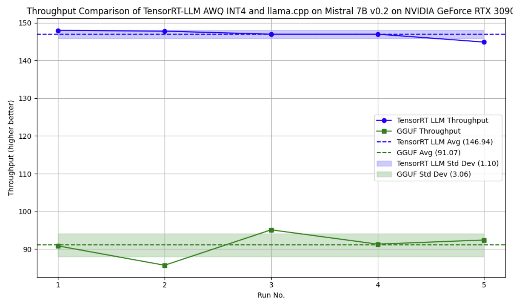
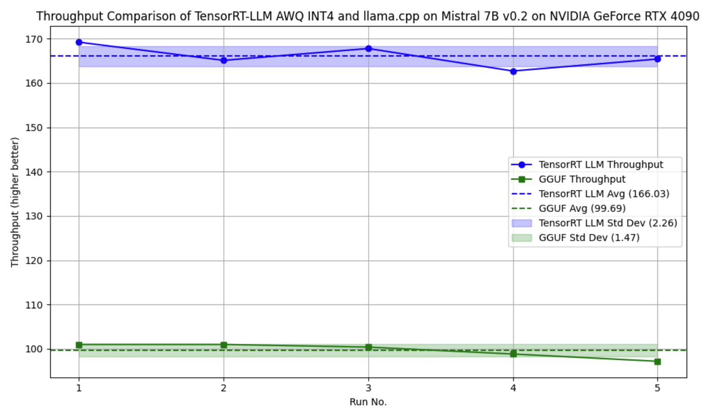

We've introduced [TensorRT-LLM](https://github.com/NVIDIA/TensorRT-LLM) support to enhance model inference on Nvidia GPUs, providing a powerful alternative to [llama.cpp](https://github.com/ggerganov/llama.cpp). This update offers insights into how these two options compare in terms of speed and resource requirements.

Check out the TensorRT-LLM Guide for setup instructions and access our Model Hub for downloadable TensorRT-LLM models.

- Mistral 7b
- TinyLlama-1.1b
- TinyJensen-1.1b 😂

:::tip

TensorRT-LLM support is available in [v0.4.9](https://github.com/janhq/jan/releases/tag/v0.4.9), but should be considered an experimental feature.

Got feedback? Spot a bug? Let us know on [Github](https://github.com/janhq/jan) or our Discord [#tensorrt-llm](https://discord.com/channels/1107178041848909847/1201832734704795688). We're here to help!

:::

## Detailed Performance Comparison

We were really curious to see how TensorRT-LLM would perform vs. llama.cpp on consumer-grade GPUs. TensorRT-LLM has previously been shown by Nvidia to reach performance of up to [10,000 tokens/s](https://nvidia.github.io/TensorRT-LLM/blogs/H100vsA100.html) on datacenter-grade GPUs. Recognizing that not all users have access to high-end GPUs (a.k.a [GPU Poor](https://www.semianalysis.com/p/google-gemini-eats-the-world-gemini#the-gpu-poor)), we tested both inference engines on common hardware configurations to provide a comprehensive comparison.

:::info

An interesting aside: Jan actually started out in June 2023 building on [FastTransformer](https://github.com/NVIDIA/FasterTransformer), the precursor library to TensorRT-LLM. TensorRT-LLM was released in September 2023, making it a very young library. We're excited to see it's roadmap develop!

:::

### How We Conducted the Tests

We picked 3 hardware platforms to run the test on, based on Jan's userbase's self-reported common hardware platforms.

| NVIDIA GPU                | VRAM Used (GB) | CUDA Cores | Tensor Cores | Memory Bus Width (bit) | Memory Bandwidth (GB/s) |
| ------------------------- | -------------- | ---------- | ------------ | ---------------------- | ----------------------- |
| RTX 4090 Desktop (Ada)    | 24             | 16,384     | 512          | 384                    | ~1000                   |
| RTX 3090 Desktop (Ampere) | 24             | 10,496     | 328          | 384                    | 935.8                   |
| RTX 4060 Laptop (Ada)     | 8              | 3,072      | 96           | 128                    | 272                     |

:::warning[Low-spec Machines?]

We focused on mid to high-end Nvidia GPUs for our tests, as TensorRT-LLM's performance enhancements are most apparent on these devices. For users with lower-spec machines, llama.cpp remains a reliable alternative.

TensorRT-LLM provides blazing fast performance at the cost of [memory usage](https://nvidia.github.io/TensorRT-LLM/memory.html). This means that the performance improvements only show up in higher-range GPUs with larger VRAMs.

We've found that [llama.cpp](https://github.com/ggerganov/llama.cpp) does an incredible job of democratizing inference to the [GPU Poor](https://www.semianalysis.com/p/google-gemini-eats-the-world-gemini#the-gpu-poor) with CPU-only or lower-range GPUs. Huge shout outs to the [llama.cpp maintainers](https://github.com/ggerganov/llama.cpp/graphs/contributors) and the [ggml.ai](https://ggml.ai/) team.

:::

We chose the popular Mistral 7b model to run on both GGUF and TensorRT-LLM, picking comparable quantizations at `INT4`.

#### llama.cpp Setup

- llama.cpp commit [15499eb](https://github.com/ggerganov/llama.cpp/commit/15499eb94227401bdc8875da6eb85c15d37068f7)
- We used `Mistral-7b-q4_k_m` in `GGUF` with `ngl` at `100` (`ngl` is the abbreviation of `Number of GPU Layers` with the range from `0` as no GPU acceleration to `100` as full on GPU)

#### TensorRT-LLM Setup

- TensorRT-LLM version [0.7.1](https://github.com/NVIDIA/TensorRT-LLM/releases/tag/v0.7.1) and build on Windows
- For TensorRT-LLM, we used `Mistral-7b-int4 AWQ`
- We ran TensorRT-LLM with `free_gpu_memory_fraction` to test it with the lowest VRAM consumption (performance may be affected)
- Note: We picked AWQ for TensorRT-LLM as a handicap as AWQ supposedly sacrifices quality for performance

#### Experiment Setup

We ran the experiment using a standardized inference request in a sandboxed environment on the same machine:

- We ran tests 5 times for each inference engine, on a baremetal PC with no other applications open
- Each inference request was of `batch_size` 1 and `input_len` 2048, `output_len` 512 as a realistic test case
- CPU and Memory usage were obtained from.... Windows Task Manager 😱
- GPU usage was obtained from `nvidia-smi`

## Results

Our biggest takeaway: TensorRT-LLM is faster than llama.cpp on 4090s and 3090s with larger VRAMs. However, on smaller GPUs (e.g. Laptop 4060 GPUs),

|              | 4090 Desktop | 3090 Desktop | 4060 Laptop |
| ------------ | ------------ | ------------ | ----------- |
| TensorRT-LLM | ✅ 159t/s    | ✅ 140.27t/s | ❌ 19t/s    |
| llama.cpp    | 101.3t/s     | 90t/s        | 22t/s       |

### RTX-4090 Desktop

:::info[Hardware Details]

- CPU: Intel 13th series
- GPU: NVIDIA GPU 4090 (Ada - sm 89)
- RAM: 32GB
- OS: Windows 11 Pro

:::

Nvidia's RTX-4090 is their top-of-the-line consumer GPU, and retails for [approximately $2,000](https://www.amazon.com/rtx-4090/s?k=rtx+4090).

#### Mistral-7b int4

| Metrics              | GGUF (using GPU) | TensorRT-LLM | Difference     |
| -------------------- | ---------------- | ------------ | -------------- |
| Throughput (token/s) | 101.3            | 159          | ✅ 57% faster  |
| VRAM Used (GB)       | 5.5              | 6.3          | 🤔 14% more    |
| RAM Used (GB)        | 0.54             | 0.42         | 🤯 20% less    |
| Disk Size (GB)       | 4.07             | 3.66         | 🤯 10% smaller |

Here is the illustration

### RTX-3090 Desktop

:::info[Hardware Details]

- CPU: Intel 13th series
- GPU: NVIDIA GPU 3090 (Ampere - sm 86)
- RAM: 64GB
- OS: Windows 11 Pro

:::

#### Mistral-7b int4

| Metrics              | GGUF (using GPU) | TensorRT-LLM | Difference    |
| -------------------- | ---------------- | ------------ | ------------- |
| Throughput (token/s) | 90               | ✅ 140.27    | ✅ 55% faster |
| VRAM Used (GB)       | 6.0              | 6.8          | 🤔 13% more   |
| RAM Used (GB)        | 0.54             | 0.42         | 🤯 22% less   |
| Disk Size (GB)       | 4.07             | 3.66         | 🤯 10% less   |

### RTX-4060 Laptop

- [ ] Dan to re-run perf tests and fill in details

:::info[Hardware Details]

- Manufacturer: Acer Nitro 16 Phenix
- CPU: Ryzen 7000
- RAM: 16GB
- GPU: NVIDIA Laptop GPU 4060 (Ada)

:::

#### Mistral-7b int4

| Metrics              | GGUF (using the GPU) | TensorRT-LLM | Difference |
| -------------------- | -------------------- | ------------ | ---------- |
| Throughput (token/s) | 22                   | ❌ 19        |            |
| VRAM Used (GB)       | 2.1                  | 7.7          |            |
| RAM Used (GB)        | 0.3                  | 13.5         |            |
| Disk Size (GB)       | 4.07                 | 4.07         |            |
