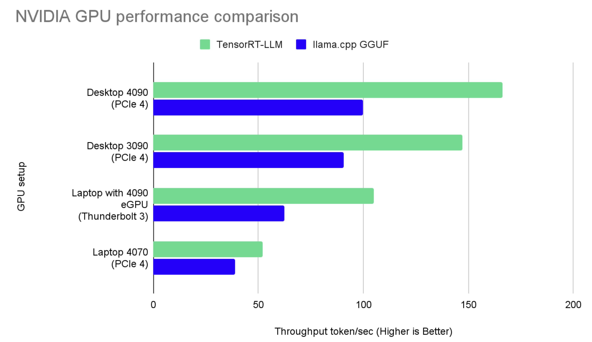

Jan now supports [TensorRT-LLM](https://github.com/NVIDIA/TensorRT-LLM) to further accelerate model inference for users with Nvidia GPUs. Users with Windows & RTX GPUs can use it as an alternative to [llama.cpp](https://github.com/ggerganov/llama.cpp).

This post compares GGUF/llama.cpp and TensorRT/TRT-LLM on speed and resource consumption, across popular consumer Ada & Ampere architectures.

To use this new extension in Jan Desktop, checkout the [TensorRT-LLM Guide](/guides/engines/tensorrt-llm) for setup instructions.

We've prebuilt the following TensorRT-LLM models for easy download in Jan Hub:

- Mistral 7b
- TinyLlama-1.1b
- TinyJensen-1.1b 😂

:::tip

TensorRT-LLM is available in [v0.4.9+](https://github.com/janhq/jan/releases/tag/v0.4.9) through [Nitro](https://github.com/janhq/nitro-tensorrt-llm), but should be considered an experimental feature.

Feedback? Let us know on [Github](https://github.com/janhq/jan) or via Discord [#tensorrt-llm](https://discord.com/channels/1107178041848909847/1201832734704795688). We're here to help!

:::

We were curious on how TensorRT-LLM performs against llama.cpp on consumer-grade GPUs. TensorRT-LLM has previously been shown by Nvidia to reach performance of up to [10,000 tokens/s](https://nvidia.github.io/TensorRT-LLM/blogs/H100vsA100.html) on datacenter-grade GPUs.

So as proud, self-proclaimed [GPU Poors](https://www.semianalysis.com/p/google-gemini-eats-the-world-gemini#the-gpu-poor), we tested both inference engines across our Ada and Ampere cards, the most popular architectures for consumers.

:::info

An interesting aside: Jan actually started out in June 2023 building on [FastTransformer](https://github.com/NVIDIA/FasterTransformer), the precursor library to TensorRT-LLM. TensorRT-LLM was released in September 2023, making it a very young library. We're excited to see it's roadmap develop!

:::

## Highlights

- **TensorRT-LLM is up to 60% faster than llama.cpp on consumer GPUs**, while using less RAM & CPU.
- On smaller Nvidia GPUs, like the 4070s or on laptops, TRT-LLM is up to 30% faster.
- On smaller Nvidia GPUs, **Llama.cpp uses less VRAM** but the comparison inverts as you scale up in VRAM.
- **Llama.cpp uniquely works on CPUs and likely the best ROI for AI users that work with smaller models.** Llama.cpp works on almost all NVIDIA cards from 2-4GB VRAM, while TensorRT-LLM requires at least 6gb ram on RTX 30s/ 40s (2xxx is not supported).
- **Users scaling up their setup with Nvidia GPUs should consider the RTX 4070 dGPU** (laptop version) which has the best performance to cost ROI.

|              | 4090 Desktop | 3090 Desktop | 4070 Laptop | Laptop Intel i7 13800H CPU |
| ------------ | ------------ | ------------ | ----------- | -------------------------- |
| TensorRT-LLM | ✅ 166.9t/s  | ✅ 140.27t/s | ✅ 51.98t/s | (Not supported)            |
| Llama.cpp    | 99.69t/s     | 90t/s        | 38.75t/s    | ✅ 11.566t/s               |

## Hardware Selection

We chose the following popular GPUs architectures based on our users' preferences:

| NVIDIA GPU        | VRAM (GB) | CUDA Cores | Tensor Cores | Memory Bus Width (bit) | Memory Bandwidth (GB/s) |
| ----------------- | --------- | ---------- | ------------ | ---------------------- | ----------------------- |
| RTX 4090 (Ada)    | 24        | 16,384     | 512          | 384                    | ~1000                   |
| RTX 3090 (Ampere) | 24        | 10,496     | 328          | 384                    | 935.8                   |
| RTX 4060 (Ada)    | 8         | 7680       | 144          | 192                    | 272                     |

Both desktop GPUs utilize PCIE 5.0, offering substantial bandwidth at 63.015 Gbps, in contrast to the RTX 4070 laptop's more limited capabilities due to power and thermal restrictions.

:::warning[Low-spec Machines?]

We focused on mid to high-end Nvidia GPUs for our tests, as TensorRT-LLM's performance enhancements are most apparent on these devices. For users with lower-spec machines, llama.cpp remains a reliable alternative.

TensorRT-LLM provides blazing fast performance at the cost of [memory usage](https://nvidia.github.io/TensorRT-LLM/memory.html). This means that the performance improvements only show up in higher-range GPUs with larger VRAMs.

We've found that [llama.cpp](https://github.com/ggerganov/llama.cpp) does an incredible job of democratizing inference to the [GPU Poor](https://www.semianalysis.com/p/google-gemini-eats-the-world-gemini#the-gpu-poor) with CPU-only or lower-range GPUs. Huge shout outs to the [llama.cpp maintainers](https://github.com/ggerganov/llama.cpp/graphs/contributors) and the [ggml.ai](https://ggml.ai/) team.

:::

#### Experiment Setup

We ran the experiment using a standardized inference request in a sandboxed environment on the same machine:

- Model: Mistral 7b model to run on both GGUF and TensorRT-LLM with quantizations at `INT4`.
- We ran tests 5 times for each inference engine, on a baremetal PC with no other opened applications.
- Each inference request was of `batch_size` 1 and `input_len` 2048, `output_len` 512 as a realistic test case
- CPU and Memory usage were obtained from.... Windows Task Manager 😱
- GPU usage was obtained from `nvidia-smi`

> TensorRT-LLM and llama.cpp Params: Benchmarking focused on both engines' latest configurations, highlighting the difference between llama.cpp's use of the open-source cuBLAS and TensorRT-LLM's proprietary optimizations.

#### llama.cpp Setup

- llama.cpp commit [15499eb](https://github.com/ggerganov/llama.cpp/commit/15499eb94227401bdc8875da6eb85c15d37068f7)
- We used `Mistral-7b-q4_k_m` in `GGUF` with `ngl` at `100` (`ngl` is the abbreviation of `Number of GPU Layers` with the range from `0` as no GPU acceleration to `100` as full on GPU)

#### TensorRT-LLM Setup

- TensorRT-LLM version [0.7.1](https://github.com/NVIDIA/TensorRT-LLM/releases/tag/v0.7.1) and build on Windows
- For TensorRT-LLM, we used `Mistral-7b-int4 AWQ`
- We ran TensorRT-LLM with `free_gpu_memory_fraction` to test it with the lowest VRAM consumption (performance may be affected)
- Note: We picked AWQ for TensorRT-LLM as a handicap as AWQ supposedly sacrifices quality for performance

## Results

#### Performance comparison

Comparison for `TensorRT-LLM` and `llama.cpp GGUF` on NVIDIA GPUs

Performance`llama.cpp GGUF` on Intel CPU

### ROI comparison

To evaluate ROI, we consider the cost per throughput unit (tokens/s) for each GPU:

- **Cost per Throughput Unit (CPT)**: Calculating the CPT provides insight into the efficiency of the investment in terms of performance gain per dollar spent.

- **Price**:
  | Name | Connection | Retail price |
  |-------------------|-----------------|--------------|
  | Laptop eGPU 4090 | Thunderbolt 3 | USD 2300 |
  | Desktop 4090 | PCIE 4 | USD 2000 |
  | Desktop 3090 | PCIE 4 | USD 1500 |
  | Laptop 4070 | PCIE 4 | USD 524 |
  | Intel i7 14700 | - | USD 400 |
  | Intel i9 13900 | - | USD 520 |
  | Intel i7 13800H | - | USD 457 |

#### ROI Insights

From the chart, "Laptop 4070 on PCIE 5" setup has the lowest CPT for both "TensorRT-LLM" and "llama.cpp GGUF (GPU)", making it the most cost-effective option among the setups presented. The "Laptop 4090 on Thunderbolt 3" has the highest CPT for both methods, which suggests it's the least cost-effective in terms of throughput.

## Detailed metrics

### RTX-4090 Desktop

:::info[Hardware Details]

- CPU: Intel 13th series
- GPU: NVIDIA GPU 4090 (Ada - sm 89)
- RAM: 32GB
- OS: Windows 11 Pro

:::

Nvidia's RTX-4090 is their top-of-the-line consumer GPU, and retails for [approximately $2,000](https://www.amazon.com/rtx-4090/s?k=rtx+4090).

#### Mistral-7b int4

| Metrics              | GGUF (using CPU) | GGUF (using GPU) | TensorRT-LLM | How TRT-LLM Compares |
| -------------------- | ---------------- | ---------------- | ------------ | -------------------- |
| Throughput (token/s) | 14.0             | 99.69            | 166.9        | ✅ 57% faster        |
| VRAM Used (GB)       | 0                | 5.5              | 6.3          | 14% more             |
| RAM Used (GB)        | 0.611            | 0.54             | 0.42         | ✅ 20% less          |
| Disk Size (GB)       | 4.07             | 4.07             | 3.66         | ✅ 10% smaller       |

4090's yielded the biggest performance differences.

Tip: We also found out that the performance with TensorRT-LLM can increase around 15% if we enable [XMP](https://www.intel.com/content/www/us/en/gaming/extreme-memory-profile-xmp.html) in BIOS for RAM bus speed from 3600 to 5600.

### RTX-3090 Desktop

Nvidia's RTX-3090 is their top-of-the-line consumer GPU, and retails for [approximately $1,500](https://www.amazon.com/s?k=rtx+3090&crid=3PXL42XYQABYN&sprefix=rtx+30%2Caps%2C311&ref=nb_sb_noss_2).

:::info[Hardware Details]

- CPU: Intel 13th series
- GPU: NVIDIA GPU 3090 (Ampere - sm 86)
- RAM: 64GB
- OS: Windows 11 Pro

:::

#### Mistral-7b int4

| Metrics              | GGUF (using CPU) | GGUF (using GPU) | TensorRT-LLM | How TRT-LLM Compares |
| -------------------- | ---------------- | ---------------- | ------------ | -------------------- |
| Throughput (token/s) | 11.42            | 90               | 140.27       | ✅ 55% faster        |
| VRAM Used (GB)       | 0                | 6.0              | 6.8          | 13% more             |
| RAM Used (GB)        | 0.611            | 0.54             | 0.42         | ✅ 22% less          |
| Disk Size (GB)       | 4.07             | 4.07             | 3.66         | ✅ 10% smaller       |

NVIDIA GPU Geforce RTX 3090 uses Ampere architecture. It has 36% less CUDA core and Tensor Core compared to 4090 but only 17% slower in terms of performance
We also found out that the performance with TensorRT-LLM can increase around 15% if we enable [XMP](https://www.intel.com/content/www/us/en/gaming/extreme-memory-profile-xmp.html) in BIOS for RAM bus speed from 3600 to 5600.

### RTX-4070 Laptop with eGPU

:::info[Hardware Details]

- CPU: AMD Ryzen 7
- GPU: NVIDIA GPU 4070 (Ada - sm 89) on PCIE 5.0 and NVIDIA GPU 4090 (Ada - sm 89) on eGPU
- RAM: 64GB
- OS: Windows 11 Pro

:::

#### Mistral-7b int4 with NVIDIA GPU Laptop 4070 on PCIE

| Metrics              | GGUF (using CPU) | GGUF (using GPU) | TensorRT-LLM | Difference on GPU |
| -------------------- | ---------------- | ---------------- | ------------ | ----------------- |
| Throughput (token/s) | 11.56            | 38.75            | 51.98        | ✅ 25.4% faster   |
| VRAM Used (GB)       | 0                | 9.96             | 6.12         | ✅ 39% less       |
| RAM Used (GB)        | 0.611            | 4.33             | 4.05         | ✅ 7% less        |
| Disk Size (GB)       | 4.07             | 4.07             | 3.66         | ✅ 10% smaller    |

#### Mistral-7b int4 with NVIDIA GPU 4090 in eGPU via Thunderbolt 3

| Metrics              | GGUF (using CPU) | GGUF (using GPU) | TensorRT-LLM | Difference on GPU |
| -------------------- | ---------------- | ---------------- | ------------ | ----------------- |
| Throughput (token/s) | 11.56            | 62.22            | 104.95       | ✅ 41% faster     |
| VRAM Used (GB)       | 0                | 7.8              | 7.74         | 1% less           |
| RAM Used (GB)        | 0.611            | 5.38             | 4.11         | ✅ 24% less       |
| Disk Size (GB)       | 4.07             | 4.07             | 3.66         | ✅ 10% smaller    |

The NVIDIA GPU laptop compared to NVIDIA GPU on desktop is worse because of the thermal constraint and energy consumption (it's a good tradeoff for portability). The PCIe 5.0 speed is the same at 63.015 Gbp.

There is a way to extend laptop with GPU is eGPU (metrics to prove). Though it extends the capabilites, it also has performance issue because of the bandwidth in Thunderbolt 3.0 at 40Gbps.

## Conclusion

Across Nvidia consumer-grade GPUs, TensorRT-LLM uses less RAM, VRAM, and disk size while yielding faster TPS than Llama.cpp.

On Jan, users with larger VRAM should use the TensorRT-LLM engine.

Whereas, users with smaller cards should still use the Llama.cpp engine, which seems to excel at CPU inference, running in highly resource constrained environments and older Nvidia cards.
