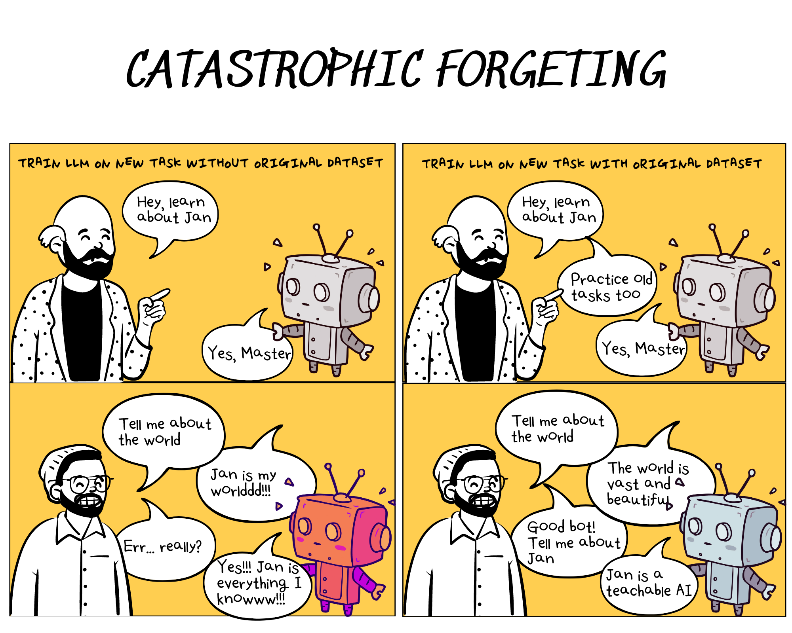
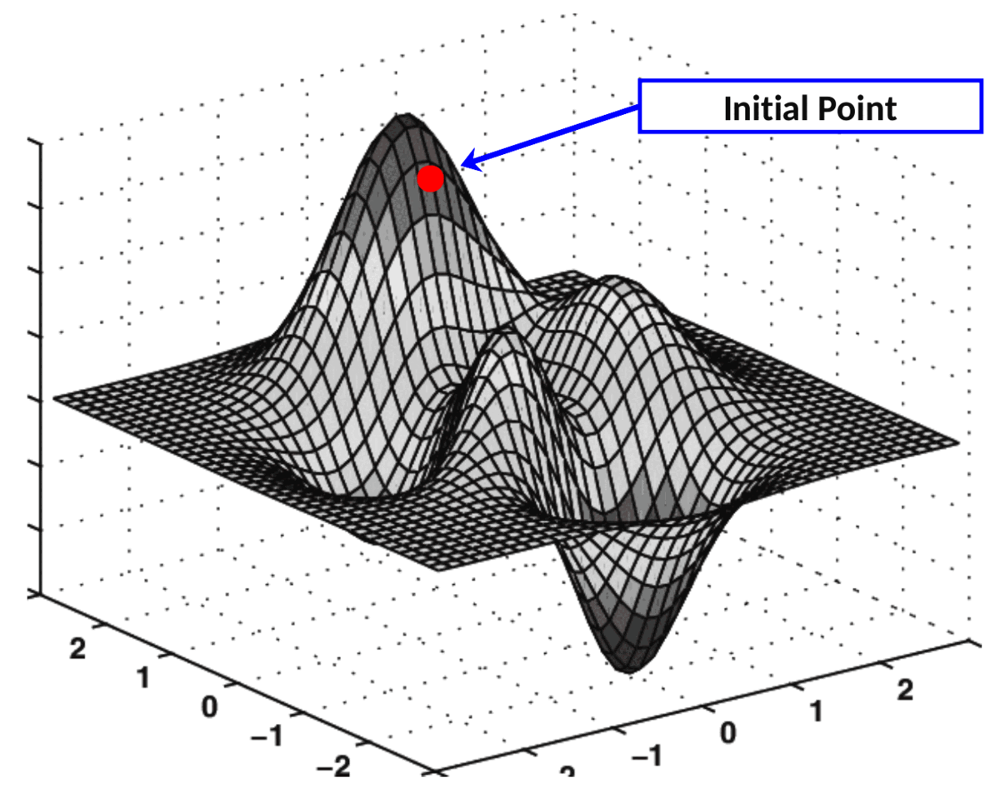
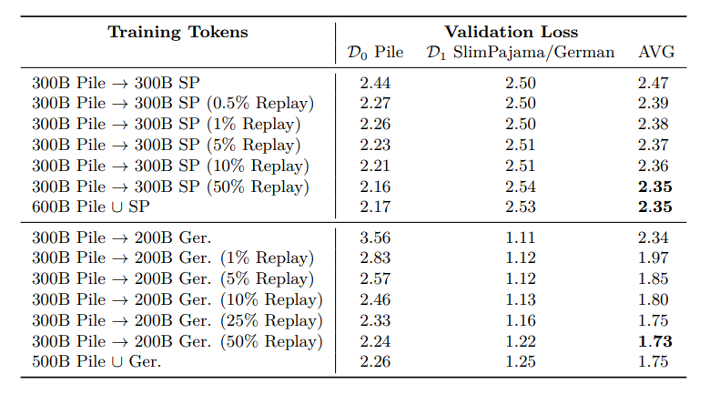
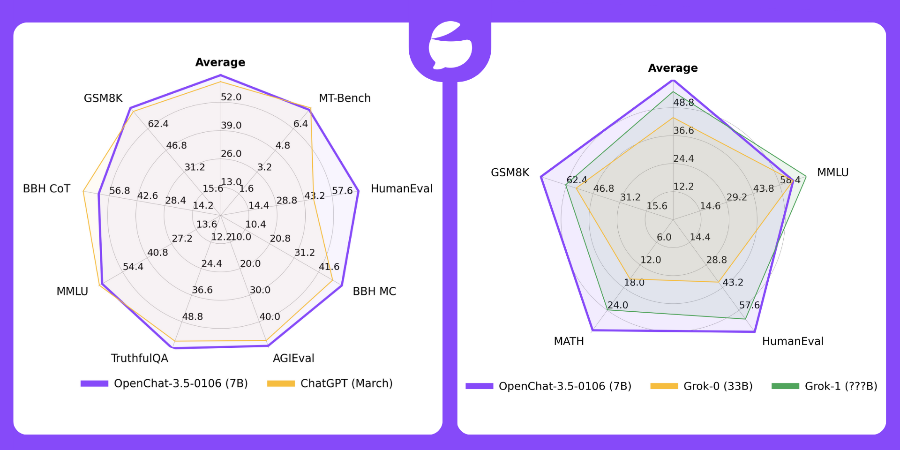

In the crowded AI landscape, OpenAI's ChatGPT stands out, not just for its capabilities but for its unique access to the pre-trained dataset. This post explores the vital role of data in maintaining a competitive edge, focusing on OpenAI's strategic advantage through data ownership.

## Data: The Secret Weapon

OpenAI, with ChatGPT, has carved a distinct advantage. By harnessing user interactions, it gains invaluable insights into diverse use cases, enabling precise model refinements. The cornerstone of this advantage lies in the "pre-trained dataset." This treasure trove of data empowers OpenAI to cater to specific needs, ensuring sustained improvement and differentiation.

### The Significance of Pre-trained Data

> *Owning the pre-trained dataset is crucial as it represents the original distribution.*

Access to the pre-trained dataset acts as a master key to address the critical issue of ["Catastrophic forgetting"](https://en.wikipedia.org/wiki/Catastrophic_interference) in Language Learning Models (LLMs). This phenomenon describes how LLMs lose hold of prior knowledge upon learning new information. Access to the foundational dataset allows for effective fine-tuning, balancing the introduction of new data with the retention of existing knowledge.

**Figure 1.** Demonstrates the catastrophic forgetting issue: without mixing datasets, AI overfits on new tasks, impairing normal communication.

### Illustrating Catastrophic Forgetting

Catastrophic forgetting can be visualized as a ball in a multidimensional landscape, where moving towards new knowledge risks losing grasp on the old. Pre-trained data acts as a map, guiding fine-tuning in a way that incorporates new information while safeguarding existing knowledge.

**Figure 2.** [Gradient decent demonstration](https://en.wikipedia.org/wiki/Gradient_descent)

### Smoothing Distribution Shifts

As described above, with the mixture of the pre-trained dataset ensures smoother distribution shifts when introducing new information, as it embodies a comprehensive spectrum of prior knowledge.

This continuity in knowledge transition helps in maintaining the robustness of the model against sudden changes, akin to providing a more gradual learning curve where the new information is incrementally integrated with the existing knowledge base.

This concept is supported by the [EleutherAI's research](https://arxiv.org/abs/2403.08763) highlighting the importance of how tasks are sequenced in the learning process, suggesting that introducing dissimilar tasks early on can expand the network's capacity for new information.

**Table 1.** Final results for English-only 405M parameter models trained with different replay amounts show models with more replay perform better in balancing learning and forgetting (measured as AVG Loss). Notably, just 1% mix with a pre-trained dataset significantly lowers AVG loss, effectively shifting model knowledge from English (the Pile) to German.

*Note:* **Replay** is the method involves combining the training dataset from the pre-trained model with new task datasets.

### Acting as a Noise Mask

The pre-trained data can also serve as a form of "noise masking", similar to techniques used in training [early computer vision models](https://arxiv.org/abs/1911.04252).

This approach introduces a level of  ["noise"](https://arxiv.org/abs/2310.05914) during training, which can prevent the model from overfitting to the new dataset. By retaining a mix of original and new data, the model is exposed to a broader range of scenarios, enhancing its generalization capabilities and robustness across tasks.

## Viable Solutions

Overcoming these challenges requires a balanced approach. One partial method involves inundating the model with extensive, curated data, allowing for comprehensive fine-tuning. While effective, this approach demands significant computational resources, a comprehensive filtering process for low-quality inputs, and an extraordinarily high cost associated with gathering millions of high-quality responses.

In the open-source community, 2 notable examples of fine-tuning with Mistral as a base model on large datasets collected from top-rated GPT-4 and human responses demonstrate a distribution shift that enhances model performance, including [OpenChat](https://huggingface.co/openchat/openchat-3.5-0106) and [Hermes-Pro](https://huggingface.co/teknium/OpenHermes-2.5-Mistral-7B).

**Figure 2.** After fine-tuning with a large amount of data samples, the model's performance improved, outperforming ChatGPT and Grok-1 in some benchmarks.

## Conclusion

The ownership and strategic use of pre-trained data serve as an invisible moat. It not only enables the tackling of complex challenges like catastrophic forgetting but also provides a baseline for continuous, targeted improvements. Although there is a solution to decomotralize, the cost remains 

## Reference
- [Catastrophic forgetting](https://arxiv.org/abs/2308.08747)
- [Simple and Scalable Strategies to Continually Pre-train Large Language Models](https://arxiv.org/abs/2403.08763)
- [Gradient descent](https://en.wikipedia.org/wiki/Gradient_descent)
- [Neftune](https://arxiv.org/abs/2310.05914)
- [Self-training with Noisy Student improves ImageNet classification](https://arxiv.org/abs/1911.04252)