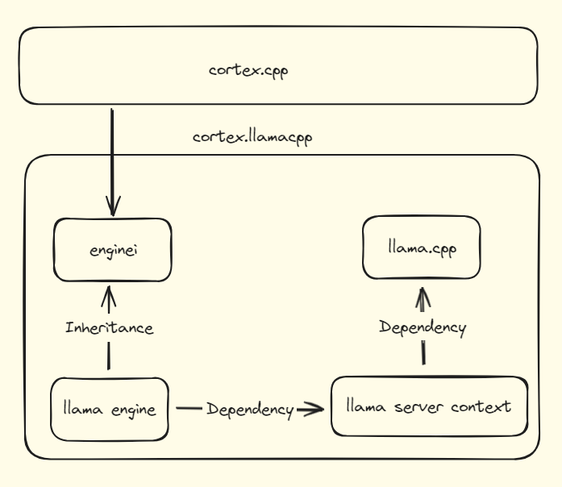
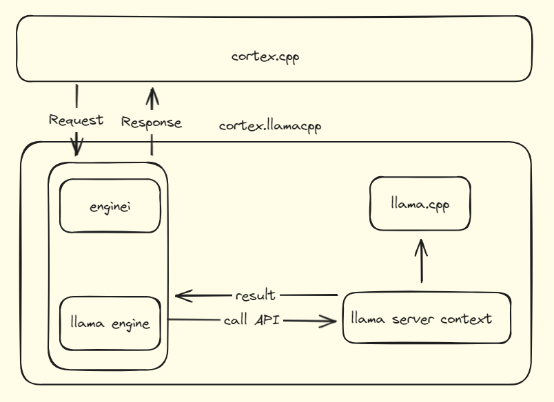

import { Callout, Steps } from 'nextra/components'
import { Cards, Card } from 'nextra/components'

<Callout type="warning">
🚧 Cortex is under construction.
</Callout>
# Cortex.llamacpp

Cortex.llamacpp is a critical component in the Cortex ecosystem, providing powerful functionalities for chat completions and embeddings.

This guide walks you through how Cortex.llamacpp is designed, the codebase structure, and future plans.

## Usage

For users of the Cortex server, llamacpp is bundled by default, eliminating the need for separate setup. However, for those interested in using llamacpp directly, this guide offers unofficial documentation to help you get started.

For a quick overview, refer to the [Quickstart Guide](/cortex/quickstart)

## Interface

Cortex.llamacpp provides several key interfaces, each designed to handle specific tasks related to model interaction:

- **HandleChatCompletion:** Processes chat completion tasks
    
    ```cpp
    void HandleChatCompletion(
          std::shared_ptr<Json::Value> jsonBody,
          std::function<void(Json::Value&&, Json::Value&&)>&& callback);
    ```
    
- **HandleEmbedding:** Generates embeddings for the input data provided
    
    ```cpp
    void HandleEmbedding(
          std::shared_ptr<Json::Value> jsonBody,
          std::function<void(Json::Value&&, Json::Value&&)>&& callback);
    ```
    
- **LoadModel:** Loads a model based on the specifications
    
    ```cpp
    void LoadModel(
          std::shared_ptr<Json::Value> jsonBody,
          std::function<void(Json::Value&&, Json::Value&&)>&& callback);
    ```
    
- **UnloadModel:** Unloads a model as specified
    
    ```cpp
    void UnloadModel(
          std::shared_ptr<Json::Value> jsonBody,
          std::function<void(Json::Value&&, Json::Value&&)>&& callback);
    ```
    
- **GetModelStatus:** Retrieves the status of a model
    
    ```cpp
    void GetModelStatus(
          std::shared_ptr<Json::Value> jsonBody,
          std::function<void(Json::Value&&, Json::Value&&)>&& callback);
    ```
    

**Parameters:**

- **`jsonBody`**: The request content in JSON format.
- **`callback`**: A function that handles the response

## Architecture

Cortex.llamacpp is designed to facilitate interaction between various components to provide APIs for embedding and inference tasks using the llama.cpp library. Here are the main components:

- `cortex.cpp`: handles API requests and responses.
- `cortex.llamacpp`: makes APIs accessible through an Engine Interface, allowing others to easily use its features.
- **`enginei` i**mplements detailed logic for all **`llama engine`** APIs, handling endpoint logic and facilitating communication between **`cortex.cpp`** and **`llama engine`**.
- **`llama engine` :** exposes APIs for embedding and inference. It loads and unloads models and simplifies API calls to **`llama.cpp`**.
- **`llama.cpp` : a** submodule from the **`llama.cpp`** repository that provides the core functionality for embeddings and inferences.
- **`llama server context` :** a wrapper offers a simpler and more user-friendly interface for **`llama.cpp`** APIs



### Activity architecture

Cortex.llamacpp supports two communication methods:

- Streaming: Responses are processed and returned as chunks of results by creating tokens through inferencing, one token at a time.
- Non-streaming: The response is processed as a whole. After the llama server context completes the entire process, it returns a single result back to cortex.cpp.



## Code Structure

```
.
├── base                              # Engine interface definition
|   └── cortex-common                 # Common interfaces used for all engines
|      └── enginei.h                  # Define abstract classes and interface methods for engines
├── examples                          # Server example to integrate engine
│   └── server.cc                     # Example server demonstrating engine integration
├── llama.cpp                         # Upstream llama.cpp repository
│   └── (files from upstream llama.cpp)
├── src                               # Source implementation for llama.cpp
│   ├── chat_completion_request.h     # OpenAI compatible request handling
│   ├── llama_client_slot             # Manage vector of slots for parallel processing
│   ├── llama_engine                  # Implementation of llamacpp engine for model loading and inference 
│   ├── llama_server_context          # Context management for chat completion requests
│   │   ├── slot                      # Struct for slot management
│   │   └── llama_context             # Struct for llama context management
|   |   └── chat_completion           # Struct for chat completion management
|   |   └── embedding                 # Struct for embedding management
├── third-party                       # Dependencies of the cortex.llamacpp project
│   └── (list of third-party dependencies)
```

## Runtime

## Roadmap
The future plans for Cortex.llamacpp are focused on enhancing performance and expanding capabilities. Key areas of improvement include:

- Performance Enhancements: Optimizing speed and reducing memory usage to ensure efficient processing of tasks.
- Multimodal Model Compatibility: Expanding support to include a variety of multimodal models, enabling a broader range of applications and use cases.

Specific milestones and timelines will be shared in upcoming updates. To stay informed about the latest developments, follow the [Cortex Llamacpp GitHub page](https://github.com/janhq/cortex.llamacpp)