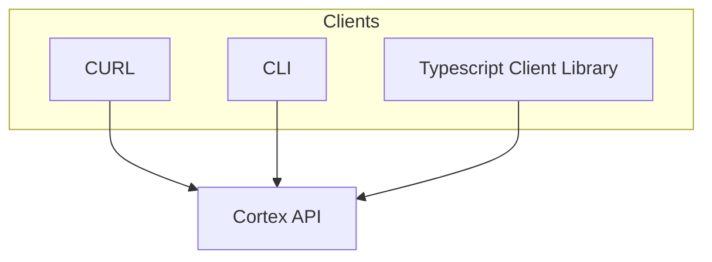

import { Callout, Steps } from 'nextra/components'
import { Cards, Card } from 'nextra/components'


<Callout type="warning">
🚧 Cortex is under construction.
</Callout>
# Cortex Overview

Cortex is a stateful, Node server that is 100% compatible with OpenAI API (all endpoints). 

It includes database integrations, an API gateway, authentication integrations, and observability integrations, and come with the underlying inference engine baked in.

This guide walks you through how Cortex is designed, the codebase structure, and future plans.

## Usage

See [Quickstart](/cortex/quickstart)

## Interface

Cortex adopts the OpenAI API standard and is fully compatible with your existing projects. In addition to OpenAI endpoints, Cortex provides more endpoints and parameters for full flexibility.

You can find the reference documentation here:
- Swagger
- API reference

We track our coverage of the OpenAI API here: 
[insert burndown]

## Architecture



TODO: Full Diagram Needed

Explain this better: Cortex is built with NestJS and handles all requests through a Node server. At the core, Cortex has a C++ runtime that handles stateless requests.

### Data

## Code Structure

[Cortex](https://github.com/janhq/cortex) is a monorepo with two projects: `cortex-js` and `cortex-cpp`.

```markdown
janhq/cortex
├── cortex-js           # Stateful implementations
├── cortex-cpp          # Stateless implementations
├── package.json
├── Dockerfile          
├── docker-compose.yml
└── README.md
```

### cortex-js

`cortex-js` folder contains stateful implementations, some of which call into `cortex-cpp`.

```markdown
janhq/cortex/cortex-js
├── src                 # 
    ├── domain/         # 
    ├── extensions/     # 
    ├── infrastructure/ # 
    ├── usecases/       # 
    ├── command.ts      # 
    └── main.ts         #
├── nest-cli.ts         #
├── constant.ts         #
├── package.json        #
└── README.md           #
```

### cortex-cpp

`cortex-cpp` folder contains first-class, stateless implementations.

To learn more about `cortex.cpp` [read here](/cortex/architecture/cortexcpp)

## Roadmap
