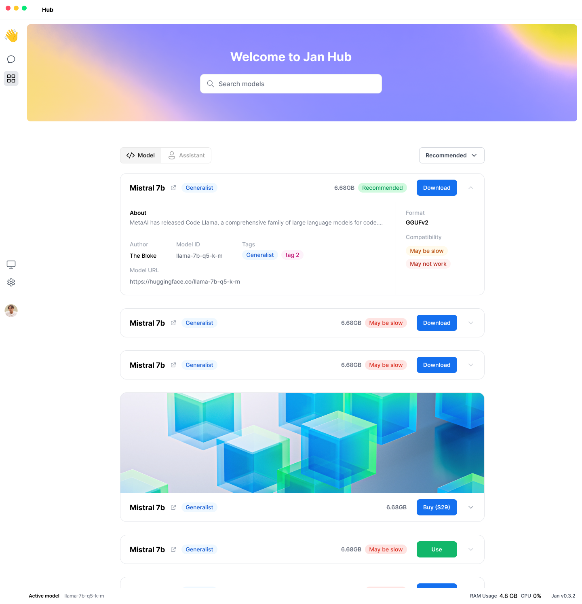

# Hub

## Overview

The Hub is like a store for everything, where users can discover and download models, assistants, and more.

## User Stories

- Users can discover recommended models (Jan ships with a few preconfigured `model.json` files)
- Users can download models suitable for their devices, e.g. compatible with their RAM
- Users can download models via a HuggingFace URL (coming soon)
