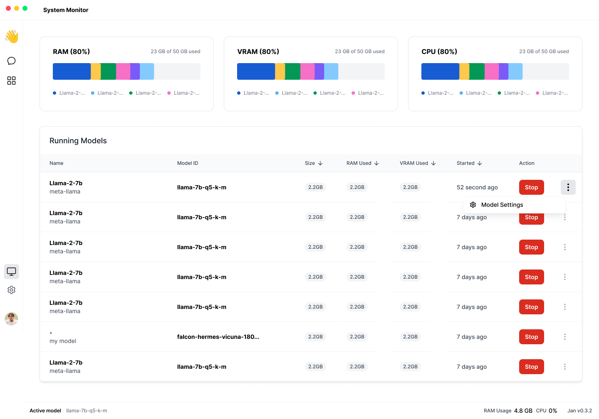

# System Monitor

## Overview

An activity screen to monitor system health and running models.

## User Stories

- Users can see disk and ram utilization
- Users can start and stop models based on system health
