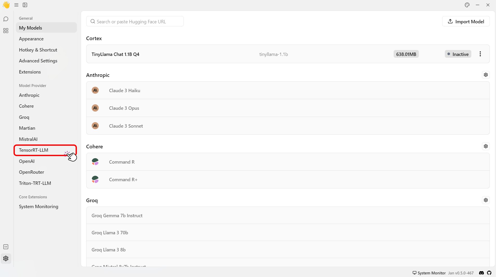
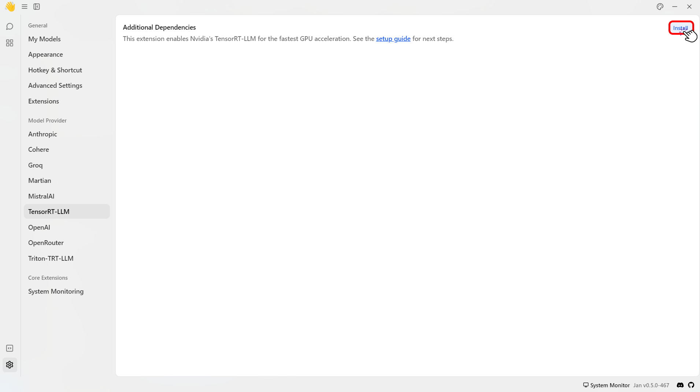
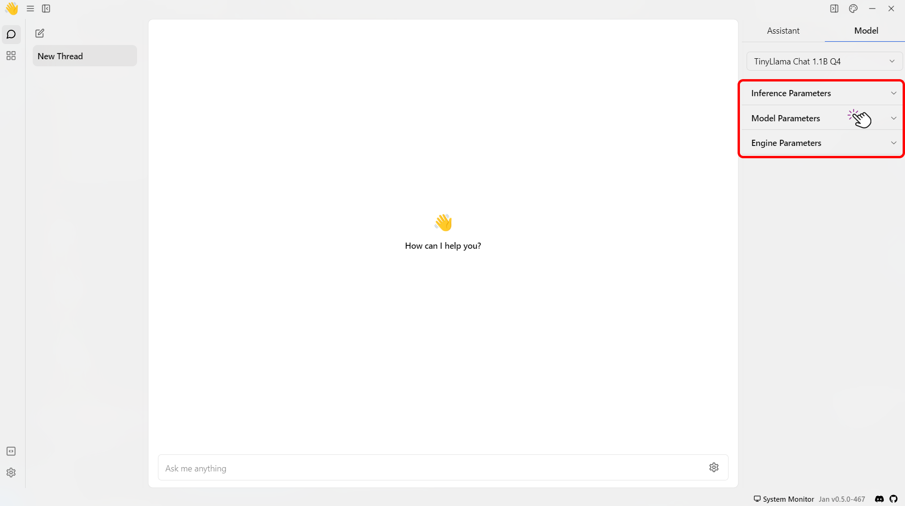

import { Callout, Steps } from 'nextra/components'

# TensorRT-LLM

## Overview

This guide walks you through installing Jan's official [TensorRT-LLM Extension](https://github.com/janhq/nitro-tensorrt-llm). This extension uses [Nitro-TensorRT-LLM](https://github.com/janhq/nitro-tensorrt-llm) as the AI engine instead of the default [Nitro-Llama-CPP](https://github.com/janhq/nitro).  It includes an efficient C++ server that executes the [TRT-LLM C++ runtime](https://nvidia.github.io/TensorRT-LLM/gpt_runtime.html) natively. It also includes features and performance improvements like OpenAI compatibility, tokenizer improvements, and queues.

<Callout type='warning' emoji="">
  - This feature is only available for Windows users. Linux is coming soon.

  - Additionally, we only prebuilt a few demo models. You can always build your desired models directly on your machine. For more information, please see [here](#build-your-own-tensorrt-models).
</Callout>

### Pre-requisites

- A Windows PC
- Nvidia GPU(s): Ada or Ampere series (i.e. RTX 4000s & 3000s). More will be supported soon.
- 3GB+ of disk space to download TRT-LLM artifacts and a Nitro binary
- Jan v0.4.9+ or Jan v0.4.8-321+ (nightly)
- Nvidia Driver v535+ (For installation guide, please see [here](/docs/troubleshooting#1-ensure-gpu-mode-requirements))
- CUDA Toolkit v12.2+ (For installation guide, please see [here](/docs/troubleshooting#1-ensure-gpu-mode-requirements))

<Callout type='warning'>
  If you are using our nightly builds, you may have to reinstall the TensorRT-LLM extension each time you update the app. We're working on better extension lifecycles - stay tuned.
</Callout>

<Steps>

### Step 1: Install TensorRT-Extension

1. Click the **Gear Icon (⚙️)** on the bottom left of your screen.
<br/>

<br/>
2. Select the **TensorRT-LLM** under the **Model Provider** section.
<br/>

<br/>
3. Click **Install** to install the required dependencies to use TensorRT-LLM.
<br/>

<br/>
3. Check that files are correctly downloaded.

```bash
ls ~/jan/extensions/@janhq/tensorrt-llm-extension/dist/bin
# Your Extension Folder should now include `nitro.exe`, among other artifacts needed to run TRT-LLM
```

### Step 2: Download a Compatible Model

TensorRT-LLM can only run models in `TensorRT` format. These models, aka "TensorRT Engines", are prebuilt for each target OS+GPU architecture.

We offer a handful of precompiled models for Ampere and Ada cards that you can immediately download and play with:

1. Restart the application and go to the Hub.
2. Look for models with the `TensorRT-LLM` label in the recommended models list > Click **Download**.

<Callout type='info'>
  This step might take some time. 🙏
</Callout>


3. Click **Download** to download the model.

### Step 3: Configure Settings

1. Navigate to the Thread section.
2. Select the model that you have downloaded.
3. Customize the default parameters of the model for how Jan runs TensorRT-LLM.
<Callout type='info'>
  Please see [here](/docs/models/model-parameters) for more detailed model parameters.
</Callout>
<br/>


</Steps>

## Build your own TensorRT Engine
To create custom TensorRT engines, you can follow the step-by-step guide provided in the [NVIDIA documentation](https://nvidia.github.io/TensorRT-LLM/quick-start-guide.html#compile-the-model-into-a-tensorrt-engine).

When compiling and running these models, please adhere to the following compatibility guidelines:
- **GPU Architectures**: Models are specifically compiled for certain GPU architectures, such as Ada. Ensure that your model is compatible with the architecture of the GPU on which it will run.
- **TensorRT-LLM Release**: Models need to be compiled and run on the same version of the TensorRT-LLM. For example, a model compiled with version 0.9.0 must be run on version 0.9.0.
- **Operating System Compatibility**: As of version 0.9.0, models are designed to be cross-OS compatible. However, this feature is still under evaluation and might exhibit instability.
- **GPU Topology**: It is crucial to understand your system's GPU topology, especially when dealing with multiple GPUs. This can be determined by the number of engine files in use.

<Callout type='info'>
Ensure these parameters are aligned correctly to avoid runtime issues and fully leverage TensorRT engines' capabilities.
</Callout>