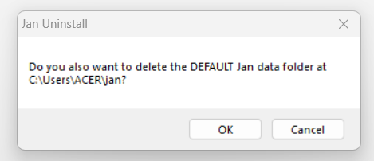

import { Tabs } from 'nextra/components'
import { Callout, Steps } from 'nextra/components'

# Jan Data Folder
Jan stores your data locally in your own filesystem in a universal file format (JSON). We build for privacy by default and do not collect or sell your data.

This guide helps you understand where and how this data is stored. We'll also show you how to delete or move the data folder location.

## Folder Structure
Jan app data folder should have the following folder structure:
<Callout type="info">
Jan is stored in the root `~/jan` by default.
</Callout>
```yaml
/assistants
  /jan
    assistant.json
  /shakespeare
    assistant.json
/extensions
  extensions.json
  /@janhq
    /extension_A
     package.json
/logs
  /app.txt
/models
  /model_A
    model.json
/settings
  settings.json
  /@janhq
    /extension_A_Settings
     settings.json
/themes
  /dark-dimmed
  /joi-dark
  /joi-light
  /night-blue
/threads
  /jan_thread_A
   messages.jsonl
   thread.json
  messages.jsonl
```
### `jan/` (The Root Directory)

This is the primary directory where all files related to Jan are stored. It typically resides in the user's home directory.

### `assistants/`

Stores configuration files for various AI assistants. Each assistant within this directory can have different settings.

- **Default Assistant**: Located in `/assistants/jan/`, it includes an `assistant.json` configuring the default settings and capabilities. The default sample of `assistan.json` is as follows:

```json
{
  "avatar": "",
  "id": "jan",
  "object": "assistant",
  "created_at": 1715132389207,
  "name": "Jan",
  "description": "A default assistant that can use all downloaded models",
  "model": "*",
  "instructions": ""
}

```

Each parameter in the file is defined as follows:

| Parameter | Description |
| --- | --- |
| avatar | Path to the assistant's avatar image, allowing visual customization. |
| id | Unique identifier for the assistant. |
| object | Indicates that this is an assistant configuration. |
| created_at | Timestamp of creation, in milliseconds since the epoch. |
| name | The assistant's name. |
| description | Describes the assistant’s capabilities and intended role. |
| model | Defines accessible models, with "*" representing access to all models. |
| instructions | Specifies queries and commands to tailor Jan's responses for improved interaction effectiveness. |
- **Custom Assistant Example**: The `/assistants/shakespeare/` shows a custom setup, also with its own `assistant.json`.

### `extensions/`

Extensions enhance Jan's functionality by adding new capabilities or integrating external services.

- **Extension Configuration**: The `extensions.json` in the `/extensions/` directory provides settings for all installed extensions.
- **Specific Extensions**: Subdirectories like `/@janhq/extension_A/` contain `package.json` files that import necessary modules for each extension.

### `logs/`

Logs from the application are stored here. This is useful for troubleshooting and monitoring the application's behavior over time. The file `/logs/app.txt` captures general application activity.

### `models/`

Stores the AI models that the assistants use to process requests and generate responses.

- **Model Configurations**: Each model directory, such as `/models/modelA/`, contains a `model.json` with settings specific to that model.

### `settings/`

General settings for the application are stored here, separate from individual assistant or engine configurations.

- **General Settings**: The `settings.json` in the `/settings/` directory holds application-wide settings.
- **Extension-specific Settings**: Additional settings for extensions are stored in respective subdirectories under `/settings/@janhq/`.

### `themes/`

The `themes` directory contains different visual themes for the application, allowing customization of the user interface.

### `threads/`

Threads history is kept in this directory. Each session or thread is stored in a way that makes it easy to review past interactions. Each thread is stored in its subdirectory, such as `/threads/jan_unixstamp/`, with files like `messages.jsonl` and `thread.json` detailing the thread settings.

## Open the Data Folder

To open the Jan data folder, follow the steps in the [Settings](/docs/settings#access-the-jan-data-folder) guide.

## Delete Jan Data Folder

If you have uninstalled the Jan app, you may also want to delete the Jan data folder. You can automatically remove this folder during uninstallation by selecting **OK** when prompted.



If you missed this step and need to delete the folder manually, please follow these instructions:

1. Go to the root data folder in your Users directory.
2. Locate the Jan data folder.
3. Delete the folder manually.