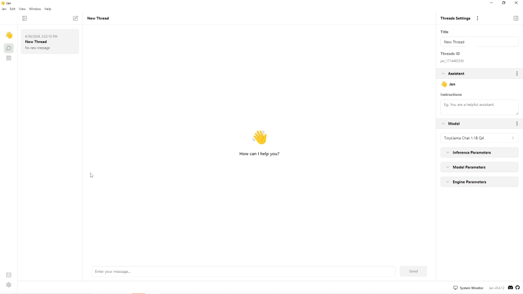

import { Tabs, Callout, Steps } from 'nextra/components'
import FAQBox from '@/components/FaqBox'


# Linux Installation
## Compatibility
Ensure that your system meets the following requirements to use Jan effectively:
  - **OS**:
    - Windows 10 or higher is required to run Jan.
  - **Hardware**:
    - **CPU**:
    - **RAM**:
## Prerequisites
  - **System Libraries**:
    - glibc 2.27 or higher. You can verify this by running `ldd --version`.
    - Install gcc-11, g++-11, cpp-11, or later versions. Refer to the [Ubuntu installation guide](https://gcc.gnu.org/projects/cxx-status.html#cxx17) for assistance.
  - **Post-Installation Actions**:
    - Add CUDA libraries to the `LD_LIBRARY_PATH` as per the instructions provided in the [Post-installation Actions](https://docs.nvidia.com/cuda/cuda-installation-guide-linux/index.html#post-installation-actions).

## Installing Jan
To install Jan, follow the steps below:
<Steps>
### Step 1: Download the Jan Application
Jan provides two types of releases:
#### Stable Releases
The stable release is a stable version of Jan. You can download a stable release Jan app via the following:
  - **Official Website**: https://jan.ai
  - **Jan GitHub repository**: https://github.com/janhq/jan
<Callout type="info">
Make sure to verify the URL to ensure that it's the official Jan website and GitHub repository.
</Callout>
#### Nightly Releases
The nightly Release allows you to test out new features and get a sneak peek at what might be included in future stable releases. You can download this version via:
  - **Jan GitHub repository**: https://github.com/janhq/jan
<Callout type="info">
Keep in mind that this build might crash frequently and may contain bugs!
</Callout>

For Linux, Jan provides two types of downloads:
1. **Ubuntu**: `.deb`
2. **Fedora**: `.AppImage`
### Step 2: Install the Jan Application
Here are the steps to install Jan on Linux based on your Linux distribution:
#### Ubuntu
Install Jan using the following command:
<Tabs items = {[ 'dpkg', 'apt-get']}>
    <Tabs.Tab>

        ```sh
        # Install Jan using dpkg
        sudo dpkg -i jan-linux-amd64-{version}.deb
        ```
    </Tabs.Tab>
    <Tabs.Tab>

        ```sh
        # Install Jan using apt-get
        sudo apt-get install ./jan-linux-amd64-{version}.deb
        # where jan-linux-amd64-{version}.deb is the path to the Jan package
        ```
    </Tabs.Tab>
</Tabs>
#### Fedora
1. Make the AppImage executable using the following command:
```sh
  chmod +x jan-linux-x86_64-{version}.AppImage
```
2. Run the AppImage file using the following command:
```sh
  ./jan-linux-x86_64-{version}.AppImage
```
</Steps>

## Data Folder
By default, Jan is installed in the following directory:

```sh
# Default installation directory
Applications\Users\{username}\Jan
```
<Callout type="info">
- You can move the Jan data folder to a specific folder by following the steps [here](/docs/settings#access-the-jan-data-folder).
- Please see the Jan Data Folder for more details about the data folder structure.
</Callout>
## GPU Acceleration
Once Jan is installed and you have a GPU, you can use your GPU to accelerate the model's performance.
### NVIDIA GPU
To enable the use of your NVIDIA GPU in the Jan app, follow the steps below:
<Callout type="info">
  Ensure that you have installed the following to use NVIDIA GPU:
    - NVIDIA GPU with CUDA Toolkit 11.7 or higher.
    - NVIDIA driver 470.63.01 or higher.
</Callout>
1. Open Jan application.
2. Go to **Settings** -> **Advanced Settings** -> **GPU Acceleration**.
3. Enable and choose the NVIDIA GPU you want.
3. A success notification saying **Successfully turned on GPU acceleration** will appear when GPU acceleration is activated.
<br/>

### AMD GPU
To enable the use of your AMD GPU in the Jan app, you need to activate the Vulkan support first by following the steps below:
1. Open Jan application.
2. Go to **Settings** -> **Advanced Settings** -> enable the **Experimental Mode**.
3. Enable the **Vulkan Support** under the **GPU Acceleration**.
4. Enable the **GPU Acceleration** and choose the GPU you want to use.
5. A success notification saying **Successfully turned on GPU acceleration** will appear when GPU acceleration is activated.
<br/>

### Intel Arc GPU
To enable the use of your Intel Arc GPU in the Jan app, you need to activate the Vulkan support first by following the steps below:
1. Open Jan application.
2. Go to **Settings** -> **Advanced Settings** -> enable the **Experimental Mode**.
3. Enable the **Vulkan Support** under the **GPU Acceleration**.
4. Enable the **GPU Acceleration** and choose the GPU you want to use.
5. A success notification saying **Successfully turned on GPU acceleration** will appear when GPU acceleration is activated.
  
## Uninstalling Jan
To uninstall Jan, follow the steps below:
### Ubuntu
1. Open a terminal.
2. Run the following command to uninstall Jan:
```sh
sudo apt-get remove jan
```
### Fedora
1. Open a terminal.
2. Run the following command to uninstall Jan:
```sh
sudo dnf remove jan
```
<Callout type="warning">
The deleted Data Folder cannot be restored.
</Callout>
## FAQs
<FAQBox title="What are Nightly Releases, and how can I access them?">
  Nightly Releases allow you to test new features and previews of upcoming stable releases. You can download them from Jan's GitHub repository. However, remember that these builds might contain bugs and crash frequently.
</FAQBox>
<FAQBox title="Can I move the Jan data folder to a different location?">
  Yes, you can move the Jan data folder.
</FAQBox>
<FAQBox title="How do I enable GPU acceleration for better performance?">
  Depending on your GPU type (NVIDIA, AMD, or Intel), follow the respective instructions provided in the [GPU Acceleration](/docs/desktop/windows#gpu-acceleration) section above.
</FAQBox>
<FAQBox title="Can I recover the deleted Jan data folder after uninstallation?">
  No, once you delete the Jan data folder during uninstallation, it cannot be restored. 
</FAQBox>
<FAQBox title="Can I use the AppImage in any distribution?">
  Yes, `.AppImage` is designed to be distribution-agnostic, meaning it can run on various Linux distributions without requiring installation. You can use the Jan AppImage on any Linux distribution that supports the AppImage format.
</FAQBox>
<FAQBox title="Can the .deb file be used on distributions other than Debian-based ones?">
  No, `.deb` files are specifically intended for Debian-based distributions and may not be compatible with other Linux distributions.
</FAQBox>
<Callout type="warning">
If you have any trouble during installation, please see our [Troubleshooting](/docs/troubleshooting) guide to resolve your problem.
</Callout>

