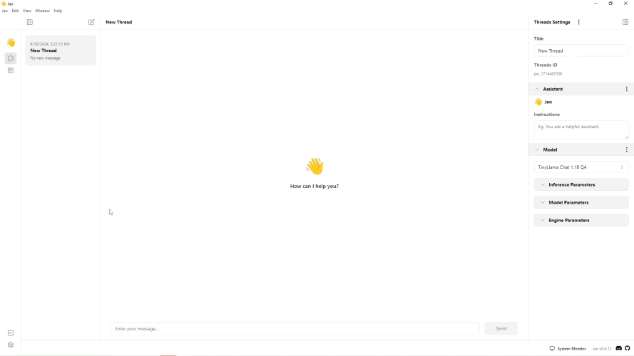

import { Tabs, Callout, Steps } from 'nextra/components'
import FAQBox from '@/components/FaqBox'


# Windows Installation
## Compatibility
Ensure that your system meets the following requirements to use Jan effectively:
  - **OS**:
    - Windows 10 or higher is required to run Jan.
  - **Hardware**:
    - **CPU**:
    - **RAM**:

## Installing Jan
To install Jan, follow the steps below:
<Steps>
### Step 1: Download the Jan Application
Jan provides two types of releases:
#### Stable Releases
The stable release is a stable version of Jan. You can download a stable release Jan app via the following:
  - **Official Website**: https://jan.ai
  - **Jan GitHub repository**: https://github.com/janhq/jan
<Callout type="info">
Make sure to verify the URL to ensure that it's the official Jan website and GitHub repository.
</Callout>
#### Nightly Releases
The nightly Release allows you to test out new features and get a sneak peek at what might be included in future stable releases. You can download this version from Jan's GitHub repository at https://github.com/janhq/jan.
<Callout type="info">
Keep in mind that this build might crash frequently and may contain bugs!
</Callout>
### Step 2: Install the Jan Application
1. Once you have downloaded the Jan app `.exe` file, open the file.
2. Wait for Jan to be completely installed on your machine.
3. Once installed, you can access Jan on your machine.
### Step 3: Move the Data Folder (Optional)
By default, Jan is installed in the following directory:

```sh
# Default installation directory
C:\Users\{username}\Jan
```
You can move the Jan data folder by following the steps below:
1. Open Jan.
2. Click the **gear icon (⚙️)** on the bottom left of your screen.
3. Under the **Settings screen**, click the **Advanced Settings**.
4. On the **Jan Data Folder** click the **pencil icon (✏️)** to change the folder where you keep your data.
<Callout type="info">
Please see the Jan Data Folder for more details about the data folder structure.
</Callout>
</Steps>

## GPU Acceleration
Once Jan is installed and you have a GPU, you can configure your GPU to accelerate the model's performance.
### NVIDIA GPU
To enable the use of your NVIDIA GPU in the Jan app, follow the steps below:
<Callout type="info">
  Ensure that you have installed the following to use NVIDIA GPU:
    - NVIDIA GPU with CUDA Toolkit 11.7 or higher.
    - NVIDIA driver 470.63.01 or higher.
</Callout>
1. Open Jan application.
2. Go to **Settings** -> **Advanced Settings** -> **GPU Acceleration**.
3. Enable and choose the NVIDIA GPU you want.
3. A success notification saying **Successfully turned on GPU acceleration** will appear when GPU acceleration is activated.
<br/>

### AMD or Intel ARC GPU
To enable the use of your AMD or Intel ARC GPU in the Jan app, you need to activate the Vulkan support first by following the steps below:
1. Open Jan application.
2. Go to **Settings** -> **Advanced Settings** -> enable the **Experimental Mode**.
3. Enable the **Vulkan Support** under the **GPU Acceleration**.
3. Enable the **GPU Acceleration** and choose the GPU you want to use.
3. A success notification saying **Successfully turned on GPU acceleration** will appear when GPU acceleration is activated.
<br/>

  
## Uninstalling Jan
To uninstall Jan, follow the steps below:
<Steps>
### Step 1: Open the Control Panels
1. Open the **Control Panels**.
2. Click **Uninstall Program** under the **Programs** section.
### Step 2: Uninstall Jan App
1. Search for **Jan**.
2. Click the **three dots icon** -> **Uninstall**.
3. Click **Uninstall** once again to confirm the action.
4. Click **OK**.
5. A message will appear: **"Do you also want to delete the DEFAULT Jan data folder at C:\Users\{username}\Jan?"**.
6. Click **OK** to delete the entire Jan data folder, or click **Cancel** to save your Jan Data folder so you can use this on the new installation folder.
<Callout type="warning">
The deleted Data Folder cannot be restored.
</Callout>
</Steps>
## FAQs
<FAQBox title="What are Nightly Releases, and how can I access them?">
  Nightly Releases allow you to test new features and previews of upcoming stable releases. You can download them from Jan's GitHub repository. However, remember that these builds might contain bugs and crash frequently.
</FAQBox>
<FAQBox title="Can I move the Jan data folder to a different location?">
  Yes, you can move the Jan data folder.
</FAQBox>
<FAQBox title="How do I enable GPU acceleration for better performance?">
  Depending on your GPU type (NVIDIA, AMD, or Intel), follow the respective instructions provided in the [GPU Acceleration](/docs/desktop/windows#gpu-acceleration) section above.
</FAQBox>
<FAQBox title="Can I recover the deleted Jan data folder after uninstallation?">
  No, once you delete the Jan data folder during uninstallation, it cannot be restored. 
</FAQBox>
<Callout type="warning">
If you have any trouble during installation, please see our [Troubleshooting](/docs/troubleshooting) guide to resolve your problem.
</Callout>
