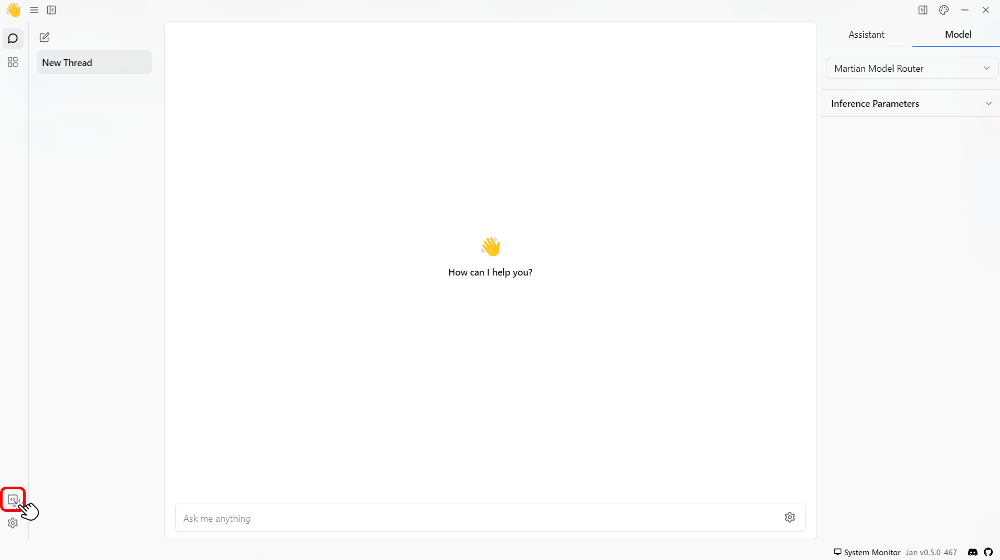
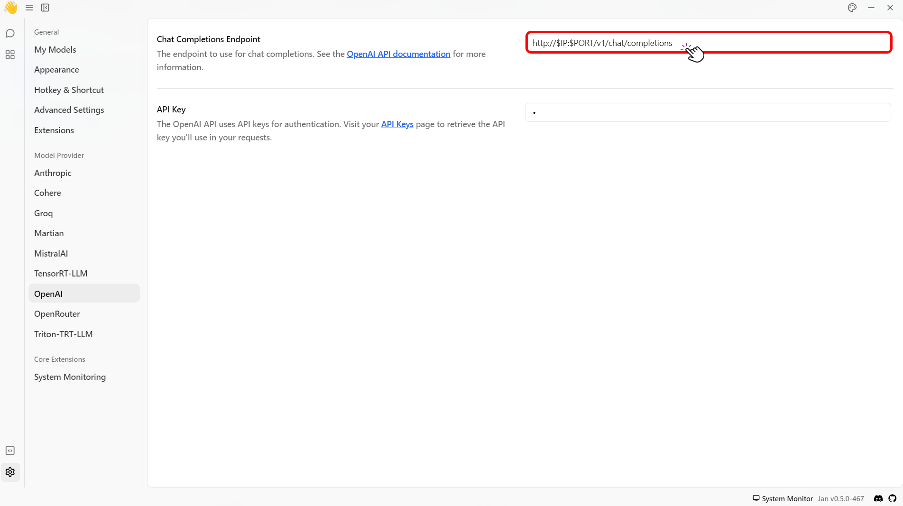

import { Callout, Steps } from 'nextra/components'

# Local API Server

Jan provides a built-in API server to be used as a drop-in for OpenAI's API local replacement. This guide will walk you through how to start the local server and use it to request the local server.

<Steps>
### Step 1: Set the Local Server

To start the local server, follow the steps below:

1. Navigate to the Jan main menu dashboard.
2. Click the **Local API Server** button on the bottom left side of your screen.

3. Select the model you want to use under the Model Settings screen to set the LLM for your local server.

4. Configure the server settings as follows:

| Feature                              | Description                                                                                                                                                                                                                                                               | Default Setting                 |
| ------------------------------------ | ------------------------------------------------------------------------------------------------------------------------------------------------------------------------------------------------------------------------------------------------------------------------- | ------------------------------- |
| Local Server Address                 | By default, Jan is only accessible on the same computer it's running on, using the address 127.0.0.1. You can change this to 0.0.0.0 to let other devices on your local network access it. However, this is less secure than allowing access from the same computer. | `localhost (127.0.0.1)`         |
| Port                                 | Jan runs on port 1337 by default. The port can be changed to any other port number as needed.                                                                                                                                                                             | `1337`                          |
| API Prefix                           | Customizes the base URL of the local API server.                                                                                                                                                                            | /v1                         |
| Cross-Origin Resource Sharing (CORS) | Manages resource access from external domains. Enabled for security by default but can be disabled if needed.                                                                                                                                                             | Enabled                         |
| Verbose Server Logs                  | Provides extensive details about server activities as the local server runs, displayed at the center of the screen.                                                                                                                                                       | Not specified (implied enabled) |

### Step 2: Start and Use the Built-in API Server

Once you have set the server settings, you can start the server by following the steps below:

1. Click the **Start Server** button on the top left of your screen.

<Callout type="info">
  When the server starts, you'll see a message like `Server listening at
  http://127.0.0.1:1337`, and the **Start Server** button will turn into a red
  **Stop Server** button.
</Callout>

2. Click the **API Reference** under the **Stop Server** button. 

3. You will be redirected to the API reference server in your browser.
4. Select the available endpoints and try them out by executing the example request.
5. In this example, we will show you how it works using the `Chat` endpoint.
6. Click the **Try it out** button.
7. The Chat endpoint has the following `cURL request example` when running using a `tinyllama-1.1b` model local server:

```json
{
  "messages": [
    {
      "content": "You are a helpful assistant.",
      "role": "system"
    },
    {
      "content": "Hello!",
      "role": "user"
    }
  ],
  "model": "tinyllama-1.1b",
  "stream": true,
  "max_tokens": 2048,
  "stop": ["hello"],
  "frequency_penalty": 0,
  "presence_penalty": 0,
  "temperature": 0.7,
  "top_p": 0.95
}
```

8. The endpoint returns the following `JSON response body`:

```json
{
  "choices": [
    {
      "finish_reason": null,
      "index": 0,
      "message": {
        "content": "Hello user. What can I help you with?",
        "role": "assistant"
      }
    }
  ],
  "created": 1700193928,
  "id": "ebwd2niJvJB1Q2Whyvkz",
  "model": "_",
  "object": "chat.completion",
  "system_fingerprint": "_",
  "usage": {
    "completion_tokens": 500,
    "prompt_tokens": 33,
    "total_tokens": 533
  }
}
```
</Steps>