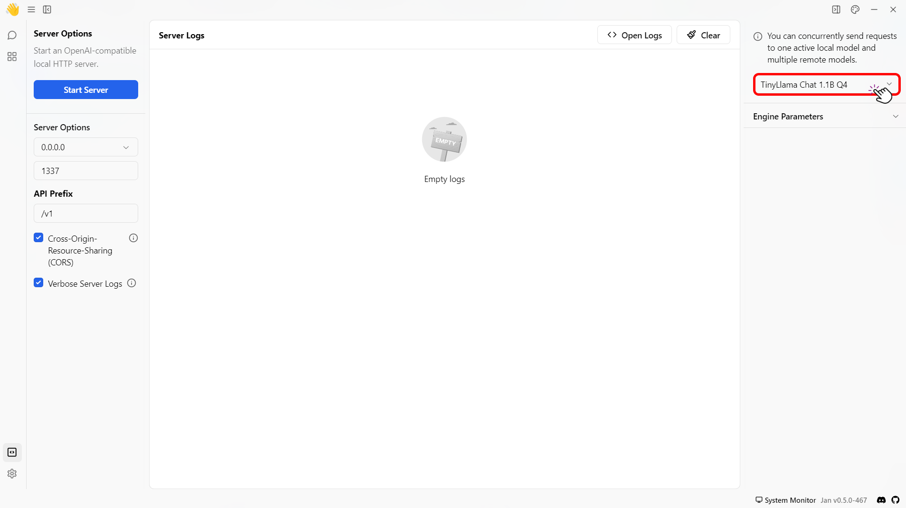
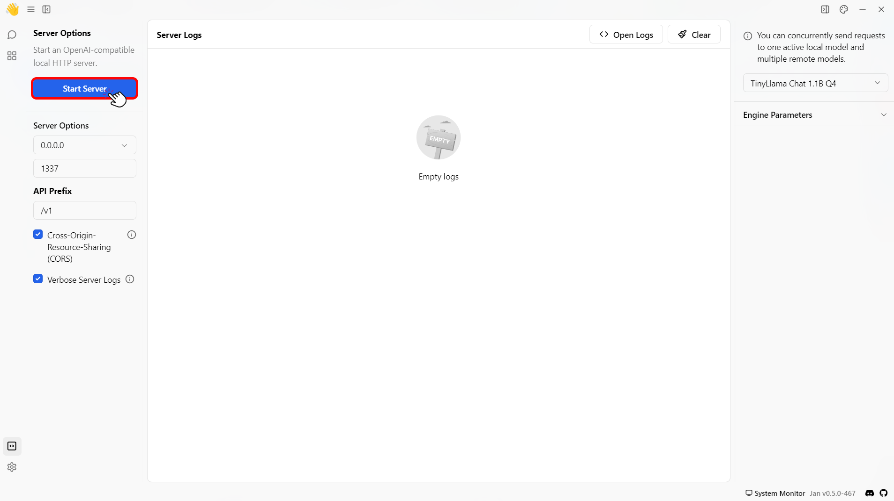

import { Callout, Steps } from 'nextra/components'

# Local API Server

Jan provides a built-in API server to be used as a drop-in for OpenAI's API local replacement. This guide will walk you through how to start the local server (Server) and use that for running the models and want to interact with the server from another machine (Client).

## Prerequisites
- Install Jan desktop app on both server and client machines.
- Configured the network connectivity to allow both machines to interact.

## How to Use Jan as a Server and a Client
<Steps>
### Step 1: Server Setup

To start the local server, follow the steps below:

1. Navigate to the Jan main menu dashboard.
2. Click the **Local API Server** button on the bottom left side of your screen.
<br/>

<br/>
3. Select the model you want to use under the Model Settings screen to set the LLM for your local server.
<br/>

<br/>
4. Configure the server settings as follows:

| Feature                              | Description                                                                                                                                                                                                                                                               | Default Setting                 |
| ------------------------------------ | ------------------------------------------------------------------------------------------------------------------------------------------------------------------------------------------------------------------------------------------------------------------------- | ------------------------------- |
| Local Server Address                 | By default, Jan is only accessible on the same computer it's running on, using the address 127.0.0.1. You can change this to 0.0.0.0 to let other devices on your local network access it. However, this is less secure than allowing access from the same computer. | `localhost (127.0.0.1)`         |
| Port                                 | Jan runs on port 1337 by default. The port can be changed to any other port number as needed.                                                                                                                                                                             | `1337`                          |
| API Prefix                           | Customizes the base URL of the local API server.                                                                                                                                                                            | /v1                         |
| Cross-Origin Resource Sharing (CORS) | Manages resource access from external domains. Enabled for security by default but can be disabled if needed.                                                                                                                                                             | Enabled                         |
| Verbose Server Logs                  | Provides extensive details about server activities as the local server runs, displayed at the center of the screen.                                                                                                                                                       | Not specified (implied enabled) |

5. Once you have set the server settings, click the **Start Server** button on the top left of your screen.

<Callout type="info">
  When the server starts, you'll see a message like `Server listening at
  http://127.0.0.1:1337`, and the **Start Server** button will turn into a red
  **Stop Server** button.
</Callout>
<br/>

<br/>

<Callout type="info">
  You can click **API Reference** under the **Stop Server** button to try to interact with the API server locally.
</Callout>

### Step 2: Client Setup
1. Navigate to Jan's model folder.
2. Create a new folder called local-model.
3. Add the following code into a model.json:
```json
{
  "sources": [
    {
      "url": "http://jan.ai"
    }
  ],
  "id": "$MODEL_ID",
  "object": "model",
  "name": "local test",
  "version": "1.0",
  "description": "Test server",
  "format": "api",
  "settings": {},
  "metadata": {
    "author": "test",
    "tags": [
      "remote"
    ]
  },
  "engine": "openai",
  "state": "ready"
}

```
4. Open the Jan app.
5. Navigate to the **Settings** > **Extensions**.
6. Insert the server URL with the format (`http://$IP:$PORT/v1/chat/completions`) in OpenAI inference engine extension settings.
<Callout type="info">
  - Replace `$IP` with your server IP address.
  - Replace `$PORT` with your server Port number.
</Callout>
<br/>


### Step 3: Start Chatting with the Model
1. Go to the **Threads** tab.
2. Create a new chat.
3. Select **Remote** in the Model dropdown menu and choose the **Local Model** name.
4. Chat with the model.

</Steps>