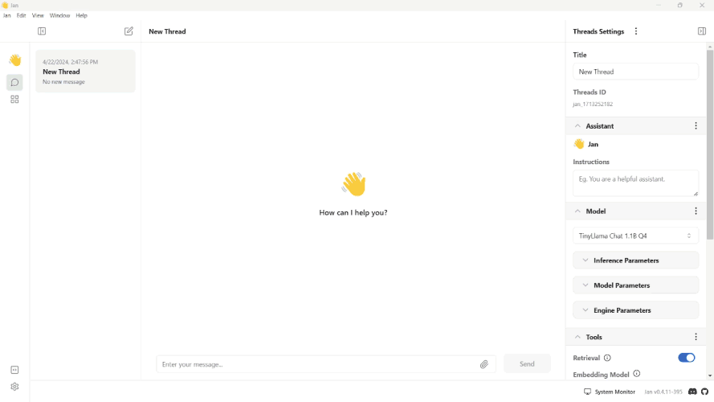
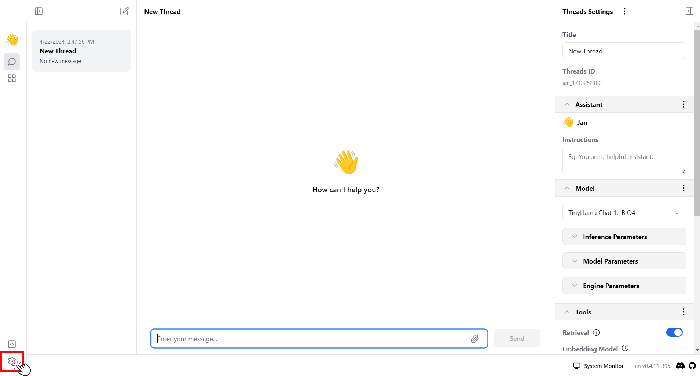
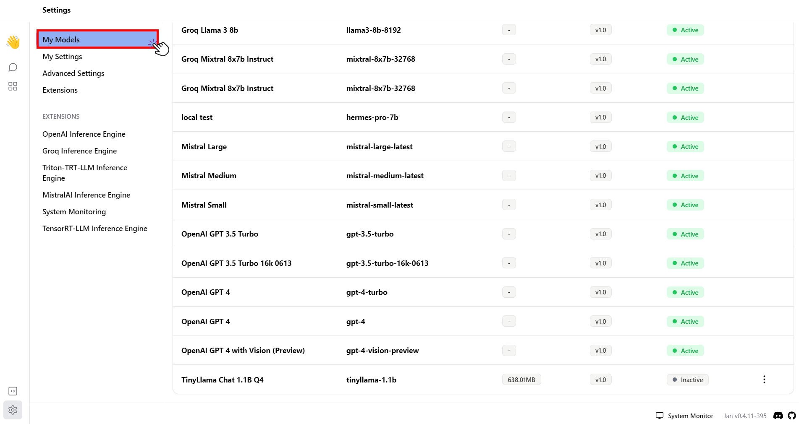
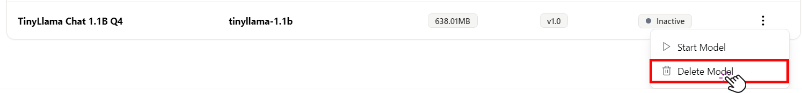

import { Callout, Steps } from 'nextra/components' 

# Overview
This guide provides comprehensive instructions on adding, customizing, and deleting models within the Jan platform. 

## Add Models

There are various ways to add models to Jan.

Currently, Jan natively supports the following model formats: 
- GGUF (through a llama.cpp engine)
- TensorRT (through a TRT-LLM engine)

### Download from Jan Hub
Jan Hub offers two easy ways to get your machine learning models. You can either pick from a list of recommended models or download using a model's ID or URL from Hugging Face. Here's a step-by-step guide for both methods.

#### 1. Download from the Recommended List
The Recommended List is a great starting point if you're looking for popular and pre-configured models that work well and quickly on most computers.

1. Open the Jan app and navigate to the Hub.
2. Select models, clicking the `v` dropdown for more information. Models with the `Recommended` label will likely run faster on your computer.
3. Click **Download** to download the model.
<br/>


#### 2. Download with HuggingFace Model's ID or URL 
If you need a specific model from Hugging Face, Jan Hub lets you download it directly using the model’s ID or URL.
<Callout type="warning">
Only `GGUF` models are supported for this feature.
</Callout>
1. Go to the [Hugging Face](https://huggingface.co/models).
2. Select the model you want to use.
3. Copy the Model's ID or URL, for example: `MaziyarPanahi/Mixtral-8x22B-Instruct-v0.1-GGUF` or `https://huggingface.co/MaziyarPanahi/Mixtral-8x22B-Instruct-v0.1-GGUF`.
4. Return to the Jan app and click on the Hub tab.
5. Paste the **URL** or the **model ID** you have copied into the search bar.
6. The app will show all available versions of the model.
7. Click Download for the version you want.
<br/>


### Add a Model Manually
You can also add a specific model that is not available within the **Hub** section by following the steps below:
1. Open the Jan app.
2. Click the **gear icon (⚙️)** on the bottom left of your screen.
3. Under the **Settings screen**, click **Advanced Settings**.
4. Open the **Jan Data folder**.
<br/>

<br/>
5. Head to the `~/jan/models/`.
6. Make a new model folder and put a file named `model.json` in it.
7. Insert the following `model.json` default code:
```json
{
  "id": "<unique_identifier_of_the_model>",
  "object": "<type_of_object, e.g., model, tool>",
  "name": "<name_of_the_model>",
  "version": "<version_number>",
  "description": "<brief_description_of_the_model>",
  "format": "<format_of_the_model_api_or_other>",
  "settings": "<additional_settings_as_needed>",
  "parameters": {
    "max_tokens": "<maximum_number_of_tokens_the_model_can_generate>",
    "temperature": "<temperature_setting_for_randomness_in_generation>"
  },
  "metadata": {
    "author": "<name_of_the_creator_or_organization>",
    "tags": ["<list_of_relevant_tags_describing_the_model>"]
  },
  "engine": "<engine_or_platform_the_model_runs_on>",
  "source": "<url_or_source_of_the_model_information>"
}
```
<Callout>
If you've set up your model's configuration in `nitro.json`, please note that `model.json` can **overwrite** the settings.
</Callout>
There are two important fields in `model.json` that you need to set:

#### Settings

This is the field where you can set your engine configurations. There are two important fields that you need to define for your local models:

| Term              | Description                                                           |
| ----------------- | --------------------------------------------------------------------- |
| `ctx_len`         | Defined based on the model's context size.                            |
| `prompt_template` | Defined based on the model's trained template (e.g., ChatML, Alpaca). |

To set up the `prompt_template` based on your model, follow the steps below: 
1. Visit [Hugging Face](https://huggingface.co/), an open-source machine-learning platform.
2. Find the current model that you're using (e.g., [Gemma 7b it](https://huggingface.co/google/gemma-7b-it)).
3. Review the text and identify the template.

#### Parameters

`parameters` are the adjustable settings that affect how your model operates or processes the data.
The fields in `parameters` are typically general and can be the same across models. An example is provided below:

<Callout type='info'>
To see the complete list of a model's parameters, please see [below](/docs/models#model-parameters).
</Callout>

```json
"parameters":{
  "temperature": 0.7,
  "top_p": 0.95,
  "stream": true,
  "max_tokens": 4096,
  "frequency_penalty": 0,
  "presence_penalty": 0
}
```

### Import or Symlink Local Models

You can also point to existing model binary files on your local filesystem. 
This is the easiest and most space-efficient way if you have already used other local AI applications.

1. Navigate to the Hub.
2. Click on `Import Model` at the top.
3. Select to import using `.GGUF` file or a folder.
3. Select the model or the folder containing multiple models.
4. Optionally, check the box to symlink the model files instead of copying them over the Jan Data Folder. This saves disk space.
<br/>


<Callout type="warning">
Windows users should drag and drop the model file, as **Click to Upload** might not show the model files in Folder Preview.
</Callout>

## Delete Models
To delete a model:

1. Go to **Settings**.
<br/>

<br/>
2. Go to **My Models**.
<br/>

<br/>
3. Select the three dots next and select `Delete model`.
<br/>
