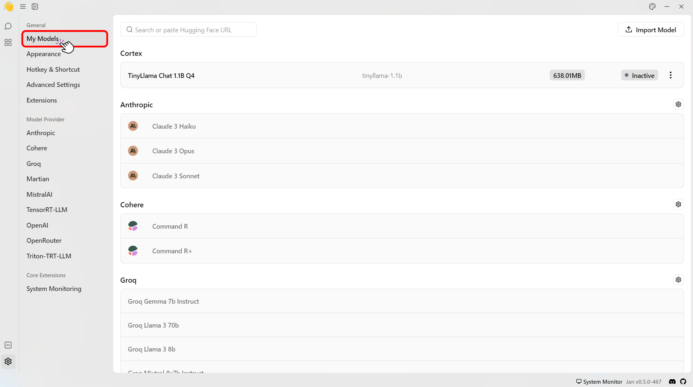
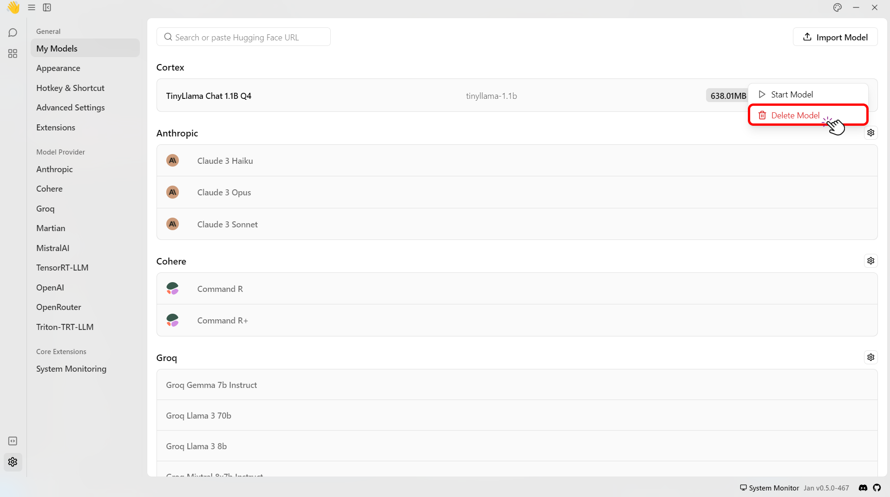

import { Callout, Steps } from 'nextra/components' 

# Overview
This guide provides comprehensive instructions on adding, customizing, and deleting models within the Jan platform. 

## Add Models

There are various ways to add models to Jan.

Currently, Jan natively supports the following model formats: 
- GGUF (through a llama.cpp engine)
- TensorRT (through a TRT-LLM engine)

### Download from Jan Hub
Jan Hub provides three convenient methods to access machine learning models. Here’s a clear step-by-step guide for each method:

#### 1. Download from the Recommended List
The Recommended List is a great starting point if you're looking for popular and pre-configured models that work well and quickly on most computers.

1. Open the Jan app and navigate to the Hub.
<br/>

<br/>
2. Select models, clicking the `v` dropdown for more information. 
<Callout type="info">
Models with the `Recommended` label will likely run faster on your computer.
</Callout>
3. Click **Download** to download the model.
<br/>


#### 2. Download with HuggingFace Model's ID or URL 
If you need a specific model from [Hugging Face](https://huggingface.co/models), Jan Hub lets you download it directly using the model’s ID or URL.
<Callout type="warning">
Only `GGUF` models are supported for this feature.
</Callout>
1. Go to the [Hugging Face](https://huggingface.co/models).
2. Select the model you want to use.
3. Copy the Model's ID or URL, for example: `MaziyarPanahi/Mixtral-8x22B-Instruct-v0.1-GGUF` or `https://huggingface.co/MaziyarPanahi/Mixtral-8x22B-Instruct-v0.1-GGUF`.
4. Return to the Jan app and click on the Hub tab.
<br/>

<br/>
5. Paste the **URL** or the **model ID** you have copied into the search bar.
<br/>

<br/>
6. The app will show all available versions of the model.
7. Click **Download** to download the model.
<br/>

<br/>
#### 3. Download with Deep Link
You can also use Jan's deep link feature to download a specific model from [Hugging Face](https://huggingface.co/models). The deep link format is: `jan://models/huggingface/<model's ID>`.
<Callout type="warning">
The deep link feature cannot be used for models that require:
- API Token.
- Acceptance of usage agreement.

You will need to download such models manually.
</Callout>
1. Go to the [Hugging Face](https://huggingface.co/models).
2. Select the model you want to use.
3. Copy the Model's ID or URL, for example: `TheBloke/Magicoder-S-DS-6.7B-GGUF`.
4. Enter the deep link URL with your chosen model's ID in your browser. For example: `jan://models/huggingface/TheBloke/Magicoder-S-DS-6.7B-GGUF`
<br/>

<br/>
5. A prompt will appear, click **Open** to open the Jan app.
<br/>

<br/>
6. The app will show all available versions of the model.
7. Click **Download** to download the model.
<br/>

<br/>
### Import or Symlink Local Models

You can also point to existing model binary files on your local filesystem. 
This is the easiest and most space-efficient way if you have already used other local AI applications.

1. Navigate to the Settings
<br/>

<br/>
2. Click on `My Models` at the top.
<br/>

<br/>
3. Click the `Import Model` button on the top-right of your screen.
4. Click the upload icon button.
<br/>

<br/>
4. Import using `.GGUF` file or a folder.
<br/>

<br/>
5. Select the model or the folder containing multiple models.

### Add a Model Manually
You can also add a specific model that is not available within the **Hub** section by following the steps below:
1. Click the System monitor button on your Jan app.
2. Click the App Log button.
3. This redirects you to the Jan data folder.
4. Head to the `~/jan/models/`.
6. Create a file named `model_name.yaml` in it.
7. Insert the following `model.yaml` default code:
```yaml
name: <model_name>
model: <model_name>
version: 1
stop:
  - </s>
top_p: 0.95
temperature: 0.7
frequency_penalty: 0
presence_penalty: 0
max_tokens: 4096
stream: true
ngl: 33
ctx_len: 4096
engine: <engine_name>
prompt_template: |-
  {system_message}
  {prompt}
files:
  - <model_file_path>
id: <model_id>
created: <creation_timestamp>
object: model
owned_by: <owner_name>

```

<Callout type='info'>
To see the complete list of a model's parameters, please see [Model Parameters](/docs/models#model-parameters).
</Callout>

## Delete Models
To delete a model:

1. Go to **Settings**.
<br/>

<br/>
2. Go to **My Models**.
<br/>

<br/>
3. Select the three dots next and select **Delete model**.
<br/>
