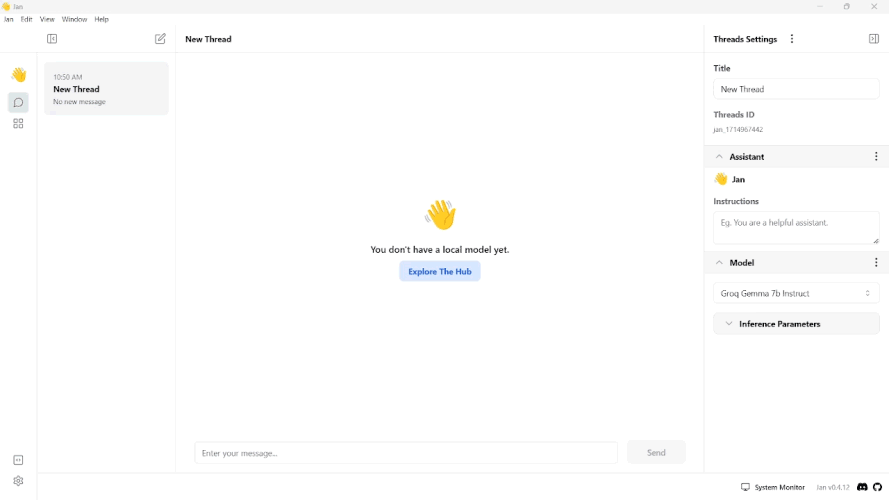
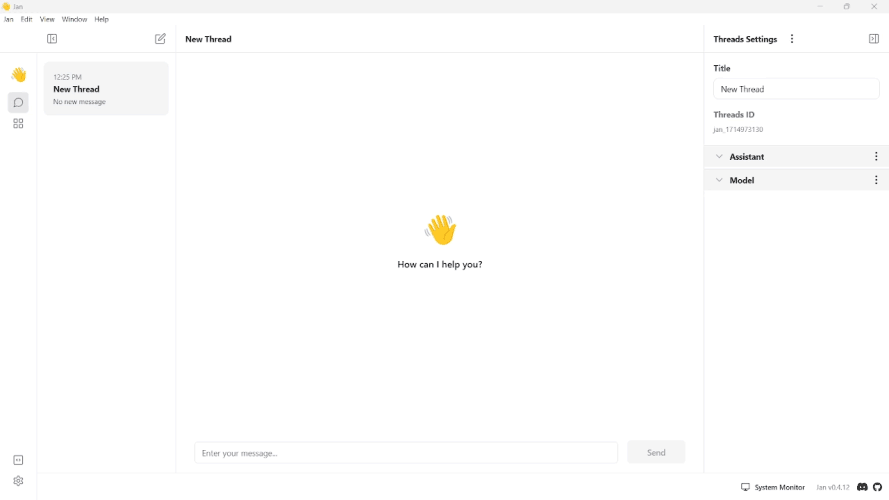

import { Tabs } from 'nextra/components'
import { Callout, Steps } from 'nextra/components'

# Quickstart
<Steps>

### Step 1: Install Jan
You can run Jan either on your desktop using the Jan desktop app or on a server by installing the Jan server. To get started, check out these pages:
- [Desktop](/docs/desktop)
- [Server](/docs/server)

Once you have installed Jan, you should see the Jan application as shown below without any local model installed:
 

 

### Step 2: Turn on the GPU Acceleration (Optional)
If you have a graphics card, boost model performance by enabling GPU acceleration:
1. Open Jan application.
2. Go to **Settings** -> **Advanced Settings** -> **GPU Acceleration**.
3. Click the Slider and choose your preferred GPU.
3. A success notification saying **Successfully turned on GPU acceleration** will appear when GPU acceleration is activated.
<Callout type="info">
Ensure you have installed your GPU driver. Please see [Desktop](/docs/desktop) for more information on activating the GPU acceleration.
</Callout>

### Step 3: Download a Model

Jan offers various local AI models tailored to different needs, all ready for download directly to your device:

1. Go to the **Hub**.
2. Select the models that you would like to install. To see model details, click the **dropdown** button.
3. You can also paste the Hugging Face model's **ID** or **URL** in the search bar.
<Callout type="info">
Ensure you select the appropriate model size by balancing performance, cost, and resource considerations in line with your task's specific requirements and hardware specifications.
</Callout>
4. Click the **Download** button.
 

 

5. Go to the **Thread** tab.
6. Click the **Model** dropdown button.
7. Choose the downloaded model, either **Local** or **Remote**.
8. Adjust the configurations as needed.
   <Callout type="info">
    Please see [Model Parameters](/docs/models#model-parameters) for detailed model configuration.
   </Callout>

 

 

### Step 4: Customize the Assistant Instruction
Customize Jan's assistant behavior by specifying queries, commands, or requests in the Assistant Instructions field to get the most responses from your assistant. To customize, follow the steps below:
1. On the **Thread** section, navigate to the right panel.
2. Select the **Assistant** dropdown menu.
3. Provide a specific guideline under the **Instructions** field.
 

 
### Step 5: Start Thread

Once you have downloaded a model and customized your assistant instruction, you can start chatting with the model.

 

 

### Step 6: Connect to a Remote API
Jan also offers access to remote models hosted on external servers. You can link up with any Remote AI APIs compatible with OpenAI. Jan comes with numerous extensions that facilitate connections to various remote AI APIs. To explore and connect to Remote APIs, follow these steps:
1. Click the **Gear Icon (⚙️)** on the bottom left of your screen.
2. Under the **Settings screen**, click the **Extensions**.
3. Ensure that you have installed the extensions.
4. Fill in the API **URL** and **Keys** in the OpenAI Inference Engine section.

 

 
</Steps>

## What's Next?
Now that Jan is up and running, explore further:
1. Learn how to download and manage your [models](/docs/models).
2. Customize Jan's [application settings](/docs/settings) according to your preferences.
3. Discover supported [integrations](/integrations) to expand Jan's capabilities.
4. Find out how to use [Jan as a client and a server](/docs/local-api).