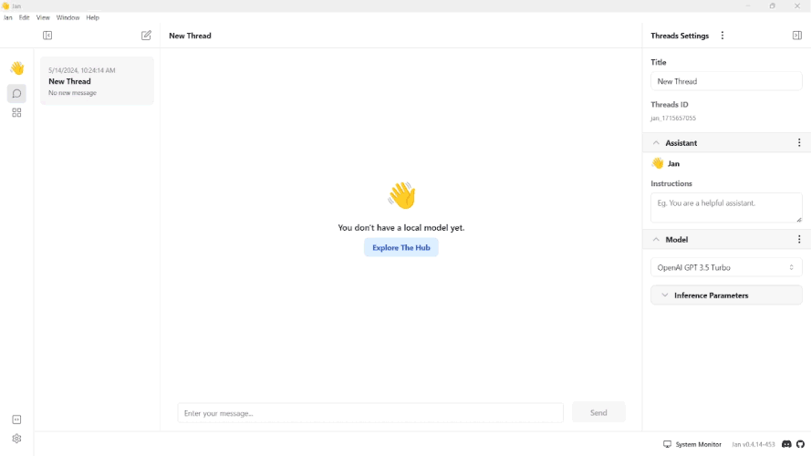
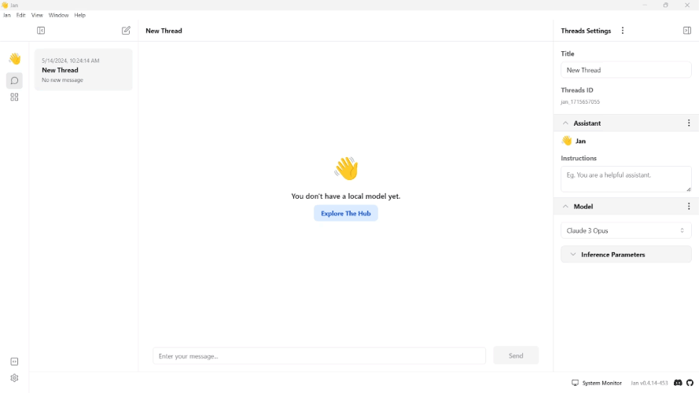

import { Callout, Steps } from 'nextra/components'

# Cohere

## How to Integrate Cohere with Jan

This guide provides step-by-step instructions on integrating Cohere with Jan, enabling users to chat with Cohere's LLMs within Jan's conversational interface.

Before proceeding, ensure you have the following:
- Access to the Jan application
- Cohere API credentials

## Integration Steps

<Steps>

### Step 1: Configure Cohere API Key
1. Obtain Cohere API Keys from your [Cohere Dashboard](https://dashboard.cohere.com/).
2. Copy your Cohere API Key and the endpoint URL you want.
3. Navigate to the **Jan app** > **Settings**.
4. Select the **Cohere**.
5. Insert the **API Key** and the **endpoint URL** into their respective fields.
 

<Callout type='info'>
  You can also manually edit the JSON file in `~/jan/settings/@janhq/inference-cohere-extension`.
</Callout>

### Step 2: Start Chatting with the Model

1. Navigate to the **Hub** section.
2. Select the Cohere model you want to use.
<Callout type='info'>
Cohere is the default extension for the Jan application. All the Cohere models are automatically installed when you install the Jan application.
</Callout>
3. Specify the model's parameters.
4. Start the conversation with the Cohere model.
 

</Steps>

## Troubleshooting

If you encounter any issues during the integration process or while using Cohere with Jan, consider the following troubleshooting steps:

- Double-check your API credentials to ensure they are correct.
- Check for error messages or logs that may provide insight into the issue.
- Reach out to Cohere API support for assistance if needed.