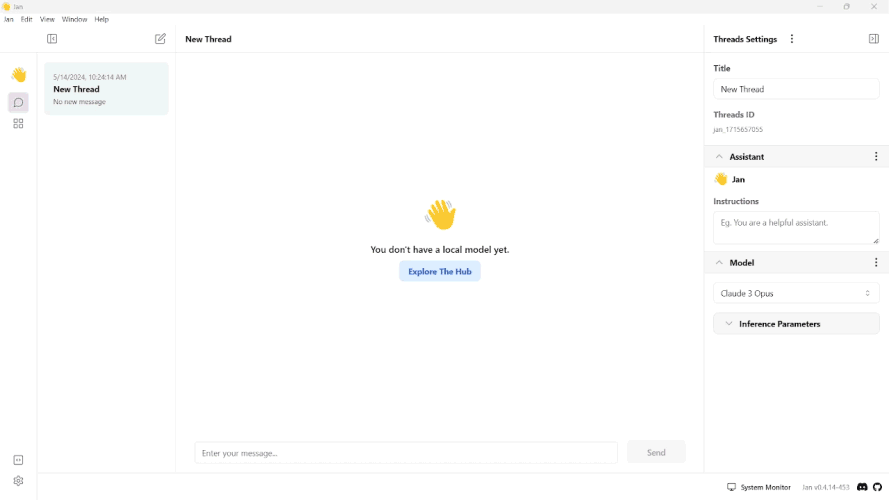
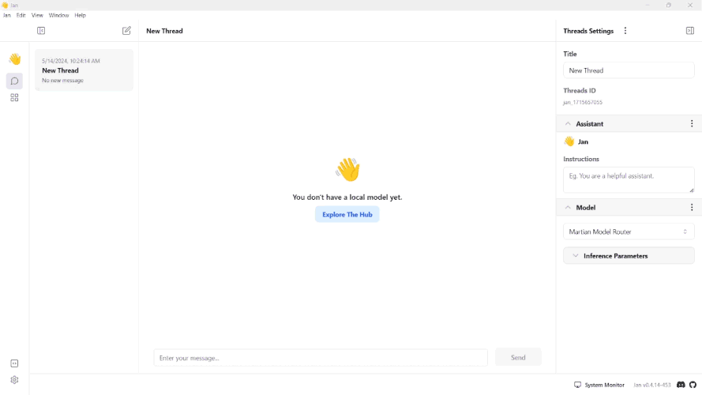

import { Callout, Steps } from 'nextra/components'

# Martian

## How to Integrate Martian with Jan

This guide provides step-by-step instructions on integrating Martian with Jan, enabling users to leverage Martian's capabilities within Jan's conversational interface.

Before proceeding, ensure you have the following:
- Access to the Jan application
- Martian API credentials

## Integration Steps

<Steps>

### Step 1: Configure Martian API Key
1. Obtain Martian API Keys from your [Martian Dashboard](https://auth.withmartian.com/).
2. Copy your Martian API Key and the endpoint URL you want.
3. Navigate to the **Jan app** > **Settings**.
4. Select the **Martian Inference Engine**.
5. Insert the **API Key** and the **endpoint URL** into their respective fields.
 

<Callout type='info'>
  You can also manually edit the JSON file in `~/jan/settings/@janhq/inference-martian-extension`.
</Callout>

### Step 2: Select Model

1. Navigate to the **Hub** section.
2. Ensure you have downloaded the model you want to use.
 

### Step 3: Start the Model

1. Navigate to the **Thread** section.
2. Under the **Model** section, click **Remote**.
3. Select the Martian model you want to use.
3. Start the conversation with the model.
 

</Steps>

## Troubleshooting

If you encounter any issues during the integration process or while using Martian with Jan, consider the following troubleshooting steps:

- Double-check your API credentials to ensure they are correct.
- Check for error messages or logs that may provide insight into the issue.
- Reach out to Martian API support for assistance if needed.