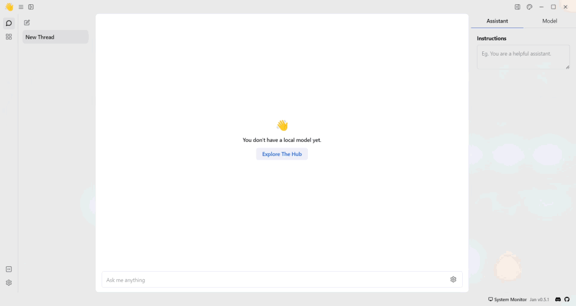

import { Callout, Steps } from 'nextra/components'

# NVIDIA NIM

## How to Integrate NVIDIA NIM with Jan

This guide provides step-by-step instructions on integrating NVIDIA NIM with Jan, enabling users to leverage Nvidia NIM's capabilities within Jan's conversational interface.

<Callout type='info'>
  Nvidia NIM extension is only supported on Jan version 0.5.1 or later.
</Callout>

Before proceeding, ensure you have the following:
- Access to the Jan application
- NVIDIA NIM API credentials

## Integration Steps
### Step 1: Configure Nvidia API Key
1. Obtain Nvidia API Keys from your [Nvidia dashboard](https://org.ngc.nvidia.com/setup/personal-keys).
2. Copy your Nvidia API Key and the endpoint URL you want.
3. Navigate to the **Jan app** > **Settings**.
4. Select the **Nvidia NIM**.
5. Insert the **API Key** and the **endpoint URL** into their respective fields.
 

### Step 2: Start Chatting with the Model

1. Navigate to the **Hub** section.
2. Select the model you want to use.
3. Specify the model's parameters.
4. Start the conversation with the model.
 

</Steps>

## Troubleshooting

If you encounter any issues during the integration process or while using Nvidia with Jan, consider the following troubleshooting steps:

- Double-check your API credentials to ensure they are correct.
- Check for error messages or logs that may provide insight into the issue.
- Reach out to Nvidia API support for assistance if needed.