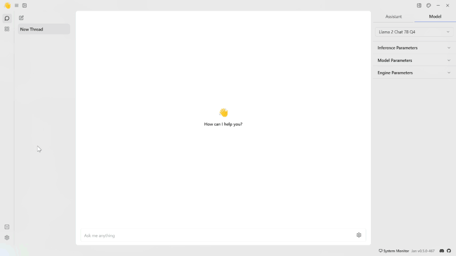
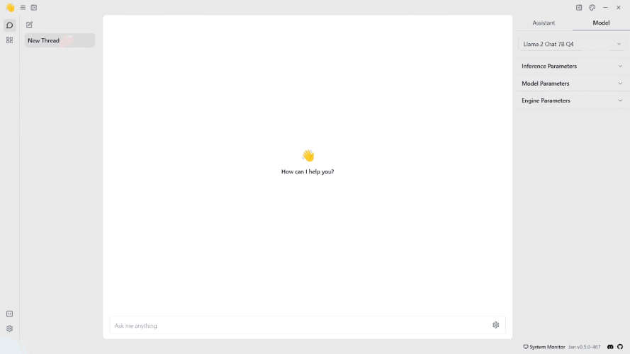

import { Callout, Steps } from 'nextra/components'

# OpenAI API

## How to Integrate OpenAI API with Jan
This guide provides step-by-step instructions for integrating the OpenAI API with Jan, allowing users to utilize OpenAI's capabilities within Jan's conversational interface.

## Integration Steps
<Steps>
### Step 1: Configure OpenAI API Key
1. Obtain OpenAI API Key from your [OpenAI Platform](https://platform.openai.com/api-keys) dashboard.
2. Copy your OpenAI Key and the endpoint URL you want to use.
3. Navigate to the **Jan app** > **Settings**.
4. Select the **OpenAI**.
<Callout type='info'>
The **OpenAI** fields can be used for any OpenAI-compatible API.
</Callout>
5. Insert the **API Key** and the **endpoint URL** into their respective fields.
 

<Callout type='info'>
You can also manually edit the JSON file in `~/jan/settings/@janhq/inference-openai-extension`.
</Callout>

### Step 2: Start Chatting with the Model

1. Navigate to the **Hub** section.
2. Select the OpenAI model you want to use.
<Callout type='info'>
The OpenAI is the default extension for the Jan application. All the OpenAI models are automatically installed when you install the Jan application.
</Callout>
3. Specify the model's parameters.
4. Start the conversation with the OpenAI model.
 

</Steps>

### OpenAI Models

You can also use specific OpenAI models you cannot find in the **Hub** section by customizing the `model.json` file, which you can see in the `~/jan/models/`. Follow the steps in the [Manage Models](/docs/models/manage-models) to manually add a model.

<Callout type='info'>
- You can find the list of available models in the [OpenAI Platform](https://platform.openai.com/docs/models/overview).
- The `id` property must match the model name in the list.
  - For example, if you want to use the [GPT-4 Turbo](https://platform.openai.com/docs/models/gpt-4-and-gpt-4-turbo), you must set the `id` property to `gpt-4-1106-preview`.
</Callout>

## Troubleshooting

If you encounter any issues during the integration process or while using OpenAI with Jan, consider the following troubleshooting steps:

- Double-check your API credentials to ensure they are correct.
- Check for error messages or logs that may provide insight into the issue.
- Reach out to OpenAI API support for assistance if needed.