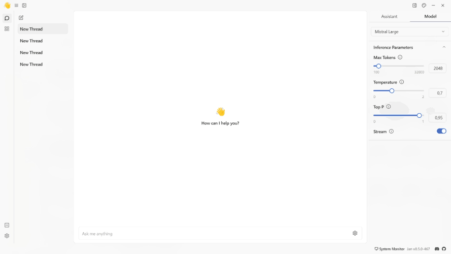
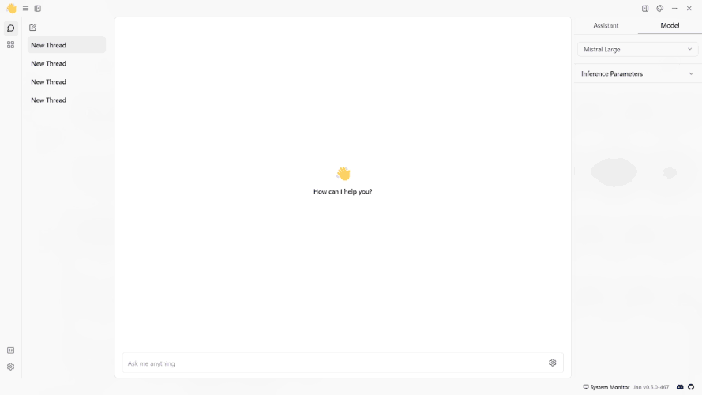

import { Callout, Steps } from 'nextra/components'

# OpenRouter

## Integrate OpenRouter with Jan

[OpenRouter](https://openrouter.ai/docs#quick-start) is a tool that gathers AI models. Developers can utilize its API to engage with diverse large language models, generative image models, and generative 3D object models.

To connect Jan with OpenRouter for accessing remote Large Language Models (LLMs) through OpenRouter, you can follow the steps below:

<Steps>
### Step 1: Configure OpenRouter API Key

1. Find your API Key in the [OpenRouter API Key](https://openrouter.ai/keys).
. Copy your OpenAI Key and the endpoint URL you want to use.
3. Navigate to the **Jan app** > **Settings**.
4. Select the **OpenRouter**.
5. Insert the **API Key** and the **endpoint URL** into their respective fields.
 

### Step 2: Start Chatting with the Model

1. Navigate to the **Hub** section.
2. Select the OpenRouter model you want to use.
3. Specify the model's parameters.
4. Start the conversation with the OpenRouter model.
 

</Steps>

## Troubleshooting

If you encounter any issues during the integration process or while using OpenAI with Jan, consider the following troubleshooting steps:

- Double-check your API credentials to ensure they are correct.
- Check for error messages or logs that may provide insight into the issue.
- Reach out to OpenRouter API support for assistance if needed.