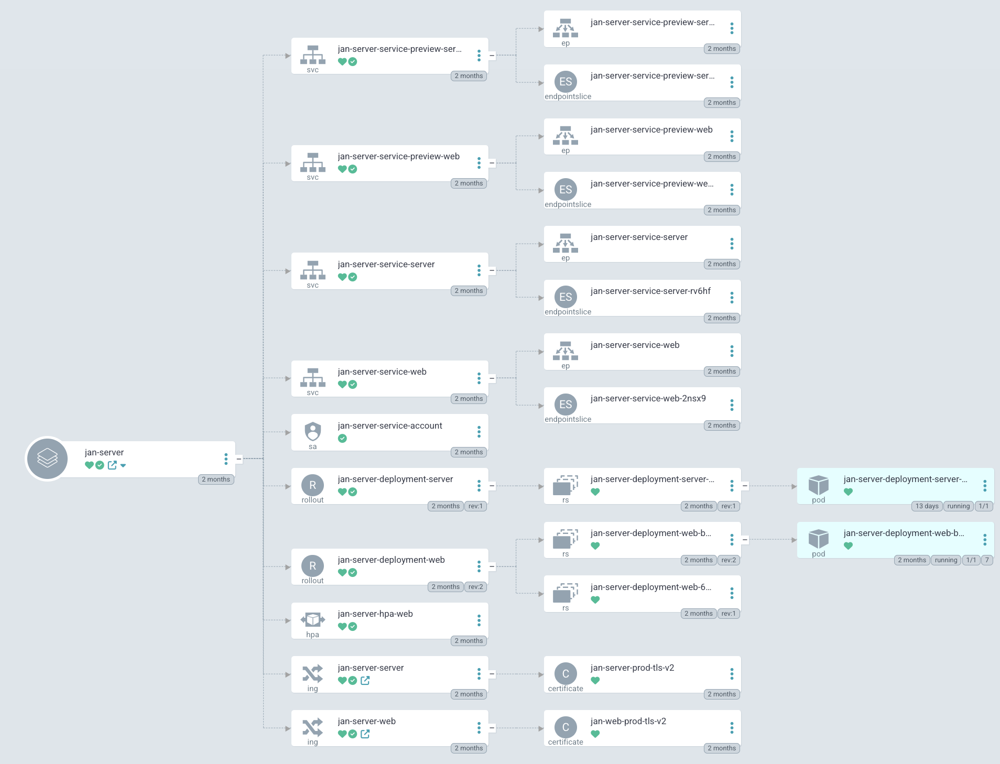

import { Tabs, Callout, Steps } from 'nextra/components'

# On-Premise Installation
To install Jan Server, follow the steps below:
<Steps>
### Step 1: Prepare Environment
- Choose a machine with at least 16GB RAM, 8 CPU cores, and 100GB storage.
- For better performance, you can use NVIDIA GPU.
<Callout type="info">
AMD GPU/ Intel Arc GPU are not supported yet.
</Callout>
### Step 2: Get Jan Server
<Tabs items={['Linux Docker', 'Windows WSL2 Docker', 'Kubernetes - Helm']}>
  <Tabs.Tab>
1. Before installing the Jan server, ensure that you have the following requirements:

    To enable GPU support, you will need:
      - NVIDIA GPU with CUDA Toolkit 11.7 or higher
      - NVIDIA driver 470.63.01 or higher
      - [NVIDIA Container Toolkit](https://docs.nvidia.com/datacenter/cloud-native/container-toolkit/latest/install-guide.html)

2. Install Docker Engine and Docker Compose on Linux using the following command:
<Callout type="info">
To install Docker Engine on Ubuntu, follow the instructions [here](https://docs.docker.com/engine/install/ubuntu/).
</Callout>
      ```bash
      curl -fsSL https://get.docker.com -o get-docker.sh
      sudo sh ./get-docker.sh --dry-run
      ```
3. Download Jan `docker-compose.yml` file using the following command:
      ```bash
      curl https://raw.githubusercontent.com/janhq/jan/dev/docker-compose.yml -o docker-compose.yml
      ```
### Step 3: Docker Configuration
Once you have installed Docker Engine and Docker Compose, you must set up the docker profile and environment variables.

The available Docker Compose profile and the environment variables are listed below:
| Docker compose Profile | Description                                  |
| ---------------------- | -------------------------------------------- |
| `cpu-fs`               | Run Jan in CPU mode with the default file system |
| `cpu-s3fs`             | Run Jan in CPU mode with S3 file system      |
| `gpu-fs`               | Run Jan in GPU mode with the default file system |
| `gpu-s3fs`             | Run Jan in GPU mode with S3 file system      |

| Environment Variable    | Description                                                                                             |
| ----------------------- | ------------------------------------------------------------------------------------------------------- |
| `S3_BUCKET_NAME`        | S3 bucket name - leave blank for default file system                                                    |
| `AWS_ACCESS_KEY_ID`     | AWS access key ID - leave blank for default file system                                                 |
| `AWS_SECRET_ACCESS_KEY` | AWS secret access key - leave blank for default file system                                             |
| `AWS_ENDPOINT`          | AWS endpoint URL - leave blank for default file system                                                  |
| `AWS_REGION`            | AWS region - leave blank for default file system                                                        |
| `API_BASE_URL`          | Jan Server URL, please modify it as your public IP address or domain name default http://localhost:1377 |

### Step 4: Run Jan Server
You can run the Jan server in two modes:
- CPU
- GPU
#### Run Jan in CPU Mode
Run Jan in CPU mode by using the following command:

```bash
# cpu mode with default file system
docker compose --profile cpu-fs up -d

# cpu mode with S3 file system
docker compose --profile cpu-s3fs up -d
```

#### Run Jan in GPU mode

1. Check CUDA compatibility with your NVIDIA driver by running `nvidia-smi` and check the CUDA version in the output

```bash
nvidia-smi

# Output
+---------------------------------------------------------------------------------------+
| NVIDIA-SMI 531.18                 Driver Version: 531.18       CUDA Version: 12.1     |
|-----------------------------------------+----------------------+----------------------+
| GPU  Name                      TCC/WDDM | Bus-Id        Disp.A | Volatile Uncorr. ECC |
| Fan  Temp  Perf            Pwr:Usage/Cap|         Memory-Usage | GPU-Util  Compute M. |
|                                         |                      |               MIG M. |
|=========================================+======================+======================|
|   0  NVIDIA GeForce RTX 4070 Ti    WDDM | 00000000:01:00.0  On |                  N/A |
|  0%   44C    P8               16W / 285W|   1481MiB / 12282MiB |      2%      Default |
|                                         |                      |                  N/A |
+-----------------------------------------+----------------------+----------------------+
|   1  NVIDIA GeForce GTX 1660 Ti    WDDM | 00000000:02:00.0 Off |                  N/A |
|  0%   49C    P8               14W / 120W|      0MiB /  6144MiB |      0%      Default |
|                                         |                      |                  N/A |
+-----------------------------------------+----------------------+----------------------+
|   2  NVIDIA GeForce GTX 1660 Ti    WDDM | 00000000:05:00.0 Off |                  N/A |
| 29%   38C    P8               11W / 120W|      0MiB /  6144MiB |      0%      Default |
|                                         |                      |                  N/A |
+-----------------------------------------+----------------------+----------------------+

+---------------------------------------------------------------------------------------+
| Processes:                                                                            |
|  GPU   GI   CI        PID   Type   Process name                            GPU Memory |
|        ID   ID                                                             Usage      |
|=======================================================================================|
```

2.  Visit [NVIDIA NGC Catalog ](https://catalog.ngc.nvidia.com/orgs/nvidia/containers/cuda/tags) and find the smallest minor version of the image tag that matches your CUDA version (e.g., 12.1 -> 12.1.0)

3. Update the `Dockerfile.gpu` line number 5 with the latest minor version of the image tag from step 2 (e.g., change `FROM nvidia/cuda:12.2.0-runtime-ubuntu22.04 AS base` to `FROM nvidia/cuda:12.1.0-runtime-ubuntu22.04 AS base`)

4. Run the following command to start Jan in GPU mode:

```bash
# GPU mode with default file system
docker compose --profile gpu-fs up -d

# GPU mode with S3 file system
docker compose --profile gpu-s3fs up -d
```
### Step 5: Access the Jan Server
Once the Jan server runs, you can access it in Jan at `http://localhost:3000`.
<Callout type="info"> 
**RAG** feature is not yet supported in Docker mode with `s3fs`.
</Callout>

  </Tabs.Tab>

  <Tabs.Tab>
1. Before installing the Jan server, ensure that you have the following requirements:
      - Windows 10 or higher is required to run Jan.
      - WSL2 must run in Windows in Jan. Follow the instructions [here](https://learn.microsoft.com/en-us/windows/wsl/install) to install it.

    To enable GPU support, you will need:
      - NVIDIA GPU with CUDA Toolkit 11.7 or higher
      - NVIDIA driver 470.63.01 or higher
      - [NVIDIA Container Toolkit](https://docs.nvidia.com/datacenter/cloud-native/container-toolkit/latest/install-guide.html)

 2. Install Docker Engine and Docker Compose on WSL2 using the following command:
<Callout type="info">
To install Docker Engine on Ubuntu, follow the instructions [here](https://docs.docker.com/engine/install/ubuntu/).
</Callout>    
    ```bash
    curl -fsSL https://get.docker.com -o get-docker.sh
    sudo sh ./get-docker.sh --dry-run
    ```
3. Download Jan `docker-compose.yml` file using the following command:
    ```bash
    curl https://raw.githubusercontent.com/janhq/jan/dev/docker-compose.yml -o docker-compose.yml
    ```
### Step 3: Docker Configuration
Once you have installed Docker Engine and Docker Compose, you must set up the docker profile and environment variables.

The available Docker Compose profile and the environment variables are listed below:
| Docker compose Profile | Description                                  |
| ---------------------- | -------------------------------------------- |
| `cpu-fs`               | Run Jan in CPU mode with the default file system |
| `cpu-s3fs`             | Run Jan in CPU mode with S3 file system      |
| `gpu-fs`               | Run Jan in GPU mode with the default file system |
| `gpu-s3fs`             | Run Jan in GPU mode with S3 file system      |

| Environment Variable    | Description                                                                                             |
| ----------------------- | ------------------------------------------------------------------------------------------------------- |
| `S3_BUCKET_NAME`        | S3 bucket name - leave blank for default file system                                                    |
| `AWS_ACCESS_KEY_ID`     | AWS access key ID - leave blank for default file system                                                 |
| `AWS_SECRET_ACCESS_KEY` | AWS secret access key - leave blank for default file system                                             |
| `AWS_ENDPOINT`          | AWS endpoint URL - leave blank for default file system                                                  |
| `AWS_REGION`            | AWS region - leave blank for default file system                                                        |
| `API_BASE_URL`          | Jan Server URL, please modify it as your public IP address or domain name default http://localhost:1377 |

### Step 4: Run Jan Server
You can run the Jan server in two modes:
- CPU
- GPU
#### Run Jan in CPU Mode
Run Jan in CPU mode by using the following command:

```bash
# cpu mode with default file system
docker compose --profile cpu-fs up -d

# cpu mode with S3 file system
docker compose --profile cpu-s3fs up -d
```

#### Run Jan in GPU mode

1. Check CUDA compatibility with your NVIDIA driver by running `nvidia-smi` and check the CUDA version in the output

```bash
nvidia-smi

# Output
+---------------------------------------------------------------------------------------+
| NVIDIA-SMI 531.18                 Driver Version: 531.18       CUDA Version: 12.1     |
|-----------------------------------------+----------------------+----------------------+
| GPU  Name                      TCC/WDDM | Bus-Id        Disp.A | Volatile Uncorr. ECC |
| Fan  Temp  Perf            Pwr:Usage/Cap|         Memory-Usage | GPU-Util  Compute M. |
|                                         |                      |               MIG M. |
|=========================================+======================+======================|
|   0  NVIDIA GeForce RTX 4070 Ti    WDDM | 00000000:01:00.0  On |                  N/A |
|  0%   44C    P8               16W / 285W|   1481MiB / 12282MiB |      2%      Default |
|                                         |                      |                  N/A |
+-----------------------------------------+----------------------+----------------------+
|   1  NVIDIA GeForce GTX 1660 Ti    WDDM | 00000000:02:00.0 Off |                  N/A |
|  0%   49C    P8               14W / 120W|      0MiB /  6144MiB |      0%      Default |
|                                         |                      |                  N/A |
+-----------------------------------------+----------------------+----------------------+
|   2  NVIDIA GeForce GTX 1660 Ti    WDDM | 00000000:05:00.0 Off |                  N/A |
| 29%   38C    P8               11W / 120W|      0MiB /  6144MiB |      0%      Default |
|                                         |                      |                  N/A |
+-----------------------------------------+----------------------+----------------------+

+---------------------------------------------------------------------------------------+
| Processes:                                                                            |
|  GPU   GI   CI        PID   Type   Process name                            GPU Memory |
|        ID   ID                                                             Usage      |
|=======================================================================================|
```

2.  Visit [NVIDIA NGC Catalog ](https://catalog.ngc.nvidia.com/orgs/nvidia/containers/cuda/tags) and find the smallest minor version of the image tag that matches your CUDA version (e.g., 12.1 -> 12.1.0)

3. Update the `Dockerfile.gpu` line number 5 with the latest minor version of the image tag from step 2 (e.g., change `FROM nvidia/cuda:12.2.0-runtime-ubuntu22.04 AS base` to `FROM nvidia/cuda:12.1.0-runtime-ubuntu22.04 AS base`)

4. Run the following command to start Jan in GPU mode:

```bash
# GPU mode with default file system
docker compose --profile gpu-fs up -d

# GPU mode with S3 file system
docker compose --profile gpu-s3fs up -d
```
### Step 5: Access the Jan Server
Once the Jan server runs, you can access it in Jan at `http://localhost:3000`.
<Callout type="info"> 
**RAG** feature is not yet supported in Docker mode with `s3fs`.
</Callout>

  </Tabs.Tab>
  <Tabs.Tab>
1. Before installing the Jan server, ensure that you have the following requirements:
  - Windows 10 or higher is required to run Jan.
  - WSL2 must run in Windows in Jan. Follow the instructions [here](https://learn.microsoft.com/en-us/windows/wsl/install) to install it.
  - To enable GPU support, you will need:
    - NVIDIA GPU with CUDA Toolkit 11.7 or higher
    - NVIDIA driver 470.63.01 or higher
    - [NVIDIA Container Toolkit](https://docs.nvidia.com/datacenter/cloud-native/container-toolkit/latest/install-guide.html)
    - [NVIDIA Device Plugin for Kubernetes](https://github.com/NVIDIA/k8s-device-plugin)
2. Install Docker Engine and Docker Compose using the following command:
<Callout type="info">
To install Docker Engine on Ubuntu, follow the instructions [here](https://docs.docker.com/engine/install/ubuntu/).
</Callout>
```bash
curl -fsSL https://get.docker.com -o get-docker.sh
sudo sh ./get-docker.sh --dry-run
```
3. Download Jan `docker-compose.yml` file using the following command:
```bash
curl https://raw.githubusercontent.com/janhq/jan/dev/docker-compose.yml -o docker-compose.yml
```
### Step 3: Helm Installation
1. Get Helm chart from Jan repository by using the following command:
    ```bash
      git clone https://github.com/janhq/jan.git
      cd jan/charts/server/
      helm install jan-server .
    ```
2. Verify and modify the configuration options by accessing the `values.yaml` file on `/jan/charts/server`. The following is the example resource created by Jan helm chart:
    
### Step 4: Access the Jan Server
Once the Jan server runs on your Helm server, you can access it using your public IP address or domain name.
1. Open a web browser and navigate to the Jan Server URL at `http://jan-server-service-web:1337`.
  </Tabs.Tab>
</Tabs>
</Steps>