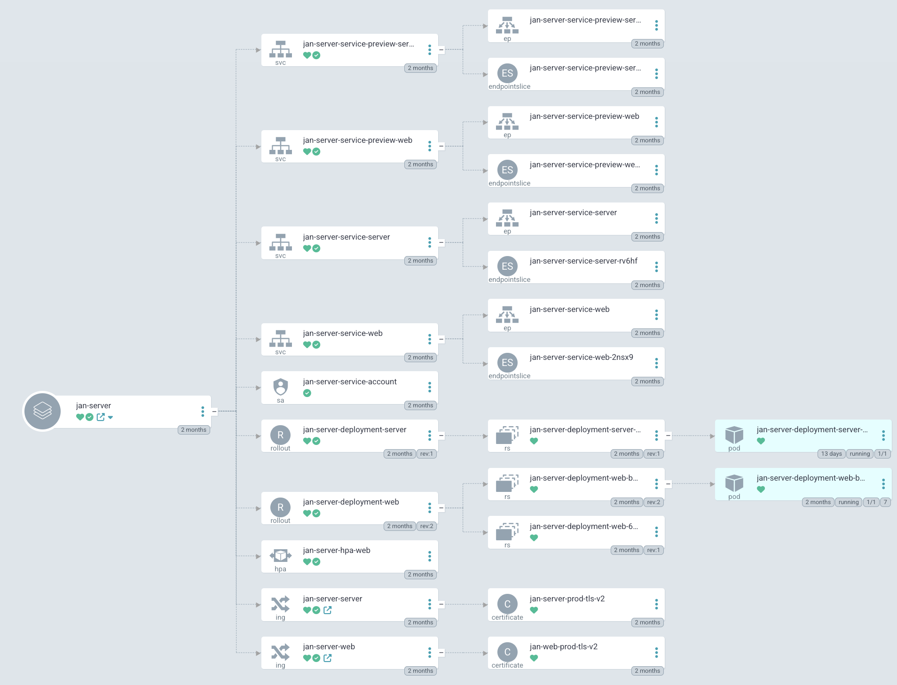

import { Tabs, Callout, Steps } from 'nextra/components'

# Kubernetes
## Compatibility
Ensure that your system meets the following hardware requirements to use Jan effectively:

  - **OS**:
  - **Hardware**:
    - **CPU**: Minimum 8 CPU cores
    - **RAM**: Minimum 16GB RAM
    - **Storage**: Minimum 100GB 
    - **GPU**:

## Prerequisites
<Steps>
### Step 1: Install Docker Engine and Compose
1. Install Docker Engine and Docker Compose 2 using the following command:
<Callout type="info">
To install Docker Engine on Ubuntu, follow the instructions [here](https://docs.docker.com/engine/install/ubuntu/).
</Callout>
```bash
curl -fsSL https://get.docker.com -o get-docker.sh
sudo sh ./get-docker.sh --dry-run
```
2. Download Jan `docker-compose.yml` file using the following command:
```bash
curl https://raw.githubusercontent.com/janhq/jan/dev/docker-compose.yml -o docker-compose.yml
```
### Step 2: Install GPU Drivers
To utilize your GPU, ensure that you have installed your GPU driver.
#### NVIDIA
To use your NVIDIA GPU, follow the steps below:
1. Download and install the Nvidia GPU driver 470.63.01 or higher from the official Nvidia website [here](https://www.nvidia.com/Download/index.aspx).
2. Install the CUDA Toolkit 11.7 or higher.
3. Install the Nvidia Container Toolkit by following the instructions provided [here](https://docs.nvidia.com/datacenter/cloud-native/container-toolkit/latest/install-guide.html).
4. Install the Nvidia device plugin for Kubernetes by following the instructions provided [here](https://github.com/NVIDIA/k8s-device-plugin).
<Callout type="info">
AMD GPU/ Intel Arc GPU are not supported yet.
</Callout>
</Steps>

## Installing Jan
In this installation section, we'll guide you through installing Jan with GPU mode and the `s3fs` variable, utilizing the remote Data Folder.
<Steps>
### Step 1: Customize the Docker Engine and Compose
1. Set up the docker profile and environment variables.
<Callout type="info">
Please see the [Understanding Jan's Dockerfile](/docs/server/kubernetes#understanding-the-jans-dockerfiles) section below for details on the docker file.
</Callout>
2. Check CUDA compatibility with your NVIDIA driver by running `nvidia-smi` and check the CUDA version in the output:

```bash
nvidia-smi

# Output
+---------------------------------------------------------------------------------------+
| NVIDIA-SMI 531.18                 Driver Version: 531.18       CUDA Version: 12.1     |
|-----------------------------------------+----------------------+----------------------+
| GPU  Name                      TCC/WDDM | Bus-Id        Disp.A | Volatile Uncorr. ECC |
| Fan  Temp  Perf            Pwr:Usage/Cap|         Memory-Usage | GPU-Util  Compute M. |
|                                         |                      |               MIG M. |
|=========================================+======================+======================|
|   0  NVIDIA GeForce RTX 4070 Ti    WDDM | 00000000:01:00.0  On |                  N/A |
|  0%   44C    P8               16W / 285W|   1481MiB / 12282MiB |      2%      Default |
|                                         |                      |                  N/A |
+-----------------------------------------+----------------------+----------------------+
|   1  NVIDIA GeForce GTX 1660 Ti    WDDM | 00000000:02:00.0 Off |                  N/A |
|  0%   49C    P8               14W / 120W|      0MiB /  6144MiB |      0%      Default |
|                                         |                      |                  N/A |
+-----------------------------------------+----------------------+----------------------+
|   2  NVIDIA GeForce GTX 1660 Ti    WDDM | 00000000:05:00.0 Off |                  N/A |
| 29%   38C    P8               11W / 120W|      0MiB /  6144MiB |      0%      Default |
|                                         |                      |                  N/A |
+-----------------------------------------+----------------------+----------------------+

+---------------------------------------------------------------------------------------+
| Processes:                                                                            |
|  GPU   GI   CI        PID   Type   Process name                            GPU Memory |
|        ID   ID                                                             Usage      |
|=======================================================================================|
```

3.  Visit [NVIDIA NGC Catalog ](https://catalog.ngc.nvidia.com/orgs/nvidia/containers/cuda/tags) and find the smallest minor version of the image tag that matches your CUDA version (e.g., 12.1 -> 12.1.0)

4. Update the `Dockerfile.gpu` line number 5 with the latest minor version of the image tag from step 2 (e.g., change `FROM nvidia/cuda:12.2.0-runtime-ubuntu22.04 AS base` to `FROM nvidia/cuda:12.1.0-runtime-ubuntu22.04 AS base`)
### Step 2: Run Jan
1. Get Helm chart from Jan repository by using the following command:
    ```bash
      git clone https://github.com/janhq/jan.git
      cd jan/charts/server/
      helm install jan-server .
    ```
2. Verify and modify the configuration options by accessing the `values.yaml` file on `/jan/charts/server`. See the example of Jan's helm cart [here](/docs/server/kubernetes#understanding-the-jans-helm-chart).
3. Start the Jan server using the `s3fs` variable. Run Jan with the following command:
<Tabs items={['GPU Mode (Recommended)', 'CPU Mode']}>
<Tabs.Tab>
```bash
# GPU mode with S3 file system
docker compose --profile gpu-s3fs up -d
```
</Tabs.Tab>
<Tabs.Tab>
```bash
# CPU mode with S3 file system
docker compose --profile cpu-s3fs up -d
```
</Tabs.Tab>
</Tabs>
#### Code Explanation
- `docker compose`: Manages multi-container Docker applications with Docker Compose.
- `--profile s3fs`: Specifies the Docker Compose profile to use. In this case, it indicates GPU mode with the S3 file system.
- `up -d`: Starts the Docker containers defined in the Docker Compose file in detached mode, meaning they run in the background.
### Step 3: Access the Jan Server
After deploying the Jan server using Helm, you can access it using your public IP address or domain name. Access the Jan Server via the following URL: `http://jan-server-service-web:1337`.
</Steps>
## Advanced Use
### CPU Usage
Running Jan in CPU mode is not the preferred option due to its slower performance than GPU mode. However, it can still be utilized for specific use cases.
To use the CPU mode, use the following commands:
```bash
# cpu mode with S3 file system
docker compose --profile cpu-s3fs up -d
```
## Resources
### Understanding the Jan's Dockerfiles
The available Docker Compose profile and the environment variables are listed below:
#### Docker Compose Profiles
Compose profiles in Docker Compose allow users to define different sets of services and configurations for specific deployment scenarios or environments. Users can activate a predefined set of services and configurations tailored to their needs by specifying a profile when running Docker Compose commands.
| Docker Compose Profile | Description                                  |
| ---------------------- | -------------------------------------------- |
| `cpu-fs`               | Run Jan in CPU mode with the default file system |
| `cpu-s3fs`             | Run Jan in CPU mode with S3 file system      |
| `gpu-fs`               | Run Jan in GPU mode with the default file system |
| `gpu-s3fs`             | Run Jan in GPU mode with S3 file system      |

#### Environment Variables
Environment variables are dynamic values that can affect the behavior of software applications or services within a computing environment. They are used to pass configuration information, such as file paths, API keys, or server URLs, to applications at runtime.
| Environment Variable    | Description                                                                                             |
| ----------------------- | ------------------------------------------------------------------------------------------------------- |
| `S3_BUCKET_NAME`        | S3 bucket name - leave blank for default file system                                                    |
| `AWS_ACCESS_KEY_ID`     | AWS access key ID - leave blank for default file system                                                 |
| `AWS_SECRET_ACCESS_KEY` | AWS secret access key - leave blank for default file system                                             |
| `AWS_ENDPOINT`          | AWS endpoint URL - leave blank for default file system                                                  |
| `AWS_REGION`            | AWS region - leave blank for default file system                                                        |
| `API_BASE_URL`          | Jan Server URL, please modify it as your public IP address or domain name default http://localhost:1377 |
### Understanding the Jan's Helm Chart
