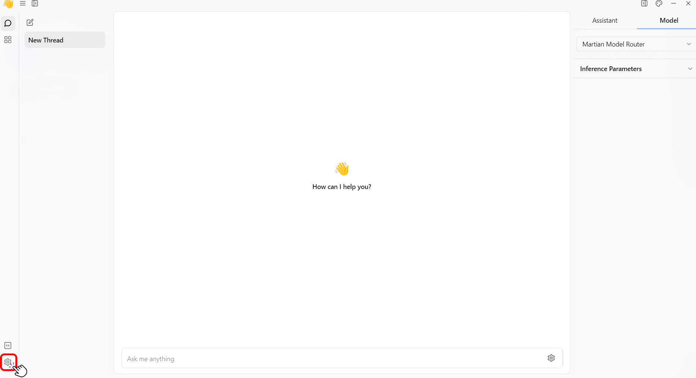

import { Tabs, Steps, Callout } from 'nextra/components'

# Settings

This guide will show you how to customize your Jan application settings and advanced settings.

## Settings File
Settings for the Jan application are stored in a `settings.json` file located at `jan/settings/`, ensuring they persist across sessions. This file contains all user preferences and configurations and can be manually edited with a text editor for advanced customization.
## Customize the UI
My Settings is where you can customize the color of Jan's desktop app UI. Here's how to personalize the color scheme of Jan's desktop app UI:
1. Navigate to the main dashboard.
2. Click the **Gear Icon (⚙️)** on the bottom left of your screen.
<br/>

<br/>
3. Select the **Appearance** section.
<br/>

<br/>
4. Pick the **Appearance Scheme** for your Jan desktop app. Options include:
  - Joi Light
  - Joi Dark
  - Dark Dimmed
  - Night Blue
<br/>

<br/>
5. Choose the **Interface theme** for your Jan desktop app. Options include:
  - Solid
  - Transparent
<br/>


## Access Advanced Settings
Advanced Settings is the GUI version of the `settings.json`. To access Jan's advanced settings, follow the steps below:
<Callout type="info">
Whenever you make changes in the Jan application's Settings screen, they are automatically saved to the `settings.json` file. This ensures your customizations are kept and applied every time the application starts.
</Callout>

1. Navigate to the main dashboard.
2. Click the **Gear Icon (⚙️)** on the bottom left of your screen.
<br/>

<br/>
3. Click the **Advanced Settings**.
<br/>

<br/>
4. You can configure the following settings:

| Feature                                  | Description                                                                                                                                                                                                              |
| ---------------------------------------- | ------------------------------------------------------------------------------------------------------------------------------------------------------------------------------------------------------------------------ |
| **Experimental Mode**                    | Enables experimental features that may be unstable.                                                                                                                                                                      |
| **GPU Acceleration**                     | Enables boosting your model performance by using your GPU devices for acceleration.                                                                                                                               |
| **Jan Data Folder**                      | Location for messages, model configurations, and user data. Changeable to a different location.                                                                                                                          |
| **HTTPS Proxy & Ignore SSL Certificate** | Use a proxy server for internet connections and ignore SSL certificates for self-signed certificates. Please check out the guide on setting up your HTTPS proxy server [here](settings#https-proxy). |
| **Ignore SSL Certificates**                   | Enables the self-signed or unverified certificates                                                       |
| **Clear Logs**                           | Removes all logs from the Jan application.                                                                                                                                                                               |
| **Reset To Factory Default**             | Resets the application to its original state, deleting all data, including model customizations and conversation history.                                                                                                 |

## Enable the Experimental Mode

To try out new features that are still in the testing phase, follow the steps below:

1. Navigate to the **Advanced Settings**.
2. On the **Experimental Mode**, click the slider to enable.
<br/>


## Enable the GPU Acceleration

To enhance your model performance, follow the steps below:

<Callout type="warning">
  Ensure you have read the [troubleshooting
  guide](/docs/troubleshooting#troubleshooting-nvidia-gpu) here for further
  assistance.
</Callout>

1. Navigate to the **Advanced Settings**.
2. On the **GPU Acceleration**, click the slider to enable.
<br/>


## Access the Jan Data Folder

To access the folder where messages, model configurations, and user data are stored, follow the steps below:

1. Navigate to the **Advanced Settings**.
<br/>

<br/>
2. On the **Jan Data Folder** click the **folder icon (📂)** to access the data or the **pencil icon (✏️)** to change the folder where you keep your data.
<br/>

<br/>
<Callout type="warning">
- Uninstalling Jan will delete the default Jan Data Folder.
- If you have moved the Jan Data Folder from its original location, this relocated folder will remain intact while the default folder is deleted upon uninstallation.
- Reinstalling Jan requires manually setting your previously relocated Jan Data Folder as the default.
</Callout>


## HTTPS Proxy

HTTPS Proxy encrypts data between your browser and the internet, making it hard for outsiders to intercept or read. It also helps you maintain your privacy and security while bypassing regional restrictions on the internet.

<Callout type="info" emoji="">
  - When configuring Jan using an HTTPS proxy, the speed of the downloading
  model may be affected by the encryption and decryption process. It also
  depends on the cloud service provider's networking. 
  
  - HTTPS Proxy does not affect the remote model usage.
</Callout>

### Setting Up Your Own HTTPS Proxy Server

This guide provides a simple overview of setting up an HTTPS proxy server using **Squid**, a widely used open-source proxy software.

<Callout type="info">
  Other software options are also available depending on your requirements.
</Callout>

<Steps>

### Step 1: Choosing a Server

1. First, you must choose a server to host your proxy server.

<Callout type="info">
  We recommend using a well-known cloud provider service like:

  - Amazon AWS
  - Google Cloud
  - Microsoft Azure
  - Digital Ocean
</Callout>


2. Ensure your server has a public IP address and is accessible from the internet.

### Step 2: Installing Squid

Instal **Squid** using the following command:

```bash
sudo apt-get update
sudo apt-get install squid
```

### Step 3: Configure Squid for HTTPS

To enable HTTPS, you will need to configure Squid with SSL support.

1. Squid requires an SSL certificate to handle HTTPS traffic. You can generate a self-signed certificate or obtain one from a Certificate Authority (CA). For a self-signed certificate, you can use OpenSSL:

```bash
openssl req -new -newkey rsa:2048 -days 365 -nodes -x509 -keyout squid-proxy.pem -out squid-proxy.pem
```

2. Edit the Squid configuration file `/etc/squid/squid.conf` to include the path to your SSL certificate and enable the HTTPS port:

```bash
http_port 3128 ssl-bump cert=/path/to/your/squid-proxy.pem
ssl_bump server-first all
ssl_bump bump all
```

3. To intercept HTTPS traffic, Squid uses SSL Bumping. This process allows Squid to decrypt and re-encrypt HTTPS traffic. To enable SSL Bumping, ensure the `ssl_bump` directives are configured correctly in your `squid.conf` file.

### Step 4 (Optional): Configure ACLs and Authentication

1. You can define rules to control who can access your proxy. This is done by editing the squid.conf file and defining ACLs:

```bash
acl allowed_ips src "/etc/squid/allowed_ips.txt"
http_access allow allowed_ips
```

2. If you want to add an authentication layer, Squid supports several authentication schemes. The basic authentication setup might look like this:

```bash
auth_param basic program /usr/lib/squid/basic_ncsa_auth /etc/squid/passwords
acl authenticated proxy_auth REQUIRED
http_access allow authenticated
```

### Step 5: Restart and Test Your Proxy

1. After configuring, restart Squid to apply the changes:

```bash
sudo systemctl restart squid
```

2. To test, configure your browser or another client to use the proxy server with its IP address and port (default is 3128).
3. Check if you can access the internet through your proxy.

<Callout type="info">
  Tips for Secure Your Proxy:

  - **Firewall rules**: Ensure only intended users or IP addresses can connect to your proxy server. This can be achieved by setting up appropriate firewall rules.
  - **Regular updates**: Keep your server and proxy software updated to protect you against known vulnerabilities.
  - **Monitoring and logging**: Monitor your proxy server for unusual activity and enable logging to keep track of the traffic passing through your proxy.
</Callout>

### Step 6: Enable the HTTPS Proxy

Once you set up your HTTPS proxy server, you can configure it for Jan.

1. Navigate to **Settings** > **Advanced Settings**.
2. On the **HTTPS Proxy**, click the slider to enable.
3. Input your domain in the blank field.
<br/>


</Steps>

## Ignore SSL Certificate

To Allow self-signed or unverified certificates, follow the steps below:

1. Navigate to the **Advanced Settings**.
2. On the **Ignore SSL Certificates**, click the slider to enable.
<br/>


## Clear Logs

To clear all logs on your Jan app, follow the steps below:

<Callout type="warning">
  This feature clears all the data in your **Jan Data Folder**.
</Callout>

1. Navigate to the **Advanced Settings**.
2. On the **Clear Logs** click the the **Clear** button.
<br/>


## Reset To Factory Default

To reset the Jan app to its original state, follow the steps below:

<Callout type="error">
  This irreversible action is only recommended if the application is corrupted.
</Callout>


1. Navigate to the **Advanced Settings**.
2. On the **Reset To Factory Default** click the the **Reset** button.
<br/>

