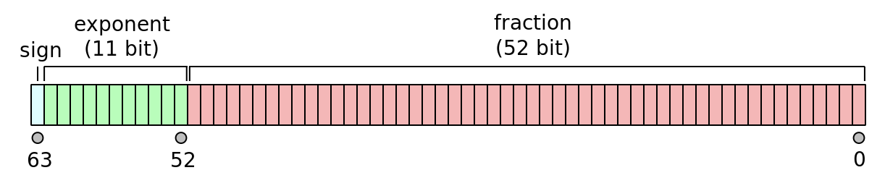
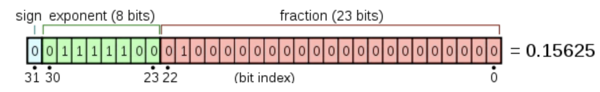
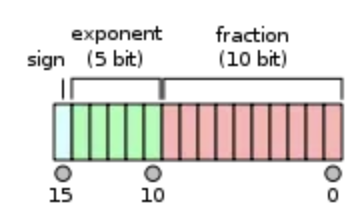
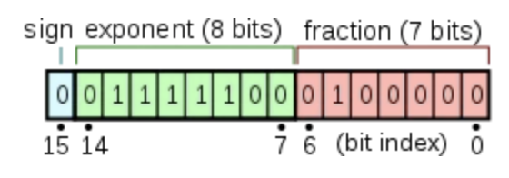
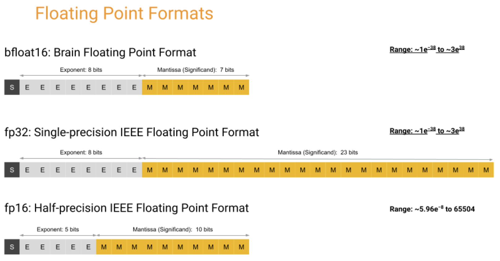

# Overview

AI and ML applications require data type in order to interpret information. Let's review the data types.

## FP64
A 64-bit floating point, typically the [IEEE 754](https://en.wikipedia.org/wiki/IEEE_754) double-precision binary floating-point support.

[Wikipedia](https://en.wikipedia.org/wiki/Double-precision_floating-point_format)

For the range, it is ~2.23e-308 … ~1.80e308 with full 15–17 decimal digits precision.

For the usage, it is used for scientific computation which requires high precision.

For hardware support, it is typically supported in x86 CPUs and most of GPUs

## FP32
FP32 is another [IEEE 754](https://en.wikipedia.org/wiki/IEEE_754) with the single-precision floating-point support.

[Wikipedia](https://en.wikipedia.org/wiki/Single-precision_floating-point_format)

For the range, it is ~1.18e-38 … ~3.40e38 with 6–9 significant decimal digits precision.

For the usage, AI and ML applications have been using FP32 to represent weights and other values for many long time. However, it is not precise enough for scientific computing.

For hardware support, it's supported in x86 CPUs and NVIDIA/ AMD GPUs

## FP16
FP16 is another [IEEE 754](https://en.wikipedia.org/wiki/IEEE_754) with half-precision floating-point support.

[Wikipedia](https://en.wikipedia.org/wiki/Single-precision_floating-point_format)

For the range, it is ~5.96e−8 (6.10e−5) … 65504 with 4 significant decimal digits precision.

For the usage:
  - It's the new trending in deep learning application as neural network requires lower precision. Higher precision results in being slower, more memory consumption and high demand for memory bandwidth.
  - Can be used for model training with Mixed-Precision Training with Quantization-Aware Training.
  - Can be used for model post-training quantization for faster and more efficient inference. Other possible formats are integer INT8 (8-bit integer), INT4 (4 bits) and even INT1 (a binary value).

For software support, it's supported in popular frameworks like Tensorflow, Pytorch, etc

For hardware support, it's **not supported** by x86 CPUs and well-supported in modern GPUs.

## BF16
BF16 is another 16-bit format originally developed by Google is called “Brain Floating Point Format”, or “bfloat16” for short.

[Wikipedia](https://en.wikipedia.org/wiki/Bfloat16_floating-point_format)

BF16, allows for fast conversion to and from an IEEE 754 FP32. In conversion to the bfloat16 format, the exponent bits are preserved while the significand field can be reduced by truncation.

[GCP](https://cloud.google.com/tpu/docs/bfloat16)

For the range, it is ~1.18e-38 … ~3.40e38 with 3 significant decimal digits.

For the usage, BF16 is the new trending to replace FP16. 
Unlike FP16 typically requires special handling via techniques such as loss scaling, BF16 comes close to being a drop-in replacement for FP32 when training and running deep neural networks.

For software support, it's supported in popular frameworks like Tensorflow, Pytorch, etc

For hardware support:
  - Supported in most modern x86 CPU with [AVX-512 BF16 extension](https://en.wikipedia.org/wiki/AVX-512#BF16) and [ARM-v8](https://www.tomshardware.com/news/bfloat16-deep-dive-arm-bf16-support-armv8-a,40305.html)
  - Supported in server grade NVIDIA GPUs starting from A100 and AMD GPUs (MI)
  - Supported from Google TPU v2

For the references, please read more about these at:
- https://observablehq.com/@rreusser/half-precision-floating-point-visualized
- https://moocaholic.medium.com/fp64-fp32-fp16-bfloat16-tf32-and-other-members-of-the-zoo-a1ca7897d407
- https://blogs.nvidia.com/blog/2020/05/14/tensorfloat-32-precision-format/
- https://arxiv.org/abs/1711.02213
- https://nhigham.com/2018/12/03/half-precision-arithmetic-fp16-versus-bfloat16/
