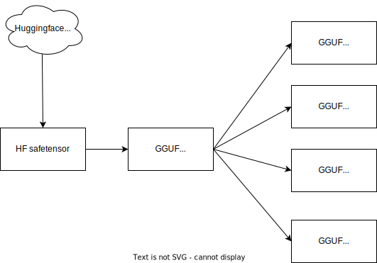
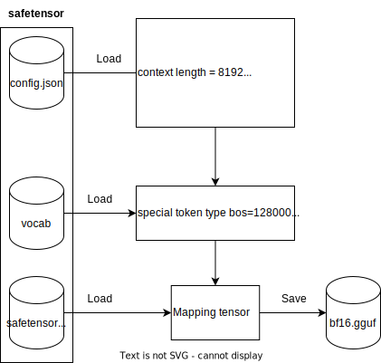

import FAQBox from '@/components/FaqBox'

## What is GGUF


GGUF is a format which is highly efficient for inference. The format was developed by [@ggerganov](https://github.com/ggerganov) and used for [llama.cpp](https://github.com/ggerganov/llama.cpp)

Unlike other formats, GGUF encodes both metadata and model tensor in a single binary that is "Build once, run everywhere"

You can also read more about GGUF in [HuggingFace awesome documentation](https://huggingface.co/docs/hub/en/gguf)

### GGUF Quantization types

<FAQBox title="GGUF Quantization types">

| Quantization Type | Description | Source URL |
|-------------------|-------------|------------|
| F32 | 32-bit standard IEEE 754 single-precision floating-point number. | [Wikipedia](https://en.wikipedia.org/wiki/Single-precision_floating-point_format) |
| F16 | 16-bit standard IEEE 754 half-precision floating-point number. | [Wikipedia](https://en.wikipedia.org/wiki/Half-precision_floating-point_format) |
| Q8_0 | 8-bit round-to-nearest quantization (q). Each block has 32 weights. Weight formula: w = q * block_scale. Legacy quantization method (not used widely as of today). | [Discussion](https://github.com/huggingface/huggingface.js/pull/615#discussion_r1557654249) |
| Q8_1 | 8-bit round-to-nearest quantization (q). Each block has 32 weights. Weight formula: w = q * block_scale + block_minimum. Legacy quantization method (not used widely as of today). | [Discussion](https://github.com/huggingface/huggingface.js/pull/615#discussion_r1557682290) |
| Q8_K | 8-bit quantization (q). Each block has 256 weights. Only used for quantizing intermediate results. All 2-6 bit dot products are implemented for this quantization type. Weight formula: w = q * block_scale. | [Issue](https://github.com/ggerganov/llama.cpp/pull/1684#issue-1739619305) |
| Q6_K | 6-bit quantization (q). Super-blocks with 16 blocks, each block has 16 weights. Weight formula: w = q * block_scale(8-bit), resulting in 6.5625 bits-per-weight. | [Issue](https://github.com/ggerganov/llama.cpp/pull/1684#issue-1739619305) |
| Q5_0 | 5-bit round-to-nearest quantization (q). Each block has 32 weights. Weight formula: w = q * block_scale. Legacy quantization method (not used widely as of today). | [Discussion](https://github.com/huggingface/huggingface.js/pull/615#discussion_r1557654249) |
| Q5_1 | 5-bit round-to-nearest quantization (q). Each block has 32 weights. Weight formula: w = q * block_scale + block_minimum. Legacy quantization method (not used widely as of today). | [Discussion](https://github.com/huggingface/huggingface.js/pull/615#discussion_r1557682290) |
| Q5_K | 5-bit quantization (q). Super-blocks with 8 blocks, each block has 32 weights. Weight formula: w = q * block_scale(6-bit) + block_min(6-bit), resulting in 5.5 bits-per-weight. | [Issue](https://github.com/ggerganov/llama.cpp/pull/1684#issue-1739619305) |
| Q4_0 | 4-bit round-to-nearest quantization (q). Each block has 32 weights. Weight formula: w = q * block_scale. Legacy quantization method (not used widely as of today). | [Discussion](https://github.com/huggingface/huggingface.js/pull/615#discussion_r1557654249) |
| Q4_1 | 4-bit round-to-nearest quantization (q). Each block has 32 weights. Weight formula: w = q * block_scale + block_minimum. Legacy quantization method (not used widely as of today). | [Discussion](https://github.com/huggingface/huggingface.js/pull/615#discussion_r1557682290) |
| Q4_K | 4-bit quantization (q). Super-blocks with 8 blocks, each block has 32 weights. Weight formula: w = q * block_scale(6-bit) + block_min(6-bit), resulting in 4.5 bits-per-weight. | [Issue](https://github.com/ggerganov/llama.cpp/pull/1684#issue-1739619305) |
| Q3_K | 3-bit quantization (q). Super-blocks with 16 blocks, each block has 16 weights. Weight formula: w = q * block_scale(6-bit), resulting. 3.4375 bits-per-weight. | [Issue](https://github.com/ggerganov/llama.cpp/pull/1684#issue-1739619305) |
| Q2_K | 2-bit quantization (q). Super-blocks with 16 blocks, each block has 16 weight. Weight formula: w = q * block_scale(4-bit) + block_min(4-bit), resulting in 2.5625 bits-per-weight. | [Issue](https://github.com/ggerganov/llama.cpp/pull/1684#issue-1739619305) |
| IQ4_XS | 4-bit quantization (q). Super-blocks with 256 weights. Weight w is obtained using super_block_scale & importance matrix, resulting in 4.25 bits-per-weight. | [README](https://huggingface.co/CISCai/OpenCodeInterpreter-DS-6.7B-SOTA-GGUF/blob/main/README.md?code=true#L59-L70) |
| IQ3_S | 3-bit quantization (q). Super-blocks with 256 weights. Weight w is obtained using super_block_scale & importance matrix, resulting in 3.44 bits-per-weight. | [README](https://huggingface.co/CISCai/OpenCodeInterpreter-DS-6.7B-SOTA-GGUF/blob/main/README.md?code=true#L59-L70) |
| IQ3_XXS | 3-bit quantization (q). Super-blocks with 256 weights. Weight w is obtained using super_block_scale & importance matrix, resulting in 3.06 bits-per-weight. | [README](https://huggingface.co/CISCai/OpenCodeInterpreter-DS-6.7B-SOTA-GGUF/blob/main/README.md?code=true#L59-L70) |
| IQ2_S | 2-bit quantization (q). Super-blocks with 256 weights. Weight w is obtained using super_block_scale & importance matrix, resulting in 2.5 bits-per-weight. | [README](https://huggingface.co/CISCai/OpenCodeInterpreter-DS-6.7B-SOTA-GGUF/blob/main/README.md?code=true#L59-L70) |
| IQ2_XS | 2-bit quantization (q). Super-blocks with 256 weights. Weight w is obtained using super_block_scale & importance matrix, resulting in 2.31 bits-per-weight. | [README](https://huggingface.co/CISCai/OpenCodeInterpreter-DS-6.7B-SOTA-GGUF/blob/main/README.md?code=true#L59-L70) |
| IQ2_XXS | 2-bit quantization (q). Super-blocks with 256 weights. Weight w is obtained using super_block_scale & importance matrix, resulting in 2.06 bits-per-weight. | [README](https://huggingface.co/CISCai/OpenCodeInterpreter-DS-6.7B-SOTA-GGUF/blob/main/README.md?code=true#L59-L70) |
| IQ1_S | 1-bit quantization (q). Super-blocks with 256 weights. Weight w is obtained using super_block_scale & importance matrix, resulting in 1.56 bits-per-weight. | [README](https://huggingface.co/CISCai/OpenCodeInterpreter-DS-6.7B-SOTA-GGUF/blob/main/README.md?code=true#L59-L70) |
| IQ4_NL | 4-bit quantization (q). Super-blocks with 256 weights. Weight w is obtained using super_block_scale & importance matrix. | [Issue](https://github.com/ggerganov/llama.cpp/pull/5590) |

</FAQBox>


## How to convert model to GGUF


### HuggingFace `safetensor` to `gguf bf16`
- Steps


There are 3 main steps to convert `safetensor` to `gguf`:
- The converter loads `config.json` and map to GGUF metadata K-V
- The converter loads vocabulary in `tokenizer.json` and map to GGUF metadata K-V for `chat_template` and vocab
- The converter loads weight from `.safetensor` files and map to GGUF BF16. For more information please see `Model layers mapping below`

<FAQBox title="Model layers mapping">

| Model layers                      | Shape            | Data format source | Data format destination |
|-----------------------------------|------------------|--------------------|-------------------------|
| token_embd.weight                 | [4096, 128256]   | torch.bfloat16     | BF16                    |
| blk.0.attn_norm.weight            | [4096]           | torch.bfloat16     | F32                     |
| blk.0.ffn_down.weight             | [14336, 4096]    | torch.bfloat16     | BF16                    |
| blk.0.ffn_gate.weight             | [4096, 14336]    | torch.bfloat16     | BF16                    |
| blk.0.ffn_up.weight               | [4096, 14336]    | torch.bfloat16     | BF16                    |
| blk.0.ffn_norm.weight             | [4096]           | torch.bfloat16     | F32                     |
| blk.0.attn_k.weight               | [4096, 1024]     | torch.bfloat16     | BF16                    |
| blk.0.attn_output.weight          | [4096, 4096]     | torch.bfloat16     | BF16                    |
| blk.0.attn_q.weight               | [4096, 4096]     | torch.bfloat16     | BF16                    |
| blk.0.attn_v.weight               | [4096, 1024]     | torch.bfloat16     | BF16                    |
| blk.1.attn_norm.weight            | [4096]           | torch.bfloat16     | F32                     |
| blk.1.ffn_down.weight             | [14336, 4096]    | torch.bfloat16     | BF16                    |
| blk.1.ffn_gate.weight             | [4096, 14336]    | torch.bfloat16     | BF16                    |
| blk.1.ffn_up.weight               | [4096, 14336]    | torch.bfloat16     | BF16                    |
| blk.1.ffn_norm.weight             | [4096]           | torch.bfloat16     | F32                     |
| blk.1.attn_k.weight               | [4096, 1024]     | torch.bfloat16     | BF16                    |
| blk.1.attn_output.weight          | [4096, 4096]     | torch.bfloat16     | BF16                    |
| blk.1.attn_q.weight               | [4096, 4096]     | torch.bfloat16     | BF16                    |
| blk.1.attn_v.weight               | [4096, 1024]     | torch.bfloat16     | BF16                    |
| blk.2.attn_norm.weight            | [4096]           | torch.bfloat16     | F32                     |
| blk.2.ffn_down.weight             | [14336, 4096]    | torch.bfloat16     | BF16                    |
| blk.2.ffn_gate.weight             | [4096, 14336]    | torch.bfloat16     | BF16                    |
| blk.2.ffn_up.weight               | [4096, 14336]    | torch.bfloat16     | BF16                    |
| blk.2.ffn_norm.weight             | [4096]           | torch.bfloat16     | F32                     |
| blk.2.attn_k.weight               | [4096, 1024]     | torch.bfloat16     | BF16                    |
| blk.2.attn_output.weight          | [4096, 4096]     | torch.bfloat16     | BF16                    |
| blk.2.attn_q.weight               | [4096, 4096]     | torch.bfloat16     | BF16                    |
| blk.2.attn_v.weight               | [4096, 1024]     | torch.bfloat16     | BF16                    |
| blk.3.attn_norm.weight            | [4096]           | torch.bfloat16     | F32                     |
| blk.3.ffn_down.weight             | [14336, 4096]    | torch.bfloat16     | BF16                    |
| blk.3.ffn_gate.weight             | [4096, 14336]    | torch.bfloat16     | BF16                    |
| blk.3.ffn_up.weight               | [4096, 14336]    | torch.bfloat16     | BF16                    |
| blk.3.ffn_norm.weight             | [4096]           | torch.bfloat16     | F32                     |
| blk.3.attn_k.weight               | [4096, 1024]     | torch.bfloat16     | BF16                    |
| blk.3.attn_output.weight          | [4096, 4096]     | torch.bfloat16     | BF16                    |
| blk.3.attn_q.weight               | [4096, 4096]     | torch.bfloat16     | BF16                    |
| blk.3.attn_v.weight               | [4096, 1024]     | torch.bfloat16     | BF16                    |
| blk.4.attn_norm.weight            | [4096]           | torch.bfloat16     | F32                     |
| blk.4.ffn_down.weight             | [14336, 4096]    | torch.bfloat16     | BF16                    |
| blk.4.ffn_gate.weight             | [4096, 14336]    | torch.bfloat16     | BF16                    |
| blk.4.ffn_up.weight               | [4096, 14336]    | torch.bfloat16     | BF16                    |
| blk.4.ffn_norm.weight             | [4096]           | torch.bfloat16     | F32                     |
| blk.4.attn_k.weight               | [4096, 1024]     | torch.bfloat16     | BF16                    |
| blk.4.attn_output.weight          | [4096, 4096]     | torch.bfloat16     | BF16                    |
| blk.4.attn_q.weight               | [4096, 4096]     | torch.bfloat16     | BF16                    |
| blk.4.attn_v.weight               | [4096, 1024]     | torch.bfloat16     | BF16                    |
| blk.5.attn_norm.weight            | [4096]           | torch.bfloat16     | F32                     |
| blk.5.ffn_down.weight             | [14336, 4096]    | torch.bfloat16     | BF16                    |
| blk.5.ffn_gate.weight             | [4096, 14336]    | torch.bfloat16     | BF16                    |
| blk.5.ffn_up.weight               | [4096, 14336]    | torch.bfloat16     | BF16                    |
| blk.5.ffn_norm.weight             | [4096]           | torch.bfloat16     | F32                     |
| blk.5.attn_k.weight               | [4096, 1024]     | torch.bfloat16     | BF16                    |
| blk.5.attn_output.weight          | [4096, 4096]     | torch.bfloat16     | BF16                    |
| blk.5.attn_q.weight               | [4096, 4096]     | torch.bfloat16     | BF16                    |
| blk.5.attn_v.weight               | [4096, 1024]     | torch.bfloat16     | BF16                    |
| blk.6.attn_norm.weight            | [4096]           | torch.bfloat16     | F32                     |
| blk.6.ffn_down.weight             | [14336, 4096]    | torch.bfloat16     | BF16                    |
| blk.6.ffn_gate.weight             | [4096, 14336]    | torch.bfloat16     | BF16                    |
| blk.6.ffn_up.weight               | [4096, 14336]    | torch.bfloat16     | BF16                    |
| blk.6.ffn_norm.weight             | [4096]           | torch.bfloat16     | F32                     |
| blk.6.attn_k.weight               | [4096, 1024]     | torch.bfloat16     | BF16                    |
| blk.6.attn_output.weight          | [4096, 4096]     | torch.bfloat16     | BF16                    |
| blk.6.attn_q.weight               | [4096, 4096]     | torch.bfloat16     | BF16                    |
| blk.6.attn_v.weight               | [4096, 1024]     | torch.bfloat16     | BF16                    |
| blk.7.attn_norm.weight            | [4096]           | torch.bfloat16     | F32                     |
| blk.7.ffn_down.weight             | [14336, 4096]    | torch.bfloat16     | BF16                    |
| blk.7.ffn_gate.weight             | [4096, 14336]    | torch.bfloat16     | BF16                    |
| blk.7.ffn_up.weight               | [4096, 14336]    | torch.bfloat16     | BF16                    |
| blk.7.ffn_norm.weight             | [4096]           | torch.bfloat16     | F32                     |
| blk.7.attn_k.weight               | [4096, 1024]     | torch.bfloat16     | BF16                    |
| blk.7.attn_output.weight          | [4096, 4096]     | torch.bfloat16     | BF16                    |
| blk.7.attn_q.weight               | [4096, 4096]     | torch.bfloat16     | BF16                    |
| blk.7.attn_v.weight               | [4096, 1024]     | torch.bfloat16     | BF16                    |
| blk.8.attn_norm.weight            | [4096]           | torch.bfloat16     | F32                     |
| blk.8.ffn_down.weight             | [14336, 4096]    | torch.bfloat16     | BF16                    |
| blk.8.ffn_gate.weight             | [4096, 14336]    | torch.bfloat16     | BF16                    |
| blk.8.ffn_up.weight               | [4096, 14336]    | torch.bfloat16     | BF16                    |
| blk.8.ffn_norm.weight             | [4096]           | torch.bfloat16     | F32                     |
| blk.8.attn_k.weight               | [4096, 1024]     | torch.bfloat16     | BF16                    |
| blk.8.attn_output.weight          | [4096, 4096]     | torch.bfloat16     | BF16                    |
| blk.8.attn_q.weight               | [4096, 4096]     | torch.bfloat16     | BF16                    |
| blk.8.attn_v.weight               | [4096, 1024]     | torch.bfloat16     | BF16                    |
| blk.10.attn_norm.weight           | [4096]           | torch.bfloat16     | F32                     |
| blk.10.ffn_down.weight            | [14336, 4096]    | torch.bfloat16     | BF16                    |
| blk.10.ffn_gate.weight            | [4096, 14336]    | torch.bfloat16     | BF16                    |
| blk.10.ffn_up.weight              | [4096, 14336]    | torch.bfloat16     | BF16                    |
| blk.10.ffn_norm.weight            | [4096]           | torch.bfloat16     | F32                     |
| blk.10.attn_k.weight              | [4096, 1024]     | torch.bfloat16     | BF16                    |
| blk.10.attn_output.weight         | [4096, 4096]     | torch.bfloat16     | BF16                    |
| blk.10.attn_q.weight              | [4096, 4096]     | torch.bfloat16     | BF16                    |
| blk.10.attn_v.weight              | [4096, 1024]     | torch.bfloat16     | BF16                    |
| blk.11.attn_norm.weight           | [4096]           | torch.bfloat16     | F32                     |
| blk.11.ffn_down.weight            | [14336, 4096]    | torch.bfloat16     | BF16                    |
| blk.11.ffn_gate.weight            | [4096, 14336]    | torch.bfloat16     | BF16                    |
| blk.11.ffn_up.weight              | [4096, 14336]    | torch.bfloat16     | BF16                    |
| blk.11.ffn_norm.weight            | [4096]           | torch.bfloat16     | F32                     |
| blk.11.attn_k.weight              | [4096, 1024]     | torch.bfloat16     | BF16                    |
| blk.11.attn_output.weight         | [4096, 4096]     | torch.bfloat16     | BF16                    |
| blk.11.attn_q.weight              | [4096, 4096]     | torch.bfloat16     | BF16                    |
| blk.11.attn_v.weight              | [4096, 1024]     | torch.bfloat16     | BF16                    |
| blk.12.attn_norm.weight           | [4096]           | torch.bfloat16     | F32                     |
| blk.12.ffn_down.weight            | [14336, 4096]    | torch.bfloat16     | BF16                    |
| blk.12.ffn_gate.weight            | [4096, 14336]    | torch.bfloat16     | BF16                    |
| blk.12.ffn_up.weight              | [4096, 14336]    | torch.bfloat16     | BF16                    |
| blk.12.ffn_norm.weight            | [4096]           | torch.bfloat16     | F32                     |
| blk.12.attn_k.weight              | [4096, 1024]     | torch.bfloat16     | BF16                    |
| blk.12.attn_output.weight         | [4096, 4096]     | torch.bfloat16     | BF16                    |
| blk.12.attn_q.weight              | [4096, 4096]     | torch.bfloat16     | BF16                    |
| blk.12.attn_v.weight              | [4096, 1024]     | torch.bfloat16     | BF16                    |
| blk.13.attn_norm.weight           | [4096]           | torch.bfloat16     | F32                     |
| blk.13.ffn_down.weight            | [14336, 4096]    | torch.bfloat16     | BF16                    |
| blk.13.ffn_gate.weight            | [4096, 14336]    | torch.bfloat16     | BF16                    |
| blk.13.ffn_up.weight              | [4096, 14336]    | torch.bfloat16     | BF16                    |
| blk.13.ffn_norm.weight            | [4096]           | torch.bfloat16     | F32                     |
| blk.13.attn_k.weight              | [4096, 1024]     | torch.bfloat16     | BF16                    |
| blk.13.attn_output.weight         | [4096, 4096]     | torch.bfloat16     | BF16                    |
| blk.13.attn_q.weight              | [4096, 4096]     | torch.bfloat16     | BF16                    |
| blk.13.attn_v.weight              | [4096, 1024]     | torch.bfloat16     | BF16                    |
| blk.14.attn_norm.weight           | [4096]           | torch.bfloat16     | F32                     |
| blk.14.ffn_down.weight            | [14336, 4096]    | torch.bfloat16     | BF16                    |
| blk.14.ffn_gate.weight            | [4096, 14336]    | torch.bfloat16     | BF16                    |
| blk.14.ffn_up.weight              | [4096, 14336]    | torch.bfloat16     | BF16                    |
| blk.14.ffn_norm.weight            | [4096]           | torch.bfloat16     | F32                     |
| blk.14.attn_k.weight              | [4096, 1024]     | torch.bfloat16     | BF16                    |
| blk.14.attn_output.weight         | [4096, 4096]     | torch.bfloat16     | BF16                    |
| blk.14.attn_q.weight              | [4096, 4096]     | torch.bfloat16     | BF16                    |
| blk.14.attn_v.weight              | [4096, 1024]     | torch.bfloat16     | BF16                    |
| blk.15.attn_norm.weight           | [4096]           | torch.bfloat16     | F32                     |
| blk.15.ffn_down.weight            | [14336, 4096]    | torch.bfloat16     | BF16                    |
| blk.15.ffn_gate.weight            | [4096, 14336]    | torch.bfloat16     | BF16                    |
| blk.15.ffn_up.weight              | [4096, 14336]    | torch.bfloat16     | BF16                    |
| blk.15.ffn_norm.weight            | [4096]           | torch.bfloat16     | F32                     |
| blk.15.attn_k.weight              | [4096, 1024]     | torch.bfloat16     | BF16                    |
| blk.15.attn_output.weight         | [4096, 4096]     | torch.bfloat16     | BF16                    |
| blk.15.attn_q.weight              | [4096, 4096]     | torch.bfloat16     | BF16                    |
| blk.15.attn_v.weight              | [4096, 1024]     | torch.bfloat16     | BF16                    |
| blk.16.attn_norm.weight           | [4096]           | torch.bfloat16     | F32                     |
| blk.16.ffn_down.weight            | [14336, 4096]    | torch.bfloat16     | BF16                    |
| blk.16.ffn_gate.weight            | [4096, 14336]    | torch.bfloat16     | BF16                    |
| blk.16.ffn_up.weight              | [4096, 14336]    | torch.bfloat16     | BF16                    |
| blk.16.ffn_norm.weight            | [4096]           | torch.bfloat16     | F32                     |
| blk.16.attn_k.weight              | [4096, 1024]     | torch.bfloat16     | BF16                    |
| blk.16.attn_output.weight         | [4096, 4096]     | torch.bfloat16     | BF16                    |
| blk.16.attn_q.weight              | [4096, 4096]     | torch.bfloat16     | BF16                    |
| blk.16.attn_v.weight              | [4096, 1024]     | torch.bfloat16     | BF16                    |
| blk.17.attn_norm.weight           | [4096]           | torch.bfloat16     | F32                     |
| blk.17.ffn_down.weight            | [14336, 4096]    | torch.bfloat16     | BF16                    |
| blk.17.ffn_gate.weight            | [4096, 14336]    | torch.bfloat16     | BF16                    |
| blk.17.ffn_up.weight              | [4096, 14336]    | torch.bfloat16     | BF16                    |
| blk.17.ffn_norm.weight            | [4096]           | torch.bfloat16     | F32                     |
| blk.17.attn_k.weight              | [4096, 1024]     | torch.bfloat16     | BF16                    |
| blk.17.attn_output.weight         | [4096, 4096]     | torch.bfloat16     | BF16                    |
| blk.17.attn_q.weight              | [4096, 4096]     | torch.bfloat16     | BF16                    |
| blk.17.attn_v.weight              | [4096, 1024]     | torch.bfloat16     | BF16                    |
| blk.18.attn_norm.weight           | [4096]           | torch.bfloat16     | F32                     |
| blk.18.ffn_down.weight            | [14336, 4096]    | torch.bfloat16     | BF16                    |
| blk.18.ffn_gate.weight            | [4096, 14336]    | torch.bfloat16     | BF16                    |
| blk.18.ffn_up.weight              | [4096, 14336]    | torch.bfloat16     | BF16                    |
| blk.18.ffn_norm.weight            | [4096]           | torch.bfloat16     | F32                     |
| blk.18.attn_k.weight              | [4096, 1024]     | torch.bfloat16     | BF16                    |
| blk.18.attn_output.weight         | [4096, 4096]     | torch.bfloat16     | BF16                    |
| blk.18.attn_q.weight              | [4096, 4096]     | torch.bfloat16     | BF16                    |
| blk.18.attn_v.weight              | [4096, 1024]     | torch.bfloat16     | BF16                    |
| blk.19.attn_norm.weight           | [4096]           | torch.bfloat16     | F32                     |
| blk.19.ffn_down.weight            | [14336, 4096]    | torch.bfloat16     | BF16                    |
| blk.19.ffn_gate.weight            | [4096, 14336]    | torch.bfloat16     | BF16                    |
| blk.19.ffn_up.weight              | [4096, 14336]    | torch.bfloat16     | BF16                    |
| blk.19.ffn_norm.weight            | [4096]           | torch.bfloat16     | F32                     |
| blk.19.attn_k.weight              | [4096, 1024]     | torch.bfloat16     | BF16                    |
| blk.19.attn_output.weight         | [4096, 4096]     | torch.bfloat16     | BF16                    |
| blk.19.attn_q.weight              | [4096, 4096]     | torch.bfloat16     | BF16                    |
| blk.19.attn_v.weight              | [4096, 1024]     | torch.bfloat16     | BF16                    |
| blk.20.ffn_gate.weight            | [4096, 14336]    | torch.bfloat16     | BF16                    |
| blk.20.attn_k.weight              | [4096, 1024]     | torch.bfloat16     | BF16                    |
| blk.20.attn_output.weight         | [4096, 4096]     | torch.bfloat16     | BF16                    |
| blk.20.attn_q.weight              | [4096, 4096]     | torch.bfloat16     | BF16                    |
| blk.20.attn_v.weight              | [4096, 1024]     | torch.bfloat16     | BF16                    |
| blk.9.attn_norm.weight            | [4096]           | torch.bfloat16     | F32                     |
| blk.9.ffn_down.weight             | [14336, 4096]    | torch.bfloat16     | BF16                    |
| blk.9.ffn_gate.weight             | [4096, 14336]    | torch.bfloat16     | BF16                    |
| blk.9.ffn_up.weight               | [4096, 14336]    | torch.bfloat16     | BF16                    |
| blk.9.ffn_norm.weight             | [4096]           | torch.bfloat16     | F32                     |
| blk.9.attn_k.weight               | [4096, 1024]     | torch.bfloat16     | BF16                    |
| blk.9.attn_output.weight          | [4096, 4096]     | torch.bfloat16     | BF16                    |
| blk.9.attn_q.weight               | [4096, 4096]     | torch.bfloat16     | BF16                    |
| blk.9.attn_v.weight               | [4096, 1024]     | torch.bfloat16     | BF16                    |
| blk.20.attn_norm.weight           | [4096]           | torch.bfloat16     | F32                     |
| blk.20.ffn_down.weight            | [14336, 4096]    | torch.bfloat16     | BF16                    |
| blk.20.ffn_up.weight              | [4096, 14336]    | torch.bfloat16     | BF16                    |
| blk.20.ffn_norm.weight            | [4096]           | torch.bfloat16     | F32                     |
| blk.21.attn_norm.weight           | [4096]           | torch.bfloat16     | F32                     |
| blk.21.ffn_down.weight            | [14336, 4096]    | torch.bfloat16     | BF16                    |
| blk.21.ffn_gate.weight            | [4096, 14336]    | torch.bfloat16     | BF16                    |
| blk.21.ffn_up.weight              | [4096, 14336]    | torch.bfloat16     | BF16                    |
| blk.21.ffn_norm.weight            | [4096]           | torch.bfloat16     | F32                     |
| blk.21.attn_k.weight              | [4096, 1024]     | torch.bfloat16     | BF16                    |
| blk.21.attn_output.weight         | [4096, 4096]     | torch.bfloat16     | BF16                    |
| blk.21.attn_q.weight              | [4096, 4096]     | torch.bfloat16     | BF16                    |
| blk.21.attn_v.weight              | [4096, 1024]     | torch.bfloat16     | BF16                    |
| blk.22.attn_norm.weight           | [4096]           | torch.bfloat16     | F32                     |
| blk.22.ffn_down.weight            | [14336, 4096]    | torch.bfloat16     | BF16                    |
| blk.22.ffn_gate.weight            | [4096, 14336]    | torch.bfloat16     | BF16                    |
| blk.22.ffn_up.weight              | [4096, 14336]    | torch.bfloat16     | BF16                    |
| blk.22.ffn_norm.weight            | [4096]           | torch.bfloat16     | F32                     |
| blk.22.attn_k.weight              | [4096, 1024]     | torch.bfloat16     | BF16                    |
| blk.22.attn_output.weight         | [4096, 4096]     | torch.bfloat16     | BF16                    |
| blk.22.attn_q.weight              | [4096, 4096]     | torch.bfloat16     | BF16                    |
| blk.22.attn_v.weight              | [4096, 1024]     | torch.bfloat16     | BF16                    |
| blk.23.attn_norm.weight           | [4096]           | torch.bfloat16     | F32                     |
| blk.23.ffn_down.weight            | [14336, 4096]    | torch.bfloat16     | BF16                    |
| blk.23.ffn_gate.weight            | [4096, 14336]    | torch.bfloat16     | BF16                    |
| blk.23.ffn_up.weight              | [4096, 14336]    | torch.bfloat16     | BF16                    |
| blk.23.ffn_norm.weight            | [4096]           | torch.bfloat16     | F32                     |
| blk.23.attn_k.weight              | [4096, 1024]     | torch.bfloat16     | BF16                    |
| blk.23.attn_output.weight         | [4096, 4096]     | torch.bfloat16     | BF16                    |
| blk.23.attn_q.weight              | [4096, 4096]     | torch.bfloat16     | BF16                    |
| blk.23.attn_v.weight              | [4096, 1024]     | torch.bfloat16     | BF16                    |
| blk.24.attn_norm.weight           | [4096]           | torch.bfloat16     | F32                     |
| blk.24.ffn_down.weight            | [14336, 4096]    | torch.bfloat16     | BF16                    |
| blk.24.ffn_gate.weight            | [4096, 14336]    | torch.bfloat16     | BF16                    |
| blk.24.ffn_up.weight              | [4096, 14336]    | torch.bfloat16     | BF16                    |
| blk.24.ffn_norm.weight            | [4096]           | torch.bfloat16     | F32                     |
| blk.24.attn_k.weight              | [4096, 1024]     | torch.bfloat16     | BF16                    |
| blk.24.attn_output.weight         | [4096, 4096]     | torch.bfloat16     | BF16                    |
| blk.24.attn_q.weight              | [4096, 4096]     | torch.bfloat16     | BF16                    |
| blk.24.attn_v.weight              | [4096, 1024]     | torch.bfloat16     | BF16                    |
| blk.25.attn_norm.weight           | [4096]           | torch.bfloat16     | F32                     |
| blk.25.ffn_down.weight            | [14336, 4096]    | torch.bfloat16     | BF16                    |
| blk.25.ffn_gate.weight            | [4096, 14336]    | torch.bfloat16     | BF16                    |
| blk.25.ffn_up.weight              | [4096, 14336]    | torch.bfloat16     | BF16                    |
| blk.25.ffn_norm.weight            | [4096]           | torch.bfloat16     | F32                     |
| blk.25.attn_k.weight              | [4096, 1024]     | torch.bfloat16     | BF16                    |
| blk.25.attn_output.weight         | [4096, 4096]     | torch.bfloat16     | BF16                    |
| blk.25.attn_q.weight              | [4096, 4096]     | torch.bfloat16     | BF16                    |
| blk.25.attn_v.weight              | [4096, 1024]     | torch.bfloat16     | BF16                    |
| blk.26.attn_norm.weight           | [4096]           | torch.bfloat16     | F32                     |
| blk.26.ffn_down.weight            | [14336, 4096]    | torch.bfloat16     | BF16                    |
| blk.26.ffn_gate.weight            | [4096, 14336]    | torch.bfloat16     | BF16                    |
| blk.26.ffn_up.weight              | [4096, 14336]    | torch.bfloat16     | BF16                    |
| blk.26.ffn_norm.weight            | [4096]           | torch.bfloat16     | F32                     |
| blk.26.attn_k.weight              | [4096, 1024]     | torch.bfloat16     | BF16                    |
| blk.26.attn_output.weight         | [4096, 4096]     | torch.bfloat16     | BF16                    |
| blk.26.attn_q.weight              | [4096, 4096]     | torch.bfloat16     | BF16                    |
| blk.26.attn_v.weight              | [4096, 1024]     | torch.bfloat16     | BF16                    |
| blk.27.attn_norm.weight           | [4096]           | torch.bfloat16     | F32                     |
| blk.27.ffn_down.weight            | [14336, 4096]    | torch.bfloat16     | BF16                    |
| blk.27.ffn_gate.weight            | [4096, 14336]    | torch.bfloat16     | BF16                    |
| blk.27.ffn_up.weight              | [4096, 14336]    | torch.bfloat16     | BF16                    |
| blk.27.ffn_norm.weight            | [4096]           | torch.bfloat16     | F32                     |
| blk.27.attn_k.weight              | [4096, 1024]     | torch.bfloat16     | BF16                    |
| blk.27.attn_output.weight         | [4096, 4096]     | torch.bfloat16     | BF16                    |
| blk.27.attn_q.weight              | [4096, 4096]     | torch.bfloat16     | BF16                    |
| blk.27.attn_v.weight              | [4096, 1024]     | torch.bfloat16     | BF16                    |
| blk.28.attn_norm.weight           | [4096]           | torch.bfloat16     | F32                     |
| blk.28.ffn_down.weight            | [14336, 4096]    | torch.bfloat16     | BF16                    |
| blk.28.ffn_gate.weight            | [4096, 14336]    | torch.bfloat16     | BF16                    |
| blk.28.ffn_up.weight              | [4096, 14336]    | torch.bfloat16     | BF16                    |
| blk.28.ffn_norm.weight            | [4096]           | torch.bfloat16     | F32                     |
| blk.28.attn_k.weight              | [4096, 1024]     | torch.bfloat16     | BF16                    |
| blk.28.attn_output.weight         | [4096, 4096]     | torch.bfloat16     | BF16                    |
| blk.28.attn_q.weight              | [4096, 4096]     | torch.bfloat16     | BF16                    |
| blk.28.attn_v.weight              | [4096, 1024]     | torch.bfloat16     | BF16                    |
| blk.29.attn_norm.weight           | [4096]           | torch.bfloat16     | F32                     |
| blk.29.ffn_down.weight            | [14336, 4096]    | torch.bfloat16     | BF16                    |
| blk.29.ffn_gate.weight            | [4096, 14336]    | torch.bfloat16     | BF16                    |
| blk.29.ffn_up.weight              | [4096, 14336]    | torch.bfloat16     | BF16                    |
| blk.29.ffn_norm.weight            | [4096]           | torch.bfloat16     | F32                     |
| blk.29.attn_k.weight              | [4096, 1024]     | torch.bfloat16     | BF16                    |
| blk.29.attn_output.weight         | [4096, 4096]     | torch.bfloat16     | BF16                    |
| blk.29.attn_q.weight              | [4096, 4096]     | torch.bfloat16     | BF16                    |
| blk.29.attn_v.weight              | [4096, 1024]     | torch.bfloat16     | BF16                    |
| blk.30.attn_norm.weight           | [4096]           | torch.bfloat16     | F32                     |
| blk.30.ffn_down.weight            | [14336, 4096]    | torch.bfloat16     | BF16                    |
| blk.30.ffn_gate.weight            | [4096, 14336]    | torch.bfloat16     | BF16                    |
| blk.30.ffn_up.weight              | [4096, 14336]    | torch.bfloat16     | BF16                    |
| blk.30.ffn_norm.weight            | [4096]           | torch.bfloat16     | F32                     |
| blk.30.attn_k.weight              | [4096, 1024]     | torch.bfloat16     | BF16                    |
| blk.30.attn_output.weight         | [4096, 4096]     | torch.bfloat16     | BF16                    |
| blk.30.attn_q.weight              | [4096, 4096]     | torch.bfloat16     | BF16                    |
| blk.30.attn_v.weight              | [4096, 1024]     | torch.bfloat16     | BF16                    |
| blk.31.ffn_gate.weight            | [4096, 14336]    | torch.bfloat16     | BF16                    |
| blk.31.ffn_up.weight              | [4096, 14336]    | torch.bfloat16     | BF16                    |
| blk.31.attn_k.weight              | [4096, 1024]     | torch.bfloat16     | BF16                    |
| blk.31.attn_output.weight         | [4096, 4096]     | torch.bfloat16     | BF16                    |
| blk.31.attn_q.weight              | [4096, 4096]     | torch.bfloat16     | BF16                    |
| blk.31.attn_v.weight              | [4096, 1024]     | torch.bfloat16     | BF16                    |
| output.weight                     | [4096, 128256]   | torch.bfloat16     | BF16                    |
| blk.31.attn_norm.weight           | [4096]           | torch.bfloat16     | F32                     |
| blk.31.ffn_down.weight            | [14336, 4096]    | torch.bfloat16     | BF16                    |
| blk.31.ffn_norm.weight            | [4096]           | torch.bfloat16     | F32                     |
| output_norm.weight                | [4096]           | torch.bfloat16     | F32                     |

</FAQBox>

### Quantization: GGUF `BF16` to GGUF `Q3_K_M`


- The quantization engine loads GGUF model in `BF16`
- The engine loads metadata and map to 22 K-V for metadata

```
- kv   0:                       general.architecture str              = llama
- kv   1:                               general.name str              = models
- kv   2:                          llama.block_count u32              = 32
- kv   3:                       llama.context_length u32              = 8192
- kv   4:                     llama.embedding_length u32              = 4096
- kv   5:                  llama.feed_forward_length u32              = 14336
- kv   6:                 llama.attention.head_count u32              = 32
- kv   7:              llama.attention.head_count_kv u32              = 8
- kv   8:                       llama.rope.freq_base f32              = 500000.000000
- kv   9:     llama.attention.layer_norm_rms_epsilon f32              = 0.000010
- kv  10:                          general.file_type u32              = 32
- kv  11:                           llama.vocab_size u32              = 128256
- kv  12:                 llama.rope.dimension_count u32              = 128
- kv  13:                       tokenizer.ggml.model str              = gpt2
- kv  14:                         tokenizer.ggml.pre str              = llama-bpe
- kv  15:                      tokenizer.ggml.tokens arr[str,128256]  = ["!", "\"", "#", "$", "%", "&", "'", ...]
- kv  16:                  tokenizer.ggml.token_type arr[i32,128256]  = [1, 1, 1, 1, 1, 1, 1, 1, 1, 1, 1, 1, ...]
- kv  17:                      tokenizer.ggml.merges arr[str,280147]  = ["Ġ Ġ", "Ġ ĠĠĠ", "ĠĠ ĠĠ", "...]
- kv  18:                tokenizer.ggml.bos_token_id u32              = 128000
- kv  19:                tokenizer.ggml.eos_token_id u32              = 128009
- kv  20:                    tokenizer.chat_template str              = {% ...}
- kv  21:               general.quantization_version u32              = 2
```

- The engine loads tensors in `f32` and `bf16` in order to quantize. Please see more information below
  - type  f32:   65 tensors
  - type bf16:  226 tensors

- The engine saves the quantized models to the disk
  - GGUF BF16: 15317.02 MB
  - GGUF Q3_K: 3825.27 MB

<FAQBox title="GGUF BF16 to GGUF Q3_K_M">


| Tensor      | Layer                      | Shape                   | Source tensor type| Source layer size | Target tensor type    | Target layer size     | Saving                                                 |
|-------------|----------------------------|-------------------------|-------------------|-------------------|-----------------------|-----------------------|--------------------------------------------------------|
| [  1/291]   | token_embd.weight          | [ 4096, 128256, 1, 1]   | bf16              | 1002.00 MiB       | q3_K                  | 215.27 MiB            |  |
| [  2/291]   | blk.0.attn_norm.weight     | [ 4096, 1, 1, 1]        | f32               | 0.016 MB          |                       |                       |                                                        |
| [  3/291]   | blk.0.ffn_down.weight      | [14336, 4096, 1, 1]     | bf16              | 112.00 MiB        | q5_K                  | 38.50 MiB             |                                                        |
| [  4/291]   | blk.0.ffn_gate.weight      | [ 4096, 14336, 1, 1]    | bf16              | 112.00 MiB        | q3_K                  | 24.06 MiB             |                                                        |
| [  5/291]   | blk.0.ffn_up.weight        | [ 4096, 14336, 1, 1]    | bf16              | 112.00 MiB        | q3_K                  | 24.06 MiB             |                                                        |
| [  6/291]   | blk.0.ffn_norm.weight      | [ 4096, 1, 1, 1]        | f32               | 0.016 MB          |                       |                       |                                                        |
| [  7/291]   | blk.0.attn_k.weight        | [ 4096, 1024, 1, 1]     | bf16              | 8.00 MiB          | q3_K                  | 1.72 MiB              |                                                        |
| [  8/291]   | blk.0.attn_output.weight   | [ 4096, 4096, 1, 1]     | bf16              | 32.00 MiB         | q4_K                  | 9.00 MiB              |                                                        |
| [  9/291]   | blk.0.attn_q.weight        | [ 4096, 4096, 1, 1]     | bf16              | 32.00 MiB         | q3_K                  | 6.88 MiB              |                                                        |
| [ 10/291]   | blk.0.attn_v.weight        | [ 4096, 1024, 1, 1]     | bf16              | 8.00 MiB          | q5_K                  | 2.75 MiB              |                                                        |
| [ 11/291]   | blk.1.attn_norm.weight     | [ 4096, 1, 1, 1]        | f32               | 0.016 MB          |                       |                       |                                                        |
| [ 12/291]   | blk.1.ffn_down.weight      | [14336, 4096, 1, 1]     | bf16              | 112.00 MiB        | q5_K                  | 38.50 MiB             |                                                        |
| [ 13/291]   | blk.1.ffn_gate.weight      | [ 4096, 14336, 1, 1]    | bf16              | 112.00 MiB        | q3_K                  | 24.06 MiB             |                                                        |
| [ 14/291]   | blk.1.ffn_up.weight        | [ 4096, 14336, 1, 1]    | bf16              | 112.00 MiB        | q3_K                  | 24.06 MiB             |                                                        |
| [ 15/291]   | blk.1.ffn_norm.weight      | [ 4096, 1, 1, 1]        | f32               | 0.016 MB          |                       |                       |                                                        |
| [ 16/291]   | blk.1.attn_k.weight        | [ 4096, 1024, 1, 1]     | bf16              | 8.00 MiB          | q3_K                  | 1.72 MiB              |                                                        |
| [ 17/291]   | blk.1.attn_output.weight   | [ 4096, 4096, 1, 1]     | bf16              | 32.00 MiB         | q4_K                  | 9.00 MiB              |                                                        |
| [ 18/291]   | blk.1.attn_q.weight        | [ 4096, 4096, 1, 1]     | bf16              | 32.00 MiB         | q3_K                  | 6.88 MiB              |                                                        |
| [ 19/291]   | blk.1.attn_v.weight        | [ 4096, 1024, 1, 1]     | bf16              | 8.00 MiB          | q5_K                  | 2.75 MiB              |                                                        |
| [ 20/291]   | blk.2.attn_norm.weight     | [ 4096, 1, 1, 1]        | f32               | 0.016 MB          |                       |                       |                                                        |
| [ 21/291]   | blk.2.ffn_down.weight      | [14336, 4096, 1, 1]     | bf16              | 112.00 MiB        | q4_K                  | 31.50 MiB             |                                                        |
| [ 22/291]   | blk.2.ffn_gate.weight      | [ 4096, 14336, 1, 1]    | bf16              | 112.00 MiB        | q3_K                  | 24.06 MiB             |                                                        |
| [ 23/291]   | blk.2.ffn_up.weight        | [ 4096, 14336, 1, 1]    | bf16              | 112.00 MiB        | q3_K                  | 24.06 MiB             |                                                        |
| [ 24/291]   | blk.2.ffn_norm.weight      | [ 4096, 1, 1, 1]        | f32               | 0.016 MB          |                       |                       |                                                        |
| [ 25/291]   | blk.2.attn_k.weight        | [ 4096, 1024, 1, 1]     | bf16              | 8.00 MiB          | q3_K                  | 1.72 MiB              |                                                        |
| [ 26/291]   | blk.2.attn_output.weight   | [ 4096, 4096, 1, 1]     | bf16              | 32.00 MiB         | q4_K                  | 9.00 MiB              |                                                        |
| [ 27/291]   | blk.2.attn_q.weight        | [ 4096, 4096, 1, 1]     | bf16              | 32.00 MiB         | q3_K                  | 6.88 MiB              |                                                        |
| [ 28/291]   | blk.2.attn_v.weight        | [ 4096, 1024, 1, 1]     | bf16              | 8.00 MiB          | q4_K                  | 2.25 MiB              |                                                        |
| [ 29/291]   | blk.3.attn_norm.weight     | [ 4096, 1, 1, 1]        | f32               | 0.016 MB          |                       |                       |                                                        |
| [ 30/291]   | blk.3.ffn_down.weight      | [14336, 4096, 1, 1]     | bf16              | 112.00 MiB        | q4_K                  | 31.50 MiB             |                                                        |
| [ 31/291]   | blk.3.ffn_gate.weight      | [ 4096, 14336, 1, 1]    | bf16              | 112.00 MiB        | q3_K                  | 24.06 MiB             |                                                        |
| [ 32/291]   | blk.3.ffn_up.weight        | [ 4096, 14336, 1, 1]    | bf16              | 112.00 MiB        | q3_K                  | 24.06 MiB             |                                                        |
| [ 33/291]   | blk.3.ffn_norm.weight      | [ 4096, 1, 1, 1]        | f32               | 0.016 MB          |                       |                       |                                                        |
| [ 34/291]   | blk.3.attn_k.weight        | [ 4096, 1024, 1, 1]     | bf16              | 8.00 MiB          | q3_K                  | 1.72 MiB              |                                                        |
| [ 35/291]   | blk.3.attn_output.weight   | [ 4096, 4096, 1, 1]     | bf16              | 32.00 MiB         | q4_K                  | 9.00 MiB              |                                                        |
| [ 36/291]   | blk.3.attn_q.weight        | [ 4096, 4096, 1, 1]     | bf16              | 32.00 MiB         | q3_K                  | 6.88 MiB              |                                                        |
| [ 37/291]   | blk.3.attn_v.weight        | [ 4096, 1024, 1, 1]     | bf16              | 8.00 MiB          | q4_K                  | 2.25 MiB              |                                                        |
| [ 38/291]   | blk.4.attn_norm.weight     | [ 4096, 1, 1, 1]        | f32               | 0.016 MB          |                       |                       |                                                        |
| [ 39/291]   | blk.4.ffn_down.weight      | [14336, 4096, 1, 1]     | bf16              | 112.00 MiB        | q4_K                  | 31.50 MiB             |                                                        |
| [ 40/291]   | blk.4.ffn_gate.weight      | [ 4096, 14336, 1, 1]    | bf16              | 112.00 MiB        | q3_K                  | 24.06 MiB             |                                                        |
| [ 41/291]   | blk.4.ffn_up.weight        | [ 4096, 14336, 1, 1]    | bf16              | 112.00 MiB        | q3_K                  | 24.06 MiB             |                                                        |
| [ 42/291]   | blk.4.ffn_norm.weight      | [ 4096, 1, 1, 1]        | f32               | 0.016 MB          |                       |                       |                                                        |
| [ 43/291]   | blk.4.attn_k.weight        | [ 4096, 1024, 1, 1]     | bf16              | 8.00 MiB          | q3_K                  | 1.72 MiB              |                                                        |
| [ 44/291]   | blk.4.attn_output.weight   | [ 4096, 4096, 1, 1]     | bf16              | 32.00 MiB         | q4_K                  | 9.00 MiB              |                                                        |
| [ 45/291]   | blk.4.attn_q.weight        | [ 4096, 4096, 1, 1]     | bf16              | 32.00 MiB         | q3_K                  | 6.88 MiB              |                                                        |
| [ 46/291]   | blk.4.attn_v.weight        | [ 4096, 1024, 1, 1]     | bf16              | 8.00 MiB          | q4_K                  | 2.25 MiB              |                                                        |
| [ 47/291]   | blk.5.attn_norm.weight     | [ 4096, 1, 1, 1]        | f32               | 0.016 MB          |                       |                       |                                                        |
| [ 48/291]   | blk.5.ffn_down.weight      | [14336, 4096, 1, 1]     | bf16              | 112.00 MiB        | q4_K                  | 31.50 MiB             |                                                        |
| [ 49/291]   | blk.5.ffn_gate.weight      | [ 4096, 14336, 1, 1]    | bf16              | 112.00 MiB        | q3_K                  | 24.06 MiB             |                                                        |
| [ 50/291]   | blk.5.ffn_up.weight        | [ 4096, 14336, 1, 1]    | bf16              | 112.00 MiB        | q3_K                  | 24.06 MiB             |                                                        |
| [ 51/291]   | blk.5.ffn_norm.weight      | [ 4096, 1, 1, 1]        | f32               | 0.016 MB          |                       |                       |                                                        |
| [ 52/291]   | blk.5.attn_k.weight        | [ 4096, 1024, 1, 1]     | bf16              | 8.00 MiB          | q3_K                  | 1.72 MiB              |                                                        |
| [ 53/291]   | blk.5.attn_output.weight   | [ 4096, 4096, 1, 1]     | bf16              | 32.00 MiB         | q4_K                  | 9.00 MiB              |                                                        |
| [ 54/291]   | blk.5.attn_q.weight        | [ 4096, 4096, 1, 1]     | bf16              | 32.00 MiB         | q3_K                  | 6.88 MiB              |                                                        |
| [ 55/291]   | blk.5.attn_v.weight        | [ 4096, 1024, 1, 1]     | bf16              | 8.00 MiB          | q4_K                  | 2.25 MiB              |                                                        |
| [ 56/291]   | blk.6.attn_norm.weight     | [ 4096, 1, 1, 1]        | f32               | 0.016 MB          |                       |                       |                                                        |
| [ 57/291]   | blk.6.ffn_down.weight      | [14336, 4096, 1, 1]     | bf16              | 112.00 MiB        | q4_K                  | 31.50 MiB             |                                                        |
| [ 58/291]   | blk.6.ffn_gate.weight      | [ 4096, 14336, 1, 1]    | bf16              | 112.00 MiB        | q3_K                  | 24.06 MiB             |                                                        |
| [ 59/291]   | blk.6.ffn_up.weight        | [ 4096, 14336, 1, 1]    | bf16              | 112.00 MiB        | q3_K                  | 24.06 MiB             |                                                        |
| [ 60/291]   | blk.6.ffn_norm.weight      | [ 4096, 1, 1, 1]        | f32               | 0.016 MB          |                       |                       |                                                        |
| [ 61/291]   | blk.6.attn_k.weight        | [ 4096, 1024, 1, 1]     | bf16              | 8.00 MiB          | q3_K                  | 1.72 MiB              |                                                        |
| [ 62/291]   | blk.6.attn_output.weight   | [ 4096, 4096, 1, 1]     | bf16              | 32.00 MiB         | q4_K                  | 9.00 MiB              |                                                        |
| [ 63/291]   | blk.6.attn_q.weight        | [ 4096, 4096, 1, 1]     | bf16              | 32.00 MiB         | q3_K                  | 6.88 MiB              |                                                        |
| [ 64/291]   | blk.6.attn_v.weight        | [ 4096, 1024, 1, 1]     | bf16              | 8.00 MiB          | q4_K                  | 2.25 MiB              |                                                        |
| [ 65/291]   | blk.7.attn_norm.weight     | [ 4096, 1, 1, 1]        | f32               | 0.016 MB          |                       |                       |                                                        |
| [ 66/291]   | blk.7.ffn_down.weight      | [14336, 4096, 1, 1]     | bf16              | 112.00 MiB        | q4_K                  | 31.50 MiB             |                                                        |
| [ 67/291]   | blk.7.ffn_gate.weight      | [ 4096, 14336, 1, 1]    | bf16              | 112.00 MiB        | q3_K                  | 24.06 MiB             |                                                        |
| [ 68/291]   | blk.7.ffn_up.weight        | [ 4096, 14336, 1, 1]    | bf16              | 112.00 MiB        | q3_K                  | 24.06 MiB             |                                                        |
| [ 69/291]   | blk.7.ffn_norm.weight      | [ 4096, 1, 1, 1]        | f32               | 0.016 MB          |                       |                       |                                                        |
| [ 70/291]   | blk.7.attn_k.weight        | [ 4096, 1024, 1, 1]     | bf16              | 8.00 MiB          | q3_K                  | 1.72 MiB              |                                                        |
| [ 71/291]   | blk.7.attn_output.weight   | [ 4096, 4096, 1, 1]     | bf16              | 32.00 MiB         | q4_K                  | 9.00 MiB              |                                                        |
| [ 72/291]   | blk.7.attn_q.weight        | [ 4096, 4096, 1, 1]     | bf16              | 32.00 MiB         | q3_K                  | 6.88 MiB              |                                                        |
| [ 73/291]   | blk.7.attn_v.weight        | [ 4096, 1024, 1, 1]     | bf16              | 8.00 MiB          | q4_K                  | 2.25 MiB              |                                                        |
| [ 74/291]   | blk.8.attn_norm.weight     | [ 4096, 1, 1, 1]        | f32               | 0.016 MB          |                       |                       |                                                        |
| [ 75/291]   | blk.8.ffn_down.weight      | [14336, 4096, 1, 1]     | bf16              | 112.00 MiB        | q4_K                  | 31.50 MiB             |                                                        |
| [ 76/291]   | blk.8.ffn_gate.weight      | [ 4096, 14336, 1, 1]    | bf16              | 112.00 MiB        | q3_K                  | 24.06 MiB             |                                                        |
| [ 77/291]   | blk.8.ffn_up.weight        | [ 4096, 14336, 1, 1]    | bf16              | 112.00 MiB        | q3_K                  | 24.06 MiB             |                                                        |
| [ 78/291]   | blk.8.ffn_norm.weight      | [ 4096, 1, 1, 1]        | f32               | 0.016 MB          |                       |                       |                                                        |
| [ 79/291]   | blk.8.attn_k.weight        | [ 4096, 1024, 1, 1]     | bf16              | 8.00 MiB          | q3_K                  | 1.72 MiB              |                                                        |
| [ 80/291]   | blk.8.attn_output.weight   | [ 4096, 4096, 1, 1]     | bf16              | 32.00 MiB         | q4_K                  | 9.00 MiB              |                                                        |
| [ 81/291]   | blk.8.attn_q.weight        | [ 4096, 4096, 1, 1]     | bf16              | 32.00 MiB         | q3_K                  | 6.88 MiB              |                                                        |
| [ 82/291]   | blk.8.attn_v.weight        | [ 4096, 1024, 1, 1]     | bf16              | 8.00 MiB          | q4_K                  | 2.25 MiB              |                                                        |
| [ 83/291]   | blk.10.attn_norm.weight    | [ 4096, 1, 1, 1]        | f32               | 0.016 MB          |                       |                       |                                                        |
| [ 84/291]   | blk.10.ffn_down.weight     | [14336, 4096, 1, 1]     | bf16              | 112.00 MiB        | q4_K                  | 31.50 MiB             |                                                        |
| [ 85/291]   | blk.10.ffn_gate.weight     | [ 4096, 14336, 1, 1]    | bf16              | 112.00 MiB        | q3_K                  | 24.06 MiB             |                                                        |
| [ 86/291]   | blk.10.ffn_up.weight       | [ 4096, 14336, 1, 1]    | bf16              | 112.00 MiB        | q3_K                  | 24.06 MiB             |                                                        |
| [ 87/291]   | blk.10.ffn_norm.weight     | [ 4096, 1, 1, 1]        | f32               | 0.016 MB          |                       |                       |                                                        |
| [ 88/291]   | blk.10.attn_k.weight       | [ 4096, 1024, 1, 1]     | bf16              | 8.00 MiB          | q3_K                  | 1.72 MiB              |                                                        |
| [ 89/291]   | blk.10.attn_output.weight  | [ 4096, 4096, 1, 1]     | bf16              | 32.00 MiB         | q4_K                  | 9.00 MiB              |                                                        |
| [ 90/291]   | blk.10.attn_q.weight       | [ 4096, 4096, 1, 1]     | bf16              | 32.00 MiB         | q3_K                  | 6.88 MiB              |                                                        |
| [ 91/291]   | blk.10.attn_v.weight       | [ 4096, 1024, 1, 1]     | bf16              | 8.00 MiB          | q4_K                  | 2.25 MiB              |                                                        |
| [ 92/291]   | blk.11.attn_norm.weight    | [ 4096, 1, 1, 1]        | f32               | 0.016 MB          |                       |                       |                                                        |
| [ 93/291]   | blk.11.ffn_down.weight     | [14336, 4096, 1, 1]     | bf16              | 112.00 MiB        | q4_K                  | 31.50 MiB             |                                                        |
| [ 94/291]   | blk.11.ffn_gate.weight     | [ 4096, 14336, 1, 1]    | bf16              | 112.00 MiB        | q3_K                  | 24.06 MiB             |                                                        |
| [ 95/291]   | blk.11.ffn_up.weight       | [ 4096, 14336, 1, 1]    | bf16              | 112.00 MiB        | q3_K                  | 24.06 MiB             |                                                        |
| [ 96/291]   | blk.11.ffn_norm.weight     | [ 4096, 1, 1, 1]        | f32               | 0.016 MB          |                       |                       |                                                        |
| [ 97/291]   | blk.11.attn_k.weight       | [ 4096, 1024, 1, 1]     | bf16              | 8.00 MiB          | q3_K                  | 1.72 MiB              |                                                        |
| [ 98/291]   | blk.11.attn_output.weight  | [ 4096, 4096, 1, 1]     | bf16              | 32.00 MiB         | q4_K                  | 9.00 MiB              |                                                        |
| [ 99/291]   | blk.11.attn_q.weight       | [ 4096, 4096, 1, 1]     | bf16              | 32.00 MiB         | q3_K                  | 6.88 MiB              |                                                        |
| [100/291]   | blk.11.attn_v.weight       | [ 4096, 1024, 1, 1]     | bf16              | 8.00 MiB          | q4_K                  | 2.25 MiB              |                                                        |
| [101/291]   | blk.12.attn_norm.weight    | [ 4096, 1, 1, 1]        | f32               | 0.016 MB          |                       |                       |                                                        |
| [102/291]   | blk.12.ffn_down.weight     | [14336, 4096, 1, 1]     | bf16              | 112.00 MiB        | q4_K                  | 31.50 MiB             |                                                        |
| [103/291]   | blk.12.ffn_gate.weight     | [ 4096, 14336, 1, 1]    | bf16              | 112.00 MiB        | q3_K                  | 24.06 MiB             |                                                        |
| [104/291]   | blk.12.ffn_up.weight       | [ 4096, 14336, 1, 1]    | bf16              | 112.00 MiB        | q3_K                  | 24.06 MiB             |                                                        |
| [105/291]   | blk.12.ffn_norm.weight     | [ 4096, 1, 1, 1]        | f32               | 0.016 MB          |                       |                       |                                                        |
| [106/291]   | blk.12.attn_k.weight       | [ 4096, 1024, 1, 1]     | bf16              | 8.00 MiB          | q3_K                  | 1.72 MiB              |                                                        |
| [107/291]   | blk.12.attn_output.weight  | [ 4096, 4096, 1, 1]     | bf16              | 32.00 MiB         | q4_K                  | 9.00 MiB              |                                                        |
| [108/291]   | blk.12.attn_q.weight       | [ 4096, 4096, 1, 1]     | bf16              | 32.00 MiB         | q3_K                  | 6.88 MiB              |                                                        |
| [109/291]   | blk.12.attn_v.weight       | [ 4096, 1024, 1, 1]     | bf16              | 8.00 MiB          | q4_K                  | 2.25 MiB              |                                                        |
| [110/291]   | blk.13.attn_norm.weight    | [ 4096, 1, 1, 1]        | f32               | 0.016 MB          |                       |                       |                                                        |
| [111/291]   | blk.13.ffn_down.weight     | [14336, 4096, 1, 1]     | bf16              | 112.00 MiB        | q4_K                  | 31.50 MiB             |                                                        |
| [112/291]   | blk.13.ffn_gate.weight     | [ 4096, 14336, 1, 1]    | bf16              | 112.00 MiB        | q3_K                  | 24.06 MiB             |                                                        |
| [113/291]   | blk.13.ffn_up.weight       | [ 4096, 14336, 1, 1]    | bf16              | 112.00 MiB        | q3_K                  | 24.06 MiB             |                                                        |
| [114/291]   | blk.13.ffn_norm.weight     | [ 4096, 1, 1, 1]        | f32               | 0.016 MB          |                       |                       |                                                        |
| [115/291]   | blk.13.attn_k.weight       | [ 4096, 1024, 1, 1]     | bf16              | 8.00 MiB          | q3_K                  | 1.72 MiB              |                                                        |
| [116/291]   | blk.13.attn_output.weight  | [ 4096, 4096, 1, 1]     | bf16              | 32.00 MiB         | q4_K                  | 9.00 MiB              |                                                        |
| [117/291]   | blk.13.attn_q.weight       | [ 4096, 4096, 1, 1]     | bf16              | 32.00 MiB         | q3_K                  | 6.88 MiB              |                                                        |
| [118/291]   | blk.13.attn_v.weight       | [ 4096, 1024, 1, 1]     | bf16              | 8.00 MiB          | q4_K                  | 2.25 MiB              |                                                        |
| [119/291]   | blk.14.attn_norm.weight    | [ 4096, 1, 1, 1]        | f32               | 0.016 MB          |                       |                       |                                                        |
| [120/291]   | blk.14.ffn_down.weight     | [14336, 4096, 1, 1]     | bf16              | 112.00 MiB        | q4_K                  | 31.50 MiB             |                                                        |
| [121/291]   | blk.14.ffn_gate.weight     | [ 4096, 14336, 1, 1]    | bf16              | 112.00 MiB        | q3_K                  | 24.06 MiB             |                                                        |
| [122/291]   | blk.14.ffn_up.weight       | [ 4096, 14336, 1, 1]    | bf16              | 112.00 MiB        | q3_K                  | 24.06 MiB             |                                                        |
| [123/291]   | blk.14.ffn_norm.weight     | [ 4096, 1, 1, 1]        | f32               | 0.016 MB          |                       |                       |                                                        |
| [124/291]   | blk.14.attn_k.weight       | [ 4096, 1024, 1, 1]     | bf16              | 8.00 MiB          | q3_K                  | 1.72 MiB              |                                                        |
| [125/291]   | blk.14.attn_output.weight  | [ 4096, 4096, 1, 1]     | bf16              | 32.00 MiB         | q4_K                  | 9.00 MiB              |                                                        |
| [126/291]   | blk.14.attn_q.weight       | [ 4096, 4096, 1, 1]     | bf16              | 32.00 MiB         | q3_K                  | 6.88 MiB              |                                                        |
| [127/291]   | blk.14.attn_v.weight       | [ 4096, 1024, 1, 1]     | bf16              | 8.00 MiB          | q4_K                  | 2.25 MiB              |                                                        |
| [128/291]   | blk.15.attn_norm.weight    | [ 4096, 1, 1, 1]        | f32               | 0.016 MB          |                       |                       |                                                        |
| [129/291]   | blk.15.ffn_down.weight     | [14336, 4096, 1, 1]     | bf16              | 112.00 MiB        | q4_K                  | 31.50 MiB             |                                                        |
| [130/291]   | blk.15.ffn_gate.weight     | [ 4096, 14336, 1, 1]    | bf16              | 112.00 MiB        | q3_K                  | 24.06 MiB             |                                                        |
| [131/291]   | blk.15.ffn_up.weight       | [ 4096, 14336, 1, 1]    | bf16              | 112.00 MiB        | q3_K                  | 24.06 MiB             |                                                        |
| [132/291]   | blk.15.ffn_norm.weight     | [ 4096, 1, 1, 1]        | f32               | 0.016 MB          |                       |                       |                                                        |
| [133/291]   | blk.15.attn_k.weight       | [ 4096, 1024, 1, 1]     | bf16              | 8.00 MiB          | q3_K                  | 1.72 MiB              |                                                        |
| [134/291]   | blk.15.attn_output.weight  | [ 4096, 4096, 1, 1]     | bf16              | 32.00 MiB         | q4_K                  | 9.00 MiB              |                                                        |
| [135/291]   | blk.15.attn_q.weight       | [ 4096, 4096, 1, 1]     | bf16              | 32.00 MiB         | q3_K                  | 6.88 MiB              |                                                        |
| [136/291]   | blk.15.attn_v.weight       | [ 4096, 1024, 1, 1]     | bf16              | 8.00 MiB          | q4_K                  | 2.25 MiB              |                                                        |
| [137/291]   | blk.16.attn_norm.weight    | [ 4096, 1, 1, 1]        | f32               | 0.016 MB          |                       |                       |                                                        |
| [138/291]   | blk.16.ffn_down.weight     | [14336, 4096, 1, 1]     | bf16              | 112.00 MiB        | q4_K                  | 31.50 MiB             |                                                        |
| [139/291]   | blk.16.ffn_gate.weight     | [ 4096, 14336, 1, 1]    | bf16              | 112.00 MiB        | q3_K                  | 24.06 MiB             |                                                        |
| [140/291]   | blk.16.ffn_up.weight       | [ 4096, 14336, 1, 1]    | bf16              | 112.00 MiB        | q3_K                  | 24.06 MiB             |                                                        |
| [141/291]   | blk.16.ffn_norm.weight     | [ 4096, 1, 1, 1]        | f32               | 0.016 MB          |                       |                       |                                                        |
| [142/291]   | blk.16.attn_k.weight       | [ 4096, 1024, 1, 1]     | bf16              | 8.00 MiB          | q3_K                  | 1.72 MiB              |                                                        |
| [143/291]   | blk.16.attn_output.weight  | [ 4096, 4096, 1, 1]     | bf16              | 32.00 MiB         | q4_K                  | 9.00 MiB              |                                                        |
| [144/291]   | blk.16.attn_q.weight       | [ 4096, 4096, 1, 1]     | bf16              | 32.00 MiB         | q3_K                  | 6.88 MiB              |                                                        |
| [145/291]   | blk.16.attn_v.weight       | [ 4096, 1024, 1, 1]     | bf16              | 8.00 MiB          | q4_K                  | 2.25 MiB              |                                                        |
| [146/291]   | blk.17.attn_norm.weight    | [ 4096, 1, 1, 1]        | f32               | 0.016 MB          |                       |                       |                                                        |
| [147/291]   | blk.17.ffn_down.weight     | [14336, 4096, 1, 1]     | bf16              | 112.00 MiB        | q4_K                  | 31.50 MiB             |                                                        |
| [148/291]   | blk.17.ffn_gate.weight     | [ 4096, 14336, 1, 1]    | bf16              | 112.00 MiB        | q3_K                  | 24.06 MiB             |                                                        |
| [149/291]   | blk.17.ffn_up.weight       | [ 4096, 14336, 1, 1]    | bf16              | 112.00 MiB        | q3_K                  | 24.06 MiB             |                                                        |
| [150/291]   | blk.17.ffn_norm.weight     | [ 4096, 1, 1, 1]        | f32               | 0.016 MB          |                       |                       |                                                        |
| [151/291]   | blk.17.attn_k.weight       | [ 4096, 1024, 1, 1]     | bf16              | 8.00 MiB          | q3_K                  | 1.72 MiB              |                                                        |
| [152/291]   | blk.17.attn_output.weight  | [ 4096, 4096, 1, 1]     | bf16              | 32.00 MiB         | q4_K                  | 9.00 MiB              |                                                        |
| [153/291]   | blk.17.attn_q.weight       | [ 4096, 4096, 1, 1]     | bf16              | 32.00 MiB         | q3_K                  | 6.88 MiB              |                                                        |
| [154/291]   | blk.17.attn_v.weight       | [ 4096, 1024, 1, 1]     | bf16              | 8.00 MiB          | q4_K                  | 2.25 MiB              |                                                        |
| [155/291]   | blk.18.attn_norm.weight    | [ 4096, 1, 1, 1]        | f32               | 0.016 MB          |                       |                       |                                                        |
| [156/291]   | blk.18.ffn_down.weight     | [14336, 4096, 1, 1]     | bf16              | 112.00 MiB        | q4_K                  | 31.50 MiB             |                                                        |
| [157/291]   | blk.18.ffn_gate.weight     | [ 4096, 14336, 1, 1]    | bf16              | 112.00 MiB        | q3_K                  | 24.06 MiB             |                                                        |
| [158/291]   | blk.18.ffn_up.weight       | [ 4096, 14336, 1, 1]    | bf16              | 112.00 MiB        | q3_K                  | 24.06 MiB             |                                                        |
| [159/291]   | blk.18.ffn_norm.weight     | [ 4096, 1, 1, 1]        | f32               | 0.016 MB          |                       |                       |                                                        |
| [160/291]   | blk.18.attn_k.weight       | [ 4096, 1024, 1, 1]     | bf16              | 8.00 MiB          | q3_K                  | 1.72 MiB              |                                                        |
| [161/291]   | blk.18.attn_output.weight  | [ 4096, 4096, 1, 1]     | bf16              | 32.00 MiB         | q4_K                  | 9.00 MiB              |                                                        |
| [162/291]   | blk.18.attn_q.weight       | [ 4096, 4096, 1, 1]     | bf16              | 32.00 MiB         | q3_K                  | 6.88 MiB              |                                                        |
| [163/291]   | blk.18.attn_v.weight       | [ 4096, 1024, 1, 1]     | bf16              | 8.00 MiB          | q4_K                  | 2.25 MiB              |                                                        |
| [164/291]   | blk.19.attn_norm.weight    | [ 4096, 1, 1, 1]        | f32               | 0.016 MB          |                       |                       |                                                        |
| [165/291]   | blk.19.ffn_down.weight     | [14336, 4096, 1, 1]     | bf16              | 112.00 MiB        | q4_K                  | 31.50 MiB             |                                                        |
| [166/291]   | blk.19.ffn_gate.weight     | [ 4096, 14336, 1, 1]    | bf16              | 112.00 MiB        | q3_K                  | 24.06 MiB             |                                                        |
| [167/291]   | blk.19.ffn_up.weight       | [ 4096, 14336, 1, 1]    | bf16              | 112.00 MiB        | q3_K                  | 24.06 MiB             |                                                        |
| [168/291]   | blk.19.ffn_norm.weight     | [ 4096, 1, 1, 1]        | f32               | 0.016 MB          |                       |                       |                                                        |
| [169/291]   | blk.19.attn_k.weight       | [ 4096, 1024, 1, 1]     | bf16              | 8.00 MiB          | q3_K                  | 1.72 MiB              |                                                        |
| [170/291]   | blk.19.attn_output.weight  | [ 4096, 4096, 1, 1]     | bf16              | 32.00 MiB         | q4_K                  | 9.00 MiB              |                                                        |
| [171/291]   | blk.19.attn_q.weight       | [ 4096, 4096, 1, 1]     | bf16              | 32.00 MiB         | q3_K                  | 6.88 MiB              |                                                        |
| [172/291]   | blk.19.attn_v.weight       | [ 4096, 1024, 1, 1]     | bf16              | 8.00 MiB          | q4_K                  | 2.25 MiB              |                                                        |
| [173/291]   | blk.20.ffn_gate.weight     | [ 4096, 14336, 1, 1]    | bf16              | 112.00 MiB        | q3_K                  | 24.06 MiB             |                                                        |
| [174/291]   | blk.20.attn_k.weight       | [ 4096, 1024, 1, 1]     | bf16              | 8.00 MiB          | q3_K                  | 1.72 MiB              |                                                        |
| [175/291]   | blk.20.attn_output.weight  | [ 4096, 4096, 1, 1]     | bf16              | 32.00 MiB         | q4_K                  | 9.00 MiB              |                                                        |
| [176/291]   | blk.20.attn_q.weight       | [ 4096, 4096, 1, 1]     | bf16              | 32.00 MiB         | q3_K                  | 6.88 MiB              |                                                        |
| [177/291]   | blk.20.attn_v.weight       | [ 4096, 1024, 1, 1]     | bf16              | 8.00 MiB          | q4_K                  | 2.25 MiB              |                                                        |
| [178/291]   | blk.9.attn_norm.weight     | [ 4096, 1, 1, 1]        | f32               | 0.016 MB          |                       |                       |                                                        |
| [179/291]   | blk.9.ffn_down.weight      | [14336, 4096, 1, 1]     | bf16              | 112.00 MiB        | q4_K                  | 31.50 MiB             |                                                        |
| [180/291]   | blk.9.ffn_gate.weight      | [ 4096, 14336, 1, 1]    | bf16              | 112.00 MiB        | q3_K                  | 24.06 MiB             |                                                        |
| [181/291]   | blk.9.ffn_up.weight        | [ 4096, 14336, 1, 1]    | bf16              | 112.00 MiB        | q3_K                  | 24.06 MiB             |                                                        |
| [182/291]   | blk.9.ffn_norm.weight      | [ 4096, 1, 1, 1]        | f32               | 0.016 MB          |                       |                       |                                                        |
| [183/291]   | blk.9.attn_k.weight        | [ 4096, 1024, 1, 1]     | bf16              | 8.00 MiB          | q3_K                  | 1.72 MiB              |                                                        |
| [184/291]   | blk.9.attn_output.weight   | [ 4096, 4096, 1, 1]     | bf16              | 32.00 MiB         | q4_K                  | 9.00 MiB              |                                                        |
| [185/291]   | blk.9.attn_q.weight        | [ 4096, 4096, 1, 1]     | bf16              | 32.00 MiB         | q3_K                  | 6.88 MiB              |                                                        |
| [186/291]   | blk.9.attn_v.weight        | [ 4096, 1024, 1, 1]     | bf16              | 8.00 MiB          | q4_K                  | 2.25 MiB              |                                                        |
| [187/291]   | blk.20.attn_norm.weight    | [ 4096, 1, 1, 1]        | f32               | 0.016 MB          |                       |                       |                                                        |
| [188/291]   | blk.20.ffn_down.weight     | [14336, 4096, 1, 1]     | bf16              | 112.00 MiB        | q4_K                  | 31.50 MiB             |                                                        |
| [189/291]   | blk.20.ffn_up.weight       | [ 4096, 14336, 1, 1]    | bf16              | 112.00 MiB        | q3_K                  | 24.06 MiB             |                                                        |
| [190/291]   | blk.20.ffn_norm.weight     | [ 4096, 1, 1, 1]        | f32               | 0.016 MB          |                       |                       |                                                        |
| [191/291]   | blk.21.attn_norm.weight    | [ 4096, 1, 1, 1]        | f32               | 0.016 MB          |                       |                       |                                                        |
| [192/291]   | blk.21.ffn_down.weight     | [14336, 4096, 1, 1]     | bf16              | 112.00 MiB        | q4_K                  | 31.50 MiB             |                                                        |
| [193/291]   | blk.21.ffn_gate.weight     | [ 4096, 14336, 1, 1]    | bf16              | 112.00 MiB        | q3_K                  | 24.06 MiB             |                                                        |
| [194/291]   | blk.21.ffn_up.weight       | [ 4096, 14336, 1, 1]    | bf16              | 112.00 MiB        | q3_K                  | 24.06 MiB             |                                                        |
| [195/291]   | blk.21.ffn_norm.weight     | [ 4096, 1, 1, 1]        | f32               | 0.016 MB          |                       |                       |                                                        |
| [196/291]   | blk.21.attn_k.weight       | [ 4096, 1024, 1, 1]     | bf16              | 8.00 MiB          | q3_K                  | 1.72 MiB              |                                                        |
| [197/291]   | blk.21.attn_output.weight  | [ 4096, 4096, 1, 1]     | bf16              | 32.00 MiB         | q4_K                  | 9.00 MiB              |                                                        |
| [198/291]   | blk.21.attn_q.weight       | [ 4096, 4096, 1, 1]     | bf16              | 32.00 MiB         | q3_K                  | 6.88 MiB              |                                                        |
| [199/291]   | blk.21.attn_v.weight       | [ 4096, 1024, 1, 1]     | bf16              | 8.00 MiB          | q4_K                  | 2.25 MiB              |                                                        |
| [200/291]   | blk.22.attn_norm.weight    | [ 4096, 1, 1, 1]        | f32               | 0.016 MB          |                       |                       |                                                        |
| [201/291]   | blk.22.ffn_down.weight     | [14336, 4096, 1, 1]     | bf16              | 112.00 MiB        | q4_K                  | 31.50 MiB             |                                                        |
| [202/291]   | blk.22.ffn_gate.weight     | [ 4096, 14336, 1, 1]    | bf16              | 112.00 MiB        | q3_K                  | 24.06 MiB             |                                                        |
| [203/291]   | blk.22.ffn_up.weight       | [ 4096, 14336, 1, 1]    | bf16              | 112.00 MiB        | q3_K                  | 24.06 MiB             |                                                        |
| [204/291]   | blk.22.ffn_norm.weight     | [ 4096, 1, 1, 1]        | f32               | 0.016 MB          |                       |                       |                                                        |
| [205/291]   | blk.22.attn_k.weight       | [ 4096, 1024, 1, 1]     | bf16              | 8.00 MiB          | q3_K                  | 1.72 MiB              |                                                        |
| [206/291]   | blk.22.attn_output.weight  | [ 4096, 4096, 1, 1]     | bf16              | 32.00 MiB         | q4_K                  | 9.00 MiB              |                                                        |
| [207/291]   | blk.22.attn_q.weight       | [ 4096, 4096, 1, 1]     | bf16              | 32.00 MiB         | q3_K                  | 6.88 MiB              |                                                        |
| [208/291]   | blk.22.attn_v.weight       | [ 4096, 1024, 1, 1]     | bf16              | 8.00 MiB          | q4_K                  | 2.25 MiB              |                                                        |
| [209/291]   | blk.23.attn_norm.weight    | [ 4096, 1, 1, 1]        | f32               | 0.016 MB          |                       |                       |                                                        |
| [210/291]   | blk.23.ffn_down.weight     | [14336, 4096, 1, 1]     | bf16              | 112.00 MiB        | q4_K                  | 31.50 MiB             |                                                        |
| [211/291]   | blk.23.ffn_gate.weight     | [ 4096, 14336, 1, 1]    | bf16              | 112.00 MiB        | q3_K                  | 24.06 MiB             |                                                        |
| [212/291]   | blk.23.ffn_up.weight       | [ 4096, 14336, 1, 1]    | bf16              | 112.00 MiB        | q3_K                  | 24.06 MiB             |                                                        |
| [213/291]   | blk.23.ffn_norm.weight     | [ 4096, 1, 1, 1]        | f32               | 0.016 MB          |                       |                       |                                                        |
| [214/291]   | blk.23.attn_k.weight       | [ 4096, 1024, 1, 1]     | bf16              | 8.00 MiB          | q3_K                  | 1.72 MiB              |                                                        |
| [215/291]   | blk.23.attn_output.weight  | [ 4096, 4096, 1, 1]     | bf16              | 32.00 MiB         | q4_K                  | 9.00 MiB              |                                                        |
| [216/291]   | blk.23.attn_q.weight       | [ 4096, 4096, 1, 1]     | bf16              | 32.00 MiB         | q3_K                  | 6.88 MiB              |                                                        |
| [217/291]   | blk.23.attn_v.weight       | [ 4096, 1024, 1, 1]     | bf16              | 8.00 MiB          | q4_K                  | 2.25 MiB              |                                                        |
| [218/291]   | blk.24.attn_norm.weight    | [ 4096, 1, 1, 1]        | f32               | 0.016 MB          |                       |                       |                                                        |
| [219/291]   | blk.24.ffn_down.weight     | [14336, 4096, 1, 1]     | bf16              | 112.00 MiB        | q4_K                  | 31.50 MiB             |                                                        |
| [220/291]   | blk.24.ffn_gate.weight     | [ 4096, 14336, 1, 1]    | bf16              | 112.00 MiB        | q3_K                  | 24.06 MiB             |                                                        |
| [221/291]   | blk.24.ffn_up.weight       | [ 4096, 14336, 1, 1]    | bf16              | 112.00 MiB        | q3_K                  | 24.06 MiB             |                                                        |
| [222/291]   | blk.24.ffn_norm.weight     | [ 4096, 1, 1, 1]        | f32               | 0.016 MB          |                       |                       |                                                        |
| [223/291]   | blk.24.attn_k.weight       | [ 4096, 1024, 1, 1]     | bf16              | 8.00 MiB          | q3_K                  | 1.72 MiB              |                                                        |
| [224/291]   | blk.24.attn_output.weight  | [ 4096, 4096, 1, 1]     | bf16              | 32.00 MiB         | q4_K                  | 9.00 MiB              |                                                        |
| [225/291]   | blk.24.attn_q.weight       | [ 4096, 4096, 1, 1]     | bf16              | 32.00 MiB         | q3_K                  | 6.88 MiB              |                                                        |
| [226/291]   | blk.24.attn_v.weight       | [ 4096, 1024, 1, 1]     | bf16              | 8.00 MiB          | q4_K                  | 2.25 MiB              |                                                        |
| [227/291]   | blk.25.attn_norm.weight    | [ 4096, 1, 1, 1]        | f32               | 0.016 MB          |                       |                       |                                                        |
| [228/291]   | blk.25.ffn_down.weight     | [14336, 4096, 1, 1]     | bf16              | 112.00 MiB        | q4_K                  | 31.50 MiB             |                                                        |
| [229/291]   | blk.25.ffn_gate.weight     | [ 4096, 14336, 1, 1]    | bf16              | 112.00 MiB        | q3_K                  | 24.06 MiB             |                                                        |
| [230/291]   | blk.25.ffn_up.weight       | [ 4096, 14336, 1, 1]    | bf16              | 112.00 MiB        | q3_K                  | 24.06 MiB             |                                                        |
| [231/291]   | blk.25.ffn_norm.weight     | [ 4096, 1, 1, 1]        | f32               | 0.016 MB          |                       |                       |                                                        |
| [232/291]   | blk.25.attn_k.weight       | [ 4096, 1024, 1, 1]     | bf16              | 8.00 MiB          | q3_K                  | 1.72 MiB              |                                                        |
| [233/291]   | blk.25.attn_output.weight  | [ 4096, 4096, 1, 1]     | bf16              | 32.00 MiB         | q4_K                  | 9.00 MiB              |                                                        |
| [234/291]   | blk.25.attn_q.weight       | [ 4096, 4096, 1, 1]     | bf16              | 32.00 MiB         | q3_K                  | 6.88 MiB              |                                                        |
| [235/291]   | blk.25.attn_v.weight       | [ 4096, 1024, 1, 1]     | bf16              | 8.00 MiB          | q4_K                  | 2.25 MiB              |                                                        |
| [236/291]   | blk.26.attn_norm.weight    | [ 4096, 1, 1, 1]        | f32               | 0.016 MB          |                       |                       |                                                        |
| [237/291]   | blk.26.ffn_down.weight     | [14336, 4096, 1, 1]     | bf16              | 112.00 MiB        | q4_K                  | 31.50 MiB             |                                                        |
| [238/291]   | blk.26.ffn_gate.weight     | [ 4096, 14336, 1, 1]    | bf16              | 112.00 MiB        | q3_K                  | 24.06 MiB             |                                                        |
| [239/291]   | blk.26.ffn_up.weight       | [ 4096, 14336, 1, 1]    | bf16              | 112.00 MiB        | q3_K                  | 24.06 MiB             |                                                        |
| [240/291]   | blk.26.ffn_norm.weight     | [ 4096, 1, 1, 1]        | f32               | 0.016 MB          |                       |                       |                                                        |
| [241/291]   | blk.26.attn_k.weight       | [ 4096, 1024, 1, 1]     | bf16              | 8.00 MiB          | q3_K                  | 1.72 MiB              |                                                        |
| [242/291]   | blk.26.attn_output.weight  | [ 4096, 4096, 1, 1]     | bf16              | 32.00 MiB         | q4_K                  | 9.00 MiB              |                                                        |
| [243/291]   | blk.26.attn_q.weight       | [ 4096, 4096, 1, 1]     | bf16              | 32.00 MiB         | q3_K                  | 6.88 MiB              |                                                        |
| [244/291]   | blk.26.attn_v.weight       | [ 4096, 1024, 1, 1]     | bf16              | 8.00 MiB          | q4_K                  | 2.25 MiB              |                                                        |
| [245/291]   | blk.27.attn_norm.weight    | [ 4096, 1, 1, 1]        | f32               | 0.016 MB          |                       |                       |                                                        |
| [246/291]   | blk.27.ffn_down.weight     | [14336, 4096, 1, 1]     | bf16              | 112.00 MiB        | q4_K                  | 31.50 MiB             |                                                        |
| [247/291]   | blk.27.ffn_gate.weight     | [ 4096, 14336, 1, 1]    | bf16              | 112.00 MiB        | q3_K                  | 24.06 MiB             |                                                        |
| [248/291]   | blk.27.ffn_up.weight       | [ 4096, 14336, 1, 1]    | bf16              | 112.00 MiB        | q3_K                  | 24.06 MiB             |                                                        |
| [249/291]   | blk.27.ffn_norm.weight     | [ 4096, 1, 1, 1]        | f32               | 0.016 MB          |                       |                       |                                                        |
| [250/291]   | blk.27.attn_k.weight       | [ 4096, 1024, 1, 1]     | bf16              | 8.00 MiB          | q3_K                  | 1.72 MiB              |                                                        |
| [251/291]   | blk.27.attn_output.weight  | [ 4096, 4096, 1, 1]     | bf16              | 32.00 MiB         | q4_K                  | 9.00 MiB              |                                                        |
| [252/291]   | blk.27.attn_q.weight       | [ 4096, 4096, 1, 1]     | bf16              | 32.00 MiB         | q3_K                  | 6.88 MiB              |                                                        |
| [253/291]   | blk.27.attn_v.weight       | [ 4096, 1024, 1, 1]     | bf16              | 8.00 MiB          | q4_K                  | 2.25 MiB              |                                                        |
| [254/291]   | blk.28.attn_norm.weight    | [ 4096, 1, 1, 1]        | f32               | 0.016 MB          |                       |                       |                                                        |
| [255/291]   | blk.28.ffn_down.weight     | [14336, 4096, 1, 1]     | bf16              | 112.00 MiB        | q4_K                  | 31.50 MiB             |                                                        |
| [256/291]   | blk.28.ffn_gate.weight     | [ 4096, 14336, 1, 1]    | bf16              | 112.00 MiB        | q3_K                  | 24.06 MiB             |                                                        |
| [257/291]   | blk.28.ffn_up.weight       | [ 4096, 14336, 1, 1]    | bf16              | 112.00 MiB        | q3_K                  | 24.06 MiB             |                                                        |
| [258/291]   | blk.28.ffn_norm.weight     | [ 4096, 1, 1, 1]        | f32               | 0.016 MB          |                       |                       |                                                        |
| [259/291]   | blk.28.attn_k.weight       | [ 4096, 1024, 1, 1]     | bf16              | 8.00 MiB          | q3_K                  | 1.72 MiB              |                                                        |
| [260/291]   | blk.28.attn_output.weight  | [ 4096, 4096, 1, 1]     | bf16              | 32.00 MiB         | q4_K                  | 9.00 MiB              |                                                        |
| [261/291]   | blk.28.attn_q.weight       | [ 4096, 4096, 1, 1]     | bf16              | 32.00 MiB         | q3_K                  | 6.88 MiB              |                                                        |
| [262/291]   | blk.28.attn_v.weight       | [ 4096, 1024, 1, 1]     | bf16              | 8.00 MiB          | q4_K                  | 2.25 MiB              |                                                        |
| [263/291]   | blk.29.attn_norm.weight    | [ 4096, 1, 1, 1]        | f32               | 0.016 MB          |                       |                       |                                                        |
| [264/291]   | blk.29.ffn_down.weight     | [14336, 4096, 1, 1]     | bf16              | 112.00 MiB        | q4_K                  | 31.50 MiB             |                                                        |
| [265/291]   | blk.29.ffn_gate.weight     | [ 4096, 14336, 1, 1]    | bf16              | 112.00 MiB        | q3_K                  | 24.06 MiB             |                                                        |
| [266/291]   | blk.29.ffn_up.weight       | [ 4096, 14336, 1, 1]    | bf16              | 112.00 MiB        | q3_K                  | 24.06 MiB             |                                                        |
| [267/291]   | blk.29.ffn_norm.weight     | [ 4096, 1, 1, 1]        | f32               | 0.016 MB          |                       |                       |                                                        |
| [268/291]   | blk.29.attn_k.weight       | [ 4096, 1024, 1, 1]     | bf16              | 8.00 MiB          | q3_K                  | 1.72 MiB              |                                                        |
| [269/291]   | blk.29.attn_output.weight  | [ 4096, 4096, 1, 1]     | bf16              | 32.00 MiB         | q4_K                  | 9.00 MiB              |                                                        |
| [270/291]   | blk.29.attn_q.weight       | [ 4096, 4096, 1, 1]     | bf16              | 32.00 MiB         | q3_K                  | 6.88 MiB              |                                                        |
| [271/291]   | blk.29.attn_v.weight       | [ 4096, 1024, 1, 1]     | bf16              | 8.00 MiB          | q4_K                  | 2.25 MiB              |                                                        |
| [272/291]   | blk.30.attn_norm.weight    | [ 4096, 1, 1, 1]        | f32               | 0.016 MB          |                       |                       |                                                        |
| [273/291]   | blk.30.ffn_down.weight     | [14336, 4096, 1, 1]     | bf16              | 112.00 MiB        | q4_K                  | 31.50 MiB             |                                                        |
| [274/291]   | blk.30.ffn_gate.weight     | [ 4096, 14336, 1, 1]    | bf16              | 112.00 MiB        | q3_K                  | 24.06 MiB             |                                                        |
| [275/291]   | blk.30.ffn_up.weight       | [ 4096, 14336, 1, 1]    | bf16              | 112.00 MiB        | q3_K                  | 24.06 MiB             |                                                        |
| [276/291]   | blk.30.ffn_norm.weight     | [ 4096, 1, 1, 1]        | f32               | 0.016 MB          |                       |                       |                                                        |
| [277/291]   | blk.30.attn_k.weight       | [ 4096, 1024, 1, 1]     | bf16              | 8.00 MiB          | q3_K                  | 1.72 MiB              |                                                        |
| [278/291]   | blk.30.attn_output.weight  | [ 4096, 4096, 1, 1]     | bf16              | 32.00 MiB         | q4_K                  | 9.00 MiB              |                                                        |
| [279/291]   | blk.30.attn_q.weight       | [ 4096, 4096, 1, 1]     | bf16              | 32.00 MiB         | q3_K                  | 6.88 MiB              |                                                        |
| [280/291]   | blk.30.attn_v.weight       | [ 4096, 1024, 1, 1]     | bf16              | 8.00 MiB          | q4_K                  | 2.25 MiB              |                                                        |
| [281/291]   | blk.31.ffn_gate.weight     | [ 4096, 14336, 1, 1]    | bf16              | 112.00 MiB        | q3_K                  | 24.06 MiB             |                                                        |
| [282/291]   | blk.31.ffn_up.weight       | [ 4096, 14336, 1, 1]    | bf16              | 112.00 MiB        | q3_K                  | 24.06 MiB             |                                                        |
| [283/291]   | blk.31.attn_k.weight       | [ 4096, 1024, 1, 1]     | bf16              | 8.00 MiB          | q3_K                  | 1.72 MiB              |                                                        |
| [284/291]   | blk.31.attn_output.weight  | [ 4096, 4096, 1, 1]     | bf16              | 32.00 MiB         | q4_K                  | 9.00 MiB              |                                                        |
| [285/291]   | blk.31.attn_q.weight       | [ 4096, 4096, 1, 1]     | bf16              | 32.00 MiB         | q3_K                  | 6.88 MiB              |                                                        |
| [286/291]   | blk.31.attn_v.weight       | [ 4096, 1024, 1, 1]     | bf16              | 8.00 MiB          | q4_K                  | 2.25 MiB              |                                                        |
| [287/291]   | output.weight              | [ 4096, 128256, 1, 1]   | bf16              | 1002.00 MiB       | q6_K                  | 410.98 MiB            |                                                        |
| [288/291]   | blk.31.attn_norm.weight    | [ 4096, 1, 1, 1]        | f32               | 0.016 MB          |                       |                       |                                                        |
| [289/291]   | blk.31.ffn_down.weight     | [14336, 4096, 1, 1]     | bf16              | 112.00 MiB        | q4_K                  | 31.50 MiB             |                                                        |
| [290/291]   | blk.31.ffn_norm.weight     | [ 4096, 1, 1, 1]        | f32               | 0.016 MB          |                       |                       |                                                        |
| [291/291]   | output_norm.weight         | [ 4096, 1, 1, 1]        | f32               | 0.016 MB          |                       |                       |                                                        |

</FAQBox>

