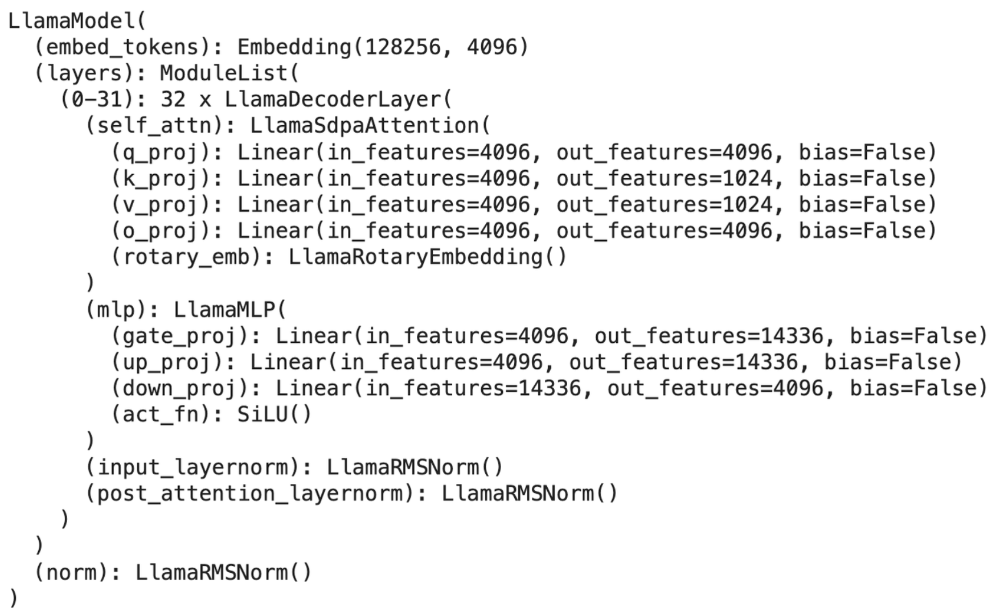

## Overview
MetaAI recently released their new Llama3 with 2 available variants including 8B and 70B models.

See more in [MetaAI LLama3 page](https://llama.meta.com/llama3/)

## Model architecture

Llama-3 models comes in four distinct variants, each supporting 8k token context length (up from 4k), 128k tokens vocabulary (up from 32k). Architecture: Llama-3-8B mirrors its predecessor Llama2-7B but with enhanced capabilities. It features 32 attention heads across 32 layers of attention blocks (same as Llama2-7B).

Llama3-8B architecture from [HuggingFace Transformer](https://huggingface.co/docs/transformers/en/index)