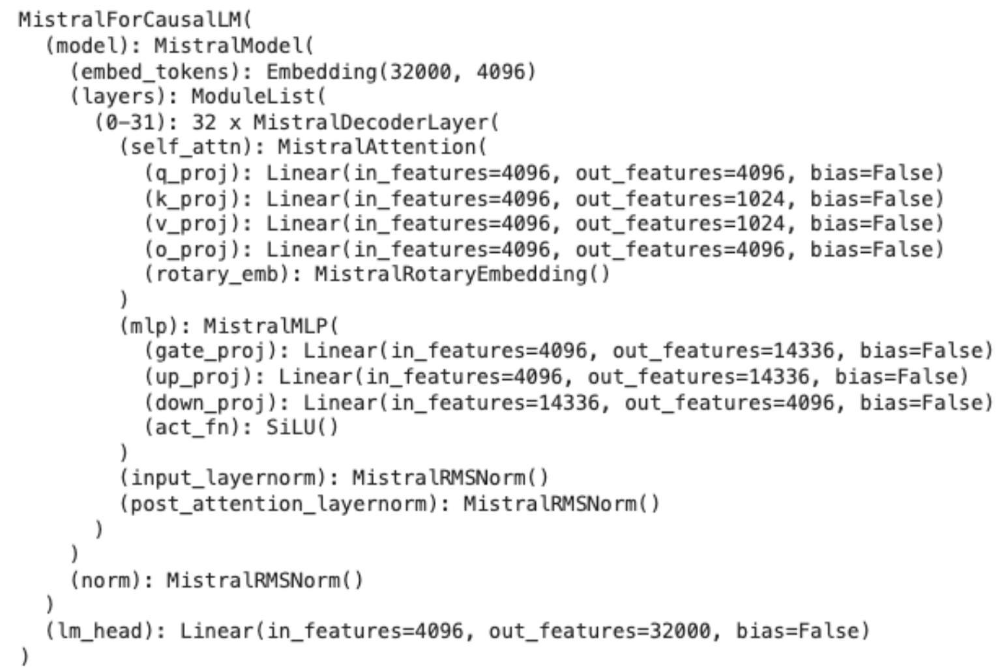

## Overview
Mistral released their new Mistral 7B model with Apache 2.0 license.

See more in [Mistral 7B page](https://mistral.ai/news/announcing-mistral-7b/)

## Model architecture

Mistral architecture is similar to Llama-2, and also uses 32 layers of 32 attention heads in each layer.

Mistral 7B architecture from [HuggingFace Transformer](https://huggingface.co/docs/transformers/en/index)