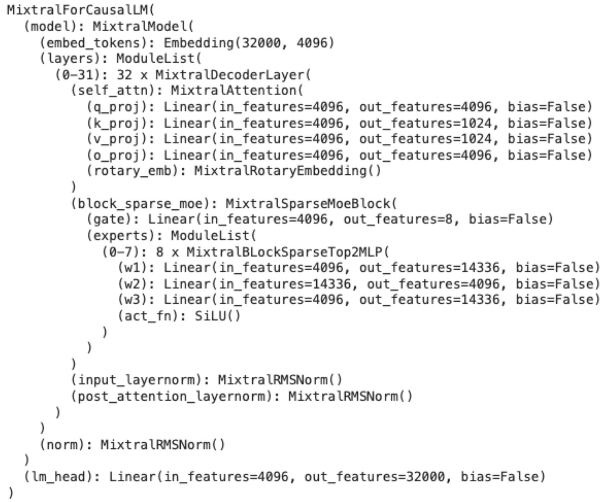

## Overview
Mistral released their new Mixtral as 8 x 7B model with Apache 2.0 license.

See more in [Mixtral 8 * 7B page](https://mistral.ai/news/mixtral-of-experts/)

## Model architecture

Mixtral uses 8 mixtures of experts on top of 32 layers of attention blocks. It uses a routing layer gate to pick 2 experts at the inference time, which helps with reduced latency

Mixtral 8 * 7B architecture from [HuggingFace Transformer](https://huggingface.co/docs/transformers/en/index)