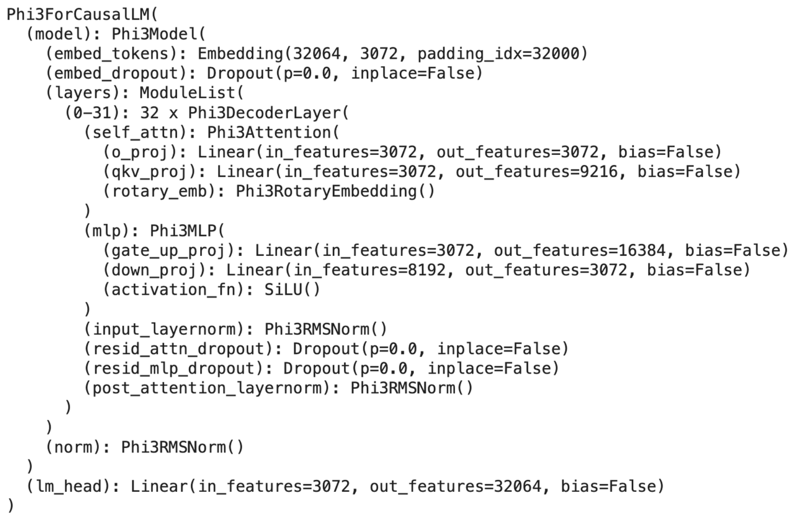

## Overview
Microsoft recently released their new Phi-3.

See more in [Microsoft Phi-3 page](https://news.microsoft.com/source/features/ai/the-phi-3-small-language-models-with-big-potential/)

## Model architecture

Microsoft launched the Phi-3 model in three distinct variants, including the compact Phi-3 mini. This smaller version model has 3.8 billion parameters, and with 4-bit quantization, it consumes less than 2GB of memory. This makes it feasible for use in a wide range of devices, even smartphones! In terms of architecture, the Phi-3 mini shares similarities with the Llama-3-8B, featuring 32 attention heads and 32 hidden layers. It supports a substantial context length of up to 4k and 128k, with a vocabulary size of 32k.

Phi-3 architecture from [HuggingFace Transformer](https://huggingface.co/docs/transformers/en/index)