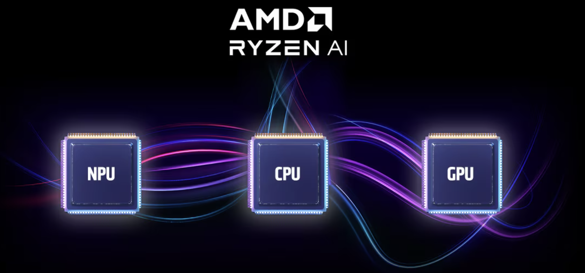
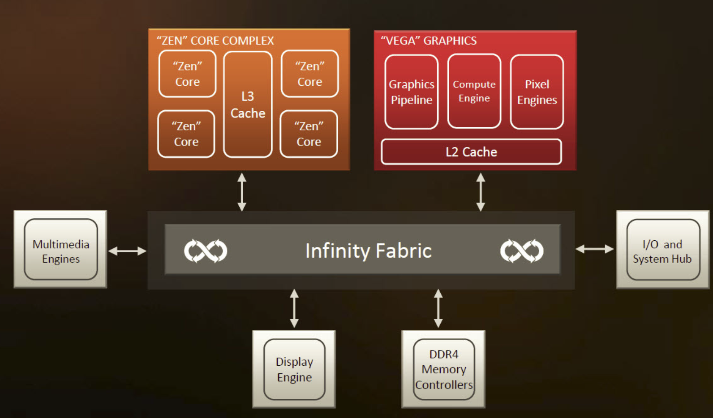

## AMD ecosystem with hardware and software

## AMD GPU list data
- TODO: Add data from: https://www.techpowerup.com/gpu-specs/ for user to see GPU data

# Hardware for A.I
To [see more](https://www.amd.com/en/solutions/ai.html)
- AMD Instinct Accelerators with [AMD CDNA 3](https://www.amd.com/en/technologies/cdna.html): AMD Instinct MI300X accelerators offer large on-chip memory ideal for Generative AI, while AMD Instinct MI300A accelerated processing units combine the power of AMD CPUs and GPUs.
- AMD EPYC Server Processors with [The AMD ‘Zen’ Processor Core](https://www.amd.com/en/technologies/zen-core): AMD EPYC server processors deliver exceptional performance, energy efficiency, and security features for certain AI inferencing workloads. 
- AMD Alveo™ Adaptive Accelerators: AMD Alveo™ V70 accelerators are designed for AI inference efficiency and tuned for video analytics and natural language processing applications. 
- AMD Adaptive SoCs: AMD Versal™ AI Core, Versal AI Edge, and Zynq adaptive SoCs enable breakthrough AI inference in the data center and across a broad range of embedded applications. 
- AMD Ryzen Processors with [The AMD ‘Zen’ Processor Core](https://www.amd.com/en/technologies/zen-core): AMD Ryzen 7040 and 8040 Series processors feature built-in AI engines and enable enhanced creative content, accelerated multi-tasking, and greater productivity.
- AMD Radeon™ Graphics Cards: AMD Radeon™ PRO and RX 7000 Series graphics cards enable users to harness the power of on-device AI processing with strong performance and platform support, all while delivering incredible value.

## Ryzen AI

NPU is designed for generative A.I with [AMD XDNA™ Architecture](https://www.amd.com/en/technologies/xdna.html)

To [see more](https://www.amd.com/en/products/processors/consumer/ryzen-ai.html#tabs-74833e1024-item-833270fb2a-tab)

## AMD Infinity Fabric
AMD Infinity Fabric to connect AMD components together with faster bandwidth (consider it as unified memory)

AMD Infinity Fabric inside Zen-3 architecture (AMD breakthrough in CPU)
