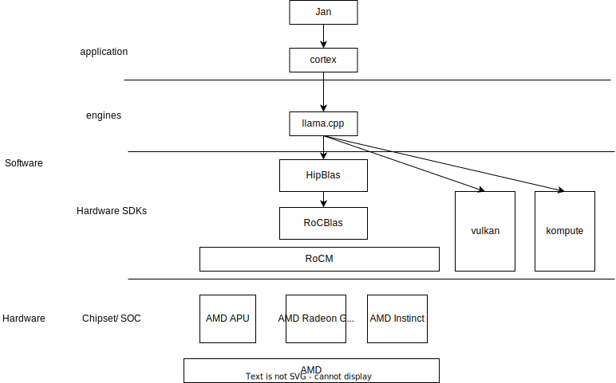

| Name                                    | Family             | Series                 | Board Type          | Launch Date   | Additional Power Connector   | Compute Units   | Base Frequency      | Boost Frequency                 | Game Frequency   |   Ray Accelerators |   AI Accelerators | Peak Pixel Fill-Rate   | Peak Texture Fill-Rate   | Max Performance   | Peak Half Precision Compute Performance   | Peak Single Precision Compute Performance   |   ROPs | Stream Processors   | Texture Units   | Transistor Count   | GPU Power   | Typical Board Power (Desktop)   | Minimum PSU Recommendation   | AMD Infinity Cache Technology   | Memory Speed                  | Max Memory Size   | Memory Type                 | Memory Interface   | Memory Bandwidth   | Effective Memory Bandwidth   | HDMI™ 4K Support   | 4K H264 Decode   | 4K H264 Encode   | H265/HEVC Decode   | H265/HEVC Encode   | AV1 Decode   | AV1 Encode   | DisplayPort   | Dual Link DVI   | HDMI™                                       | VGA   | USB Type-C   | Length   |   Slots | OS Support                                                                                                                                                 | Supported Technologies                                                                                                                                                                                                                                                                                                                                                                                                                                                                                                                               |
|:----------------------------------------|:-------------------|:-----------------------|:--------------------|:--------------|:-----------------------------|:----------------|:--------------------|:--------------------------------|:-----------------|-------------------:|------------------:|:-----------------------|:-------------------------|:------------------|:------------------------------------------|:--------------------------------------------|-------:|:--------------------|:----------------|:-------------------|:------------|:--------------------------------|:-----------------------------|:--------------------------------|:------------------------------|:------------------|:----------------------------|:-------------------|:-------------------|:-----------------------------|:-------------------|:-----------------|:-----------------|:-------------------|:-------------------|:-------------|:-------------|:--------------|:----------------|:--------------------------------------------|:------|:-------------|:---------|--------:|:-----------------------------------------------------------------------------------------------------------------------------------------------------------|:-----------------------------------------------------------------------------------------------------------------------------------------------------------------------------------------------------------------------------------------------------------------------------------------------------------------------------------------------------------------------------------------------------------------------------------------------------------------------------------------------------------------------------------------------------|
| AMD Radeon™ RX 7900 XTX                 | Radeon RX          | Radeon RX 7000 Series  | Component           | 12/13/2022    | 2x8-Pin                      | 96              | nan                 | Up to 2500 MHz                  | 2300 MHz         |                 96 |               192 | Up to 480 GP/s         | Up to 960 GT/s           | nan               | 123 TFLOPs                                | 61 TFLOPs                                   |    192 | 6144                | 384             | 58 B               | nan         | 355 W                           | 800W                         | 96 MB                           | Up to 20 Gbps                 | 24 GB             | GDDR6                       | nan                | Up to 960 GB/s     | Up to 3500 GB/s              | Yes                | Yes              | Yes              | Yes                | Yes                | Yes          | Yes          | 2.1           | nan             | 2.1                                         | nan   | Yes          | 287 mm   |     2.5 | Windows 11 - 64-Bit Edition , Windows 10 - 64-Bit Edition , Ubuntu x86 64-Bit , Linux x86 64-Bit                                                           | AMD Software  Adrenalin Edition , AMD FidelityFX™ Super Resolution , AMD Noise Suppression , AMD Radeon™ Super Resolution , AMD Smart Access Memory , AMD Smart Access Video , VSR(4K) , AMD Privacy View , AMD Radeon™ Boost , AMD Radeon™ Anti-Lag , AMD Radeon™ Image Sharpening , AMD Enhanced Sync Technology , AMD FreeSync™ Technology , AMD Radeon™ Chill , AMD Virtual Super Resolution                                                                                                                                                     |
| AMD Radeon™ RX 7900 XT                  | Radeon RX          | Radeon RX 7000 Series  | Component           | 12/13/2022    | 2x8-Pin                      | 84              | nan                 | Up to 2400 MHz                  | 2000 MHz         |                 84 |               168 | Up to 460 GP/s         | Up to 810 GT/s           | nan               | 103 TFLOPs                                | 52 TFLOPs                                   |    192 | 5376                | nan             | 58 B               | nan         | 315 W                           | 750W                         | 80 MB                           | Up to 20 Gbps                 | 20 GB             | GDDR6                       | nan                | Up to 800 GB/s     | Up to 2900 GB/s              | Yes                | Yes              | Yes              | Yes                | Yes                | Yes          | Yes          | 2.1           | nan             | 2.1                                         | nan   | Yes          | 276 mm   |     2.5 | Windows 11 - 64-Bit Edition , Windows 10 - 64-Bit Edition , Ubuntu x86 64-Bit , Linux x86 64-Bit                                                           | AMD Software  Adrenalin Edition , AMD FidelityFX™ Super Resolution , AMD Noise Suppression , AMD Radeon™ Super Resolution , AMD Smart Access Memory , AMD Smart Access Video , AMD Privacy View , AMD Radeon™ Boost , AMD Radeon™ Anti-Lag , AMD Radeon™ Image Sharpening , AMD Enhanced Sync Technology , AMD FreeSync™ Technology , AMD Radeon™ Chill , AMD Virtual Super Resolution                                                                                                                                                               |
| AMD Radeon™ RX 7900 GRE                 | Radeon RX          | Radeon RX 7000 Series  | Component           | 7/27/2023     | 2x8-Pin                      | 80              | nan                 | Up to 2245 MHz                  | 1880 MHz         |                 80 |               160 | nan                    | nan                      | nan               | 92 TFLOPs                                 | 46 TFLOPs                                   |    nan | 5120                | nan             | 54 B               | nan         | 260 W                           | nan                          | 64 MB                           | Up to 18 Gbps                 | 16 GB             | GDDR6                       | 256-bit            | Up to 576 GB/s     | Up to 2250 GB/s              | Yes                | Yes              | Yes              | Yes                | Yes                | Yes          | Yes          | 2.1           | nan             | 2.1                                         | nan   | Yes          | nan      |   nan   | Windows 11 - 64-Bit Edition , Windows 10 - 64-Bit Edition , Ubuntu x86 64-Bit , Linux x86 64-Bit                                                           | AMD Software  Adrenalin Edition , AMD FidelityFX™ Super Resolution , AMD Noise Suppression , AMD Radeon™ Super Resolution , AMD Smart Access Memory , AMD Privacy View , AMD Radeon™ Boost , AMD Radeon™ Anti-Lag , AMD Radeon™ Image Sharpening , AMD Enhanced Sync Technology , AMD FreeSync™ Technology , AMD Radeon™ Chill , AMD Virtual Super Resolution , The Vulkan® API                                                                                                                                                                      |
| AMD Radeon™ RX 7800 XT                  | Radeon RX          | Radeon RX 7000 Series  | Component           | nan           | 2x8-Pin                      | 60              | nan                 | Up to 2430 MHz                  | 2124 MHz         |                 60 |               120 | Up to 233 GP/s         | Up to 583 GT/s           | nan               | 74 TFLOPs                                 | 37 TFLOPs                                   |     96 | 3840                | 240             | 28.1 B             | nan         | 263 W                           | 700W                         | 64 MB                           | Up to 19.5 Gbps               | 16 GB             | GDDR6                       | 256-bit            | Up to 624 GB/s     | Up to 2708 GB/s              | Yes                | Yes              | Yes              | Yes                | Yes                | Yes          | Yes          | 2.1           | nan             | 2.1                                         | nan   | nan          | 267 mm   |     2.5 | Windows 11 - 64-Bit Edition , Windows 10 - 64-Bit Edition , Ubuntu x86 64-Bit , Linux x86 64-Bit                                                           | AMD Software  Adrenalin Edition , AMD FidelityFX™ Super Resolution , AMD Noise Suppression , AMD Radeon™ FRTC , AMD Radeon™ Super Resolution , AMD Smart Access Memory , AMD Smart Access Video , AMD Privacy View , AMD Radeon™ Boost , AMD Radeon™ Anti-Lag , AMD Radeon™ Image Sharpening , AMD Enhanced Sync Technology , AMD FreeSync™ Technology , AMD Radeon™ Chill , AMD Virtual Super Resolution                                                                                                                                            |
| AMD Radeon™ RX 7700 XT                  | Radeon RX          | Radeon RX 7000 Series  | Component           | nan           | 2x8-Pin                      | 54              | nan                 | Up to 2544 MHz                  | 2171 MHz         |                 54 |               108 | Up to 244 GP/s         | Up to 550 GT/s           | nan               | 70 TFLOPs                                 | 35 TFLOPs                                   |     96 | 3456                | 216             | 28.1 B             | nan         | 245 W                           | 700W                         | 48 MB                           | Up to 18 Gbps                 | 12 GB             | GDDR6                       | 192-bit            | Up to 432 GB/s     | Up to 1995 GB/s              | Yes                | Yes              | Yes              | Yes                | Yes                | Yes          | Yes          | 2.1           | nan             | 2.1                                         | nan   | nan          | 267 mm   |     2.5 | Windows 11 - 64-Bit Edition , Windows 10 - 64-Bit Edition , Ubuntu x86 64-Bit , Linux x86 64-Bit                                                           | AMD Software  Adrenalin Edition , AMD FidelityFX™ Super Resolution , AMD Noise Suppression , AMD Radeon™ FRTC , AMD Radeon™ Super Resolution , AMD Smart Access Memory , AMD Smart Access Video , AMD Privacy View , AMD Radeon™ Boost , AMD Radeon™ Anti-Lag , AMD Radeon™ Image Sharpening , AMD Enhanced Sync Technology , AMD FreeSync™ Technology , AMD Radeon™ Chill , AMD Virtual Super Resolution                                                                                                                                            |
| AMD Radeon™ RX 7600 XT                  | Radeon RX          | Radeon RX 7000 Series  | Component           | nan           | 2x8-Pin                      | 32              | nan                 | Up to 2755 MHz                  | 2470 MHz         |                 32 |                64 | Up to 176.3 GP/s       | Up to 352.6 GT/s         | nan               | 45.14 TFLOPs                              | 22.57 TFLOPs                                |     64 | 2048                | 128             | 13.3 B             | nan         | 190 W                           | 600W                         | 32 MB                           | Up to 18 Gbps                 | 16 GB             | GDDR6                       | 128-bit            | Up to 288 GB/s     | Up to 477 GB/s               | Yes                | Yes              | Yes              | Yes                | Yes                | Yes          | Yes          | 2.1           | nan             | 2.1                                         | nan   | No           | 241 mm   |     2   | Windows 11 - 64-Bit Edition , Windows 10 - 64-Bit Edition , Ubuntu x86 64-Bit , Linux x86 64-Bit                                                           | AMD Software  Adrenalin Edition , AMD FidelityFX™ Super Resolution , AMD Fluid Motion Frames , AMD HYPR-RX , AMD HYPR-RX Eco , AMD Noise Suppression , AMD Radeon™ FRTC , AMD Radeon™ Super Resolution , AMD Smart Access Memory , AMD Smart Access Video , AMD Privacy View , AMD Radeon™ Boost , AMD Radeon™ Anti-Lag , AMD Radeon™ Image Sharpening , AMD Enhanced Sync Technology , AMD FreeSync™ Technology , AMD Radeon™ Chill , AMD Virtual Super Resolution                                                                                  |
| AMD Radeon™ RX 7600                     | Radeon RX          | Radeon RX 7000 Series  | Desktop             | nan           | 1x8-Pin                      | 32              | nan                 | Up to 2655 MHz                  | 2250 MHz         |                 32 |                64 | Up to 169.9 GP/s       | Up to 339.8 GT/s         | nan               | 43.5 TFLOPs                               | 21.75 TFLOPs                                |     64 | 2048                | 128             | 13.3 B             | nan         | 165 W                           | 550W                         | 32 MB                           | Up to 18 Gbps                 | 8 GB              | GDDR6                       | 128-bit            | Up to 288 GB/s     | Up to 477 GB/s               | Yes                | Yes              | Yes              | Yes                | Yes                | Yes          | Yes          | Up to 2.1     | nan             | 2.1                                         | nan   | No           | 204 mm   |     2   | Windows 11 - 64-Bit Edition , Windows 10 - 64-Bit Edition , Ubuntu x86 64-Bit , Linux x86 64-Bit                                                           | AMD Software  Adrenalin Edition , AMD FidelityFX™ Super Resolution , AMD Noise Suppression , AMD Radeon™ FRTC , AMD Radeon™ Super Resolution , AMD Smart Access Memory , AMD Smart Access Video , AMD Privacy View , AMD Radeon™ Boost , AMD Radeon™ Anti-Lag , AMD Radeon™ Image Sharpening , AMD Enhanced Sync Technology , AMD FreeSync™ Technology , AMD Radeon™ Chill , AMD Virtual Super Resolution                                                                                                                                            |
| AMD Radeon™ RX 7900M                    | Radeon RX          | Radeon RX 7000 Series  | Notebook            | 10/19/2023    | nan                          | 72              | nan                 | nan                             | 1825 MHz         |                nan |               nan | nan                    | Up to 601.9 GT/s         | nan               | 77.05 TFLOPs                              | 38.52 TFLOPs                                |    192 | 4608                | nan             | 53.9 B             | Up to 180 W | nan                             | nan                          | 64 MB                           | Up to 18 Gbps                 | 16 GB             | GDDR6                       | nan                | Up to 576 GB/s     | nan                          | Yes                | Yes              | Yes              | Yes                | Yes                | Yes          | Yes          | nan           | nan             | nan                                         | nan   | nan          | nan      |   nan   | Windows 11 - 64-Bit Edition , Windows 10 - 64-Bit Edition , Ubuntu x86 64-Bit                                                                              | nan                                                                                                                                                                                                                                                                                                                                                                                                                                                                                                                                                  |
| AMD Radeon™ RX 7600M XT                 | Radeon RX          | Radeon RX 7000 Series  | Notebook            | 1/4/2023      | nan                          | 32              | nan                 | nan                             | 2300 MHz         |                nan |               nan | nan                    | Up to 334.7 GT/s         | nan               | 42.8 TFLOPs                               | 21.4 TFLOPs                                 |     64 | 2048                | nan             | 13.3 B             | Up to 120 W | nan                             | nan                          | 32 MB                           | Up to 18 Gbps                 | 8 GB              | GDDR6                       | 128-bit            | Up to 288 GB/s     | nan                          | Yes                | Yes              | Yes              | Yes                | Yes                | Yes          | Yes          | nan           | nan             | nan                                         | nan   | nan          | nan      |   nan   | Windows 11 - 64-Bit Edition , Windows 10 - 64-Bit Edition , Linux x86 64-Bit                                                                               | nan                                                                                                                                                                                                                                                                                                                                                                                                                                                                                                                                                  |
| AMD Radeon™ RX 7600M                    | Radeon RX          | Radeon RX 7000 Series  | Notebook            | 1/4/2023      | nan                          | 28              | nan                 | nan                             | 2070 MHz         |                nan |               nan | nan                    | Up to 269.9 GT/s         | nan               | 34.5 TFLOPs                               | 17.3 TFLOPs                                 |     64 | 1792                | nan             | 13.3 B             | Up to 90 W  | nan                             | nan                          | 32 MB                           | Up to 16 Gbps                 | 8 GB              | GDDR6                       | 128-bit            | Up to 256 GB/s     | nan                          | Yes                | Yes              | Yes              | Yes                | Yes                | Yes          | Yes          | nan           | nan             | nan                                         | nan   | nan          | nan      |   nan   | Windows 11 - 64-Bit Edition , Windows 10 - 64-Bit Edition , Linux x86 64-Bit                                                                               | nan                                                                                                                                                                                                                                                                                                                                                                                                                                                                                                                                                  |
| AMD Radeon™ RX 7700S                    | Radeon RX          | Radeon RX 7000 Series  | Notebook            | 1/4/2023      | nan                          | 32              | nan                 | nan                             | 2200 MHz         |                nan |               nan | nan                    | Up to 320 GT/s           | nan               | 41 TFLOPs                                 | 20.5 TFLOPs                                 |    nan | nan                 | nan             | 13.3 B             | Up to 100 W | nan                             | nan                          | 32 MB                           | Up to 18 Gbps                 | 8 GB              | GDDR6                       | 128-bit            | Up to 288 GB/s     | nan                          | Yes                | Yes              | Yes              | Yes                | Yes                | Yes          | Yes          | nan           | nan             | nan                                         | nan   | nan          | nan      |   nan   | Windows 11 - 64-Bit Edition , Windows 10 - 64-Bit Edition , Ubuntu x86 64-Bit                                                                              | nan                                                                                                                                                                                                                                                                                                                                                                                                                                                                                                                                                  |
| AMD Radeon™ RX 7600S                    | Radeon RX          | Radeon RX 7000 Series  | Notebook            | 1/4/2023      | nan                          | 28              | nan                 | nan                             | 1865 MHz         |                nan |               nan | nan                    | Up to 245.8 GT/s         | nan               | 31.5 TFLOPs                               | 15.7 TFLOPs                                 |     64 | 1792                | nan             | 13.3 B             | Up to 75 W  | nan                             | nan                          | 32 MB                           | Up to 16 Gbps                 | 8 GB              | GDDR6                       | 128-bit            | Up to 256 GB/s     | nan                          | Yes                | Yes              | Yes              | Yes                | Yes                | Yes          | Yes          | nan           | nan             | nan                                         | nan   | nan          | nan      |   nan   | Windows 11 - 64-Bit Edition , Windows 10 - 64-Bit Edition , Linux x86 64-Bit                                                                               | nan                                                                                                                                                                                                                                                                                                                                                                                                                                                                                                                                                  |
| AMD Radeon™ RX 6950 XT                  | Radeon RX          | Radeon RX 6000 Series  | Desktop             | 5/10/2022     | 2x8-Pin                      | 80              | 1890 MHz            | Up to 2310 MHz                  | 2100 MHz         |                 80 |               nan | Up to 295.7 GP/s       | Up to 739.2 GT/s         | nan               | 47.31 TFLOPs                              | 23.65 TFLOPs                                |    128 | 5120                | 320             | 26.8 B             | nan         | 335 W                           | 850W                         | 128 MB                          | Up to 18 Gbps                 | 16 GB             | GDDR6                       | 256-bit            | Up to 576 GB/s     | Up to 1794 GB/s              | Yes                | Yes              | Yes              | Yes                | Yes                | Yes          | nan          | nan           | nan             | nan                                         | nan   | nan          | nan      |   nan   | Windows 11 - 64-Bit Edition , Windows 10 - 64-Bit Edition , Ubuntu x86 64-Bit , Linux x86 64-Bit                                                           | AMD Software  Adrenalin Edition , AMD FidelityFX™ Super Resolution , AMD Noise Suppression , AMD Radeon™ Super Resolution , AMD Smart Access Memory , VSR(4K) , AMD Privacy View , AMD Radeon™ Boost , AMD Radeon™ Anti-Lag , AMD Radeon™ Image Sharpening , AMD Enhanced Sync Technology , AMD FreeSync™ Technology , AMD Radeon™ Chill , TrueAudio Next , The Vulkan® API , AMD Mantle API                                                                                                                                                         |
| AMD Radeon™ RX 6900 XT                  | Radeon RX          | Radeon RX 6000 Series  | Component           | 12/8/2020     | 2x8-Pin                      | 80              | nan                 | Up to 2250 MHz                  | 2015 MHz         |                 80 |               nan | Up to 288 GP/s         | Up to 720 GT/s           | nan               | 46.08 TFLOPs                              | 23.04 TFLOPs                                |    128 | 5120                | 320             | 26.8 B             | nan         | 300 W                           | 850W                         | 128 MB                          | Up to 16 Gbps                 | 16 GB             | GDDR6                       | 256-bit            | Up to 512 GB/s     | nan                          | Yes                | Yes              | Yes              | Yes                | Yes                | Yes          | nan          | 1.4a          | nan             | HDMI™ 2.1 VRR and FRL                       | nan   | Yes          | 267 mm   |     2.5 | Windows 11 - 64-Bit Edition , Windows 10 - 64-Bit Edition , Linux x86 64-Bit                                                                               | AMD Software  Adrenalin Edition , AMD FidelityFX™ Super Resolution , AMD Noise Suppression , AMD Radeon™ Super Resolution , AMD Smart Access Memory , VSR(4K) , AMD Privacy View , AMD Radeon™ Boost , AMD Radeon™ Anti-Lag , AMD Radeon™ Image Sharpening , AMD Enhanced Sync Technology , AMD FreeSync™ Technology , AMD Radeon™ Chill , TrueAudio Next , The Vulkan® API                                                                                                                                                                          |
| AMD Radeon™ RX 6800 XT Midnight Black   | Radeon RX          | Radeon RX 6000 Series  | Component           | 4/7/2021      | 2x8-Pin                      | 72              | nan                 | Up to 2250 MHz                  | 2015 MHz         |                 72 |               nan | Up to 288 GP/s         | Up to 648 GT/s           | nan               | 41.47 TFLOPs                              | 20.74 TFLOPs                                |    128 | 4608                | 288             | 26.8 B             | nan         | 300 W                           | 750W                         | 128 MB                          | Up to 16 Gbps                 | 16 GB             | GDDR6                       | 256-bit            | Up to 512 GB/s     | nan                          | Yes                | Yes              | Yes              | Yes                | Yes                | Yes          | nan          | 1.4a          | nan             | HDMI™ 2.1 VRR and FRL                       | nan   | Yes          | 267 mm   |     2.5 | Windows 11 - 64-Bit Edition , Windows 10 - 64-Bit Edition , Linux x86 64-Bit                                                                               | nan                                                                                                                                                                                                                                                                                                                                                                                                                                                                                                                                                  |
| AMD Radeon™ RX 6800 XT                  | Radeon RX          | Radeon RX 6000 Series  | Component           | 11/18/2020    | 2x8-Pin                      | 72              | nan                 | Up to 2250 MHz                  | 2015 MHz         |                 72 |               nan | Up to 288 GP/s         | Up to 648 GT/s           | nan               | 41.47 TFLOPs                              | 20.74 TFLOPs                                |    128 | 4608                | 288             | 26.8 B             | nan         | 300 W                           | 750W                         | 128 MB                          | Up to 16 Gbps                 | 16 GB             | GDDR6                       | 256-bit            | Up to 512 GB/s     | nan                          | Yes                | Yes              | Yes              | Yes                | Yes                | Yes          | nan          | 1.4a          | nan             | HDMI™ 2.1 VRR and FRL                       | nan   | Yes          | 267 mm   |     2.5 | Windows 11 - 64-Bit Edition , Windows 10 - 64-Bit Edition , Linux x86 64-Bit                                                                               | AMD Software  Adrenalin Edition , AMD FidelityFX™ Super Resolution , AMD Noise Suppression , AMD Radeon™ Super Resolution , AMD Smart Access Memory , VSR(4K) , AMD Privacy View , AMD Radeon™ Boost , AMD Radeon™ Anti-Lag , AMD Radeon™ Image Sharpening , AMD Enhanced Sync Technology , AMD FreeSync™ Technology , AMD Radeon™ Chill , TrueAudio Next , The Vulkan® API                                                                                                                                                                          |
| AMD Radeon™ RX 6800                     | Radeon RX          | Radeon RX 6000 Series  | Component           | 11/18/2020    | 2x8-Pin                      | 60              | nan                 | Up to 2105 MHz                  | 1815 MHz         |                 60 |               nan | Up to 202.1 GP/s       | Up to 505.2 GT/s         | nan               | 32.33 TFLOPs                              | 16.17 TFLOPs                                |     96 | 3840                | 240             | 26.8 B             | nan         | 250 W                           | 650W                         | 128 MB                          | Up to 16 Gbps                 | 16 GB             | GDDR6                       | 256-bit            | Up to 512 GB/s     | nan                          | Yes                | Yes              | Yes              | Yes                | Yes                | Yes          | nan          | 1.4a          | nan             | HDMI™ 2.1 VRR and FRL                       | nan   | Yes          | 267 mm   |     2   | Windows 11 - 64-Bit Edition , Windows 10 - 64-Bit Edition , Linux x86 64-Bit                                                                               | AMD Software  Adrenalin Edition , AMD FidelityFX™ Super Resolution , AMD Noise Suppression , AMD Radeon™ Super Resolution , AMD Smart Access Memory , VSR(4K) , AMD Privacy View , AMD Radeon™ Boost , AMD Radeon™ Anti-Lag , AMD Radeon™ Image Sharpening , AMD Enhanced Sync Technology , AMD FreeSync™ Technology , AMD Radeon™ Chill , TrueAudio Next , The Vulkan® API                                                                                                                                                                          |
| AMD Radeon™ RX 6750 XT                  | Radeon RX          | Radeon RX 6000 Series  | Component           | 5/10/2022     | 1x8-Pin + 1x6-Pin            | 40              | 2150 MHz            | Up to 2600 MHz                  | 2495 MHz         |                 40 |               nan | Up to 166.4 GP/s       | Up to 416 GT/s           | nan               | 26.62 TFLOPs                              | 13.31 TFLOPs                                |     64 | 2560                | 160             | 17.2 B             | nan         | 250 W                           | 650W                         | 96 MB                           | Up to 18 Gbps                 | 12 GB             | GDDR6                       | 192-bit            | Up to 432 GB/s     | Up to 1326 GB/s              | Yes                | Yes              | Yes              | Yes                | Yes                | Yes          | nan          | 1.4a          | nan             | 4K120Hz/8K60Hz VRR as specified in HDMI 2.1 | nan   | nan          | 267 mm   |     2   | Windows 11 - 64-Bit Edition , Windows 10 - 64-Bit Edition , Ubuntu x86 64-Bit , Linux x86 64-Bit                                                           | AMD Software  Adrenalin Edition , AMD FidelityFX™ Super Resolution , AMD Noise Suppression , AMD Radeon™ Super Resolution , AMD Smart Access Memory , VSR(4K) , AMD Privacy View , AMD Radeon™ Boost , AMD Radeon™ Anti-Lag , AMD Radeon™ Image Sharpening , AMD Enhanced Sync Technology , AMD FreeSync™ Technology , AMD Radeon™ Chill , TrueAudio Next , The Vulkan® API , AMD Mantle API                                                                                                                                                         |
| AMD Radeon™ RX 6700 XT                  | Radeon RX          | Radeon RX 6000 Series  | Component           | 3/1/2021      | 1x8-Pin + 1x6-Pin            | 40              | 2321 MHz            | Up to 2581 MHz                  | 2424 MHz         |                 40 |               nan | Up to 165.2 GP/s       | Up to 413 GT/s           | nan               | 26.43 TFLOPs                              | 13.21 TFLOPs                                |     64 | 2560                | 160             | 17.2 B             | nan         | 230 W                           | 650W                         | 96 MB                           | Up to 16 Gbps                 | 12 GB             | GDDR6                       | 192-bit            | Up to 384 GB/s     | Up to 1278 GB/s              | Yes                | Yes              | Yes              | Yes                | Yes                | Yes          | nan          | 1.4a          | nan             | 4K120Hz/8K60Hz VRR as specified in HDMI 2.1 | nan   | nan          | 267 mm   |     2   | Windows 11 - 64-Bit Edition , Windows 10 - 64-Bit Edition , Ubuntu x86 64-Bit , Linux x86 64-Bit                                                           | AMD Software  Adrenalin Edition , AMD FidelityFX™ Super Resolution , AMD Noise Suppression , AMD Radeon™ Super Resolution , AMD Smart Access Memory , VSR(4K) , AMD Privacy View , AMD Radeon™ Boost , AMD Radeon™ Anti-Lag , AMD Radeon™ Image Sharpening , AMD Enhanced Sync Technology , AMD FreeSync™ Technology , AMD Radeon™ Chill , TrueAudio Next , The Vulkan® API , AMD Mantle API                                                                                                                                                         |
| AMD Radeon™ RX 6700                     | Radeon RX          | Radeon RX 6000 Series  | Component           | 6/9/2021      | 1x8-Pin                      | 36              | 1941 MHz            | Up to 2450 MHz                  | 2174 MHz         |                 36 |               nan | Up to 156.8 GP/s       | Up to 352.8 GT/s         | nan               | 22.58 TFLOPs                              | 11.29 TFLOPs                                |     64 | 2304                | 144             | 17.2 B             | nan         | 175 W                           | 600W                         | 80 MB                           | Up to 16 Gbps / Up to 14 Gbps | 10 GB             | GDDR6                       | 160-bit            | Up to 320 GB/s     | Up to 1065 GB/s              | Yes                | Yes              | Yes              | Yes                | Yes                | Yes          | nan          | 1.4a          | nan             | 4K120Hz/8K60Hz VRR as specified in HDMI 2.1 | nan   | nan          | 267 mm   |     2   | Windows 11 - 64-Bit Edition , Windows 10 - 64-Bit Edition , Ubuntu x86 64-Bit , Linux x86 64-Bit                                                           | AMD Software  Adrenalin Edition , AMD FidelityFX™ Super Resolution , AMD Noise Suppression , AMD Radeon™ Super Resolution , AMD Smart Access Memory , VSR(4K) , AMD Privacy View , AMD Radeon™ Boost , AMD Radeon™ Anti-Lag , AMD Radeon™ Image Sharpening , AMD Enhanced Sync Technology , AMD FreeSync™ Technology , AMD Radeon™ Chill , TrueAudio Next , The Vulkan® API , AMD Mantle API                                                                                                                                                         |
| AMD Radeon™ RX 6650 XT                  | Radeon RX          | Radeon RX 6000 Series  | Desktop             | 5/10/2022     | 1x8-Pin                      | 32              | 2055 MHz            | Up to 2635 MHz                  | 2410 MHz         |                 32 |               nan | Up to 168.6 GP/s       | Up to 337.3 GT/s         | nan               | 21.59 TFLOPs                              | 10.79 TFLOPs                                |     64 | 2048                | 128             | 11.1 B             | nan         | 180 W                           | 500W                         | 32 MB                           | Up to 17.5 Gbps               | 8 GB              | GDDR6                       | 128-bit            | Up to 280 GB/s     | Up to 469 GB/s               | Yes                | Yes              | Yes              | Yes                | Yes                | Yes          | nan          | nan           | nan             | nan                                         | nan   | nan          | nan      |   nan   | Windows 11 - 64-Bit Edition , Windows 10 - 64-Bit Edition , Ubuntu x86 64-Bit , Linux x86 64-Bit                                                           | AMD Software  Adrenalin Edition , AMD FidelityFX™ Super Resolution , AMD Noise Suppression , AMD Radeon™ Super Resolution , AMD Smart Access Memory , VSR(4K) , AMD Privacy View , AMD Radeon™ Boost , AMD Radeon™ Anti-Lag , AMD Radeon™ Image Sharpening , AMD Enhanced Sync Technology , AMD FreeSync™ Technology , AMD Radeon™ Chill , TrueAudio Next , The Vulkan® API , AMD Mantle API                                                                                                                                                         |
| AMD Radeon™ RX 6600 XT                  | Radeon RX          | Radeon RX 6000 Series  | Component           | 8/11/2021     | 1x8-Pin                      | 32              | nan                 | Up to 2589 MHz                  | 2359 MHz         |                 32 |               nan | Up to 165.7 GP/s       | Up to 331.4 GT/s         | nan               | 21.21 TFLOPs                              | 10.6 TFLOPs                                 |     64 | 2048                | 128             | 11.1 B             | nan         | 160 W                           | 500W                         | 32 MB                           | Up to 16 Gbps                 | 8 GB              | GDDR6                       | 128-bit            | Up to 256 GB/s     | nan                          | Yes                | Yes              | Yes              | Yes                | Yes                | Yes          | nan          | 1.4a          | nan             | HDMI™ 2.1 VRR and FRL                       | nan   | No           | nan      |   nan   | Windows 11 - 64-Bit Edition , Windows 10 - 64-Bit Edition , Linux x86 64-Bit                                                                               | AMD Software  Adrenalin Edition , AMD FidelityFX™ Super Resolution , AMD Noise Suppression , AMD Radeon™ Super Resolution , AMD Smart Access Memory , VSR(4K) , AMD Privacy View , AMD Radeon™ Boost , AMD Radeon™ Anti-Lag , AMD Radeon™ Image Sharpening , AMD Enhanced Sync Technology , AMD FreeSync™ Technology , AMD Radeon™ Chill , TrueAudio Next , The Vulkan® API                                                                                                                                                                          |
| AMD Radeon™ RX 6600                     | Radeon RX          | Radeon RX 6000 Series  | Component           | 10/13/2021    | 1x8-Pin                      | 28              | nan                 | Up to 2491 MHz                  | 2044 MHz         |                 28 |               nan | Up to 159.4 GP/s       | Up to 279 GT/s           | nan               | 17.86 TFLOPs                              | 8.93 TFLOPs                                 |     64 | 1792                | 112             | 11.1 B             | nan         | 132 W                           | 450W                         | 32 MB                           | Up to 14 Gbps                 | 8 GB              | GDDR6                       | 128-bit            | Up to 224 GB/s     | nan                          | Yes                | Yes              | Yes              | Yes                | Yes                | Yes          | nan          | 1.4a          | nan             | HDMI™ 2.1 VRR and FRL                       | nan   | No           | nan      |   nan   | Windows 11 - 64-Bit Edition , Windows 10 - 64-Bit Edition , Linux x86 64-Bit                                                                               | AMD Software  Adrenalin Edition , AMD FidelityFX™ Super Resolution , AMD Noise Suppression , AMD Radeon™ Super Resolution , AMD Smart Access Memory , VSR(4K) , AMD Privacy View , AMD Radeon™ Boost , AMD Radeon™ Anti-Lag , AMD Radeon™ Image Sharpening , AMD Enhanced Sync Technology , AMD FreeSync™ Technology , AMD Radeon™ Chill , TrueAudio Next , The Vulkan® API                                                                                                                                                                          |
| AMD Radeon™ RX 6500 XT                  | Radeon RX          | Radeon RX 6000 Series  | Desktop             | 1/19/2022     | 1x6-Pin                      | 16              | nan                 | Up to 2815 MHz                  | 2650 MHz         |                 16 |               nan | Up to 90.1 GP/s        | Up to 180.2 GT/s         | nan               | 11.53 TFLOPs                              | 5.77 TFLOPs                                 |     32 | 1024                | 64              | 5.4 B              | nan         | 113 W                           | 400W                         | 16 MB                           | Up to 18 Gbps                 | 8 GB              | GDDR6                       | 64-bit             | Up to 144 GB/s     | Up to 232 GB/s               | Yes                | Yes              | No               | Yes                | No                 | No           | nan          | 1.4a          | nan             | HDMI™ 2.1 VRR and FRL                       | nan   | No           | nan      |     2   | Windows 11 - 64-Bit Edition , Windows 10 - 64-Bit Edition , Linux x86 64-Bit                                                                               | AMD Software  Adrenalin Edition , AMD FidelityFX™ Super Resolution , AMD Noise Suppression , AMD Radeon™ Super Resolution , AMD Smart Access Memory , VSR(4K) , AMD Privacy View , AMD Radeon™ Boost , AMD Radeon™ Anti-Lag , AMD Radeon™ Image Sharpening , AMD Enhanced Sync Technology , AMD FreeSync™ Technology , AMD Radeon™ Chill , TrueAudio Next , The Vulkan® API                                                                                                                                                                          |
| AMD Radeon™ RX 6500 XT (4GB)            | Radeon RX          | Radeon RX 6000 Series  | Desktop             | 1/19/2022     | 1x6-Pin                      | 16              | nan                 | Up to 2815 MHz                  | 2610 MHz         |                 16 |               nan | Up to 90.1 GP/s        | Up to 180.2 GT/s         | nan               | 11.53 TFLOPs                              | 5.77 TFLOPs                                 |     32 | 1024                | 64              | 5.4 B              | nan         | 107 W                           | 400W                         | 16 MB                           | Up to 18 Gbps                 | 4 GB              | GDDR6                       | 64-bit             | Up to 144 GB/s     | Up to 232 GB/s               | Yes                | Yes              | No               | Yes                | No                 | No           | nan          | 1.4a          | nan             | HDMI™ 2.1 VRR and FRL                       | nan   | No           | nan      |     2   | Windows 11 - 64-Bit Edition , Windows 10 - 64-Bit Edition , Linux x86 64-Bit                                                                               | nan                                                                                                                                                                                                                                                                                                                                                                                                                                                                                                                                                  |
| AMD Radeon™ RX 6400                     | Radeon RX          | Radeon RX 6000 Series  | Desktop             | 1/19/2022     | PCIe Powered                 | 12              | nan                 | Up to 2321 MHz                  | 2039 MHz         |                 12 |               nan | Up to 74.3 GP/s        | Up to 111.4 GT/s         | nan               | 7.13 TFLOPs                               | 3.57 TFLOPs                                 |     32 | 768                 | 48              | 5.4 B              | nan         | 53 W                            | 350W                         | 16 MB                           | Up to 16 Gbps                 | 4 GB              | GDDR6                       | 64-bit             | Up to 128 GB/s     | nan                          | Yes                | Yes              | No               | Yes                | No                 | No           | nan          | 1.4a          | nan             | HDMI™ 2.1 VRR and FRL                       | nan   | No           | nan      |     1   | Windows 11 - 64-Bit Edition , Windows 10 - 64-Bit Edition , Linux x86 64-Bit                                                                               | AMD Software  Adrenalin Edition , AMD FidelityFX™ Super Resolution , AMD Noise Suppression , AMD Radeon™ Super Resolution , AMD Smart Access Memory , VSR(4K) , AMD Privacy View , AMD Radeon™ Boost , AMD Radeon™ Anti-Lag , AMD Radeon™ Image Sharpening , AMD Enhanced Sync Technology , AMD FreeSync™ Technology , AMD Radeon™ Chill , TrueAudio Next , The Vulkan® API                                                                                                                                                                          |
| AMD Radeon™ RX 6850M XT                 | Radeon RX          | Radeon RX 6000 Series  | Notebook            | 1/4/2022      | nan                          | 40              | nan                 | nan                             | 2463 MHz         |                nan |               nan | nan                    | Up to 415.68 GT/s        | nan               | 26.6 TFLOPs                               | 13.3 TFLOPs                                 |     64 | 2560                | nan             | 17.2 B             | Up to 165 W | nan                             | nan                          | 96 MB                           | Up to 18 Gbps                 | 12 GB             | GDDR6                       | 192-bit            | Up to 432 GB/s     | nan                          | nan                | Yes              | Yes              | Yes                | Yes                | Yes          | nan          | nan           | nan             | nan                                         | nan   | nan          | nan      |   nan   | Windows 11 - 64-Bit Edition , Windows 10 - 64-Bit Edition , Linux x86 64-Bit                                                                               | nan                                                                                                                                                                                                                                                                                                                                                                                                                                                                                                                                                  |
| AMD Radeon™ RX 6800M                    | Radeon RX          | Radeon RX 6000 Series  | Notebook            | 5/31/2021     | nan                          | 40              | nan                 | nan                             | 2300 MHz         |                nan |               nan | nan                    | Up to 368 GT/s           | nan               | 23.55 TFLOPs                              | 11.78 TFLOPs                                |     64 | 2560                | nan             | 17.2 B             | 145+ W      | nan                             | nan                          | 96 MB                           | Up to 16 Gbps                 | 12 GB             | GDDR6                       | 192-bit            | Up to 384 GB/s     | nan                          | Yes                | Yes              | Yes              | Yes                | Yes                | Yes          | nan          | nan           | nan             | nan                                         | nan   | nan          | nan      |   nan   | Windows 11 - 64-Bit Edition , Windows 10 - 64-Bit Edition , Linux x86 64-Bit                                                                               | AMD Smart Access Memory , AMD SmartShift Technology                                                                                                                                                                                                                                                                                                                                                                                                                                                                                                  |
| AMD Radeon™ RX 6700M                    | Radeon RX          | Radeon RX 6000 Series  | Notebook            | 5/31/2021     | nan                          | 36              | nan                 | nan                             | 2300 MHz         |                nan |               nan | nan                    | Up to 331.2 GT/s         | nan               | 21.2 TFLOPs                               | 10.6 TFLOPs                                 |     64 | 2304                | nan             | 17.2 B             | up to 135 W | nan                             | nan                          | 80 MB                           | Up to 16 Gbps                 | 10 GB             | GDDR6                       | 160-bit            | Up to 320 GB/s     | nan                          | Yes                | Yes              | Yes              | Yes                | Yes                | Yes          | nan          | nan           | nan             | nan                                         | nan   | nan          | nan      |   nan   | Windows 11 - 64-Bit Edition , Windows 10 - 64-Bit Edition , Linux x86 64-Bit                                                                               | AMD Smart Access Memory , AMD SmartShift Technology                                                                                                                                                                                                                                                                                                                                                                                                                                                                                                  |
| AMD Radeon™ RX 6650M XT                 | Radeon RX          | Radeon RX 6000 Series  | Notebook            | 1/4/2022      | nan                          | 32              | nan                 | nan                             | 2162 MHz         |                nan |               nan | nan                    | Up to 311.55 GT/s        | nan               | 19.94 TFLOPs                              | 9.97 TFLOPs                                 |     64 | 2048                | nan             | 11.1 B             | Up to 120 W | nan                             | nan                          | 32 MB                           | Up to 16 Gbps                 | 8 GB              | GDDR6                       | 128-bit            | Up to 256 GB/s     | nan                          | nan                | Yes              | Yes              | Yes                | Yes                | Yes          | nan          | nan           | nan             | nan                                         | nan   | nan          | nan      |   nan   | Windows 11 - 64-Bit Edition , Windows 10 - 64-Bit Edition , Linux x86 64-Bit                                                                               | AMD Smart Access Memory , AMD SmartShift Technology                                                                                                                                                                                                                                                                                                                                                                                                                                                                                                  |
| AMD Radeon™ RX 6650M                    | Radeon RX          | Radeon RX 6000 Series  | Notebook            | 1/4/2022      | nan                          | 28              | nan                 | nan                             | 2222 MHz         |                nan |               nan | nan                    | Up to 276.64 GT/s        | nan               | 17.7 TFLOPs                               | 8.85 TFLOPs                                 |     64 | 1792                | nan             | 11.1 B             | Up to 120 W | nan                             | nan                          | 32 MB                           | Up to 16 Gbps                 | 8 GB              | GDDR6                       | 128-bit            | Up to 256 GB/s     | nan                          | nan                | Yes              | Yes              | Yes                | Yes                | Yes          | nan          | nan           | nan             | nan                                         | nan   | nan          | nan      |   nan   | Windows 11 - 64-Bit Edition , Windows 10 - 64-Bit Edition , Linux x86 64-Bit                                                                               | AMD Smart Access Memory , AMD SmartShift Technology                                                                                                                                                                                                                                                                                                                                                                                                                                                                                                  |
| AMD Radeon™ RX 6600M                    | Radeon RX          | Radeon RX 6000 Series  | Notebook            | 5/31/2021     | nan                          | 28              | nan                 | nan                             | 2177 MHz         |                nan |               nan | nan                    | Up to 274.2 GT/s         | nan               | 17.55 TFLOPs                              | 8.77 TFLOPs                                 |     64 | 1792                | nan             | 11.1 B             | up to 100 W | nan                             | nan                          | 32 MB                           | Up to 14 Gbps                 | 8 GB              | GDDR6                       | 128-bit            | Up to 224 GB/s     | nan                          | Yes                | Yes              | Yes              | Yes                | Yes                | Yes          | nan          | nan           | nan             | nan                                         | nan   | nan          | nan      |   nan   | Windows 11 - 64-Bit Edition , Windows 10 - 64-Bit Edition , Linux x86 64-Bit                                                                               | AMD Smart Access Memory , AMD SmartShift Technology                                                                                                                                                                                                                                                                                                                                                                                                                                                                                                  |
| AMD Radeon™ RX 6550M                    | Radeon RX          | Radeon RX 6000 Series  | Notebook            | 1/4/2023      | nan                          | 16              | nan                 | nan                             | 2560 MHz         |                nan |               nan | nan                    | Up to 182.1 GT/s         | nan               | 11.6 TFLOPs                               | 5.8 TFLOPs                                  |     64 | 1024                | nan             | 5.4 B              | Up to 80 W  | nan                             | nan                          | 16 MB                           | Up to 18 Gbps                 | 4 GB              | GDDR6                       | 64-bit             | Up to 144 GB/s     | nan                          | Yes                | Yes              | No               | Yes                | No                 | No           | nan          | nan           | nan             | nan                                         | nan   | nan          | nan      |   nan   | Windows 11 - 64-Bit Edition , Windows 10 - 64-Bit Edition , Linux x86 64-Bit                                                                               | nan                                                                                                                                                                                                                                                                                                                                                                                                                                                                                                                                                  |
| AMD Radeon™ RX 6500M                    | Radeon RX          | Radeon RX 6000 Series  | Notebook            | 1/4/2022      | nan                          | 16              | nan                 | nan                             | 2191 MHz         |                nan |               nan | nan                    | Up to 155.7 GT/s         | nan               | 9.97 TFLOPs                               | 4.98 TFLOPs                                 |     32 | 1024                | nan             | nan                | Up to 50 W  | nan                             | nan                          | 16 MB                           | nan                           | 4 GB              | GDDR6                       | 64-bit             | Up to 128 GB/s     | nan                          | Yes                | Yes              | No               | Yes                | No                 | No           | nan          | nan           | nan             | nan                                         | nan   | nan          | nan      |   nan   | Windows 11 - 64-Bit Edition , Windows 10 - 64-Bit Edition , Linux x86 64-Bit                                                                               | AMD Smart Access Memory , AMD SmartShift Technology                                                                                                                                                                                                                                                                                                                                                                                                                                                                                                  |
| AMD Radeon™ RX 6450M                    | Radeon RX          | Radeon RX 6000 Series  | Notebook            | 1/4/2023      | nan                          | 12              | nan                 | nan                             | 2220 MHz         |                nan |               nan | nan                    | Up to 118.1 GT/s         | nan               | 7.6 TFLOPs                                | 3.78 TFLOPs                                 |     64 | 768                 | nan             | 5.4 B              | Up to 50 W  | nan                             | nan                          | 16 MB                           | Up to 16 Gbps                 | 4 GB              | GDDR6                       | 64-bit             | Up to 128 GB/s     | nan                          | Yes                | Yes              | No               | Yes                | No                 | No           | nan          | nan           | nan             | nan                                         | nan   | nan          | nan      |   nan   | Windows 11 - 64-Bit Edition , Windows 10 - 64-Bit Edition , Linux x86 64-Bit                                                                               | nan                                                                                                                                                                                                                                                                                                                                                                                                                                                                                                                                                  |
| AMD Radeon™ RX 6300M                    | Radeon RX          | Radeon RX 6000 Series  | Notebook            | 1/4/2022      | nan                          | 12              | nan                 | nan                             | 1512 MHz         |                nan |               nan | nan                    | Up to 97.9 GT/s          | nan               | 6.27 TFLOPs                               | 3.13 TFLOPs                                 |     32 | 768                 | nan             | nan                | Up to 25 W  | nan                             | nan                          | 8 MB                            | nan                           | 2 GB              | GDDR6                       | nan                | Up to 64 GB/s      | nan                          | Yes                | Yes              | No               | Yes                | No                 | No           | nan          | nan           | nan             | nan                                         | nan   | nan          | nan      |   nan   | Windows 11 - 64-Bit Edition , Windows 10 - 64-Bit Edition , Linux x86 64-Bit                                                                               | AMD Smart Access Memory , AMD SmartShift Technology                                                                                                                                                                                                                                                                                                                                                                                                                                                                                                  |
| AMD Radeon™ RX 6800S                    | Radeon RX          | Radeon RX 6000 Series  | Notebook            | 1/4/2022      | nan                          | 32              | nan                 | nan                             | 1975 MHz         |                nan |               nan | nan                    | Up to 288 GT/s           | nan               | 18.43 TFLOPs                              | 9.22 TFLOPs                                 |     64 | 2048                | nan             | 11.1 B             | Up to 100 W | nan                             | nan                          | 32 MB                           | Up to 16 Gbps                 | 8 GB              | GDDR6                       | 128-bit            | Up to 256 GB/s     | nan                          | nan                | Yes              | Yes              | Yes                | Yes                | Yes          | nan          | nan           | nan             | nan                                         | nan   | nan          | nan      |   nan   | Windows 11 - 64-Bit Edition , Windows 10 - 64-Bit Edition , Linux x86 64-Bit                                                                               | AMD Smart Access Memory , AMD SmartShift Technology                                                                                                                                                                                                                                                                                                                                                                                                                                                                                                  |
| AMD Radeon™ RX 6700S                    | Radeon RX          | Radeon RX 6000 Series  | Notebook            | 1/4/2022      | nan                          | 28              | nan                 | nan                             | 1890 MHz         |                nan |               nan | nan                    | Up to 247.5 GT/s         | nan               | 15.84 TFLOPs                              | 7.92 TFLOPs                                 |     64 | 1792                | nan             | 11.1 B             | Up to 80 W  | nan                             | nan                          | 32 MB                           | Up to 14 Gbps                 | 8 GB              | GDDR6                       | 128-bit            | Up to 224 GB/s     | nan                          | nan                | Yes              | Yes              | Yes                | Yes                | Yes          | nan          | nan           | nan             | nan                                         | nan   | nan          | nan      |   nan   | Windows 11 - 64-Bit Edition , Windows 10 - 64-Bit Edition , Linux x86 64-Bit                                                                               | AMD Smart Access Memory , AMD SmartShift Technology                                                                                                                                                                                                                                                                                                                                                                                                                                                                                                  |
| AMD Radeon™ RX 6600S                    | Radeon RX          | Radeon RX 6000 Series  | Notebook            | 1/4/2022      | nan                          | 28              | nan                 | nan                             | 1881 MHz         |                nan |               nan | nan                    | Up to 244.2 GT/s         | nan               | 15.63 TFLOPs                              | 7.81 TFLOPs                                 |     64 | 1792                | nan             | 11.1 B             | Up to 80 W  | nan                             | nan                          | 32 MB                           | Up to 14 Gbps                 | 4 GB              | GDDR6                       | 128-bit            | Up to 224 GB/s     | nan                          | nan                | Yes              | Yes              | Yes                | Yes                | Yes          | nan          | nan           | nan             | nan                                         | nan   | nan          | nan      |   nan   | Windows 11 - 64-Bit Edition , Windows 10 - 64-Bit Edition , Linux x86 64-Bit                                                                               | AMD Smart Access Memory , AMD SmartShift Technology                                                                                                                                                                                                                                                                                                                                                                                                                                                                                                  |
| AMD Radeon™ RX 6550S                    | Radeon RX          | Radeon RX 6000 Series  | Notebook            | 1/4/2023      | nan                          | 16              | nan                 | nan                             | 2170 MHz         |                nan |               nan | nan                    | Up to 154.2 GT/s         | nan               | 9.9 TFLOPs                                | 4.9 TFLOPs                                  |     64 | 1024                | nan             | 5.4 B              | Up to 50 W  | nan                             | nan                          | 16 MB                           | Up to 16 Gbps                 | 4 GB              | GDDR6                       | 64-bit             | Up to 128 GB/s     | nan                          | Yes                | Yes              | No               | Yes                | No                 | No           | nan          | nan           | nan             | nan                                         | nan   | nan          | nan      |   nan   | Windows 11 - 64-Bit Edition , Windows 10 - 64-Bit Edition , RHEL x86 64-Bit , Ubuntu x86 64-Bit                                                            | nan                                                                                                                                                                                                                                                                                                                                                                                                                                                                                                                                                  |
| AMD Radeon™ RX 5700 XT 50th Anniversary | Radeon RX          | Radeon RX 5000 Series  | Component           | 7/7/2019      | 1x8-Pin + 1x6-Pin            | 40              | nan                 | Up to 1980 MHz                  | 1830 MHz         |                nan |               nan | Up to 126.7 GP/s       | Up to 316.8 GT/s         | nan               | 20.28 TFLOPs                              | 10.14 TFLOPs                                |     64 | 2560                | 160             | nan                | nan         | 235 W                           | 600W                         | nan                             | Up to 14 Gbps                 | 8 GB              | GDDR6                       | 256-bit            | Up to 448 GB/s     | nan                          | Yes                | Yes              | Yes              | Yes                | Yes                | nan          | nan          | 1.4a          | nan             | 4K60 Support                                | nan   | nan          | nan      |   nan   | Windows 11 - 64-Bit Edition , Windows 10 - 64-Bit Edition , Windows 7 - 64-Bit Edition , Ubuntu x86 64-Bit , Linux x86 64-Bit                              | VSR(4K) , AMD RDNA Architecture , AMD Radeon™ Media Engine , AMD Radeon™ VR Ready Premium , AMD FreeSync™ Technology , DirectX® 12 Technology , TrueAudio Next , The Vulkan® API                                                                                                                                                                                                                                                                                                                                                                     |
| AMD Radeon™ RX 5700 XT                  | Radeon RX          | Radeon RX 5000 Series  | Component           | 7/7/2019      | 1x8-Pin + 1x6-Pin            | 40              | nan                 | Up to 1905 MHz                  | 1755 MHz         |                nan |               nan | Up to 121.9 GP/s       | Up to 304.8 GT/s         | nan               | 19.51 TFLOPs                              | 9.75 TFLOPs                                 |     64 | 2560                | 160             | 10.3 B             | nan         | 225 W                           | 600W                         | nan                             | Up to 14 Gbps                 | 8 GB              | GDDR6                       | 256-bit            | Up to 448 GB/s     | nan                          | nan                | Yes              | Yes              | Yes                | Yes                | nan          | nan          | 1.4a          | nan             | 4K60 Support                                | nan   | nan          | nan      |   nan   | Windows 11 - 64-Bit Edition , Windows 10 - 64-Bit Edition , Windows 7 - 64-Bit Edition , Ubuntu x86 64-Bit , Linux x86 64-Bit                              | VSR(4K) , AMD RDNA Architecture , AMD Radeon™ Media Engine , AMD Radeon™ VR Ready Premium , AMD FreeSync™ Technology , DirectX® 12 Technology , TrueAudio Next , The Vulkan® API                                                                                                                                                                                                                                                                                                                                                                     |
| AMD Radeon™ RX 5700                     | Radeon RX          | Radeon RX 5000 Series  | Component           | 7/7/2019      | 1x8-Pin + 1x6-Pin            | 36              | nan                 | Up to 1725 MHz                  | 1625 MHz         |                nan |               nan | Up to 110.4 GP/s       | Up to 248.4 GT/s         | nan               | 15.9 TFLOPs                               | 7.95 TFLOPs                                 |     64 | 2304                | 144             | 10.3 B             | nan         | 180 W                           | 600W                         | nan                             | Up to 14 Gbps                 | 8 GB              | GDDR6                       | 256-bit            | Up to 448 GB/s     | nan                          | nan                | Yes              | Yes              | Yes                | Yes                | nan          | nan          | 1.4a          | nan             | 4K60 Support                                | nan   | nan          | nan      |   nan   | Windows 11 - 64-Bit Edition                                                                                                                                | VSR(4K) , AMD RDNA Architecture , AMD Radeon™ Media Engine , AMD Radeon™ VR Ready Premium , AMD FreeSync™ Technology , DirectX® 12 Technology , TrueAudio Next , The Vulkan® API                                                                                                                                                                                                                                                                                                                                                                     |
| AMD Radeon™ RX 5600 XT                  | Radeon RX          | Radeon RX 5000 Series  | Component           | nan           | nan                          | 36              | nan                 | Up to 1560 MHz                  | 1375 MHz         |                nan |               nan | Up to 99.8 GP/s        | Up to 224.64 GT/s        | nan               | 14.38 TFLOPs                              | 7.19 TFLOPs                                 |     64 | 2304                | 144             | 10.3 B             | nan         | 150 W                           | 550W                         | nan                             | Up to 12 Gbps / Up to 14 Gbps | 6 GB              | GDDR6                       | 192-bit            | Up to 336 GB/s     | nan                          | nan                | Yes              | Yes              | Yes                | Yes                | nan          | nan          | 1.4a          | nan             | 4K60 Support                                | nan   | nan          | nan      |   nan   | Windows 11 - 64-Bit Edition                                                                                                                                | nan                                                                                                                                                                                                                                                                                                                                                                                                                                                                                                                                                  |
| AMD Radeon™ RX 5600                     | Radeon RX          | Radeon RX 5000 Series  | Component           | nan           | nan                          | 32              | nan                 | Up to 1560 MHz                  | 1375 MHz         |                nan |               nan | Up to 99.84 GP/s       | Up to 199.68 GT/s        | nan               | 12.78 TFLOPs                              | 6.39 TFLOPs                                 |     64 | 2048                | 128             | 10.3 B             | nan         | 150 W                           | 550W                         | nan                             | Up to 12 Gbps                 | 6 GB              | GDDR6                       | 192-bit            | Up to 288 GB/s     | nan                          | nan                | Yes              | Yes              | Yes                | Yes                | nan          | nan          | 1.4a          | nan             | 4K60 Support                                | nan   | nan          | nan      |   nan   | Windows 11 - 64-Bit Edition                                                                                                                                | nan                                                                                                                                                                                                                                                                                                                                                                                                                                                                                                                                                  |
| AMD Radeon™ RX 5500 XT                  | Radeon RX          | Radeon RX 5000 Series  | Component           | 12/12/2019    | 1x8-Pin                      | 22              | nan                 | Up to 1845 MHz                  | 1717 MHz         |                nan |               nan | Up to 59 GP/s          | Up to 162.36 GT/s        | nan               | nan                                       | 5.2 TFLOPs                                  |     32 | 1408                | nan             | 6.4 B              | nan         | 130 W                           | 450W                         | nan                             | Up to 14 Gbps                 | 8 GB              | GDDR6                       | nan                | Up to 224 GB/s     | nan                          | nan                | Yes              | Yes              | Yes                | Yes                | nan          | nan          | 1.4a          | nan             | 4K60 Support                                | nan   | nan          | nan      |   nan   | Windows 11 - 64-Bit Edition                                                                                                                                | nan                                                                                                                                                                                                                                                                                                                                                                                                                                                                                                                                                  |
| AMD Radeon™ RX 5500                     | Radeon RX          | Radeon RX 5000 Series  | Desktop             | 10/7/2019     | 1x8-Pin                      | 22              | nan                 | Up to 1845 MHz                  | 1670 MHz         |                nan |               nan | Up to 59 GP/s          | Up to 162.36 GT/s        | nan               | 10.4 TFLOPs                               | 5.2 TFLOPs                                  |     32 | 1408                | nan             | 6.4 B              | nan         | 150 W                           | 550W                         | nan                             | Up to 14 Gbps                 | 4 GB              | GDDR6                       | 128-bit            | Up to 224 GB/s     | nan                          | nan                | Yes              | Yes              | Yes                | Yes                | nan          | nan          | nan           | nan             | 4K60 Support                                | nan   | nan          | nan      |   nan   | Windows 11 - 64-Bit Edition                                                                                                                                | nan                                                                                                                                                                                                                                                                                                                                                                                                                                                                                                                                                  |
| AMD Radeon™ RX 5300                     | Radeon RX          | Radeon RX 5000 Series  | Desktop             | nan           | nan                          | 22              | nan                 | Up to 1645 MHz                  | 1448 MHz         |                nan |               nan | Up to 52.6 GP/s        | Up to 144.8 GT/s         | nan               | 9.26 TFLOPs                               | 4.63 TFLOPs                                 |     32 | 1408                | nan             | 6.4 B              | nan         | 100 W                           | nan                          | nan                             | Up to 14 Gbps                 | 3 GB              | GDDR6                       | 96-bit             | Up to 168 GB/s     | nan                          | nan                | Yes              | Yes              | Yes                | Yes                | nan          | nan          | 1.4a          | nan             | 4K60 Support                                | nan   | nan          | nan      |   nan   | Windows 11 - 64-Bit Edition                                                                                                                                | AMD FreeSync™ Technology , DirectX® 12 Technology , The Vulkan® API                                                                                                                                                                                                                                                                                                                                                                                                                                                                                  |
| AMD Radeon™ RX 5700M                    | Radeon RX          | Radeon RX 5000 Series  | Notebook            | nan           | nan                          | 36              | nan                 | Up to 1720 MHz                  | 1620 MHz         |                nan |               nan | Up to 110.1 GP/s       | Up to 247.7 GT/s         | nan               | 15.85 TFLOPs                              | 7.93 TFLOPs                                 |     64 | 2304                | nan             | 10.3 B             | nan         | nan                             | nan                          | nan                             | Up to 12 Gbps                 | 8 GB              | GDDR6                       | 256-bit            | Up to 384 GB/s     | nan                          | nan                | Yes              | Yes              | Yes                | Yes                | nan          | nan          | 1.4a          | nan             | 4K60 Support                                | nan   | nan          | nan      |   nan   | Windows 11 - 64-Bit Edition                                                                                                                                | nan                                                                                                                                                                                                                                                                                                                                                                                                                                                                                                                                                  |
| AMD Radeon™ RX 5600M                    | Radeon RX          | Radeon RX 5000 Series  | Notebook            | nan           | nan                          | 36              | nan                 | Up to 1265 MHz                  | 1190 MHz         |                nan |               nan | Up to 80.96 GP/s       | Up to 182.16 GT/s        | nan               | 11.66 TFLOPs                              | 5.83 TFLOPs                                 |     64 | 2304                | 144             | 10.3 B             | nan         | nan                             | nan                          | nan                             | Up to 12 Gbps                 | 6 GB              | GDDR6                       | 192-bit            | Up to 288 GB/s     | nan                          | nan                | Yes              | Yes              | Yes                | Yes                | nan          | nan          | nan           | nan             | nan                                         | nan   | nan          | nan      |   nan   | Windows 11 - 64-Bit Edition                                                                                                                                | nan                                                                                                                                                                                                                                                                                                                                                                                                                                                                                                                                                  |
| AMD Radeon™ RX 5500M                    | Radeon RX          | Radeon RX 5000 Series  | Notebook            | 10/7/2019     | nan                          | 22              | nan                 | Up to 1645 MHz                  | 1448 MHz         |                nan |               nan | Up to 52.6 GP/s        | Up to 144.76 GT/s        | nan               | 9.26 TFLOPs                               | 4.63 TFLOPs                                 |     32 | 1408                | nan             | 6.4 B              | nan         | nan                             | nan                          | nan                             | Up to 14 Gbps                 | 4 GB              | GDDR6                       | 128-bit            | Up to 224 GB/s     | nan                          | nan                | Yes              | Yes              | Yes                | Yes                | nan          | nan          | nan           | nan             | 4K60 Support                                | nan   | nan          | nan      |   nan   | Windows 11 - 64-Bit Edition                                                                                                                                | nan                                                                                                                                                                                                                                                                                                                                                                                                                                                                                                                                                  |
| AMD Radeon™ RX 5300M                    | Radeon RX          | Radeon RX 5000 Series  | Notebook            | 11/13/2019    | nan                          | 22              | nan                 | Up to 1445 MHz                  | 1181 MHz         |                nan |               nan | Up to 46.2 GP/s        | Up to 127.2 GT/s         | nan               | 8.14 TFLOPs                               | 4.07 TFLOPs                                 |     32 | 1408                | nan             | 6.4 B              | nan         | nan                             | nan                          | nan                             | Up to 14 Gbps                 | 3 GB              | GDDR6                       | 96-bit             | Up to 168 GB/s     | nan                          | nan                | Yes              | Yes              | Yes                | Yes                | nan          | nan          | nan           | nan             | 4K60 Support                                | nan   | nan          | nan      |   nan   | Windows 11 - 64-Bit Edition                                                                                                                                | nan                                                                                                                                                                                                                                                                                                                                                                                                                                                                                                                                                  |
| AMD Radeon™ VII                         | Radeon RX          | Radeon RX Vega Series  | Desktop , Component | 2019          | nan                          | 60              | 1400 MHz            | Up to 1750 MHz                  | nan              |                nan |               nan | Up to 115.26 GP/s      | Up to 432.24 GT/s        | nan               | 27.7 TFLOPs                               | 13.8 TFLOPs                                 |    nan | 3840                | nan             | 13.2 B             | nan         | 300 W                           | 750W                         | nan                             | Up to 4 Gbps                  | 16 GB             | HBM2                        | 4096-bit           | Up to 1024 GB/s    | nan                          | nan                | nan              | nan              | nan                | nan                | nan          | nan          | 1.4 HDR       | No              | 4K60 Support                                | No    | nan          | nan      |   nan   | Windows 11 - 64-Bit Edition                                                                                                                                | AMD Radeon™ VR Ready Premium , AMD FreeSync™ Technology , AMD Radeon™ Chill , AMD Radeon™ ReLive , DirectX® 12 Technology , Catalyst Software , OpenCL® 2.0 , OpenGL 4.6 , AMD PowerTune Technology , AMD TressFX Hair , TrueAudio Next , Unified Video Decoder (UVD) , Video Code Engine (VCE) , AMD Virtual Super Resolution , The Vulkan® API , AMD ZeroCore Power Technology                                                                                                                                                                     |
| Radeon™ RX Vega 64 Liquid Cooled        | Radeon RX          | Radeon RX Vega Series  | Desktop , Component | Q3/2017       | nan                          | 64              | 1406 MHz            | Up to 1677 MHz                  | nan              |                nan |               nan | Up to 107.3 GP/s       | Up to 429.3 GT/s         | Up to 13.7 TFLOPs | 27.5 TFLOPs                               | 13.7 TFLOPs                                 |     64 | 4096                | 256             | 12.5 B             | nan         | 345 W                           | 1000W                        | nan                             | Up to 1.89 Gbps               | 8 GB              | HBM2                        | 2048-bit           | Up to 484 GB/s     | nan                          | nan                | nan              | nan              | nan                | nan                | nan          | nan          | 1.4 HDR       | No              | 4K60 Support                                | No    | nan          | nan      |   nan   | Windows 11 - 64-Bit Edition                                                                                                                                | AMD FreeSync™ Technology , AMD LiquidVR™ Technology , AMD Radeon™ Chill , AMD Radeon™ ReLive , DirectX® 12 Technology , Catalyst Software , AMD Frame Rate Target Control , OpenCL® 2.0 , OpenGL 4.5 , AMD PowerTune Technology , AMD TressFX Hair , TrueAudio Next , Unified Video Decoder (UVD) , Video Code Engine (VCE) , AMD Virtual Super Resolution , The Vulkan® API , AMD ZeroCore Power Technology                                                                                                                                         |
| Radeon™ RX Vega 64                      | Radeon RX          | Radeon RX Vega Series  | Desktop , Component | Q3/2017       | nan                          | 64              | 1247 MHz            | Up to 1546 MHz                  | nan              |                nan |               nan | Up to 98.9 GP/s        | Up to 395.8 GT/s         | Up to 12.7 TFLOPs | 25.3 TFLOPs                               | 12.6 TFLOPs                                 |     64 | 4096                | 256             | 12.5 B             | nan         | 295 W                           | 750W                         | nan                             | Up to 1.89 Gbps               | 8 GB              | HBM2                        | 2048-bit           | Up to 484 GB/s     | nan                          | nan                | nan              | nan              | nan                | nan                | nan          | nan          | 1.4 HDR       | No              | 4K60 Support                                | No    | nan          | nan      |   nan   | Windows 11 - 64-Bit Edition                                                                                                                                | AMD Radeon™ VR Ready Premium , AMD FreeSync™ Technology , AMD Radeon™ Chill , AMD Radeon™ ReLive , DirectX® 12 Technology , Catalyst Software , AMD Frame Rate Target Control , OpenCL® 2.0 , OpenGL 4.5 , AMD PowerTune Technology , AMD TressFX Hair , TrueAudio Next , Unified Video Decoder (UVD) , Video Code Engine (VCE) , AMD Virtual Super Resolution , The Vulkan® API , AMD ZeroCore Power Technology                                                                                                                                     |
| Radeon™ RX Vega 56                      | Radeon RX          | Radeon RX Vega Series  | Desktop , Component | Q3/2017       | nan                          | 56              | 1156 MHz            | Up to 1471 MHz                  | nan              |                nan |               nan | Up to 94 GP/s          | Up to 330 GT/s           | Up to 10.5 TFLOPs | 21 TFLOPs                                 | 10.5 TFLOPs                                 |     64 | 3584                | 256             | 12.5 B             | nan         | 210 W                           | 650W                         | nan                             | Up to 1.6 Gbps                | 8 GB              | HBM2                        | 2048-bit           | Up to 410 GB/s     | nan                          | nan                | nan              | nan              | nan                | nan                | nan          | nan          | 1.4 HDR       | No              | 4K60 Support                                | No    | nan          | nan      |   nan   | Windows 11 - 64-Bit Edition                                                                                                                                | AMD Radeon™ VR Ready Premium , AMD FreeSync™ Technology , AMD Radeon™ Chill , AMD Radeon™ ReLive , DirectX® 12 Technology , Catalyst Software , AMD Frame Rate Target Control , OpenCL® 2.0 , OpenGL 4.5 , AMD PowerTune Technology , AMD TressFX Hair , TrueAudio Next , Unified Video Decoder (UVD) , Video Code Engine (VCE) , AMD Virtual Super Resolution , The Vulkan® API , AMD ZeroCore Power Technology                                                                                                                                     |
| Radeon™ RX 640                          | Radeon 600|500|400 | Radeon 600 Series      | Desktop , Notebook  | Q3 2019       | nan                          | 8 / 10          | nan                 | Up to 1287 MHz                  | nan              |                nan |               nan | Up to 20.6 GP/s        | Up to 51.48 GT/s         | Up to 1.65 TFLOPs | nan                                       | nan                                         |     16 | 512 / 640           | 40              | nan                | nan         | nan                             | nan                          | nan                             | Up to 7 Gbps                  | 4 GB              | GDDR5                       | 64-bit             | Up to 56 GB/s      | nan                          | Yes                | Yes              | Yes              | Yes                | Yes                | nan          | nan          | 1.4 HDR       | Yes             | 4K60 Support                                | No    | nan          | nan      |   nan   | Windows 11 - 64-Bit Edition                                                                                                                                | AMD Software  Adrenalin Edition , AMD FreeSync™ Technology , 4th Gen GCN Architecture , AMD Radeon™ Chill , AMD Radeon™ ReLive , DirectX® 12 Technology , AMD App Acceleration , AMD Enduro™ Technology , 3rd Gen 14nm Process Technology , OpenCL® 2.0 , OpenGL 4.5 , AMD PowerTune Technology , AMD TressFX Hair , TrueAudio Next , Unified Video Decoder (UVD) , Video Code Engine (VCE) , The Vulkan® API                                                                                                                                        |
| Radeon™ 630                             | Radeon 600|500|400 | Radeon 600 Series      | Desktop , Notebook  | Q3 2019       | nan                          | 8               | nan                 | Up to 1219 MHz                  | nan              |                nan |               nan | Up to 9.8 GP/s         | Up to 39 GT/s            | Up to 1.25 TFLOPs | nan                                       | nan                                         |      8 | 512                 | 32              | nan                | nan         | nan                             | nan                          | nan                             | Up to 6 Gbps                  | 4 GB              | GDDR5                       | 64-bit             | Up to 48 GB/s      | nan                          | Yes                | Yes              | Yes              | Yes                | Yes                | nan          | nan          | 1.4 HDR       | No              | 4K60 Support                                | nan   | nan          | nan      |   nan   | Windows 11 - 64-Bit Edition                                                                                                                                | AMD Software  Adrenalin Edition , AMD FreeSync™ Technology , 4th Gen GCN Architecture , AMD Radeon™ Chill , DirectX® 12 Technology , AMD App Acceleration , AMD Enduro™ Technology , 3rd Gen 14nm Process Technology , OpenCL® 2.0 , OpenGL 4.5 , AMD PowerTune Technology , AMD TressFX Hair , AMD TrueAudio Technology , Unified Video Decoder (UVD) , Video Code Engine (VCE) , The Vulkan® API                                                                                                                                                   |
| Radeon™ 625                             | Radeon 600|500|400 | Radeon 600 Series      | Notebook            | Q3 2019       | nan                          | 6               | nan                 | Up to 1024 MHz                  | nan              |                nan |               nan | Up to 8.2 GP/s         | Up to 24.6 GT/s          | Up to 800 GFLOPs  | nan                                       | nan                                         |      8 | 384                 | 24              | nan                | nan         | nan                             | nan                          | nan                             | Up to 4.5 Gbps                | 4 GB              | GDDR5                       | 64-bit             | Up to 48 GB/s      | nan                          | No                 | No               | No               | No                 | No                 | nan          | nan          | No            | No              | No                                          | No    | nan          | nan      |   nan   | Windows 11 - 64-Bit Edition                                                                                                                                | AMD Software  Adrenalin Edition , AMD FreeSync™ Technology , 4th Gen GCN Architecture , AMD Radeon™ Chill , DirectX® 12 Technology , AMD App Acceleration , AMD Enduro™ Technology , 3rd Gen 14nm Process Technology , OpenCL® 2.0 , OpenGL 4.5 , AMD PowerTune Technology , AMD TressFX Hair , AMD TrueAudio Technology , Unified Video Decoder (UVD) , Video Code Engine (VCE) , The Vulkan® API                                                                                                                                                   |
| Radeon™ 620                             | Radeon 600|500|400 | Radeon 600 Series      | Notebook            | Q3 2019       | nan                          | 6               | nan                 | Up to 1024 MHz                  | nan              |                nan |               nan | Up to 8.2 GP/s         | Up to 24.58 GT/s         | Up to 800 GFLOPs  | nan                                       | nan                                         |      8 | 320 / 384           | 20 / 24         | nan                | nan         | nan                             | nan                          | nan                             | Up to 4.5 Gbps                | 4 GB              | DDR3 / GDDR5                | 64-bit             | Up to 48 GB/s      | nan                          | No                 | No               | No               | No                 | No                 | nan          | nan          | No            | No              | No                                          | No    | nan          | nan      |   nan   | Windows 11 - 64-Bit Edition                                                                                                                                | AMD Software  Adrenalin Edition , AMD FreeSync™ Technology , 4th Gen GCN Architecture , AMD Radeon™ Chill , DirectX® 12 Technology , AMD App Acceleration , AMD Enduro™ Technology , 3rd Gen 14nm Process Technology , OpenCL® 2.0 , OpenGL 4.5 , AMD PowerTune Technology , AMD TressFX Hair , TrueAudio Next , Unified Video Decoder (UVD) , Video Code Engine (VCE) , The Vulkan® API                                                                                                                                                             |
| Radeon™ 610                             | Radeon 600|500|400 | Radeon 600 Series      | Notebook            | Q3 2019       | nan                          | 5               | nan                 | Up to 1030 MHz                  | nan              |                nan |               nan | Up to 4.1 GP/s         | Up to 20.6 GT/s          | Up to 660 GFLOPs  | nan                                       | nan                                         |      4 | 320                 | 20              | nan                | nan         | nan                             | nan                          | nan                             | Up to 4.5 Gbps                | 4 GB              | GDDR5                       | 64-bit             | Up to 48 GB/s      | nan                          | No                 | No               | No               | No                 | No                 | nan          | nan          | No            | No              | No                                          | No    | nan          | nan      |   nan   | Windows 11 - 64-Bit Edition                                                                                                                                | AMD Software  Adrenalin Edition , Graphics Core Next Architecture , 1st Gen GCN Architecture , AMD Radeon™ ReLive , DirectX® 12 Technology , AMD App Acceleration , AMD Enduro™ Technology , 28nm Process Technology , OpenCL® 2.0 , OpenGL 4.5 , AMD PowerTune Technology , AMD TressFX Hair , AMD TrueAudio Technology , Unified Video Decoder (UVD) , Video Code Engine (VCE) , The Vulkan® API                                                                                                                                                   |
| Radeon™ RX 580X                         | Radeon 600|500|400 | Radeon RX 500X Series  | Desktop , Notebook  | 4/3/2018      | nan                          | 36              | 1257 MHz            | Up to 1340 MHz                  | nan              |                nan |               nan | Up to 42.88 GP/s       | Up to 192.96 GT/s        | Up to 6.2 TFLOPs  | nan                                       | nan                                         |     32 | 2304                | 144             | 5.7 B              | nan         | nan                             | nan                          | nan                             | Up to 8 Gbps                  | 8 GB              | GDDR5                       | 256-bit            | Up to 256 GB/s     | nan                          | Yes                | Yes              | Yes              | Yes                | Yes                | nan          | nan          | 1.4 HDR       | No              | 4K60 Support                                | No    | nan          | nan      |   nan   | Windows 11 - 64-Bit Edition                                                                                                                                | AMD Software  Adrenalin Edition , AMD Radeon™ VR Ready Premium , AMD FreeSync™ Technology , 4th Gen GCN Architecture , AMD Radeon™ Chill , AMD Radeon™ ReLive , DirectX® 12 Technology , AMD App Acceleration , TrueAudio Next , The Vulkan® API                                                                                                                                                                                                                                                                                                     |
| Radeon™ RX 570X                         | Radeon 600|500|400 | Radeon RX 500X Series  | Desktop , Notebook  | 4/3/2018      | nan                          | 32              | 1168 MHz            | Up to 1244 MHz                  | nan              |                nan |               nan | Up to 39.81 GP/s       | Up to 159.23 GT/s        | Up to 5.1 TFLOPs  | nan                                       | nan                                         |     32 | 2048                | 128             | 5.7 B              | nan         | nan                             | nan                          | nan                             | Up to 7 Gbps                  | 8 GB              | GDDR5                       | 256-bit            | Up to 224 GB/s     | nan                          | Yes                | Yes              | Yes              | Yes                | Yes                | nan          | nan          | 1.4 HDR       | No              | 4K60 Support                                | No    | nan          | nan      |   nan   | Windows 11 - 64-Bit Edition                                                                                                                                | AMD Software  Adrenalin Edition , AMD FreeSync™ Technology , 4th Gen GCN Architecture , AMD Radeon™ Chill , AMD Radeon™ ReLive , DirectX® 12 Technology , AMD App Acceleration , The Vulkan® API                                                                                                                                                                                                                                                                                                                                                     |
| Radeon™ RX 560X                         | Radeon 600|500|400 | Radeon RX 500X Series  | Desktop , Notebook  | 4/3/2018      | nan                          | 14 / 16         | 1175 MHz            | Up to 1275 MHz                  | nan              |                nan |               nan | Up to 20.4 GP/s        | Up to 81.6 GT/s          | Up to 2.6 TFLOPs  | nan                                       | nan                                         |     16 | 896 / 1024          | 64              | 3 B                | nan         | nan                             | nan                          | nan                             | Up to 7 Gbps                  | 4 GB              | GDDR5                       | 128-bit            | Up to 112 GB/s     | nan                          | Yes                | Yes              | Yes              | Yes                | Yes                | nan          | nan          | 1.4 HDR       | No              | 4K60 Support                                | No    | nan          | nan      |   nan   | Windows 11 - 64-Bit Edition                                                                                                                                | AMD Software  Adrenalin Edition , AMD FreeSync™ Technology , 4th Gen GCN Architecture , AMD Radeon™ Chill , AMD Radeon™ ReLive , DirectX® 12 Technology , AMD App Acceleration , The Vulkan® API                                                                                                                                                                                                                                                                                                                                                     |
| Radeon™ RX 550X                         | Radeon 600|500|400 | Radeon RX 500X Series  | Desktop , Notebook  | 4/3/2018      | nan                          | 8 / 10          | nan                 | Up to 1287 MHz                  | nan              |                nan |               nan | Up to 20.6 GP/s        | Up to 51.48 GT/s         | Up to 1.65 TFLOPs | nan                                       | nan                                         |     16 | 512 / 640           | 40              | nan                | nan         | nan                             | nan                          | nan                             | Up to 7 Gbps                  | 4 GB              | GDDR5                       | 128-bit            | Up to 112 GB/s     | nan                          | Yes                | Yes              | Yes              | Yes                | Yes                | nan          | nan          | 1.4 HDR       | Yes             | 4K60 Support                                | No    | nan          | nan      |   nan   | Windows 11 - 64-Bit Edition                                                                                                                                | AMD Software  Adrenalin Edition , AMD FreeSync™ Technology , 4th Gen GCN Architecture , AMD Radeon™ Chill , AMD Radeon™ ReLive , DirectX® 12 Technology , AMD App Acceleration , The Vulkan® API                                                                                                                                                                                                                                                                                                                                                     |
| Radeon™ RX 540X                         | Radeon 600|500|400 | Radeon RX 500X Series  | Desktop , Notebook  | 4/3/2018      | nan                          | 8               | nan                 | Up to 1219 MHz                  | nan              |                nan |               nan | Up to 19.5 GP/s        | Up to 39 GT/s            | Up to 1.25 TFLOPs | nan                                       | nan                                         |     16 | 512                 | 32              | nan                | nan         | nan                             | nan                          | nan                             | Up to 6 Gbps                  | 4 GB              | GDDR5                       | 128-bit            | Up to 96 GB/s      | nan                          | Yes                | Yes              | Yes              | Yes                | Yes                | nan          | nan          | 1.4 HDR       | No              | 4K60 Support                                | No    | nan          | nan      |   nan   | Windows 11 - 64-Bit Edition                                                                                                                                | AMD Software  Adrenalin Edition , AMD FreeSync™ Technology , 4th Gen GCN Architecture , AMD Radeon™ Chill , AMD Radeon™ ReLive , DirectX® 12 Technology , AMD App Acceleration , The Vulkan® API                                                                                                                                                                                                                                                                                                                                                     |
| Radeon™ RX 590                          | Radeon 600|500|400 | Radeon RX 500 Series   | Component           | 11/15/2018    | nan                          | 36              | 1469 MHz            | Up to 1545 MHz                  | nan              |                nan |               nan | Up to 49.54 GP/s       | Up to 222.48 GT/s        | Up to 7.1 TFLOPs  | nan                                       | nan                                         |     32 | 2304                | 144             | 5.7 B              | nan         | nan                             | nan                          | nan                             | Up to 8 Gbps                  | 8 GB              | GDDR5                       | 256-bit            | Up to 256 GB/s     | nan                          | Yes                | Yes              | Yes              | Yes                | Yes                | nan          | nan          | 1.4 HDR       | No              | 4K60 Support                                | No    | nan          | nan      |   nan   | Windows 11 - 64-Bit Edition                                                                                                                                | AMD Software  Adrenalin Edition , AMD FreeSync™ Technology , AMD LiquidVR™ Technology , 4th Gen GCN Architecture , AMD Radeon™ Chill , AMD Radeon™ ReLive , DirectX® 12 Technology , AMD App Acceleration , AMD Frame Rate Target Control , 12nm Process Technology , OpenCL® 2.0 , OpenGL 4.5 , AMD PowerTune Technology , TrueAudio Next , Unified Video Decoder (UVD) , Video Code Engine (VCE) , AMD Virtual Super Resolution , The Vulkan® API                                                                                                  |
| Radeon™ RX 580                          | Radeon 600|500|400 | Radeon RX 500 Series   | Component           | 4/18/2017     | nan                          | 36              | 1257 MHz            | Up to 1340 MHz                  | nan              |                nan |               nan | Up to 42.88 GP/s       | Up to 192.96 GT/s        | Up to 6.2 TFLOPs  | nan                                       | nan                                         |     32 | 2304                | 144             | 5.7 B              | nan         | 185 W                           | 500W                         | nan                             | Up to 8 Gbps                  | 8 GB              | GDDR5                       | 256-bit            | Up to 256 GB/s     | nan                          | Yes                | Yes              | Yes              | Yes                | Yes                | nan          | nan          | 1.4 HDR       | No              | 4K60 Support                                | No    | nan          | nan      |   nan   | Windows 11 - 64-Bit Edition , Windows 10 - 64-Bit Edition , Windows 7 - 32-Bit Edition , Windows 7 - 64-Bit Edition , Ubuntu x86 64-Bit , Linux x86 64-Bit | AMD Software  Adrenalin Edition , AMD Radeon™ VR Ready Premium , AMD FreeSync™ Technology , AMD LiquidVR™ Technology , 4th Gen GCN Architecture , AMD Radeon™ Chill , AMD Radeon™ ReLive , DirectX® 12 Technology , AMD App Acceleration , AMD CrossFire™ Technology , AMD CrossFire™ (Bridgeless) , AMD Frame Rate Target Control , 3rd Gen 14nm Process Technology , OpenCL® 2.0 , OpenGL 4.5 , AMD PowerTune Technology , TrueAudio Next , Unified Video Decoder (UVD) , Video Code Engine (VCE) , AMD Virtual Super Resolution , The Vulkan® API |
| Radeon™ RX 580 (OEM)                    | Radeon 600|500|400 | Radeon RX 500 Series   | Desktop , Notebook  | 4/18/2018     | nan                          | 36              | 1120 MHz - 1257 MHz | Up to 1266 MHz - Up to 1340 MHz | nan              |                nan |               nan | Up to 42.88 GP/s       | Up to 192.96 GT/s        | Up to 6.2 TFLOPs  | nan                                       | nan                                         |     32 | 2304                | 144             | 5.7 B              | nan         | 185 W                           | 500W                         | nan                             | Up to 8 Gbps                  | 8 GB              | GDDR5                       | 256-bit            | Up to 256 GB/s     | nan                          | Yes                | Yes              | Yes              | Yes                | Yes                | nan          | nan          | 1.4 HDR       | No              | 4K60 Support                                | No    | nan          | nan      |   nan   | Windows 11 - 64-Bit Edition , Windows 10 - 64-Bit Edition , Windows 7 - 32-Bit Edition , Windows 7 - 64-Bit Edition , Ubuntu x86 64-Bit , Linux x86 64-Bit | AMD Software  Adrenalin Edition , AMD Radeon™ VR Ready Creator , AMD FreeSync™ Technology , 4th Gen GCN Architecture , 3rd Gen GCN Architecture , AMD Radeon™ Chill , AMD Radeon™ ReLive , DirectX® 12 Technology , AMD App Acceleration , AMD Frame Rate Target Control , OpenCL® 2.0 , OpenGL 4.5 , AMD PowerTune Technology , TrueAudio Next , Unified Video Decoder (UVD) , Video Code Engine (VCE) , AMD Virtual Super Resolution , The Vulkan® API                                                                                             |
| Radeon™ RX 570 (OEM)                    | Radeon 600|500|400 | Radeon RX 500 Series   | Desktop , Notebook  | 4/18/2017     | nan                          | nan             | 926 MHz - 1168 MHz  | Up to 1206 MHz - Up to 1244 MHz | nan              |                nan |               nan | Up to 39.81 GP/s       | Up to 159.23 GT/s        | Up to 5.1 TFLOPs  | nan                                       | nan                                         |     32 | 2048                | 128             | 5.7 B              | nan         | 150 W                           | 450W                         | nan                             | Up to 7 Gbps                  | 8 GB              | GDDR5                       | 256-bit            | Up to 224 GB/s     | nan                          | Yes                | Yes              | Yes              | Yes                | Yes                | nan          | nan          | 1.4 HDR       | No              | 4K60 Support                                | No    | nan          | nan      |   nan   | Windows 11 - 64-Bit Edition , Windows 10 - 64-Bit Edition , Windows 7 - 32-Bit Edition , Windows 7 - 64-Bit Edition , Ubuntu x86 64-Bit , Linux x86 64-Bit | AMD Software  Adrenalin Edition , AMD FreeSync™ Technology , 4th Gen GCN Architecture , AMD Radeon™ Chill , AMD Radeon™ ReLive , AMD CrossFire™ Technology , AMD CrossFire™ (Bridgeless) , AMD Frame Rate Target Control , OpenCL® 2.0 , OpenGL 4.6 , AMD PowerTune Technology , Unified Video Decoder (UVD) , AMD Virtual Super Resolution , The Vulkan® API                                                                                                                                                                                        |
| Radeon™ RX 570                          | Radeon 600|500|400 | Radeon RX 500 Series   | Component           | 4/18/2017     | nan                          | 32              | 1168 MHz            | Up to 1244 MHz                  | nan              |                nan |               nan | Up to 39.81 GP/s       | Up to 159.23 GT/s        | Up to 5.1 TFLOPs  | nan                                       | nan                                         |     32 | 2048                | 128             | 5.7 B              | nan         | 150 W                           | 450W                         | nan                             | Up to 7 Gbps                  | 8 GB              | GDDR5                       | 256-bit            | Up to 224 GB/s     | nan                          | Yes                | Yes              | Yes              | Yes                | Yes                | nan          | nan          | 1.4 HDR       | No              | 4K60 Support                                | No    | nan          | nan      |   nan   | Windows 11 - 64-Bit Edition , Windows 10 - 64-Bit Edition , Windows 7 - 32-Bit Edition , Windows 7 - 64-Bit Edition , Ubuntu x86 64-Bit , Linux x86 64-Bit | AMD Software  Adrenalin Edition , AMD FreeSync™ Technology , 4th Gen GCN Architecture , AMD Radeon™ Chill , AMD Radeon™ ReLive , DirectX® 12 Technology , AMD App Acceleration , AMD CrossFire™ Technology , AMD CrossFire™ (Bridgeless) , AMD Frame Rate Target Control , 3rd Gen 14nm Process Technology , OpenCL® 2.0 , OpenGL 4.5 , AMD PowerTune Technology , TrueAudio Next , Unified Video Decoder (UVD) , Video Code Engine (VCE) , AMD Virtual Super Resolution , The Vulkan® API                                                           |
| Radeon™ RX 560                          | Radeon 600|500|400 | Radeon RX 500 Series   | Component           | 4/18/2017     | nan                          | 14 / 16         | 1175 MHz            | Up to 1275 MHz                  | nan              |                nan |               nan | Up to 20.4 GP/s        | Up to 81.6 GT/s          | Up to 2.6 TFLOPs  | nan                                       | nan                                         |     16 | 896 / 1024          | 64              | 3 B                | nan         | 60-80 W                         | 450W                         | nan                             | Up to 7 Gbps                  | 4 GB              | GDDR5                       | 128-bit            | Up to 112 GB/s     | nan                          | Yes                | Yes              | Yes              | Yes                | Yes                | nan          | nan          | 1.4 HDR       | No              | 4K60 Support                                | No    | nan          | nan      |   nan   | Windows 11 - 64-Bit Edition , Windows 10 - 64-Bit Edition , Windows 7 - 32-Bit Edition , Windows 7 - 64-Bit Edition , Ubuntu x86 64-Bit , Linux x86 64-Bit | AMD Software  Adrenalin Edition , AMD FreeSync™ Technology , AMD LiquidVR™ Technology , 4th Gen GCN Architecture , AMD Radeon™ Chill , AMD Radeon™ ReLive , DirectX® 12 Technology , AMD App Acceleration , AMD CrossFire™ Technology , AMD CrossFire™ (Bridgeless) , AMD Frame Rate Target Control , 3rd Gen 14nm Process Technology , OpenCL® 2.0 , OpenGL 4.5 , AMD PowerTune Technology , TrueAudio Next , Unified Video Decoder (UVD) , Video Code Engine (VCE) , AMD Virtual Super Resolution , The Vulkan® API                                |
| Radeon™ RX 560 (OEM)                    | Radeon 600|500|400 | Radeon RX 500 Series   | Desktop , Notebook  | 4/18/2017     | nan                          | 14 / 16         | 1090 MHz - 1175 MHz | Up to 1200 MHz - Up to 1275 MHz | nan              |                nan |               nan | Up to 20.4 GP/s        | Up to 81.6 GT/s          | Up to 2.6 TFLOPs  | nan                                       | nan                                         |     16 | 896 / 1024          | 64              | 3 B                | nan         | 60-80 W                         | 450W                         | nan                             | Up to 7 Gbps                  | 4 GB              | GDDR5                       | 128-bit            | Up to 112 GB/s     | nan                          | Yes                | Yes              | Yes              | Yes                | Yes                | nan          | nan          | 1.4 HDR       | No              | 4K60 Support                                | No    | nan          | nan      |   nan   | Windows 11 - 64-Bit Edition , Windows 10 - 64-Bit Edition , Windows 7 - 32-Bit Edition , Windows 7 - 64-Bit Edition , Ubuntu x86 64-Bit , Linux x86 64-Bit | AMD Software  Adrenalin Edition , AMD FreeSync™ Technology , AMD LiquidVR™ Technology , 4th Gen GCN Architecture , AMD Radeon™ Chill , AMD Radeon™ ReLive , DirectX® 12 Technology , AMD App Acceleration , AMD CrossFire™ Technology , AMD CrossFire™ (Bridgeless) , AMD Frame Rate Target Control , 3rd Gen 14nm Process Technology , OpenCL® 2.0 , OpenGL 4.5 , AMD PowerTune Technology , TrueAudio Next , Unified Video Decoder (UVD) , Video Code Engine (VCE) , AMD Virtual Super Resolution , The Vulkan® API                                |
| Radeon™ RX 550                          | Radeon 600|500|400 | Radeon RX 500 Series   | Component           | 4/18/2017     | nan                          | nan             | nan                 | Up to 1183 MHz                  | nan              |                nan |               nan | nan                    | nan                      | Up to 1.2 TFLOPs  | nan                                       | nan                                         |    nan | nan                 | nan             | nan                | nan         | 50 W                            | 400W                         | nan                             | Up to 7 Gbps                  | 4 GB              | GDDR5                       | 128-bit            | Up to 112 GB/s     | nan                          | Yes                | Yes              | Yes              | Yes                | Yes                | nan          | nan          | 1.4 HDR       | Yes             | 4K60 Support                                | No    | nan          | nan      |   nan   | Windows 11 - 64-Bit Edition , Windows 10 - 64-Bit Edition , Windows 7 - 32-Bit Edition , Windows 7 - 64-Bit Edition , Ubuntu x86 64-Bit , Linux x86 64-Bit | AMD Software  Adrenalin Edition , AMD FreeSync™ Technology , AMD LiquidVR™ Technology , 4th Gen GCN Architecture , AMD Radeon™ Chill , AMD Radeon™ ReLive , DirectX® 12 Technology , AMD App Acceleration , AMD Frame Rate Target Control , 3rd Gen 14nm Process Technology , OpenCL® 2.0 , OpenGL 4.5 , AMD PowerTune Technology , TrueAudio Next , Unified Video Decoder (UVD) , Video Code Engine (VCE) , AMD Virtual Super Resolution , The Vulkan® API                                                                                          |
| Radeon™ RX 540                          | Radeon 600|500|400 | Radeon RX 500 Series   | Notebook            | 4/18/2017     | nan                          | 8               | nan                 | Up to 1219 MHz                  | nan              |                nan |               nan | Up to 19.5 GP/s        | Up to 39.01 GT/s         | Up to 1.2 TFLOPs  | nan                                       | nan                                         |     16 | 512                 | 32              | nan                | nan         | nan                             | nan                          | nan                             | Up to 6 Gbps                  | 4 GB              | GDDR5                       | 128-bit            | Up to 96 GB/s      | nan                          | Yes                | Yes              | Yes              | Yes                | Yes                | nan          | nan          | 1.4 HDR       | No              | 4K60 Support                                | No    | nan          | nan      |   nan   | Windows 11 - 64-Bit Edition , Windows 10 - 64-Bit Edition , Windows 7 - 32-Bit Edition , Windows 7 - 64-Bit Edition , Ubuntu x86 64-Bit , Linux x86 64-Bit | AMD Software  Adrenalin Edition , AMD FreeSync™ Technology , 4th Gen GCN Architecture , AMD Radeon™ Chill , AMD Radeon™ ReLive , DirectX® 12 Technology , AMD App Acceleration , AMD Enduro™ Technology , 3rd Gen 14nm Process Technology , OpenCL® 2.0 , OpenGL 4.5 , AMD PowerTune Technology , AMD TressFX Hair , TrueAudio Next , Unified Video Decoder (UVD) , Video Code Engine (VCE) , The Vulkan® API                                                                                                                                        |
| Radeon™ 550X                            | Radeon 600|500|400 | Radeon 500X Series     | Desktop , Notebook  | 4/3/2018      | nan                          | 8 / 10          | nan                 | Up to 1287 MHz                  | nan              |                nan |               nan | Up to 20.6 GP/s        | Up to 51.48 GT/s         | Up to 1.65 TFLOPs | nan                                       | nan                                         |     16 | 512 / 640           | 40              | nan                | nan         | nan                             | nan                          | nan                             | Up to 7 Gbps                  | 4 GB              | GDDR5                       | 64-bit             | Up to 56 GB/s      | nan                          | Yes                | Yes              | Yes              | Yes                | Yes                | nan          | nan          | 1.4 HDR       | Yes             | 4K60 Support                                | No    | nan          | nan      |   nan   | nan                                                                                                                                                        | AMD Software  Adrenalin Edition , AMD FreeSync™ Technology , 4th Gen GCN Architecture , AMD Radeon™ Chill , AMD Radeon™ ReLive , DirectX® 12 Technology , AMD App Acceleration , The Vulkan® API                                                                                                                                                                                                                                                                                                                                                     |
| Radeon™ 540X                            | Radeon 600|500|400 | Radeon 500X Series     | Desktop , Notebook  | 4/3/2018      | nan                          | 8               | nan                 | Up to 1219 MHz                  | nan              |                nan |               nan | Up to 9.8 GP/s         | Up to 39 GT/s            | Up to 1.25 TFLOPs | nan                                       | nan                                         |      8 | 512                 | 32              | nan                | nan         | nan                             | nan                          | nan                             | Up to 6 Gbps                  | 4 GB              | GDDR5                       | 64-bit             | Up to 48 GB/s      | nan                          | Yes                | Yes              | Yes              | Yes                | Yes                | nan          | nan          | 1.4 HDR       | No              | 4K60 Support                                | nan   | nan          | nan      |   nan   | nan                                                                                                                                                        | AMD Software  Adrenalin Edition , AMD FreeSync™ Technology , 4th Gen GCN Architecture , AMD Radeon™ Chill , AMD Radeon™ ReLive , DirectX® 12 Technology , AMD App Acceleration , The Vulkan® API                                                                                                                                                                                                                                                                                                                                                     |
| Radeon™ 540                             | Radeon 600|500|400 | Radeon 500 Series      | Notebook            | nan           | nan                          | 8               | nan                 | Up to 1124 MHz                  | nan              |                nan |               nan | nan                    | nan                      | Up to 1.2 TFLOPs  | nan                                       | nan                                         |     16 | 512                 | 32              | nan                | nan         | nan                             | nan                          | nan                             | Up to 6 Gbps                  | 4 GB              | GDDR5                       | 64-bit             | Up to 48 GB/s      | nan                          | Yes                | nan              | nan              | nan                | nan                | nan          | nan          | 1.4 HDR       | nan             | 4K60 Support                                | nan   | nan          | nan      |   nan   | nan                                                                                                                                                        | AMD Software  Adrenalin Edition , AMD FreeSync™ Technology , 4th Gen GCN Architecture , AMD Radeon™ Chill , AMD Radeon™ ReLive , DirectX® 12 Technology , The Vulkan® API                                                                                                                                                                                                                                                                                                                                                                            |
| Radeon™ 535                             | Radeon 600|500|400 | Radeon 500 Series      | Desktop             | nan           | nan                          | 6               | nan                 | Up to 1024 MHz                  | nan              |                nan |               nan | Up to 8.2 GP/s         | Up to 24.6 GT/s          | nan               | nan                                       | nan                                         |      8 | 384                 | 24              | 834 M              | nan         | nan                             | nan                          | nan                             | Up to 4.5 Gbps                | 4 GB              | GDDR5                       | 64-bit             | Up to 48 GB/s      | nan                          | No                 | No               | No               | No                 | No                 | nan          | nan          | nan           | nan             | No                                          | nan   | nan          | nan      |   nan   | Windows 10 - 64-Bit Edition , Windows 8.1 - 32-Bit Edition , Windows 8.1 - 64-Bit Edition                                                                  | DirectX® 12 Technology , 28nm Process Technology , The Vulkan® API                                                                                                                                                                                                                                                                                                                                                                                                                                                                                   |
| Radeon™ 530                             | Radeon 600|500|400 | Radeon 500 Series      | Desktop , Notebook  | 4/18/2017     | nan                          | 6               | nan                 | Up to 1024 MHz                  | nan              |                nan |               nan | Up to 8.2 GP/s         | Up to 24.58 GT/s         | Up to 800 GFLOPs  | nan                                       | nan                                         |      8 | 320 / 384           | 20 / 24         | nan                | nan         | nan                             | nan                          | nan                             | Up to 4.5 Gbps                | 4 GB              | DDR3 / GDDR5                | 64-bit             | Up to 48 GB/s      | nan                          | No                 | No               | No               | No                 | No                 | nan          | nan          | No            | No              | No                                          | No    | nan          | nan      |   nan   | Windows 11 - 64-Bit Edition , Windows 10 - 64-Bit Edition , Windows 7 - 32-Bit Edition , Windows 7 - 64-Bit Edition , Ubuntu x86 64-Bit , Linux x86 64-Bit | AMD Software  Adrenalin Edition , Graphics Core Next Architecture , 3rd Gen GCN Architecture , AMD Radeon™ ReLive , DirectX® 12 Technology , AMD App Acceleration , AMD Enduro™ Technology , AMD Frame Rate Target Control , 28nm Process Technology , OpenCL® 2.0 , OpenGL 4.5 , AMD PowerTune Technology , AMD Radeon™ Dual Graphics , AMD TressFX Hair , Unified Video Decoder (UVD) , Video Code Engine (VCE) , The Vulkan® API                                                                                                                  |
| Radeon™ 520                             | Radeon 600|500|400 | Radeon 500 Series      | Desktop , Notebook  | 4/18/2017     | nan                          | 5               | nan                 | Up to 1030 MHz                  | nan              |                nan |               nan | Up to 4.1 GP/s         | Up to 20.6 GT/s          | Up to 660 GFLOPs  | nan                                       | nan                                         |      4 | 320                 | 20              | nan                | nan         | nan                             | nan                          | nan                             | Up to 4.5 Gbps                | 4 GB              | GDDR5                       | 64-bit             | Up to 48 GB/s      | nan                          | No                 | No               | No               | No                 | No                 | nan          | nan          | No            | No              | No                                          | No    | nan          | nan      |   nan   | Windows 11 - 64-Bit Edition , Windows 10 - 64-Bit Edition , Windows 7 - 32-Bit Edition , Windows 7 - 64-Bit Edition , Ubuntu x86 64-Bit , Linux x86 64-Bit | AMD Software  Adrenalin Edition , Graphics Core Next Architecture , 1st Gen GCN Architecture , AMD Radeon™ ReLive , DirectX® 12 Technology , AMD App Acceleration , AMD Enduro™ Technology , 28nm Process Technology , OpenCL® 2.0 , OpenGL 4.5 , AMD PowerTune Technology , AMD Radeon™ Dual Graphics , AMD TressFX Hair , Unified Video Decoder (UVD) , Video Code Engine (VCE) , The Vulkan® API                                                                                                                                                  |
| AMD Radeon™ RX 480                      | Radeon 600|500|400 | Radeon RX 400 Series   | Component           | nan           | nan                          | 36              | 1120 MHz            | Up to 1266 MHz                  | nan              |                nan |               nan | nan                    | nan                      | Up to 5.8 TFLOPs  | nan                                       | nan                                         |    nan | 2304                | nan             | nan                | 110 W       | 150 W                           | 500W                         | nan                             | Up to 7 Gbps                  | 4 GB              | GDDR5                       | 256-bit            | Up to 224 GB/s     | nan                          | Yes                | Yes              | Yes              | Yes                | Yes                | nan          | nan          | 1.4 HDR       | No              | 4K60 Support                                | No    | nan          | nan      |   nan   | Windows 11 - 64-Bit Edition , Windows 10 - 64-Bit Edition , Windows 7 - 64-Bit Edition , Ubuntu x86 64-Bit , Linux x86 64-Bit                              | AMD Radeon™ VR Ready Premium , AMD FreeSync™ Technology , 4th Gen GCN Architecture , AMD Radeon™ Chill , AMD Radeon™ ReLive , DirectX® 12 Technology , Catalyst Software , AMD CrossFire™ Technology , AMD CrossFire™ (Bridgeless) , AMD Frame Rate Target Control , 3rd Gen 14nm Process Technology , OpenCL® 2.0 , OpenGL 4.5 , AMD PowerTune Technology , TrueAudio Next , Unified Video Decoder (UVD) , Video Code Engine (VCE) , AMD Virtual Super Resolution , The Vulkan® API , AMD ZeroCore Power Technology , AMD Gaming Evolved Client     |
| Radeon™ RX 470                          | Radeon 600|500|400 | Radeon RX 400 Series   | Component           | nan           | nan                          | 32              | 926 MHz             | Up to 1206 MHz                  | nan              |                nan |               nan | nan                    | nan                      | Up to 4.9 TFLOPs  | nan                                       | nan                                         |    nan | 2048                | nan             | nan                | 85-110 W    | 120 W                           | 450W                         | nan                             | Up to 6.6 Gbps                | 4 GB              | GDDR5                       | 256-bit            | Up to 211 GB/s     | nan                          | Yes                | Yes              | Yes              | Yes                | Yes                | nan          | nan          | 1.4 HDR       | No              | 4K60 Support                                | No    | nan          | nan      |   nan   | Windows 11 - 64-Bit Edition , Windows 10 - 64-Bit Edition , Windows 7 - 64-Bit Edition , Ubuntu x86 64-Bit , Linux x86 64-Bit                              | AMD FreeSync™ Technology , 4th Gen GCN Architecture , AMD Radeon™ Chill , AMD Radeon™ ReLive , DirectX® 12 Technology , Catalyst Software , AMD CrossFire™ Technology , AMD CrossFire™ (Bridgeless) , AMD Frame Rate Target Control , 3rd Gen 14nm Process Technology , OpenCL® 2.0 , OpenGL 4.5 , AMD PowerTune Technology , TrueAudio Next , Unified Video Decoder (UVD) , Video Code Engine (VCE) , AMD Virtual Super Resolution , The Vulkan® API , AMD ZeroCore Power Technology , AMD Gaming Evolved Client                                    |
| Radeon™ RX 460                          | Radeon 600|500|400 | Radeon RX 400 Series   | Component           | nan           | nan                          | 14              | 1090 MHz            | Up to 1200 MHz                  | nan              |                nan |               nan | nan                    | nan                      | Up to 2.2 TFLOPs  | nan                                       | nan                                         |    nan | 896                 | nan             | nan                | 35-48 W     | 70 W                            | 400W                         | nan                             | Up to 7 Gbps                  | 2 GB              | GDDR5                       | 128-bit            | Up to 112 GB/s     | nan                          | Yes                | Yes              | Yes              | Yes                | Yes                | nan          | nan          | 1.4 HDR       | No              | 4K60 Support                                | No    | nan          | nan      |   nan   | Windows 11 - 64-Bit Edition , Windows 10 - 64-Bit Edition , Windows 7 - 64-Bit Edition , Ubuntu x86 64-Bit , Linux x86 64-Bit                              | AMD FreeSync™ Technology , 4th Gen GCN Architecture , AMD Radeon™ Chill , AMD Radeon™ ReLive , DirectX® 12 Technology , Catalyst Software , AMD CrossFire™ (Bridgeless) , AMD Frame Rate Target Control , 3rd Gen 14nm Process Technology , OpenCL® 2.0 , OpenGL 4.5 , AMD PowerTune Technology , Unified Video Decoder (UVD) , Video Code Engine (VCE) , AMD Virtual Super Resolution , The Vulkan® API , AMD ZeroCore Power Technology                                                                                                             |
| AMD Radeon™ R9 Fury X                   | Radeon R9|R7|R5    | Radeon R9 Fury Series  | Component           | nan           | nan                          | 64              | nan                 | Up to 1050 MHz                  | nan              |                nan |               nan | nan                    | nan                      | nan               | nan                                       | nan                                         |    nan | 4096                | nan             | nan                | nan         | 275 W                           | nan                          | nan                             | nan                           | 4 GB              | High Bandwidth Memory (HBM) | nan                | Up to 512 GB/s     | nan                          | nan                | nan              | nan              | nan                | nan                | nan          | nan          | Yes           | No              | Yes                                         | No    | nan          | nan      |   nan   | nan                                                                                                                                                        | AMD App Acceleration , Catalyst Software , AMD Frame Rate Target Control , AMD FreeSync™ Technology , AMD HD3D Technology , AMD Mantle API , AMD PowerTune Technology , AMD TrueAudio Technology , Unified Video Decoder (UVD) , Video Code Engine (VCE) , AMD Gaming Evolved Client , AMD LiquidVR™ Technology , AMD TressFX Hair , AMD Virtual Super Resolution , OpenCL® 2.0 , OpenGL 4.5 , DirectX® 12 Technology                                                                                                                                |
| AMD Radeon™ R9 Fury                     | Radeon R9|R7|R5    | Radeon R9 Fury Series  | Component           | nan           | nan                          | 56              | nan                 | Up to 1000 MHz                  | nan              |                nan |               nan | nan                    | nan                      | nan               | nan                                       | nan                                         |    nan | 3584                | nan             | nan                | nan         | 275 W                           | nan                          | nan                             | nan                           | 4 GB              | High Bandwidth Memory (HBM) | 4096-bit           | Up to 512 GB/s     | nan                          | nan                | nan              | nan              | nan                | nan                | nan          | nan          | Yes           | No              | Yes                                         | No    | nan          | nan      |   nan   | nan                                                                                                                                                        | AMD App Acceleration , Catalyst Software , AMD Frame Rate Target Control , AMD FreeSync™ Technology , AMD HD3D Technology , AMD Mantle API , AMD PowerTune Technology , AMD TrueAudio Technology , Unified Video Decoder (UVD) , Video Code Engine (VCE) , AMD Gaming Evolved Client , AMD LiquidVR™ Technology , AMD TressFX Hair , AMD Virtual Super Resolution , The Vulkan® API , OpenCL® 2.0 , OpenGL 4.5 , DirectX® 12 Technology                                                                                                              |
| AMD Radeon™ R9 Nano                     | Radeon R9|R7|R5    | Radeon R9 Fury Series  | Component           | nan           | nan                          | 64              | nan                 | Up to 1000 MHz                  | nan              |                nan |               nan | nan                    | nan                      | nan               | nan                                       | nan                                         |    nan | 4096                | nan             | nan                | nan         | 175 W                           | nan                          | nan                             | nan                           | 4 GB              | High Bandwidth Memory (HBM) | 4096-bit           | Up to 512 GB/s     | nan                          | nan                | nan              | nan              | nan                | nan                | nan          | nan          | Yes           | No              | Yes                                         | No    | nan          | nan      |   nan   | nan                                                                                                                                                        | AMD App Acceleration , Catalyst Software , AMD Frame Rate Target Control , AMD FreeSync™ Technology , AMD HD3D Technology , AMD Mantle API , AMD PowerTune Technology , AMD TrueAudio Technology , AMD ZeroCore Power Technology , Video Code Engine (VCE) , AMD Gaming Evolved Client , AMD LiquidVR™ Technology , AMD TressFX Hair , AMD Virtual Super Resolution , The Vulkan® API , OpenCL® 2.0 , OpenGL 4.5 , DirectX® 12 Technology                                                                                                            |
| AMD Radeon™ R9 390X                     | Radeon R9|R7|R5    | Radeon R9 300 Series   | Component           | nan           | nan                          | 44              | nan                 | Up to 1050 MHz                  | nan              |                nan |               nan | nan                    | nan                      | nan               | nan                                       | nan                                         |    nan | 2816                | nan             | nan                | nan         | nan                             | nan                          | nan                             | nan                           | 8 GB              | GDDR5                       | 512-bit            | Up to 384 GB/s     | nan                          | Yes                | nan              | nan              | nan                | nan                | nan          | nan          | Yes           | No              | Yes                                         | No    | nan          | nan      |   nan   | nan                                                                                                                                                        | Catalyst Software , AMD Frame Rate Target Control , AMD FreeSync™ Technology , AMD HD3D Technology , AMD Mantle API , AMD PowerTune Technology , AMD TrueAudio Technology , AMD ZeroCore Power Technology , Video Code Engine (VCE) , AMD LiquidVR™ Technology , AMD Virtual Super Resolution , The Vulkan® API , TrueAudio Next , OpenCL® 2.0 , OpenGL 4.5 , DirectX® 12 Technology                                                                                                                                                                 |
| AMD Radeon™ R9 390                      | Radeon R9|R7|R5    | Radeon R9 300 Series   | Component           | nan           | nan                          | 40              | nan                 | Up to 1000 MHz                  | nan              |                nan |               nan | nan                    | nan                      | nan               | nan                                       | nan                                         |    nan | 2560                | nan             | nan                | nan         | nan                             | nan                          | nan                             | nan                           | 8 GB              | GDDR5                       | 512-bit            | Up to 384 GB/s     | nan                          | Yes                | nan              | nan              | nan                | nan                | nan          | nan          | Yes           | No              | Yes                                         | No    | nan          | nan      |   nan   | nan                                                                                                                                                        | Catalyst Software , AMD Frame Rate Target Control , AMD FreeSync™ Technology , AMD HD3D Technology , AMD Mantle API , AMD PowerTune Technology , AMD TrueAudio Technology , AMD ZeroCore Power Technology , Video Code Engine (VCE) , AMD LiquidVR™ Technology , AMD Virtual Super Resolution , The Vulkan® API , TrueAudio Next , OpenCL® 2.0 , OpenGL 4.5 , DirectX® 12 Technology                                                                                                                                                                 |
| AMD Radeon™ R9 380X                     | Radeon R9|R7|R5    | Radeon R9 300 Series   | Component           | nan           | nan                          | 32              | nan                 | Up to 970 MHz                   | nan              |                nan |               nan | nan                    | nan                      | nan               | nan                                       | nan                                         |    nan | 2048                | nan             | nan                | nan         | nan                             | nan                          | nan                             | nan                           | 4 GB              | GDDR5                       | 64-bit             | Up to 182 GB/s     | nan                          | Yes                | nan              | nan              | nan                | nan                | nan          | nan          | Yes           | No              | Yes                                         | No    | nan          | nan      |   nan   | nan                                                                                                                                                        | Catalyst Software , AMD Frame Rate Target Control , AMD FreeSync™ Technology , AMD HD3D Technology , AMD Mantle API , AMD PowerTune Technology , AMD TrueAudio Technology , AMD ZeroCore Power Technology , Video Code Engine (VCE) , AMD LiquidVR™ Technology , AMD Virtual Super Resolution , The Vulkan® API , TrueAudio Next , OpenCL® 2.0 , OpenGL 4.5 , DirectX® 12 Technology                                                                                                                                                                 |
| AMD Radeon™ R9 380                      | Radeon R9|R7|R5    | Radeon R9 300 Series   | Component           | nan           | nan                          | 28              | nan                 | Up to 970 MHz                   | nan              |                nan |               nan | nan                    | nan                      | nan               | nan                                       | nan                                         |    nan | 1792                | nan             | nan                | nan         | nan                             | nan                          | nan                             | nan                           | 4 GB              | GDDR5                       | 256-bit            | Up to 182 GB/s     | nan                          | Yes                | nan              | nan              | nan                | nan                | nan          | nan          | Yes           | No              | Yes                                         | No    | nan          | nan      |   nan   | nan                                                                                                                                                        | Catalyst Software , AMD Frame Rate Target Control , AMD FreeSync™ Technology , AMD HD3D Technology , AMD Mantle API , AMD PowerTune Technology , AMD TrueAudio Technology , AMD ZeroCore Power Technology , Video Code Engine (VCE) , AMD LiquidVR™ Technology , AMD Virtual Super Resolution , The Vulkan® API , TrueAudio Next , OpenCL® 2.0 , OpenGL 4.5 , DirectX® 12 Technology                                                                                                                                                                 |
| AMD Radeon™ R9 M395X                    | Radeon R9|R7|R5    | Radeon R9 300 Series   | Component           | nan           | nan                          | nan             | nan                 | nan                             | nan              |                nan |               nan | nan                    | nan                      | nan               | nan                                       | nan                                         |    nan | nan                 | nan             | nan                | nan         | nan                             | nan                          | nan                             | nan                           | 4 GB              | GDDR5                       | 256-bit            | nan                | nan                          | nan                | nan              | nan              | nan                | nan                | nan          | nan          | nan           | nan             | nan                                         | nan   | nan          | nan      |   nan   | nan                                                                                                                                                        | Catalyst Software , AMD PowerTune Technology , AMD Radeon™ Dual Graphics , AMD TrueAudio Technology , AMD ZeroCore Power Technology , Switchable Graphics , OpenGL 4.4 , DirectX® 12 Technology                                                                                                                                                                                                                                                                                                                                                      |
| AMD Radeon™ R9 M395                     | Radeon R9|R7|R5    | Radeon R9 300 Series   | Component           | nan           | nan                          | nan             | nan                 | nan                             | nan              |                nan |               nan | nan                    | nan                      | nan               | nan                                       | nan                                         |    nan | nan                 | nan             | nan                | nan         | nan                             | nan                          | nan                             | nan                           | 4 GB              | GDDR5                       | 256-bit            | nan                | nan                          | nan                | nan              | nan              | nan                | nan                | nan          | nan          | nan           | nan             | nan                                         | nan   | nan          | nan      |   nan   | nan                                                                                                                                                        | Catalyst Software , AMD PowerTune Technology , AMD Radeon™ Dual Graphics , AMD TrueAudio Technology , AMD ZeroCore Power Technology , Switchable Graphics , OpenGL 4.4 , DirectX® 12 Technology                                                                                                                                                                                                                                                                                                                                                      |
| AMD Radeon™ R9 M390X                    | Radeon R9|R7|R5    | Radeon R9 300 Series   | Component           | nan           | nan                          | nan             | nan                 | nan                             | nan              |                nan |               nan | nan                    | nan                      | nan               | nan                                       | nan                                         |    nan | nan                 | nan             | nan                | nan         | nan                             | nan                          | nan                             | nan                           | 4 GB              | GDDR5                       | 256-bit            | nan                | nan                          | nan                | nan              | nan              | nan                | nan                | nan          | nan          | nan           | nan             | nan                                         | nan   | nan          | nan      |   nan   | nan                                                                                                                                                        | Catalyst Software , AMD PowerTune Technology , AMD Radeon™ Dual Graphics , AMD ZeroCore Power Technology , Switchable Graphics , OpenGL 4.4 , DirectX® 12 Technology                                                                                                                                                                                                                                                                                                                                                                                 |
| AMD Radeon™ R9 M390                     | Radeon R9|R7|R5    | Radeon R9 300 Series   | Component           | nan           | nan                          | nan             | nan                 | nan                             | nan              |                nan |               nan | nan                    | nan                      | nan               | nan                                       | nan                                         |    nan | nan                 | nan             | nan                | nan         | nan                             | nan                          | nan                             | nan                           | 4 GB              | GDDR5                       | 256-bit            | nan                | nan                          | nan                | nan              | nan              | nan                | nan                | nan          | nan          | nan           | nan             | nan                                         | nan   | nan          | nan      |   nan   | nan                                                                                                                                                        | Catalyst Software , AMD PowerTune Technology , AMD Radeon™ Dual Graphics , AMD ZeroCore Power Technology , Switchable Graphics , OpenGL 4.4 , DirectX® 12 Technology                                                                                                                                                                                                                                                                                                                                                                                 |
| AMD Radeon™ R9 M385X                    | Radeon R9|R7|R5    | Radeon R9 300 Series   | Component           | nan           | nan                          | nan             | nan                 | Up to 1100 MHz                  | nan              |                nan |               nan | nan                    | nan                      | nan               | nan                                       | nan                                         |    nan | nan                 | nan             | nan                | nan         | nan                             | nan                          | nan                             | nan                           | 4 GB              | GDDR5                       | 128-bit            | nan                | nan                          | nan                | nan              | nan              | nan                | nan                | nan          | nan          | nan           | nan             | nan                                         | nan   | nan          | nan      |   nan   | nan                                                                                                                                                        | Catalyst Software , AMD PowerTune Technology , AMD Radeon™ Dual Graphics , AMD ZeroCore Power Technology , Switchable Graphics , OpenGL 4.4 , DirectX® 12 Technology                                                                                                                                                                                                                                                                                                                                                                                 |
| AMD Radeon™ R9 M385                     | Radeon R9|R7|R5    | Radeon R9 300 Series   | Component           | nan           | nan                          | nan             | nan                 | Up to 1100 MHz                  | nan              |                nan |               nan | nan                    | nan                      | nan               | nan                                       | nan                                         |    nan | nan                 | nan             | nan                | nan         | nan                             | nan                          | nan                             | nan                           | 4 GB              | GDDR5                       | 128-bit            | nan                | nan                          | nan                | nan              | nan              | nan                | nan                | nan          | nan          | nan           | nan             | nan                                         | nan   | nan          | nan      |   nan   | nan                                                                                                                                                        | Catalyst Software , AMD PowerTune Technology , AMD Radeon™ Dual Graphics , AMD TrueAudio Technology , AMD ZeroCore Power Technology , Switchable Graphics , OpenGL 4.4 , DirectX® 12 Technology                                                                                                                                                                                                                                                                                                                                                      |
| AMD Radeon™ R9 M380                     | Radeon R9|R7|R5    | Radeon R9 300 Series   | Component           | nan           | nan                          | nan             | nan                 | Up to 1000 MHz                  | nan              |                nan |               nan | nan                    | nan                      | nan               | nan                                       | nan                                         |    nan | nan                 | nan             | nan                | nan         | nan                             | nan                          | nan                             | nan                           | 4 GB              | GDDR5                       | 128-bit            | nan                | nan                          | nan                | nan              | nan              | nan                | nan                | nan          | nan          | nan           | nan             | nan                                         | nan   | nan          | nan      |   nan   | nan                                                                                                                                                        | Catalyst Software , AMD PowerTune Technology , AMD Radeon™ Dual Graphics , AMD TrueAudio Technology , AMD ZeroCore Power Technology , Switchable Graphics , OpenGL 4.4 , DirectX® 12 Technology                                                                                                                                                                                                                                                                                                                                                      |
| AMD Radeon™ R9 M375X                    | Radeon R9|R7|R5    | Radeon R9 300 Series   | Component           | nan           | nan                          | 10              | nan                 | Up to 1015 MHz                  | nan              |                nan |               nan | nan                    | nan                      | nan               | nan                                       | nan                                         |    nan | nan                 | nan             | nan                | nan         | nan                             | nan                          | nan                             | nan                           | 4 GB              | GDDR5                       | 128-bit            | nan                | nan                          | nan                | nan              | nan              | nan                | nan                | nan          | nan          | nan           | nan             | nan                                         | nan   | nan          | nan      |   nan   | nan                                                                                                                                                        | Catalyst Software , AMD PowerTune Technology , AMD Radeon™ Dual Graphics , AMD ZeroCore Power Technology , Switchable Graphics , OpenGL 4.4 , DirectX® 12 Technology                                                                                                                                                                                                                                                                                                                                                                                 |
| AMD Radeon™ R9 M375                     | Radeon R9|R7|R5    | Radeon R9 300 Series   | Component           | nan           | nan                          | 10              | nan                 | Up to 1015 MHz                  | nan              |                nan |               nan | nan                    | nan                      | nan               | nan                                       | nan                                         |    nan | nan                 | nan             | nan                | nan         | nan                             | nan                          | nan                             | nan                           | 4 GB              | DDR3                        | 128-bit            | nan                | nan                          | nan                | nan              | nan              | nan                | nan                | nan          | nan          | nan           | nan             | nan                                         | nan   | nan          | nan      |   nan   | nan                                                                                                                                                        | Catalyst Software , AMD PowerTune Technology , AMD Radeon™ Dual Graphics , AMD ZeroCore Power Technology , Switchable Graphics , OpenGL 4.4 , DirectX® 12 Technology                                                                                                                                                                                                                                                                                                                                                                                 |
| AMD Radeon™ R9 M365X                    | Radeon R9|R7|R5    | Radeon R9 300 Series   | Component           | nan           | nan                          | 10              | nan                 | Up to 925 MHz                   | nan              |                nan |               nan | nan                    | nan                      | nan               | nan                                       | nan                                         |    nan | nan                 | nan             | nan                | nan         | nan                             | nan                          | nan                             | nan                           | 4 GB              | GDDR5                       | 128-bit            | nan                | nan                          | nan                | nan              | nan              | nan                | nan                | nan          | nan          | nan           | nan             | nan                                         | nan   | nan          | nan      |   nan   | nan                                                                                                                                                        | Catalyst Software , AMD PowerTune Technology , AMD Radeon™ Dual Graphics , AMD ZeroCore Power Technology , Switchable Graphics , OpenGL 4.4 , DirectX® 12 Technology                                                                                                                                                                                                                                                                                                                                                                                 |
| AMD Radeon™ R9 M360                     | Radeon R9|R7|R5    | Radeon R9 300 Series   | Component           | nan           | nan                          | 8               | nan                 | Up to 925 MHz                   | nan              |                nan |               nan | nan                    | nan                      | nan               | nan                                       | nan                                         |    nan | nan                 | nan             | nan                | nan         | nan                             | nan                          | nan                             | nan                           | 4 GB              | GDDR5                       | 128-bit            | nan                | nan                          | nan                | nan              | nan              | nan                | nan                | nan          | nan          | nan           | nan             | nan                                         | nan   | nan          | nan      |   nan   | nan                                                                                                                                                        | Catalyst Software , AMD PowerTune Technology , AMD Radeon™ Dual Graphics , AMD ZeroCore Power Technology , Switchable Graphics , OpenGL 4.4 , DirectX® 12 Technology                                                                                                                                                                                                                                                                                                                                                                                 |
| AMD Radeon™ R7 370                      | Radeon R9|R7|R5    | Radeon R7 300 Series   | Component           | nan           | nan                          | nan             | nan                 | Up to 975 MHz                   | nan              |                nan |               nan | nan                    | nan                      | nan               | nan                                       | nan                                         |    nan | 1024                | nan             | nan                | nan         | nan                             | nan                          | nan                             | nan                           | 4 GB              | GDDR5                       | 256-bit            | Up to 179 GB/s     | nan                          | nan                | nan              | nan              | nan                | nan                | nan          | nan          | Yes           | No              | Yes                                         | No    | nan          | nan      |   nan   | nan                                                                                                                                                        | Catalyst Software , AMD Mantle API , AMD TrueAudio Technology , Video Code Engine (VCE) , OpenCL® 2.0 , DirectX® 12 Technology                                                                                                                                                                                                                                                                                                                                                                                                                       |
| AMD Radeon™ R7 360                      | Radeon R9|R7|R5    | Radeon R7 300 Series   | Component           | nan           | nan                          | nan             | nan                 | Up to 1000 MHz                  | nan              |                nan |               nan | nan                    | nan                      | nan               | nan                                       | nan                                         |    nan | 768                 | nan             | nan                | nan         | nan                             | nan                          | nan                             | nan                           | 2 GB              | GDDR5                       | 128-bit            | Up to 112 GB/s     | nan                          | nan                | nan              | nan              | nan                | nan                | nan          | nan          | Yes           | No              | Yes                                         | No    | nan          | nan      |   nan   | nan                                                                                                                                                        | Catalyst Software , AMD Mantle API , AMD PowerTune Technology , AMD TrueAudio Technology , Video Code Engine (VCE) , OpenCL® 2.0 , DirectX® 12 Technology                                                                                                                                                                                                                                                                                                                                                                                            |
| AMD Radeon™ R7 M380                     | Radeon R9|R7|R5    | Radeon R7 300 Series   | Component           | nan           | nan                          | 10              | nan                 | Up to 915 MHz                   | nan              |                nan |               nan | nan                    | nan                      | nan               | nan                                       | nan                                         |    nan | nan                 | nan             | nan                | nan         | nan                             | nan                          | nan                             | nan                           | 4 GB              | DDR3                        | 128-bit            | nan                | nan                          | nan                | nan              | nan              | nan                | nan                | nan          | nan          | nan           | nan             | nan                                         | nan   | nan          | nan      |   nan   | nan                                                                                                                                                        | Catalyst Software , AMD PowerTune Technology , AMD Radeon™ Dual Graphics , AMD ZeroCore Power Technology , Switchable Graphics , OpenGL 4.4 , DirectX® 12 Technology                                                                                                                                                                                                                                                                                                                                                                                 |
| AMD Radeon™ R7 M375                     | Radeon R9|R7|R5    | Radeon R7 300 Series   | Component           | nan           | nan                          | 8               | nan                 | Up to 915 MHz                   | nan              |                nan |               nan | nan                    | nan                      | nan               | nan                                       | nan                                         |    nan | nan                 | nan             | nan                | nan         | nan                             | nan                          | nan                             | nan                           | 4 GB              | DDR3                        | 128-bit            | nan                | nan                          | nan                | nan              | nan              | nan                | nan                | nan          | nan          | nan           | nan             | nan                                         | nan   | nan          | nan      |   nan   | nan                                                                                                                                                        | Catalyst Software , AMD PowerTune Technology , AMD Radeon™ Dual Graphics , AMD ZeroCore Power Technology , Switchable Graphics , OpenGL 4.4 , DirectX® 12 Technology                                                                                                                                                                                                                                                                                                                                                                                 |
| AMD Radeon™ R7 M370                     | Radeon R9|R7|R5    | Radeon R7 300 Series   | Component           | nan           | nan                          | nan             | nan                 | Up to 960 MHz                   | nan              |                nan |               nan | nan                    | nan                      | nan               | nan                                       | nan                                         |    nan | nan                 | nan             | nan                | nan         | nan                             | nan                          | nan                             | nan                           | 4 GB              | GDDR5                       | 128-bit            | nan                | nan                          | nan                | nan              | nan              | nan                | nan                | nan          | nan          | nan           | nan             | nan                                         | nan   | nan          | nan      |   nan   | nan                                                                                                                                                        | Catalyst Software , AMD PowerTune Technology , AMD Radeon™ Dual Graphics , AMD ZeroCore Power Technology , Switchable Graphics , OpenGL 4.4 , DirectX® 12 Technology                                                                                                                                                                                                                                                                                                                                                                                 |
| AMD Radeon™ R7 M365X                    | Radeon R9|R7|R5    | Radeon R7 300 Series   | Component           | nan           | nan                          | 6               | nan                 | Up to 825 MHz                   | nan              |                nan |               nan | nan                    | nan                      | nan               | nan                                       | nan                                         |    nan | nan                 | nan             | nan                | nan         | nan                             | nan                          | nan                             | nan                           | 4 GB              | GDDR5                       | 128-bit            | nan                | nan                          | nan                | nan              | nan              | nan                | nan                | nan          | nan          | nan           | nan             | nan                                         | nan   | nan          | nan      |   nan   | nan                                                                                                                                                        | Catalyst Software , AMD PowerTune Technology , AMD Radeon™ Dual Graphics , AMD ZeroCore Power Technology , Switchable Graphics , OpenGL 4.4 , DirectX® 12 Technology                                                                                                                                                                                                                                                                                                                                                                                 |
| AMD Radeon™ R7 M365                     | Radeon R9|R7|R5    | Radeon R7 300 Series   | Component           | nan           | nan                          | nan             | nan                 | Up to 960 MHz                   | nan              |                nan |               nan | nan                    | nan                      | nan               | nan                                       | nan                                         |    nan | nan                 | nan             | nan                | nan         | nan                             | nan                          | nan                             | nan                           | 4 GB              | DDR3                        | 128-bit            | nan                | nan                          | nan                | nan              | nan              | nan                | nan                | nan          | nan          | nan           | nan             | nan                                         | nan   | nan          | nan      |   nan   | nan                                                                                                                                                        | Catalyst Software , AMD PowerTune Technology , AMD Radeon™ Dual Graphics , AMD ZeroCore Power Technology , Switchable Graphics , OpenGL 4.4 , DirectX® 12 Technology                                                                                                                                                                                                                                                                                                                                                                                 |
| AMD Radeon™ R7 M360                     | Radeon R9|R7|R5    | Radeon R7 300 Series   | Component           | nan           | nan                          | 6               | nan                 | Up to 1125 MHz                  | nan              |                nan |               nan | nan                    | nan                      | nan               | nan                                       | nan                                         |    nan | nan                 | nan             | nan                | nan         | nan                             | nan                          | nan                             | nan                           | 4 GB              | DDR3                        | 64-bit             | nan                | nan                          | nan                | nan              | nan              | nan                | nan                | nan          | nan          | nan           | nan             | nan                                         | nan   | nan          | nan      |   nan   | nan                                                                                                                                                        | Catalyst Software , AMD PowerTune Technology , AMD Radeon™ Dual Graphics , AMD ZeroCore Power Technology , Switchable Graphics , OpenGL 4.4 , DirectX® 12 Technology                                                                                                                                                                                                                                                                                                                                                                                 |
| AMD Radeon™ R7 M350                     | Radeon R9|R7|R5    | Radeon R7 300 Series   | Component           | nan           | nan                          | 6               | nan                 | Up to 825 MHz                   | nan              |                nan |               nan | nan                    | nan                      | nan               | nan                                       | nan                                         |    nan | nan                 | nan             | nan                | nan         | nan                             | nan                          | nan                             | nan                           | 4 GB              | DDR3                        | 128-bit            | nan                | nan                          | nan                | nan              | nan              | nan                | nan                | nan          | nan          | nan           | nan             | nan                                         | nan   | nan          | nan      |   nan   | nan                                                                                                                                                        | Catalyst Software , AMD PowerTune Technology , AMD Radeon™ Dual Graphics , AMD ZeroCore Power Technology , Switchable Graphics , OpenGL 4.4 , DirectX® 12 Technology                                                                                                                                                                                                                                                                                                                                                                                 |
| AMD Radeon™ R7 M340                     | Radeon R9|R7|R5    | Radeon R7 300 Series   | Component           | nan           | nan                          | 6               | nan                 | Up to 1021 MHz                  | nan              |                nan |               nan | nan                    | nan                      | nan               | nan                                       | nan                                         |    nan | nan                 | nan             | nan                | nan         | nan                             | nan                          | nan                             | nan                           | 4 GB              | DDR3                        | 128-bit            | nan                | nan                          | nan                | nan              | nan              | nan                | nan                | nan          | nan          | nan           | nan             | nan                                         | nan   | nan          | nan      |   nan   | nan                                                                                                                                                        | Catalyst Software , AMD PowerTune Technology , AMD Radeon™ Dual Graphics , AMD ZeroCore Power Technology , Switchable Graphics , OpenGL 4.4 , DirectX® 12 Technology                                                                                                                                                                                                                                                                                                                                                                                 |
| AMD Radeon™ R5 M335X                    | Radeon R9|R7|R5    | Radeon R5 300 Series   | Component           | nan           | nan                          | 5               | nan                 | Up to 1070 MHz                  | nan              |                nan |               nan | nan                    | nan                      | nan               | nan                                       | nan                                         |    nan | nan                 | nan             | nan                | nan         | nan                             | nan                          | nan                             | nan                           | 4 GB              | DDR3                        | 64-bit             | Up to 32 GB/s      | nan                          | nan                | nan              | nan              | nan                | nan                | nan          | nan          | nan           | nan             | nan                                         | nan   | nan          | nan      |   nan   | nan                                                                                                                                                        | Catalyst Software , AMD PowerTune Technology , AMD Radeon™ Dual Graphics , AMD ZeroCore Power Technology , Switchable Graphics , OpenGL 4.4 , DirectX® 12 Technology                                                                                                                                                                                                                                                                                                                                                                                 |
| AMD Radeon™ R5 M335                     | Radeon R9|R7|R5    | Radeon R5 300 Series   | Component           | nan           | nan                          | 5               | nan                 | Up to 1070 MHz                  | nan              |                nan |               nan | nan                    | nan                      | nan               | nan                                       | nan                                         |    nan | nan                 | nan             | nan                | nan         | nan                             | nan                          | nan                             | nan                           | 4 GB              | DDR3                        | 64-bit             | nan                | nan                          | nan                | nan              | nan              | nan                | nan                | nan          | nan          | nan           | nan             | nan                                         | nan   | nan          | nan      |   nan   | nan                                                                                                                                                        | Catalyst Software , AMD PowerTune Technology , AMD Radeon™ Dual Graphics , AMD ZeroCore Power Technology , Switchable Graphics , OpenGL 4.4 , DirectX® 12 Technology                                                                                                                                                                                                                                                                                                                                                                                 |
| AMD Radeon™ R5 M330                     | Radeon R9|R7|R5    | Radeon R5 300 Series   | Component           | nan           | nan                          | 5               | nan                 | Up to 1030 MHz                  | nan              |                nan |               nan | nan                    | nan                      | nan               | nan                                       | nan                                         |    nan | nan                 | nan             | nan                | nan         | nan                             | nan                          | nan                             | nan                           | 4 GB              | DDR3                        | 64-bit             | nan                | nan                          | nan                | nan              | nan              | nan                | nan                | nan          | nan          | nan           | nan             | nan                                         | nan   | nan          | nan      |   nan   | nan                                                                                                                                                        | Catalyst Software , AMD PowerTune Technology , AMD Radeon™ Dual Graphics , AMD ZeroCore Power Technology , Switchable Graphics , OpenGL 4.4 , DirectX® 12 Technology                                                                                                                                                                                                                                                                                                                                                                                 |
| AMD Radeon™ R5 M320                     | Radeon R9|R7|R5    | Radeon R5 300 Series   | Component           | nan           | nan                          | 5               | nan                 | Up to 855 MHz                   | nan              |                nan |               nan | nan                    | nan                      | nan               | nan                                       | nan                                         |    nan | nan                 | nan             | nan                | nan         | nan                             | nan                          | nan                             | nan                           | 4 GB              | DDR3                        | 64-bit             | nan                | nan                          | nan                | nan              | nan              | nan                | nan                | nan          | nan          | nan           | nan             | nan                                         | nan   | nan          | nan      |   nan   | nan                                                                                                                                                        | Catalyst Software , AMD PowerTune Technology , AMD Radeon™ Dual Graphics , AMD ZeroCore Power Technology , Switchable Graphics , OpenGL 4.4 , DirectX® 12 Technology                                                                                                                                                                                                                                                                                                                                                                                 |
| AMD Radeon™ R5 M315                     | Radeon R9|R7|R5    | Radeon R5 300 Series   | Component           | nan           | nan                          | 5               | nan                 | nan                             | nan              |                nan |               nan | nan                    | nan                      | nan               | nan                                       | nan                                         |    nan | nan                 | nan             | nan                | nan         | nan                             | nan                          | nan                             | nan                           | 4 GB              | DDR3                        | 64-bit             | nan                | nan                          | nan                | nan              | nan              | nan                | nan                | nan          | nan          | nan           | nan             | nan                                         | nan   | nan          | nan      |   nan   | nan                                                                                                                                                        | Catalyst Software , AMD PowerTune Technology , AMD Radeon™ Dual Graphics , AMD ZeroCore Power Technology , Switchable Graphics , OpenGL 4.4 , DirectX® 12 Technology                                                                                                                                                                                                                                                                                                                                                                                 |
| AMD Radeon™ R9 295X2                    | Radeon R9|R7|R5    | Radeon R9 200 Series   | Component           | nan           | nan                          | nan             | nan                 | Up to 1018 MHz                  | nan              |                nan |               nan | nan                    | nan                      | nan               | nan                                       | nan                                         |    nan | 5632                | nan             | nan                | nan         | 500 W                           | nan                          | nan                             | nan                           | 8 GB              | nan                         | nan                | Up to 640 GB/s     | nan                          | nan                | nan              | nan              | nan                | nan                | nan          | nan          | No            | Yes             | nan                                         | No    | nan          | nan      |   nan   | nan                                                                                                                                                        | Catalyst Software , AMD HD3D Technology , Unified Video Decoder (UVD) , AMD Gaming Evolved Client , AMD LiquidVR™ Technology , AMD TressFX Hair , The Vulkan® API , DirectX® 12 Technology                                                                                                                                                                                                                                                                                                                                                           |
| AMD Radeon™ R9 290X                     | Radeon R9|R7|R5    | Radeon R9 200 Series   | Component           | nan           | nan                          | nan             | nan                 | Up to 947 MHz                   | nan              |                nan |               nan | nan                    | nan                      | nan               | nan                                       | nan                                         |    nan | 2560                | nan             | nan                | nan         | 250 W                           | nan                          | nan                             | nan                           | 4 GB              | nan                         | nan                | Up to 320 GB/s     | nan                          | nan                | nan              | nan              | nan                | nan                | nan          | nan          | Yes           | Yes             | Yes                                         | No    | nan          | nan      |   nan   | nan                                                                                                                                                        | Catalyst Software , AMD HD3D Technology , AMD TrueAudio Technology , Unified Video Decoder (UVD) , AMD Gaming Evolved Client , AMD LiquidVR™ Technology , AMD TressFX Hair , The Vulkan® API , DirectX® 12 Technology                                                                                                                                                                                                                                                                                                                                |
| AMD Radeon™ R9 290                      | Radeon R9|R7|R5    | Radeon R9 200 Series   | Component           | nan           | nan                          | nan             | nan                 | nan                             | nan              |                nan |               nan | nan                    | nan                      | nan               | nan                                       | nan                                         |    nan | nan                 | nan             | nan                | nan         | nan                             | nan                          | nan                             | nan                           | nan               | nan                         | nan                | nan                | nan                          | nan                | nan              | nan              | nan                | nan                | nan          | nan          | No            | No              | nan                                         | No    | nan          | nan      |   nan   | nan                                                                                                                                                        | Catalyst Software , AMD HD3D Technology , AMD TrueAudio Technology , Unified Video Decoder (UVD) , AMD Gaming Evolved Client , AMD LiquidVR™ Technology , AMD TressFX Hair , The Vulkan® API , DirectX® 12 Technology                                                                                                                                                                                                                                                                                                                                |
| AMD Radeon™ R9 285                      | Radeon R9|R7|R5    | Radeon R9 200 Series   | Component           | nan           | nan                          | nan             | nan                 | nan                             | nan              |                nan |               nan | nan                    | nan                      | nan               | nan                                       | nan                                         |    nan | nan                 | nan             | nan                | nan         | nan                             | nan                          | nan                             | nan                           | nan               | nan                         | nan                | nan                | nan                          | nan                | nan              | nan              | nan                | nan                | nan          | nan          | No            | No              | nan                                         | No    | nan          | nan      |   nan   | nan                                                                                                                                                        | Catalyst Software , AMD HD3D Technology , AMD TrueAudio Technology , Unified Video Decoder (UVD) , AMD Gaming Evolved Client , AMD LiquidVR™ Technology , AMD TressFX Hair , The Vulkan® API , DirectX® 12 Technology                                                                                                                                                                                                                                                                                                                                |
| AMD Radeon™ R9 280X                     | Radeon R9|R7|R5    | Radeon R9 200 Series   | Component           | nan           | nan                          | nan             | nan                 | Up to 1000 MHz                  | nan              |                nan |               nan | nan                    | nan                      | nan               | nan                                       | nan                                         |    nan | 2048                | nan             | nan                | nan         | 250 W                           | nan                          | nan                             | nan                           | 3 GB              | nan                         | nan                | Up to 288 GB/s     | nan                          | nan                | nan              | nan              | nan                | nan                | nan          | nan          | Yes           | Yes             | Yes                                         | No    | nan          | nan      |   nan   | nan                                                                                                                                                        | Catalyst Software , AMD HD3D Technology , AMD TrueAudio Technology , Unified Video Decoder (UVD) , AMD Gaming Evolved Client , AMD LiquidVR™ Technology , AMD TressFX Hair , The Vulkan® API , DirectX® 12 Technology                                                                                                                                                                                                                                                                                                                                |
| AMD Radeon™ R9 280                      | Radeon R9|R7|R5    | Radeon R9 200 Series   | Component           | nan           | nan                          | nan             | nan                 | Up to 933 MHz                   | nan              |                nan |               nan | nan                    | nan                      | nan               | nan                                       | nan                                         |    nan | 1792                | nan             | nan                | nan         | nan                             | nan                          | nan                             | nan                           | 3 GB              | nan                         | nan                | Up to 240 GB/s     | nan                          | nan                | nan              | nan              | nan                | nan                | nan          | nan          | No            | Yes             | Yes                                         | No    | nan          | nan      |   nan   | nan                                                                                                                                                        | Catalyst Software , AMD HD3D Technology , AMD TrueAudio Technology , Unified Video Decoder (UVD) , AMD Gaming Evolved Client , AMD LiquidVR™ Technology , AMD TressFX Hair , The Vulkan® API , DirectX® 12 Technology                                                                                                                                                                                                                                                                                                                                |
| AMD Radeon™ R9 270X                     | Radeon R9|R7|R5    | Radeon R9 200 Series   | Component           | nan           | nan                          | nan             | nan                 | Up to 1050 MHz                  | nan              |                nan |               nan | nan                    | nan                      | nan               | nan                                       | nan                                         |    nan | 1280                | nan             | nan                | nan         | 180 W                           | nan                          | nan                             | nan                           | 2 GB              | nan                         | nan                | Up to 179 GB/s     | nan                          | nan                | nan              | nan              | nan                | nan                | nan          | nan          | Yes           | Yes             | Yes                                         | No    | nan          | nan      |   nan   | nan                                                                                                                                                        | Catalyst Software , AMD HD3D Technology , AMD TrueAudio Technology , Unified Video Decoder (UVD) , AMD Gaming Evolved Client , AMD LiquidVR™ Technology , AMD TressFX Hair , The Vulkan® API , DirectX® 12 Technology                                                                                                                                                                                                                                                                                                                                |
| AMD Radeon™ R9 270                      | Radeon R9|R7|R5    | Radeon R9 200 Series   | Component           | nan           | nan                          | nan             | nan                 | Up to 925 MHz                   | nan              |                nan |               nan | nan                    | nan                      | nan               | nan                                       | nan                                         |    nan | 1280                | nan             | nan                | nan         | 150 W                           | nan                          | nan                             | nan                           | 2 GB              | nan                         | nan                | Up to 179 GB/s     | nan                          | nan                | nan              | nan              | nan                | nan                | nan          | nan          | Yes           | Yes             | Yes                                         | No    | nan          | nan      |   nan   | nan                                                                                                                                                        | Catalyst Software , AMD HD3D Technology , AMD TrueAudio Technology , Unified Video Decoder (UVD) , AMD Gaming Evolved Client , AMD LiquidVR™ Technology , AMD TressFX Hair , The Vulkan® API , DirectX® 12 Technology                                                                                                                                                                                                                                                                                                                                |
| AMD Radeon™ R9 M295X                    | Radeon R9|R7|R5    | Radeon R9 200 Series   | Component           | nan           | nan                          | nan             | nan                 | nan                             | nan              |                nan |               nan | nan                    | nan                      | nan               | nan                                       | nan                                         |    nan | nan                 | nan             | nan                | nan         | nan                             | nan                          | nan                             | nan                           | nan               | nan                         | nan                | nan                | nan                          | nan                | nan              | nan              | nan                | nan                | nan          | nan          | nan           | nan             | nan                                         | nan   | nan          | nan      |   nan   | nan                                                                                                                                                        | Catalyst Software , AMD PowerTune Technology , AMD Radeon™ Dual Graphics , AMD ZeroCore Power Technology , Switchable Graphics , OpenGL 4.4                                                                                                                                                                                                                                                                                                                                                                                                          |
| AMD Radeon™ R9 M290X                    | Radeon R9|R7|R5    | Radeon R9 200 Series   | Component           | nan           | nan                          | 20              | nan                 | Up to 900 MHz                   | nan              |                nan |               nan | nan                    | nan                      | nan               | nan                                       | nan                                         |    nan | nan                 | nan             | nan                | nan         | nan                             | nan                          | nan                             | nan                           | 4 GB              | GDDR5                       | 256-bit            | Up to 154 GB/s     | nan                          | nan                | nan              | nan              | nan                | nan                | nan          | nan          | nan           | nan             | nan                                         | nan   | nan          | nan      |   nan   | nan                                                                                                                                                        | Catalyst Software , AMD PowerTune Technology , AMD Radeon™ Dual Graphics , AMD ZeroCore Power Technology , Switchable Graphics , OpenGL 4.4 , DirectX® 11                                                                                                                                                                                                                                                                                                                                                                                            |
| AMD Radeon™ R9 M285X                    | Radeon R9|R7|R5    | Radeon R9 200 Series   | Component           | nan           | nan                          | nan             | nan                 | nan                             | nan              |                nan |               nan | nan                    | nan                      | nan               | nan                                       | nan                                         |    nan | nan                 | nan             | nan                | nan         | nan                             | nan                          | nan                             | nan                           | nan               | nan                         | nan                | nan                | nan                          | nan                | nan              | nan              | nan                | nan                | nan          | nan          | nan           | nan             | nan                                         | nan   | nan          | nan      |   nan   | nan                                                                                                                                                        | Catalyst Software , AMD PowerTune Technology , AMD Radeon™ Dual Graphics , AMD ZeroCore Power Technology , Switchable Graphics , OpenGL 4.4 , DirectX® 11                                                                                                                                                                                                                                                                                                                                                                                            |
| AMD Radeon™ R9 M280X                    | Radeon R9|R7|R5    | Radeon R9 200 Series   | Component           | nan           | nan                          | nan             | nan                 | nan                             | nan              |                nan |               nan | nan                    | nan                      | nan               | nan                                       | nan                                         |    nan | nan                 | nan             | nan                | nan         | nan                             | nan                          | nan                             | nan                           | nan               | nan                         | nan                | nan                | nan                          | nan                | nan              | nan              | nan                | nan                | nan          | nan          | nan           | nan             | nan                                         | nan   | nan          | nan      |   nan   | nan                                                                                                                                                        | Catalyst Software , AMD PowerTune Technology , AMD Radeon™ Dual Graphics , AMD ZeroCore Power Technology , Switchable Graphics , OpenGL 4.4 , DirectX® 11                                                                                                                                                                                                                                                                                                                                                                                            |
| AMD Radeon™ R9 M280                     | Radeon R9|R7|R5    | Radeon R9 200 Series   | Component           | nan           | nan                          | 14              | nan                 | Up to 1100 MHz                  | nan              |                nan |               nan | nan                    | nan                      | nan               | nan                                       | nan                                         |    nan | nan                 | nan             | nan                | nan         | nan                             | nan                          | nan                             | nan                           | 4 GB              | GDDR5                       | 128-bit            | Up to 96 GB/s      | nan                          | nan                | nan              | nan              | nan                | nan                | nan          | nan          | nan           | nan             | nan                                         | nan   | nan          | nan      |   nan   | nan                                                                                                                                                        | Catalyst Software , AMD PowerTune Technology , AMD Radeon™ Dual Graphics , AMD ZeroCore Power Technology , Switchable Graphics , OpenCL® 2.0 , OpenGL 4.4 , DirectX® 12 Technology                                                                                                                                                                                                                                                                                                                                                                   |
| AMD Radeon™ R9 M275X                    | Radeon R9|R7|R5    | Radeon R9 200 Series   | Component           | nan           | nan                          | 10              | nan                 | Up to 925 MHz                   | nan              |                nan |               nan | nan                    | nan                      | nan               | nan                                       | nan                                         |    nan | nan                 | nan             | nan                | nan         | nan                             | nan                          | nan                             | nan                           | 4 GB              | GDDR5                       | 128-bit            | Up to 72 GB/s      | nan                          | nan                | nan              | nan              | nan                | nan                | nan          | nan          | nan           | nan             | nan                                         | nan   | nan          | nan      |   nan   | nan                                                                                                                                                        | Catalyst Software , AMD PowerTune Technology , AMD Radeon™ Dual Graphics , AMD ZeroCore Power Technology , Switchable Graphics , OpenGL 4.4 , DirectX® 11                                                                                                                                                                                                                                                                                                                                                                                            |
| AMD Radeon™ R9 M270X                    | Radeon R9|R7|R5    | Radeon R9 200 Series   | Component           | nan           | nan                          | 10              | nan                 | Up to 775 MHz                   | nan              |                nan |               nan | nan                    | nan                      | nan               | nan                                       | nan                                         |    nan | nan                 | nan             | nan                | nan         | nan                             | nan                          | nan                             | nan                           | 4 GB              | GDDR5                       | 128-bit            | Up to 72 GB/s      | nan                          | nan                | nan              | nan              | nan                | nan                | nan          | nan          | nan           | nan             | nan                                         | nan   | nan          | nan      |   nan   | nan                                                                                                                                                        | Catalyst Software , AMD PowerTune Technology , AMD Radeon™ Dual Graphics , AMD ZeroCore Power Technology , Switchable Graphics , OpenGL 4.4 , DirectX® 11                                                                                                                                                                                                                                                                                                                                                                                            |
| AMD Radeon™ R9 M265X                    | Radeon R9|R7|R5    | Radeon R9 200 Series   | Component           | nan           | nan                          | 10              | nan                 | Up to 625 MHz                   | nan              |                nan |               nan | nan                    | nan                      | nan               | nan                                       | nan                                         |    nan | nan                 | nan             | nan                | nan         | nan                             | nan                          | nan                             | nan                           | 4 GB              | GDDR5                       | 128-bit            | Up to 72 GB/s      | nan                          | nan                | nan              | nan              | nan                | nan                | nan          | nan          | nan           | nan             | nan                                         | nan   | nan          | nan      |   nan   | nan                                                                                                                                                        | Catalyst Software , AMD PowerTune Technology , AMD Radeon™ Dual Graphics , AMD ZeroCore Power Technology , Switchable Graphics , OpenGL 4.4 , DirectX® 11                                                                                                                                                                                                                                                                                                                                                                                            |
| AMD Radeon™ R7 265                      | Radeon R9|R7|R5    | Radeon R7 200 Series   | Component           | nan           | nan                          | nan             | nan                 | Up to 925 MHz                   | nan              |                nan |               nan | nan                    | nan                      | nan               | nan                                       | nan                                         |    nan | 1024                | nan             | nan                | nan         | nan                             | nan                          | nan                             | nan                           | 4 GB              | nan                         | nan                | Up to 179 GB/s     | nan                          | nan                | nan              | nan              | nan                | nan                | nan          | nan          | No            | Yes             | Yes                                         | Yes   | nan          | nan      |   nan   | nan                                                                                                                                                        | Catalyst Software , DirectX® 12 Technology                                                                                                                                                                                                                                                                                                                                                                                                                                                                                                           |
| AMD Radeon™ R7 260X                     | Radeon R9|R7|R5    | Radeon R7 200 Series   | Component           | nan           | nan                          | nan             | nan                 | Up to 1000 MHz                  | nan              |                nan |               nan | nan                    | nan                      | nan               | nan                                       | nan                                         |    nan | 896                 | nan             | nan                | nan         | nan                             | nan                          | nan                             | nan                           | 4 GB              | nan                         | nan                | Up to 104 GB/s     | nan                          | nan                | nan              | nan              | nan                | nan                | nan          | nan          | No            | Yes             | Yes                                         | Yes   | nan          | nan      |   nan   | nan                                                                                                                                                        | Catalyst Software , DirectX® 12 Technology                                                                                                                                                                                                                                                                                                                                                                                                                                                                                                           |
| AMD Radeon™ R7 260                      | Radeon R9|R7|R5    | Radeon R7 200 Series   | Component           | nan           | nan                          | nan             | nan                 | Up to 1100 MHz                  | nan              |                nan |               nan | nan                    | nan                      | nan               | nan                                       | nan                                         |    nan | 896                 | nan             | nan                | nan         | 115 W                           | nan                          | nan                             | nan                           | 2 GB              | nan                         | nan                | Up to 104 GB/s     | nan                          | nan                | nan              | nan              | nan                | nan                | nan          | nan          | Yes           | Yes             | Yes                                         | No    | nan          | nan      |   nan   | nan                                                                                                                                                        | Catalyst Software , DirectX® 12 Technology                                                                                                                                                                                                                                                                                                                                                                                                                                                                                                           |
| AMD Radeon™ R7 250X                     | Radeon R9|R7|R5    | Radeon R7 200 Series   | Component           | nan           | nan                          | nan             | nan                 | Up to 1000 MHz                  | nan              |                nan |               nan | nan                    | nan                      | nan               | nan                                       | nan                                         |    nan | 640                 | nan             | nan                | nan         | nan                             | nan                          | nan                             | nan                           | 2 GB              | nan                         | nan                | Up to 96 GB/s      | nan                          | nan                | nan              | nan              | nan                | nan                | nan          | nan          | No            | Yes             | Yes                                         | Yes   | nan          | nan      |   nan   | nan                                                                                                                                                        | Catalyst Software , DirectX® 12 Technology                                                                                                                                                                                                                                                                                                                                                                                                                                                                                                           |
| AMD Radeon™ R7 250                      | Radeon R9|R7|R5    | Radeon R7 200 Series   | Component           | nan           | nan                          | nan             | nan                 | Up to 1050 MHz                  | nan              |                nan |               nan | nan                    | nan                      | nan               | nan                                       | nan                                         |    nan | 384                 | nan             | nan                | nan         | 75 W                            | nan                          | nan                             | nan                           | 2 GB              | nan                         | nan                | Up to 72 GB/s      | nan                          | nan                | nan              | nan              | nan                | nan                | nan          | nan          | No            | Yes             | Yes                                         | Yes   | nan          | nan      |   nan   | nan                                                                                                                                                        | Catalyst Software , DirectX® 12 Technology                                                                                                                                                                                                                                                                                                                                                                                                                                                                                                           |
| AMD Radeon™ R7 240                      | Radeon R9|R7|R5    | Radeon R7 200 Series   | Component           | nan           | nan                          | nan             | nan                 | Up to 780 MHz                   | nan              |                nan |               nan | nan                    | nan                      | nan               | nan                                       | nan                                         |    nan | 320                 | nan             | nan                | nan         | 50 W                            | nan                          | nan                             | nan                           | 2 GB              | nan                         | nan                | Up to 72 GB/s      | nan                          | nan                | nan              | nan              | nan                | nan                | nan          | nan          | No            | Yes             | Yes                                         | Yes   | nan          | nan      |   nan   | nan                                                                                                                                                        | Catalyst Software , DirectX® 12 Technology                                                                                                                                                                                                                                                                                                                                                                                                                                                                                                           |
| AMD Radeon™ R7 M270                     | Radeon R9|R7|R5    | Radeon R7 200 Series   | Component           | nan           | nan                          | nan             | nan                 | nan                             | nan              |                nan |               nan | nan                    | nan                      | nan               | nan                                       | nan                                         |    nan | nan                 | nan             | nan                | nan         | nan                             | nan                          | nan                             | nan                           | nan               | nan                         | nan                | nan                | nan                          | nan                | nan              | nan              | nan                | nan                | nan          | nan          | nan           | nan             | nan                                         | nan   | nan          | nan      |   nan   | nan                                                                                                                                                        | Catalyst Software , AMD PowerTune Technology , AMD Radeon™ Dual Graphics , AMD ZeroCore Power Technology , Switchable Graphics , OpenGL 4.4 , DirectX® 11                                                                                                                                                                                                                                                                                                                                                                                            |
| AMD Radeon™ R7 M265X                    | Radeon R9|R7|R5    | Radeon R7 200 Series   | Component           | nan           | nan                          | nan             | nan                 | nan                             | nan              |                nan |               nan | nan                    | nan                      | nan               | nan                                       | nan                                         |    nan | nan                 | nan             | nan                | nan         | nan                             | nan                          | nan                             | nan                           | nan               | nan                         | nan                | nan                | nan                          | nan                | nan              | nan              | nan                | nan                | nan          | nan          | nan           | nan             | nan                                         | nan   | nan          | nan      |   nan   | nan                                                                                                                                                        | Catalyst Software , AMD PowerTune Technology , AMD Radeon™ Dual Graphics , AMD ZeroCore Power Technology , Switchable Graphics , OpenGL 4.4 , DirectX® 11                                                                                                                                                                                                                                                                                                                                                                                            |
| AMD Radeon™ R7 M265                     | Radeon R9|R7|R5    | Radeon R7 200 Series   | Component           | nan           | nan                          | 6               | nan                 | Up to 825 MHz                   | nan              |                nan |               nan | nan                    | nan                      | nan               | nan                                       | nan                                         |    nan | nan                 | nan             | nan                | nan         | nan                             | nan                          | nan                             | nan                           | 4 GB              | DDR3                        | 128-bit            | Up to 32 GB/s      | nan                          | nan                | nan              | nan              | nan                | nan                | nan          | nan          | nan           | nan             | nan                                         | nan   | nan          | nan      |   nan   | nan                                                                                                                                                        | Catalyst Software , AMD PowerTune Technology , AMD Radeon™ Dual Graphics , AMD ZeroCore Power Technology , Switchable Graphics , OpenGL 4.4 , DirectX® 11                                                                                                                                                                                                                                                                                                                                                                                            |
| AMD Radeon™ R7 M265AE                   | Radeon R9|R7|R5    | Radeon R7 200 Series   | Component           | nan           | nan                          | nan             | nan                 | nan                             | nan              |                nan |               nan | nan                    | nan                      | nan               | nan                                       | nan                                         |    nan | nan                 | nan             | nan                | nan         | nan                             | nan                          | nan                             | nan                           | nan               | nan                         | nan                | nan                | nan                          | nan                | nan              | nan              | nan                | nan                | nan          | nan          | nan           | nan             | nan                                         | nan   | nan          | nan      |   nan   | nan                                                                                                                                                        | Catalyst Software , AMD PowerTune Technology , AMD Radeon™ Dual Graphics , AMD ZeroCore Power Technology , Switchable Graphics , OpenGL 4.4 , DirectX® 11                                                                                                                                                                                                                                                                                                                                                                                            |
| AMD Radeon™ R7 M260X                    | Radeon R9|R7|R5    | Radeon R7 200 Series   | Component           | nan           | nan                          | 6               | nan                 | Up to 715 MHz                   | nan              |                nan |               nan | nan                    | nan                      | nan               | nan                                       | nan                                         |    nan | nan                 | nan             | nan                | nan         | nan                             | nan                          | nan                             | nan                           | 4 GB              | GDDR5                       | 128-bit            | Up to 64 GB/s      | nan                          | nan                | nan              | nan              | nan                | nan                | nan          | nan          | nan           | nan             | nan                                         | nan   | nan          | nan      |   nan   | nan                                                                                                                                                        | Catalyst Software , AMD PowerTune Technology , AMD Radeon™ Dual Graphics , AMD ZeroCore Power Technology , Switchable Graphics , OpenCL® 2.0 , OpenGL 4.3 , DirectX® 12 Technology                                                                                                                                                                                                                                                                                                                                                                   |
| AMD Radeon™ R7 M260                     | Radeon R9|R7|R5    | Radeon R7 200 Series   | Component           | nan           | nan                          | 6               | nan                 | Up to 980 MHz                   | nan              |                nan |               nan | nan                    | nan                      | nan               | nan                                       | nan                                         |    nan | nan                 | nan             | nan                | nan         | nan                             | nan                          | nan                             | nan                           | 4 GB              | DDR3                        | 128-bit            | Up to 32 GB/s      | nan                          | nan                | nan              | nan              | nan                | nan                | nan          | nan          | nan           | nan             | nan                                         | nan   | nan          | nan      |   nan   | nan                                                                                                                                                        | Catalyst Software , AMD PowerTune Technology , AMD Radeon™ Dual Graphics , AMD ZeroCore Power Technology , Switchable Graphics , OpenCL® 2.0 , OpenGL 4.3 , DirectX® 12 Technology                                                                                                                                                                                                                                                                                                                                                                   |
| AMD Radeon™ R5 235                      | Radeon R9|R7|R5    | Radeon R5 200 Series   | Component           | nan           | nan                          | nan             | nan                 | nan                             | nan              |                nan |               nan | nan                    | nan                      | nan               | nan                                       | nan                                         |    nan | nan                 | nan             | nan                | nan         | nan                             | nan                          | nan                             | nan                           | 4 GB              | nan                         | nan                | nan                | nan                          | nan                | nan              | nan              | nan                | nan                | nan          | nan          | No            | Yes             | Yes                                         | Yes   | nan          | nan      |   nan   | nan                                                                                                                                                        | Catalyst Software , DirectX® 11                                                                                                                                                                                                                                                                                                                                                                                                                                                                                                                      |
| AMD Radeon™ R5 230                      | Radeon R9|R7|R5    | Radeon R5 200 Series   | Component           | nan           | nan                          | nan             | nan                 | nan                             | nan              |                nan |               nan | nan                    | nan                      | nan               | nan                                       | nan                                         |    nan | nan                 | nan             | nan                | nan         | nan                             | nan                          | nan                             | nan                           | 4 GB              | nan                         | nan                | nan                | nan                          | nan                | nan              | nan              | nan                | nan                | nan          | nan          | No            | Yes             | Yes                                         | Yes   | nan          | nan      |   nan   | nan                                                                                                                                                        | Catalyst Software , DirectX® 11                                                                                                                                                                                                                                                                                                                                                                                                                                                                                                                      |
| AMD Radeon™ R5 M255X                    | Radeon R9|R7|R5    | Radeon R5 200 Series   | Component           | nan           | nan                          | 5               | nan                 | Up to 940 MHz                   | nan              |                nan |               nan | nan                    | nan                      | nan               | nan                                       | nan                                         |    nan | nan                 | nan             | nan                | nan         | nan                             | nan                          | nan                             | nan                           | 4 GB              | DDR3                        | 64-bit             | Up to 16 GB/s      | nan                          | nan                | nan              | nan              | nan                | nan                | nan          | nan          | nan           | nan             | nan                                         | nan   | nan          | nan      |   nan   | nan                                                                                                                                                        | Catalyst Software , AMD PowerTune Technology , AMD Radeon™ Dual Graphics , AMD ZeroCore Power Technology , Switchable Graphics , OpenGL 4.4 , DirectX® 11                                                                                                                                                                                                                                                                                                                                                                                            |
| AMD Radeon™ R5 M255                     | Radeon R9|R7|R5    | Radeon R5 200 Series   | Component           | nan           | nan                          | 5               | nan                 | Up to 940 MHz                   | nan              |                nan |               nan | nan                    | nan                      | nan               | nan                                       | nan                                         |    nan | nan                 | nan             | nan                | nan         | nan                             | nan                          | nan                             | nan                           | 4 GB              | DDR3                        | 64-bit             | Up to 16 GB/s      | nan                          | nan                | nan              | nan              | nan                | nan                | nan          | nan          | nan           | nan             | nan                                         | nan   | nan          | nan      |   nan   | nan                                                                                                                                                        | Catalyst Software , AMD PowerTune Technology , AMD Radeon™ Dual Graphics , AMD ZeroCore Power Technology , Switchable Graphics , OpenGL 4.4 , DirectX® 11                                                                                                                                                                                                                                                                                                                                                                                            |
| AMD Radeon™ R5 M240X                    | Radeon R9|R7|R5    | Radeon R5 200 Series   | Component           | nan           | nan                          | nan             | nan                 | nan                             | nan              |                nan |               nan | nan                    | nan                      | nan               | nan                                       | nan                                         |    nan | nan                 | nan             | nan                | nan         | nan                             | nan                          | nan                             | nan                           | nan               | nan                         | nan                | nan                | nan                          | nan                | nan              | nan              | nan                | nan                | nan          | nan          | nan           | nan             | nan                                         | nan   | nan          | nan      |   nan   | nan                                                                                                                                                        | Catalyst Software , AMD PowerTune Technology , AMD Radeon™ Dual Graphics , AMD ZeroCore Power Technology , Switchable Graphics , OpenGL 4.4 , DirectX® 11                                                                                                                                                                                                                                                                                                                                                                                            |
| AMD Radeon™ R5 M240                     | Radeon R9|R7|R5    | Radeon R5 200 Series   | Component           | nan           | nan                          | nan             | nan                 | nan                             | nan              |                nan |               nan | nan                    | nan                      | nan               | nan                                       | nan                                         |    nan | nan                 | nan             | nan                | nan         | nan                             | nan                          | nan                             | nan                           | nan               | nan                         | nan                | nan                | nan                          | nan                | nan              | nan              | nan                | nan                | nan          | nan          | nan           | nan             | nan                                         | nan   | nan          | nan      |   nan   | nan                                                                                                                                                        | Catalyst Software , AMD PowerTune Technology , AMD Radeon™ Dual Graphics , AMD ZeroCore Power Technology , Switchable Graphics , OpenGL 4.4 , DirectX® 11                                                                                                                                                                                                                                                                                                                                                                                            |
| AMD Radeon™ R5 M230                     | Radeon R9|R7|R5    | Radeon R5 200 Series   | Component           | nan           | nan                          | 5               | nan                 | Up to 855 MHz                   | nan              |                nan |               nan | nan                    | nan                      | nan               | nan                                       | nan                                         |    nan | nan                 | nan             | nan                | nan         | nan                             | nan                          | nan                             | nan                           | 4 GB              | DDR3                        | 64-bit             | Up to 16 GB/s      | nan                          | nan                | nan              | nan              | nan                | nan                | nan          | nan          | nan           | nan             | nan                                         | nan   | nan          | nan      |   nan   | nan                                                                                                                                                        | Catalyst Software , AMD PowerTune Technology , AMD Radeon™ Dual Graphics , AMD ZeroCore Power Technology , Switchable Graphics , OpenGL 4.4 , DirectX® 11                                                                                                                                                                                                                                                                                                                                                                                            |
| AMD Radeon™ HD 8970M Series GPU         | Radeon HD          | Radeon HD 8000M Series | Component           | nan           | nan                          | 20              | nan                 | Up to 850 MHz                   | nan              |                nan |               nan | nan                    | nan                      | nan               | nan                                       | nan                                         |    nan | nan                 | nan             | nan                | nan         | nan                             | nan                          | nan                             | nan                           | 4 GB              | GDDR5                       | nan                | Up to 154 GB/s     | nan                          | nan                | nan              | nan              | nan                | nan                | nan          | nan          | nan           | nan             | nan                                         | nan   | nan          | nan      |   nan   | nan                                                                                                                                                        | Catalyst Software , AMD PowerTune Technology , AMD ZeroCore Power Technology , DirectX® 11                                                                                                                                                                                                                                                                                                                                                                                                                                                           |
| AMD Radeon™ HD 8870M Series GPU         | Radeon HD          | Radeon HD 8000M Series | Component           | nan           | nan                          | 10              | nan                 | Up to 725 MHz                   | nan              |                nan |               nan | nan                    | nan                      | nan               | nan                                       | nan                                         |    nan | nan                 | nan             | nan                | nan         | nan                             | nan                          | nan                             | nan                           | 2 GB              | GDDR5                       | nan                | nan                | nan                          | nan                | nan              | nan              | nan                | nan                | nan          | nan          | nan           | nan             | nan                                         | nan   | nan          | nan      |   nan   | nan                                                                                                                                                        | Catalyst Software , OpenGL 4.4 , DirectX® 11                                                                                                                                                                                                                                                                                                                                                                                                                                                                                                         |
| AMD Radeon™ HD 8850M Series GPU         | Radeon HD          | Radeon HD 8000M Series | Component           | nan           | nan                          | 10              | nan                 | Up to 725 MHz                   | nan              |                nan |               nan | nan                    | nan                      | nan               | nan                                       | nan                                         |    nan | nan                 | nan             | nan                | nan         | nan                             | nan                          | nan                             | nan                           | 2 GB              | GDDR5                       | nan                | nan                | nan                          | nan                | nan              | nan              | nan                | nan                | nan          | nan          | nan           | nan             | nan                                         | nan   | nan          | nan      |   nan   | nan                                                                                                                                                        | Catalyst Software , OpenGL 4.4 , DirectX® 11                                                                                                                                                                                                                                                                                                                                                                                                                                                                                                         |
| AMD Radeon™ HD 8830M Series GPU         | Radeon HD          | Radeon HD 8000M Series | Component           | nan           | nan                          | 10              | nan                 | Up to 575 MHz                   | nan              |                nan |               nan | nan                    | nan                      | nan               | nan                                       | nan                                         |    nan | nan                 | nan             | nan                | nan         | nan                             | nan                          | nan                             | nan                           | 2 GB              | DDR3                        | nan                | nan                | nan                          | nan                | nan              | nan              | nan                | nan                | nan          | nan          | nan           | nan             | nan                                         | nan   | nan          | nan      |   nan   | nan                                                                                                                                                        | Catalyst Software , OpenGL 4.4 , DirectX® 11                                                                                                                                                                                                                                                                                                                                                                                                                                                                                                         |
| AMD Radeon™ HD 8790M Series GPU         | Radeon HD          | Radeon HD 8000M Series | Component           | nan           | nan                          | 6               | nan                 | Up to 850 MHz                   | nan              |                nan |               nan | nan                    | nan                      | nan               | nan                                       | nan                                         |    nan | nan                 | nan             | nan                | nan         | nan                             | nan                          | nan                             | nan                           | 2 GB              | GDDR5                       | nan                | nan                | nan                          | nan                | nan              | nan              | nan                | nan                | nan          | nan          | nan           | nan             | nan                                         | nan   | nan          | nan      |   nan   | nan                                                                                                                                                        | Catalyst Software , OpenGL 4.4 , DirectX® 11                                                                                                                                                                                                                                                                                                                                                                                                                                                                                                         |
| AMD Radeon™ HD 8770M Series GPU         | Radeon HD          | Radeon HD 8000M Series | Component           | nan           | nan                          | 6               | nan                 | Up to 775 MHz                   | nan              |                nan |               nan | nan                    | nan                      | nan               | nan                                       | nan                                         |    nan | nan                 | nan             | nan                | nan         | nan                             | nan                          | nan                             | nan                           | 2 GB              | GDDR5                       | nan                | nan                | nan                          | nan                | nan              | nan              | nan                | nan                | nan          | nan          | nan           | nan             | nan                                         | nan   | nan          | nan      |   nan   | nan                                                                                                                                                        | Catalyst Software , OpenGL 4.4 , DirectX® 11                                                                                                                                                                                                                                                                                                                                                                                                                                                                                                         |
| AMD Radeon™ HD 8750M Series GPU         | Radeon HD          | Radeon HD 8000M Series | Component           | nan           | nan                          | 6               | nan                 | Up to 775 MHz                   | nan              |                nan |               nan | nan                    | nan                      | nan               | nan                                       | nan                                         |    nan | nan                 | nan             | nan                | nan         | nan                             | nan                          | nan                             | nan                           | 2 GB              | GDDR5                       | nan                | nan                | nan                          | nan                | nan              | nan              | nan                | nan                | nan          | nan          | nan           | nan             | nan                                         | nan   | nan          | nan      |   nan   | nan                                                                                                                                                        | Catalyst Software , OpenGL 4.4 , DirectX® 11                                                                                                                                                                                                                                                                                                                                                                                                                                                                                                         |
| AMD Radeon™ HD 8730M Series GPU         | Radeon HD          | Radeon HD 8000M Series | Component           | nan           | nan                          | 6               | nan                 | Up to 650 MHz                   | nan              |                nan |               nan | nan                    | nan                      | nan               | nan                                       | nan                                         |    nan | nan                 | nan             | nan                | nan         | nan                             | nan                          | nan                             | nan                           | 2 GB              | DDR3                        | nan                | nan                | nan                          | nan                | nan              | nan              | nan                | nan                | nan          | nan          | nan           | nan             | nan                                         | nan   | nan          | nan      |   nan   | nan                                                                                                                                                        | Catalyst Software , OpenGL 4.4 , DirectX® 11                                                                                                                                                                                                                                                                                                                                                                                                                                                                                                         |
| AMD Radeon™ HD 8690M Series GPU         | Radeon HD          | Radeon HD 8000M Series | Component           | nan           | nan                          | 6               | nan                 | Up to 775 MHz                   | nan              |                nan |               nan | nan                    | nan                      | nan               | nan                                       | nan                                         |    nan | nan                 | nan             | nan                | nan         | nan                             | nan                          | nan                             | nan                           | 2 GB              | GDDR5                       | nan                | nan                | nan                          | nan                | nan              | nan              | nan                | nan                | nan          | nan          | nan           | nan             | nan                                         | nan   | nan          | nan      |   nan   | nan                                                                                                                                                        | Catalyst Software , OpenGL 4.4 , DirectX® 11                                                                                                                                                                                                                                                                                                                                                                                                                                                                                                         |
| AMD Radeon™ HD 8670M Series GPU         | Radeon HD          | Radeon HD 8000M Series | Component           | nan           | nan                          | 6               | nan                 | Up to 775 MHz                   | nan              |                nan |               nan | nan                    | nan                      | nan               | nan                                       | nan                                         |    nan | nan                 | nan             | nan                | nan         | nan                             | nan                          | nan                             | nan                           | 2 GB              | DDR3                        | nan                | nan                | nan                          | nan                | nan              | nan              | nan                | nan                | nan          | nan          | nan           | nan             | nan                                         | nan   | nan          | nan      |   nan   | nan                                                                                                                                                        | Catalyst Software , OpenGL 4.4 , DirectX® 11                                                                                                                                                                                                                                                                                                                                                                                                                                                                                                         |
| AMD Radeon™ HD 8590M Series GPU         | Radeon HD          | Radeon HD 8000M Series | Component           | nan           | nan                          | 5               | nan                 | Up to 750 MHz                   | nan              |                nan |               nan | nan                    | nan                      | nan               | nan                                       | nan                                         |    nan | nan                 | nan             | nan                | nan         | nan                             | nan                          | nan                             | nan                           | 2 GB              | GDDR5                       | 64-bit             | Up to 36 GB/s      | nan                          | nan                | nan              | nan              | nan                | nan                | nan          | nan          | nan           | nan             | nan                                         | nan   | nan          | nan      |   nan   | nan                                                                                                                                                        | Catalyst Software                                                                                                                                                                                                                                                                                                                                                                                                                                                                                                                                    |
| AMD Radeon™ HD 8570M Series GPU         | Radeon HD          | Radeon HD 8000M Series | Component           | nan           | nan                          | 5               | nan                 | Up to 650 MHz                   | nan              |                nan |               nan | nan                    | nan                      | nan               | nan                                       | nan                                         |    nan | nan                 | nan             | nan                | nan         | nan                             | nan                          | nan                             | nan                           | 2 GB              | GDDR5                       | nan                | nan                | nan                          | nan                | nan              | nan              | nan                | nan                | nan          | nan          | nan           | nan             | nan                                         | nan   | nan          | nan      |   nan   | nan                                                                                                                                                        | Catalyst Software , OpenGL 4.4 , DirectX® 11                                                                                                                                                                                                                                                                                                                                                                                                                                                                                                         |
| AMD Radeon™ HD 7990                     | Radeon HD          | Radeon HD 7000 Series  | Component           | nan           | nan                          | nan             | nan                 | nan                             | nan              |                nan |               nan | nan                    | nan                      | nan               | nan                                       | nan                                         |    nan | nan                 | nan             | nan                | nan         | nan                             | nan                          | nan                             | nan                           | nan               | nan                         | nan                | nan                | nan                          | nan                | nan              | nan              | nan                | nan                | nan          | nan          | No            | No              | nan                                         | No    | nan          | nan      |   nan   | nan                                                                                                                                                        | Catalyst Software , DirectX® 11.2                                                                                                                                                                                                                                                                                                                                                                                                                                                                                                                    |
| AMD Radeon™ HD 7970 GHz Edition         | Radeon HD          | Radeon HD 7000 Series  | Component           | nan           | nan                          | nan             | nan                 | Up to 1050 MHz                  | nan              |                nan |               nan | nan                    | nan                      | nan               | nan                                       | nan                                         |    nan | 2048                | nan             | nan                | nan         | 250 W                           | nan                          | nan                             | nan                           | 3 GB              | nan                         | nan                | Up to 288 GB/s     | nan                          | nan                | nan              | nan              | nan                | nan                | nan          | nan          | No            | Yes             | Yes                                         | No    | nan          | nan      |   nan   | nan                                                                                                                                                        | Catalyst Software , DirectX® 11                                                                                                                                                                                                                                                                                                                                                                                                                                                                                                                      |
| AMD Radeon™ HD 7970                     | Radeon HD          | Radeon HD 7000 Series  | Component           | nan           | nan                          | nan             | nan                 | Up to 925 MHz                   | nan              |                nan |               nan | nan                    | nan                      | nan               | nan                                       | nan                                         |    nan | 2048                | nan             | nan                | nan         | 300 W                           | nan                          | nan                             | nan                           | 3 GB              | nan                         | nan                | Up to 264 GB/s     | nan                          | nan                | nan              | nan              | nan                | nan                | nan          | nan          | No            | Yes             | Yes                                         | No    | nan          | nan      |   nan   | nan                                                                                                                                                        | Catalyst Software , DirectX® 11                                                                                                                                                                                                                                                                                                                                                                                                                                                                                                                      |
| AMD Radeon™ HD 7950                     | Radeon HD          | Radeon HD 7000 Series  | Component           | nan           | nan                          | 28              | nan                 | Up to 1250 MHz                  | nan              |                nan |               nan | nan                    | nan                      | nan               | nan                                       | nan                                         |    nan | 1792                | nan             | nan                | nan         | 300 W                           | nan                          | nan                             | nan                           | 3 GB              | GDDR5                       | nan                | Up to 240 GB/s     | nan                          | nan                | nan              | nan              | nan                | nan                | nan          | nan          | No            | Yes             | Yes                                         | No    | nan          | nan      |   nan   | nan                                                                                                                                                        | AMD App Acceleration , Catalyst Software , AMD PowerTune Technology , AMD ZeroCore Power Technology , DirectX® 11                                                                                                                                                                                                                                                                                                                                                                                                                                    |
| AMD Radeon™ HD 7870 GHz Edition         | Radeon HD          | Radeon HD 7000 Series  | Component           | nan           | nan                          | nan             | nan                 | Up to 1000 MHz                  | nan              |                nan |               nan | nan                    | nan                      | nan               | nan                                       | nan                                         |    nan | 1024                | nan             | nan                | nan         | 225 W                           | nan                          | nan                             | nan                           | 2 GB              | nan                         | nan                | Up to 154 GB/s     | nan                          | nan                | nan              | nan              | nan                | nan                | nan          | nan          | No            | Yes             | Yes                                         | No    | nan          | nan      |   nan   | nan                                                                                                                                                        | Catalyst Software , DirectX® 11                                                                                                                                                                                                                                                                                                                                                                                                                                                                                                                      |
| AMD Radeon™ HD 7850                     | Radeon HD          | Radeon HD 7000 Series  | Component           | nan           | nan                          | nan             | nan                 | Up to 1000 MHz                  | nan              |                nan |               nan | nan                    | nan                      | nan               | nan                                       | nan                                         |    nan | 1200                | nan             | nan                | nan         | 225 W                           | nan                          | nan                             | nan                           | 2 GB              | nan                         | nan                | Up to 154 GB/s     | nan                          | nan                | nan              | nan              | nan                | nan                | nan          | nan          | No            | Yes             | Yes                                         | No    | nan          | nan      |   nan   | nan                                                                                                                                                        | Catalyst Software , DirectX® 11                                                                                                                                                                                                                                                                                                                                                                                                                                                                                                                      |
| AMD Radeon™ HD 7790                     | Radeon HD          | Radeon HD 7000 Series  | Component           | nan           | nan                          | nan             | nan                 | nan                             | nan              |                nan |               nan | nan                    | nan                      | nan               | nan                                       | nan                                         |    nan | nan                 | nan             | nan                | nan         | nan                             | nan                          | nan                             | nan                           | nan               | nan                         | nan                | nan                | nan                          | nan                | nan              | nan              | nan                | nan                | nan          | nan          | No            | No              | nan                                         | No    | nan          | nan      |   nan   | nan                                                                                                                                                        | Catalyst Software                                                                                                                                                                                                                                                                                                                                                                                                                                                                                                                                    |
| AMD Radeon™ HD 7770 GHz Edition         | Radeon HD          | Radeon HD 7000 Series  | Component           | nan           | nan                          | nan             | nan                 | Up to 1000 MHz                  | nan              |                nan |               nan | nan                    | nan                      | nan               | nan                                       | nan                                         |    nan | 640                 | nan             | nan                | nan         | 125 W                           | nan                          | nan                             | nan                           | 1 GB              | nan                         | nan                | Up to 72 GB/s      | nan                          | nan                | nan              | nan              | nan                | nan                | nan          | nan          | No            | Yes             | Yes                                         | No    | nan          | nan      |   nan   | nan                                                                                                                                                        | Catalyst Software , DirectX® 11                                                                                                                                                                                                                                                                                                                                                                                                                                                                                                                      |
| AMD Radeon™ HD 7750                     | Radeon HD          | Radeon HD 7000 Series  | Component           | nan           | nan                          | nan             | nan                 | Up to 800 MHz                   | nan              |                nan |               nan | nan                    | nan                      | nan               | nan                                       | nan                                         |    nan | 512                 | nan             | nan                | nan         | 75 W                            | nan                          | nan                             | nan                           | 1 GB              | nan                         | nan                | Up to 72 GB/s      | nan                          | nan                | nan              | nan              | nan                | nan                | nan          | nan          | Yes           | Yes             | Yes                                         | No    | nan          | nan      |   nan   | nan                                                                                                                                                        | Catalyst Software , DirectX® 11                                                                                                                                                                                                                                                                                                                                                                                                                                                                                                                      |
| AMD Radeon™ HD 7730                     | Radeon HD          | Radeon HD 7000 Series  | Component           | nan           | nan                          | nan             | nan                 | nan                             | nan              |                nan |               nan | nan                    | nan                      | nan               | nan                                       | nan                                         |    nan | nan                 | nan             | nan                | nan         | nan                             | nan                          | nan                             | nan                           | nan               | nan                         | nan                | nan                | nan                          | nan                | nan              | nan              | nan                | nan                | nan          | nan          | No            | No              | nan                                         | No    | nan          | nan      |   nan   | nan                                                                                                                                                        | Catalyst Software                                                                                                                                                                                                                                                                                                                                                                                                                                                                                                                                    |
| AMD Radeon™ HD 6970                     | Radeon HD          | Radeon HD 6000 Series  | Component           | nan           | nan                          | nan             | nan                 | Up to 880 MHz                   | nan              |                nan |               nan | nan                    | nan                      | nan               | nan                                       | nan                                         |    nan | nan                 | nan             | nan                | nan         | 550 W                           | nan                          | nan                             | nan                           | 2 GB              | nan                         | nan                | nan                | nan                          | nan                | nan              | nan              | nan                | nan                | nan          | nan          | No            | Yes             | Yes                                         | No    | nan          | nan      |   nan   | nan                                                                                                                                                        | Catalyst Software , DirectX® 11                                                                                                                                                                                                                                                                                                                                                                                                                                                                                                                      |
| AMD Radeon™ HD 6950                     | Radeon HD          | Radeon HD 6000 Series  | Component           | nan           | nan                          | nan             | nan                 | Up to 800 MHz                   | nan              |                nan |               nan | nan                    | nan                      | nan               | nan                                       | nan                                         |    nan | nan                 | nan             | nan                | nan         | 500 W                           | nan                          | nan                             | nan                           | 2 GB              | nan                         | nan                | nan                | nan                          | nan                | nan              | nan              | nan                | nan                | nan          | nan          | No            | Yes             | Yes                                         | No    | nan          | nan      |   nan   | nan                                                                                                                                                        | Catalyst Software , DirectX® 11                                                                                                                                                                                                                                                                                                                                                                                                                                                                                                                      |
| AMD Radeon™ HD 6870                     | Radeon HD          | Radeon HD 6000 Series  | Component           | nan           | nan                          | nan             | nan                 | Up to 900 MHz                   | nan              |                nan |               nan | nan                    | nan                      | nan               | nan                                       | nan                                         |    nan | nan                 | nan             | nan                | nan         | nan                             | nan                          | nan                             | nan                           | 1 GB              | nan                         | nan                | nan                | nan                          | nan                | nan              | nan              | nan                | nan                | nan          | nan          | No            | Yes             | Yes                                         | No    | nan          | nan      |   nan   | nan                                                                                                                                                        | Catalyst Software , DirectX® 11                                                                                                                                                                                                                                                                                                                                                                                                                                                                                                                      |
| AMD Radeon™ HD 6850                     | Radeon HD          | Radeon HD 6000 Series  | Component           | nan           | nan                          | nan             | nan                 | nan                             | nan              |                nan |               nan | nan                    | nan                      | nan               | nan                                       | nan                                         |    nan | nan                 | nan             | nan                | nan         | nan                             | nan                          | nan                             | nan                           | 1 GB              | nan                         | nan                | nan                | nan                          | nan                | nan              | nan              | nan                | nan                | nan          | nan          | No            | No              | nan                                         | No    | nan          | nan      |   nan   | nan                                                                                                                                                        | Catalyst Software , DirectX® 11                                                                                                                                                                                                                                                                                                                                                                                                                                                                                                                      |
| AMD Radeon™ HD 6770                     | Radeon HD          | Radeon HD 6000 Series  | Component           | nan           | nan                          | nan             | nan                 | Up to 900 MHz                   | nan              |                nan |               nan | nan                    | nan                      | nan               | nan                                       | nan                                         |    nan | nan                 | nan             | nan                | nan         | nan                             | nan                          | nan                             | nan                           | 1 GB              | nan                         | nan                | nan                | nan                          | nan                | nan              | nan              | nan                | nan                | nan          | nan          | No            | Yes             | Yes                                         | No    | nan          | nan      |   nan   | nan                                                                                                                                                        | Catalyst Software , DirectX® 11                                                                                                                                                                                                                                                                                                                                                                                                                                                                                                                      |
| AMD Radeon™ HD 6750                     | Radeon HD          | Radeon HD 6000 Series  | Component           | nan           | nan                          | nan             | nan                 | Up to 900 MHz                   | nan              |                nan |               nan | nan                    | nan                      | nan               | nan                                       | nan                                         |    nan | nan                 | nan             | nan                | nan         | nan                             | nan                          | nan                             | nan                           | 1 GB              | nan                         | nan                | nan                | nan                          | nan                | nan              | nan              | nan                | nan                | nan          | nan          | No            | Yes             | Yes                                         | No    | nan          | nan      |   nan   | nan                                                                                                                                                        | Catalyst Software , DirectX® 11                                                                                                                                                                                                                                                                                                                                                                                                                                                                                                                      |
| AMD Radeon™ HD 6670                     | Radeon HD          | Radeon HD 6000 Series  | Component           | nan           | nan                          | nan             | nan                 | Up to 800 MHz                   | nan              |                nan |               nan | nan                    | nan                      | nan               | nan                                       | nan                                         |    nan | nan                 | nan             | nan                | nan         | nan                             | nan                          | nan                             | nan                           | 1 GB              | nan                         | nan                | Up to 64 GB/s      | nan                          | nan                | nan              | nan              | nan                | nan                | nan          | nan          | No            | Yes             | Yes                                         | No    | nan          | nan      |   nan   | nan                                                                                                                                                        | Catalyst Software , DirectX® 11                                                                                                                                                                                                                                                                                                                                                                                                                                                                                                                      |
| AMD Radeon™ HD 6570                     | Radeon HD          | Radeon HD 6000 Series  | Component           | nan           | nan                          | nan             | nan                 | Up to 650 MHz                   | nan              |                nan |               nan | nan                    | nan                      | nan               | nan                                       | nan                                         |    nan | 480                 | nan             | nan                | nan         | 40 W                            | nan                          | nan                             | nan                           | 1 GB              | GDDR5                       | nan                | Up to 29 GB/s      | nan                          | nan                | nan              | nan              | nan                | nan                | nan          | nan          | Yes           | Yes             | Yes                                         | No    | nan          | nan      |   nan   | nan                                                                                                                                                        | Catalyst Software , Unified Video Decoder (UVD) , DirectX® 11                                                                                                                                                                                                                                                                                                                                                                                                                                                                                        |
| AMD Radeon™ HD 6450                     | Radeon HD          | Radeon HD 6000 Series  | Component           | nan           | nan                          | nan             | nan                 | Up to 750 MHz                   | nan              |                nan |               nan | nan                    | nan                      | nan               | nan                                       | nan                                         |    nan | 160                 | nan             | nan                | nan         | 30 W                            | nan                          | nan                             | nan                           | 1 GB              | nan                         | nan                | nan                | nan                          | nan                | nan              | nan              | nan                | nan                | nan          | nan          | Yes           | Yes             | Yes                                         | Yes   | nan          | nan      |   nan   | nan                                                                                                                                                        | Catalyst Software , DirectX® 11                                                                                                                                                                                                                                                                                                                                                                                                                                                                                                                      |
| ATI Radeon™ HD 5970                     | Radeon HD          | Radeon HD 5000 Series  | Component           | nan           | nan                          | nan             | nan                 | Up to 725 MHz                   | nan              |                nan |               nan | nan                    | nan                      | nan               | nan                                       | nan                                         |    nan | nan                 | nan             | nan                | nan         | 300 W                           | nan                          | nan                             | nan                           | 2 GB              | nan                         | nan                | nan                | nan                          | nan                | nan              | nan              | nan                | nan                | nan          | nan          | No            | Yes             | nan                                         | No    | nan          | nan      |   nan   | nan                                                                                                                                                        | Catalyst Software , DirectX® 11                                                                                                                                                                                                                                                                                                                                                                                                                                                                                                                      |
| ATI Radeon™ HD 5870                     | Radeon HD          | Radeon HD 5000 Series  | Component           | nan           | nan                          | nan             | nan                 | Up to 850 MHz                   | nan              |                nan |               nan | nan                    | nan                      | nan               | nan                                       | nan                                         |    nan | nan                 | nan             | nan                | nan         | nan                             | nan                          | nan                             | nan                           | 1 GB              | nan                         | nan                | nan                | nan                          | nan                | nan              | nan              | nan                | nan                | nan          | nan          | Yes           | Yes             | Yes                                         | No    | nan          | nan      |   nan   | nan                                                                                                                                                        | Catalyst Software , DirectX® 11                                                                                                                                                                                                                                                                                                                                                                                                                                                                                                                      |
| ATI Radeon™ HD 5850                     | Radeon HD          | Radeon HD 5000 Series  | Component           | nan           | nan                          | nan             | nan                 | Up to 725 MHz                   | nan              |                nan |               nan | nan                    | nan                      | nan               | nan                                       | nan                                         |    nan | nan                 | nan             | nan                | nan         | nan                             | nan                          | nan                             | nan                           | 1 GB              | nan                         | nan                | nan                | nan                          | nan                | nan              | nan              | nan                | nan                | nan          | nan          | Yes           | Yes             | Yes                                         | No    | nan          | nan      |   nan   | nan                                                                                                                                                        | Catalyst Software , DirectX® 11                                                                                                                                                                                                                                                                                                                                                                                                                                                                                                                      |
| ATI Radeon™ HD 5830                     | Radeon HD          | Radeon HD 5000 Series  | Component           | nan           | nan                          | nan             | nan                 | Up to 800 MHz                   | nan              |                nan |               nan | nan                    | nan                      | nan               | nan                                       | nan                                         |    nan | nan                 | nan             | nan                | nan         | nan                             | nan                          | nan                             | nan                           | 1 GB              | nan                         | nan                | nan                | nan                          | nan                | nan              | nan              | nan                | nan                | nan          | nan          | Yes           | Yes             | Yes                                         | No    | nan          | nan      |   nan   | nan                                                                                                                                                        | Catalyst Software , DirectX® 11                                                                                                                                                                                                                                                                                                                                                                                                                                                                                                                      |
| ATI Radeon™ HD 5770                     | Radeon HD          | Radeon HD 5000 Series  | Component           | nan           | nan                          | nan             | nan                 | Up to 850 MHz                   | nan              |                nan |               nan | nan                    | nan                      | nan               | nan                                       | nan                                         |    nan | nan                 | nan             | nan                | nan         | nan                             | nan                          | nan                             | nan                           | 1 GB              | nan                         | nan                | nan                | nan                          | nan                | nan              | nan              | nan                | nan                | nan          | nan          | Yes           | Yes             | Yes                                         | No    | nan          | nan      |   nan   | nan                                                                                                                                                        | Catalyst Software , DirectX® 11                                                                                                                                                                                                                                                                                                                                                                                                                                                                                                                      |
| ATI Radeon™ HD 5750                     | Radeon HD          | Radeon HD 5000 Series  | Component           | nan           | nan                          | nan             | nan                 | Up to 700 MHz                   | nan              |                nan |               nan | nan                    | nan                      | nan               | nan                                       | nan                                         |    nan | nan                 | nan             | nan                | nan         | nan                             | nan                          | nan                             | nan                           | 1 GB              | nan                         | nan                | nan                | nan                          | nan                | nan              | nan              | nan                | nan                | nan          | nan          | Yes           | Yes             | Yes                                         | No    | nan          | nan      |   nan   | nan                                                                                                                                                        | Catalyst Software , DirectX® 11                                                                                                                                                                                                                                                                                                                                                                                                                                                                                                                      |
| ATI Radeon™ HD 5670                     | Radeon HD          | Radeon HD 5000 Series  | Component           | nan           | nan                          | nan             | nan                 | Up to 775 MHz                   | nan              |                nan |               nan | nan                    | nan                      | nan               | nan                                       | nan                                         |    nan | 400                 | nan             | nan                | nan         | nan                             | nan                          | nan                             | nan                           | 1 GB              | GDDR5                       | nan                | Up to 64 GB/s      | nan                          | nan                | nan              | nan              | nan                | nan                | nan          | nan          | Yes           | Yes             | Yes                                         | Yes   | nan          | nan      |   nan   | nan                                                                                                                                                        | Catalyst Software , AMD Radeon™ Dual Graphics , Unified Video Decoder (UVD) , DirectX® 11                                                                                                                                                                                                                                                                                                                                                                                                                                                            |
| ATI Radeon™ HD 5570                     | Radeon HD          | Radeon HD 5000 Series  | Component           | nan           | nan                          | nan             | nan                 | Up to 650 MHz                   | nan              |                nan |               nan | nan                    | nan                      | nan               | nan                                       | nan                                         |    nan | nan                 | nan             | nan                | nan         | nan                             | nan                          | nan                             | nan                           | 1 GB              | nan                         | nan                | nan                | nan                          | nan                | nan              | nan              | nan                | nan                | nan          | nan          | Yes           | Yes             | nan                                         | Yes   | nan          | nan      |   nan   | nan                                                                                                                                                        | Catalyst Software , DirectX® 11                                                                                                                                                                                                                                                                                                                                                                                                                                                                                                                      |
| ATI Radeon™ HD 5450                     | Radeon HD          | Radeon HD 5000 Series  | Component           | nan           | nan                          | nan             | nan                 | Up to 650 MHz                   | nan              |                nan |               nan | nan                    | nan                      | nan               | nan                                       | nan                                         |    nan | nan                 | nan             | nan                | nan         | nan                             | nan                          | nan                             | nan                           | 1 GB              | nan                         | nan                | nan                | nan                          | nan                | nan              | nan              | nan                | nan                | nan          | nan          | Yes           | Yes             | Yes                                         | Yes   | nan          | nan      |   nan   | nan                                                                                                                                                        | Catalyst Software , DirectX® 11                                                                                                                                                                                                                                                                                                                                                                                                                                                                                                                      |