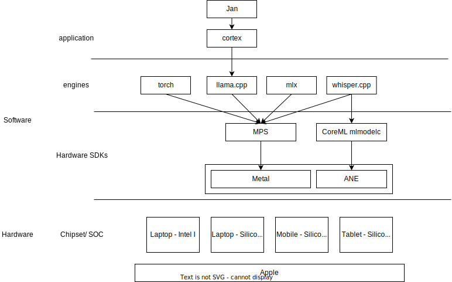

## Apple ecosystem for hardware and software

Apple Silicon has unified memory with CPU, GPU and NPU (ANE) on the same board (SoC).

## Apple hardware - Mobile A chip
Here is an image for Apple A12

## Apple hardware - Tablet/ Laptop M chip

| Chip | Component | % of die | TOPS   | Number of core
|------|-----------|----------|--------|---------------
| M1   | NPU       | 6%       | 11     |
| M1   | CPU P-core | 1.9%    |        | 
| M1   | CPU E-core | 0.5%    |        |
| M1   | GPU        | 2.1%    |        |
| M2   | NPU       | 4%       | 11     |
| M2   | CPU P-core | 1.9%    |        | 
| M2   | CPU E-core | 0.5%    |        |
| M2   | GPU        | 19%   |        |
| M2 Pro   | NPU       | 6%       | 15.8     |
| M2 Pro   | CPU P-core | 1.9%    |        | 
| M2 Pro   | CPU E-core | 0.5%    |        |
| M2 Pro   | GPU        | 24%    |        |
| M2 Max   | NPU       |        |      |
| M2 Max   | CPU P-core | 1.9%    |        | 
| M2 Max   | CPU E-core | 0.5%    |        |
| M2 Max   | GPU        | 28%    |        |
| M3   | NPU       |        | 18     |
| M3   | CPU P-core | 1.9%    |        | 
| M3   | CPU E-core | 0.5%    |        |
| M3   | GPU        |     |        |
| M3 Pro   | NPU       |        | 11     |
| M3 Pro   | CPU P-core | 1.9%    |        | 
| M3 Pro   | CPU E-core | 0.5%    |        |
| M3 Pro   | GPU        | 2.1%    |        |
| M3 Max   | NPU       |        | 11     |
| M3 Max   | CPU P-core | 1.9%    |        | 
| M3 Max   | CPU E-core | 0.5%    |        |
| M3 Max   | GPU        |     |        |

M3

M3 Pro

M3 max

