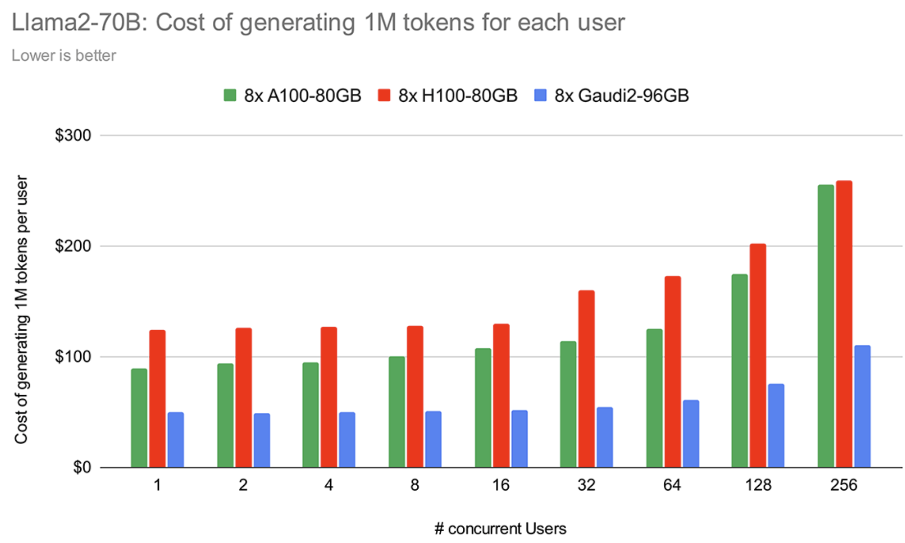

## Intel ecosystem with hardware and software

## Intel CPU Core Ultra
Intel Core Ultra NPU architecture

Data flow between Intel CPU and NPU

## Intel Arc GPU
LLM Inference comparison between Intel Arc GPU versus. NVIDIA Geforce 4060

### Intel FPGA (Gaudi Habana)
| Logical view | Real view
|--------------|-----------
|  | 

Comparison between Intel Gaudi 2 versus. AMD MI250 and NVIDIA A100

Comparison between Intel Gaudi 3 versus. AMD MI300X and NVIDIA H100

LLM Inference comparison for throughput - Gaudi2 versus NVIDIA A100/ H100

LLM Inference comparison for cost per 1M tokens - Gaudi2 versus NVIDIA A100/ H100

