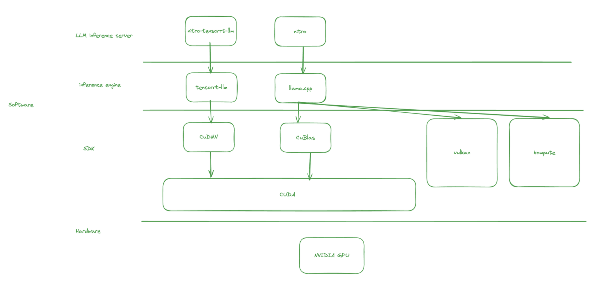

Data from: https://www.techpowerup.com/gpu-specs/

| Name             | GPU Chip | Released     | Bus        | Memory                | GPU Clock | Memory Clock |
|------------------|----------|--------------|------------|-----------------------|-----------|--------------|
| GeForce RTX 4090 | AD102    | Sep 20th, 2022 | PCIe 4.0 x16 | 24 GB, GDDR6X, 384 bit | 2235 MHz  | 1313 MHz     |
