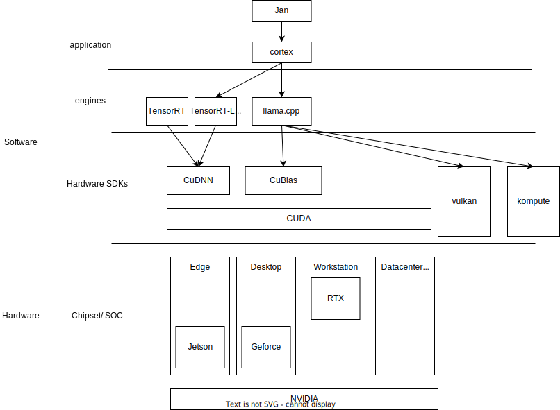
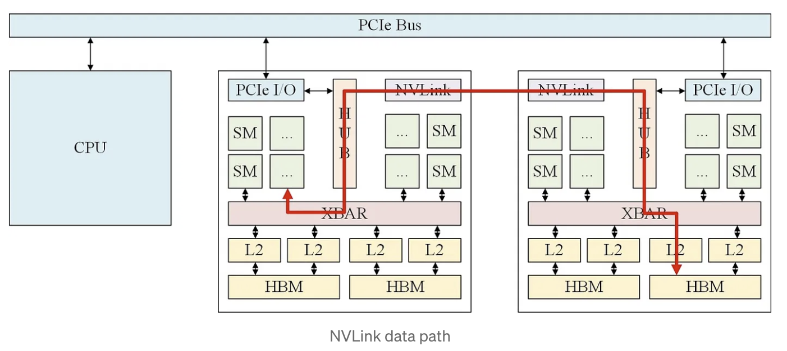
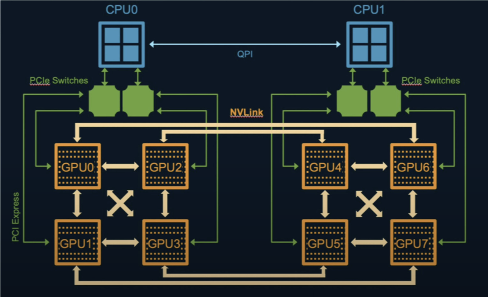
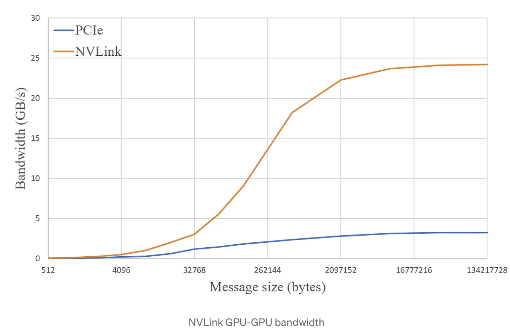
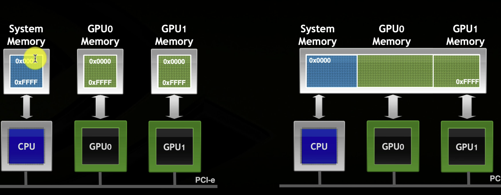
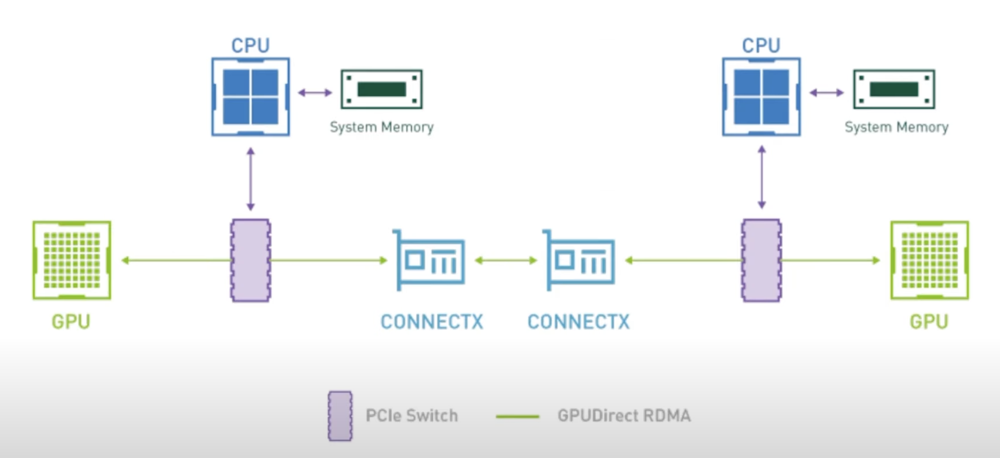
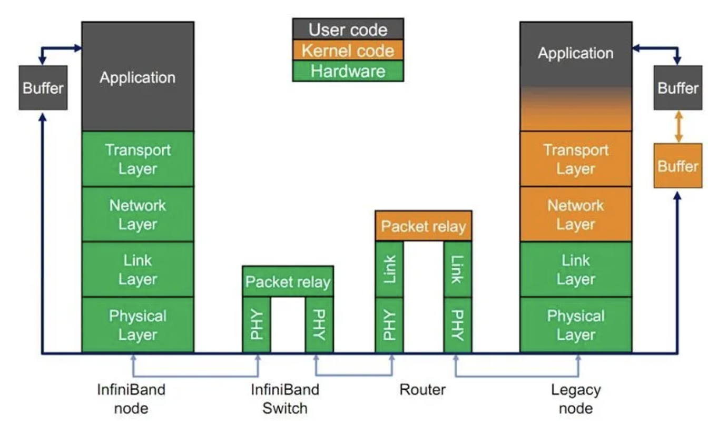
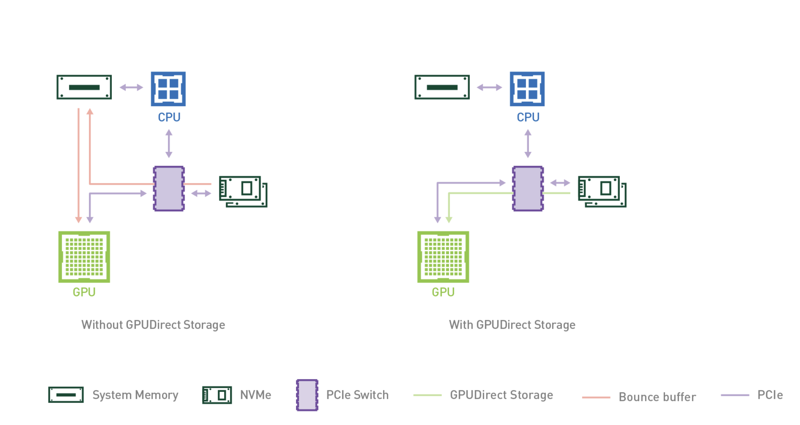

## Why GPU (NVIDIA promo)
- Todo: Add youtube embed: https://www.youtube.com/watch?v=-P28LKWTzrI&t=91s

## NVIDIA Ecosystem for hardware and software

- TODO: Add data from: https://www.techpowerup.com/gpu-specs/ for user to see GPU data

### NVIDIA has a wide range of hardware support for HPC and AI/ML
- **Computation**: Cuda Cores, Tensor Core
- **Network**:
  - **Inter-GPU with NVLink** which is better than PCIe
    - In multi-GPU environment, NVIDIA CUDA provides a way for peer-to-peer memory access between GPU. Without NVlink, CPU and PCIe is the bottleneck to transfer data back and forth
    
    
    - The bandwidth for NVLink is way much better compared to PCIe
    
    - With NVLink, we have a virtual bigger GPU
    
  - **Inter-node: InfiniBand**
    - Data transfer directly between GPUs inter-node via PCIe without touching CPU
    
    - Illustration of Infiniband Node - Infiniband Switch - Router in 7 network layer
    

- **Storage**: GPUDirectStorage: For faster data access on disk (M2). Data can go directly between PCIe devices (GPU, M2, InfiniBand)
    
