import { Tabs } from 'nextra/components'

<Tabs items={['Motherboard', 'CPU', 'GPU', 'Memory', 'HDD', 'SSD', 'PSU']}>
  <Tabs.Tab>
    ## Motherboard
    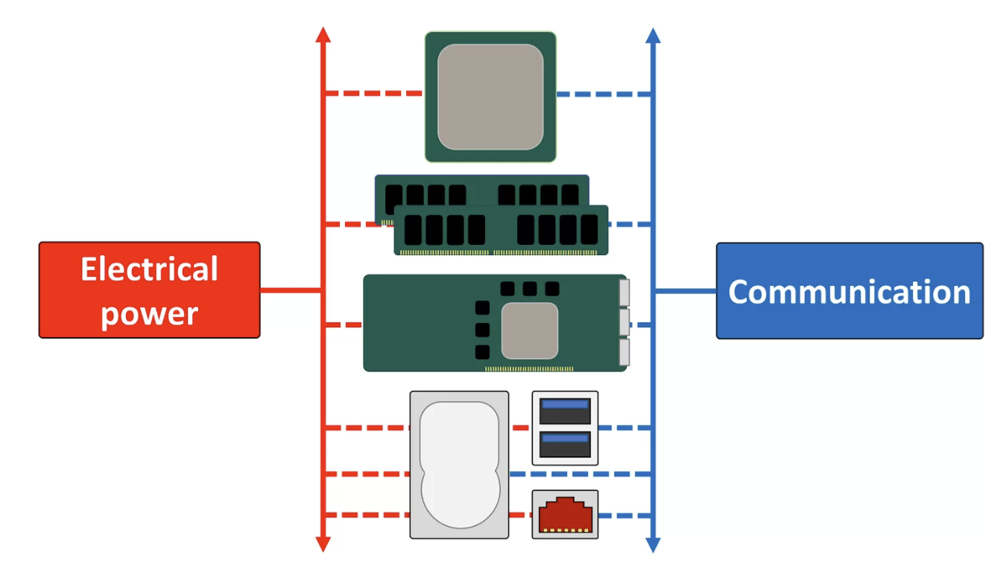

    Let us begin with the main role of a motherboard. In essence, it serves two purposes:

    Provide electrical power to the individual components
    Provide a route to allow the components to communicate with each other
    There are other things a motherboard does (e.g. holds the components in place, or provides feedback as to how well everything is functioning) but the aforementioned aspects are critical to how a PC operates, that almost every other part that makes up the motherboard, is related to these two things.

    Nearly every motherboard used in a standard desktop PC today will have sockets for the central processing unit (CPU), memory modules (nearly always a type of DRAM), add-in expansion cards (such a graphics card), storage, input/ouputs, and a means to communicate with other computers and systems.
    
    | Human view | Technical view 
    |--|--|
    | 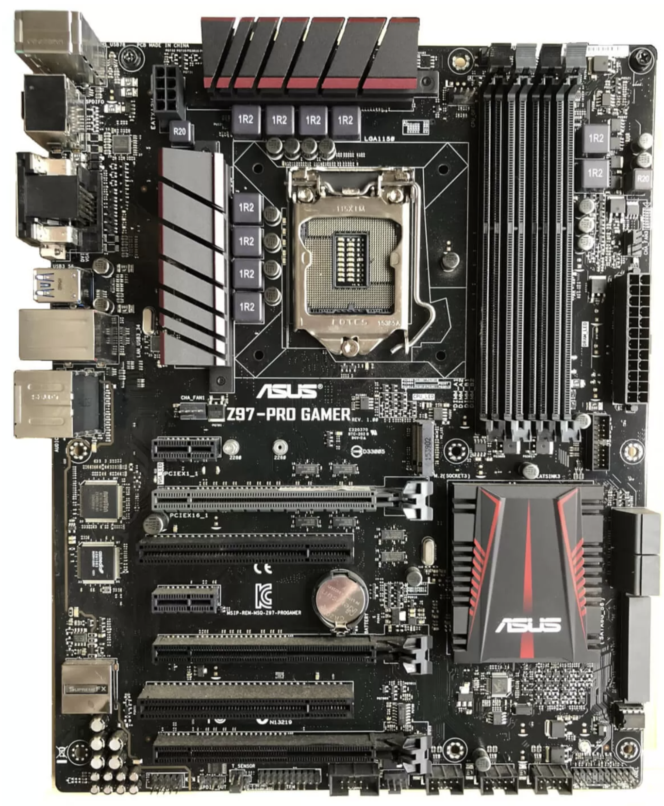 | 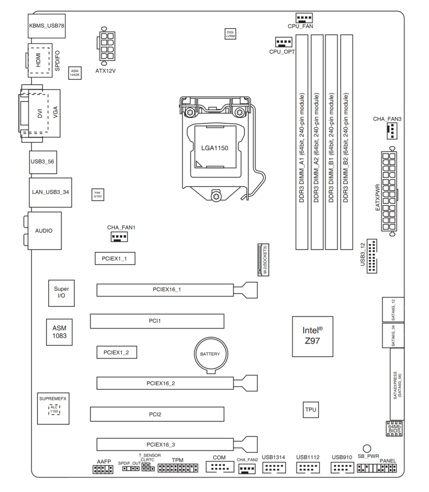 |

    ### Components
    - CPU with CPU sockets
    - Memory
    - Extension:
      - PCIe
      - M2 socket
    - PSU
    
  </Tabs.Tab>
  <Tabs.Tab>
    ## CPU
    CPUs can process data quickly in sequence, thanks to their multiple heavyweight cores and high clock speed. They are suited to running diverse tasks and can switch between different tasks with minimal latency. The speed of CPUs may create the impression of parallelism, but they can only handle one task at a time.
    The following conceptual diagram outlines the basic components of a CPU.
    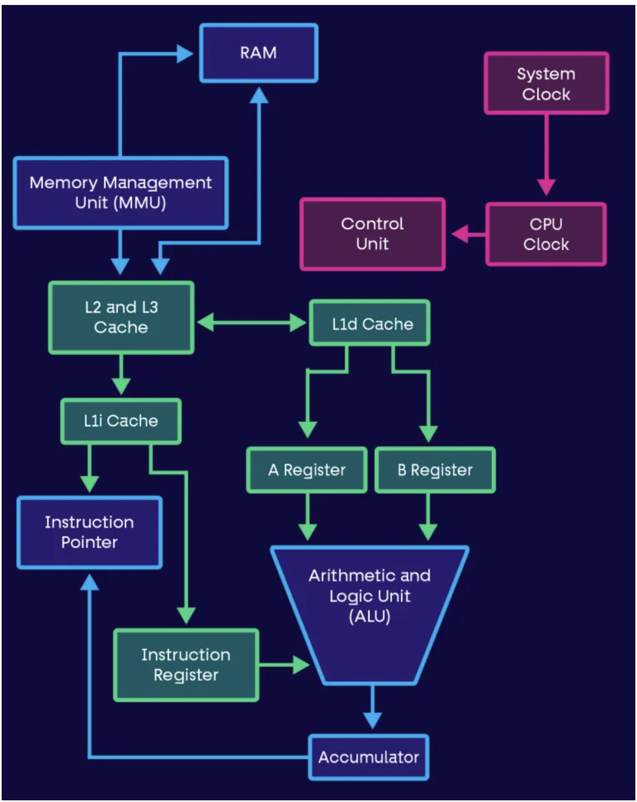
    While each CPU design may differ, the main components of a CPU are:
    - Control Unit (CU)—the control unit retrieves instructions, decodes, and executes them. It also sends control signals to manage hardware and directs data around the processor system.
    - Clock—this helps coordinate the components of the computer. The clock produces regular electrical pulses to synchronize the components. The pulse frequency, measured in hertz (Hz), is called the clock speed. Higher frequencies allow the processing of more instructions within a given timeframe.
    - Arithmetic Logic Unit (ALU)—this unit handles calculations. It makes logical and arithmetic decisions and serves as a gateway for transferring data from the primary memory to secondary storage.
    - Registers—a register holds a small amount of high-speed memory within the processor. Registers store data required for processing, including the instruction to be decoded, the address of the next instruction, and the results of computations. Different CPUs contain different numbers and types of registers. However, most processors are likely to include a program counter, a memory address register (MAR), a memory data register (MDR), a current instruction register (CIR), and an accumulator (ACC).
    - Caches—a cache is a small, built-in RAM in the processor that can store data and reusable instructions temporarily. Caches enable high-speed processing because the data is more readily available to the processor than the external RAM.
    - Buses—these are fast internal connections that send data and signals from the processor to other components. There are three types of buses: an address bus to carry memory addresses components like input/output devices and primary memory; a data bus to carry actual data; and a control bus to carry control signals and clock pulses.

    ### CPU Advantages and Limitations
    CPUs have several distinct advantages for modern computing tasks:

    - Flexibility—a CPU is a general-purpose processor that can handle many tasks, and multitask between multiple activities.
    - Faster in many contexts—CPUs are faster than GPUs when handling operations like data processing in RAM, I/O operations, and operating system administration.
    - Precision—CPUs can support mid-range math operations with higher precision than GPUs, which is important for many use cases.
    - Cache memory—CPUs have a large local cache memory, which lets them handle large sets of linear instructions.
    - Hardware compatibility—CPUs are compatible with all types of motherboards and system designs, whereas GPUs require specialized hardware support.
    
    CPUs have the following disadvantages compared to GPUs:

    - Parallel processing—CPUs are less adept at tasks that require millions of identical operations because of their limited parallelism.
    - Slower development—CPUs are a very mature technology that is already reaching the limits of its development, while GPUs have much more potential to improve.
    - Compatibility—several types of CPUs, including x86 and ARM processors, and software may not be compatible with all types.
  </Tabs.Tab>
  <Tabs.Tab>
    ## GPU
    At a high level, GPU architecture is focused on putting cores to work on as many operations as possible, and less on fast memory access to the processor cache, as in a CPU. Below is a diagram showing a typical NVIDIA GPU architecture. We’ll discuss it as a common example of modern GPU architecture.
    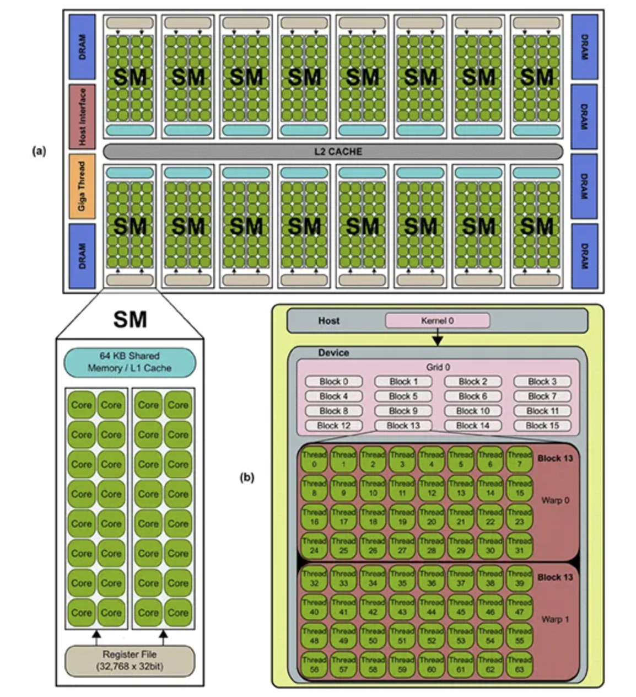
    An NVIDIA GPU has three primary components:
    - Processor Clusters (PC) - the GPU consists of several clusters of Streaming Multiprocessors.
    - Streaming Multiprocessors (SM) - each SM has multiple processor cores, and a layer-1 cache that allows it to distribute instructions to its cores.
    - Layer-2 cache - this is a shared cache that connects SMs together. Each SM uses the layer-2 cache to retrieve data from global memory.
    - DRAM - this is the GPU’s global memory, typically based on technology like GDDR-5 or GDDR-6. It holds instructions that need to be processed by all the SMs.
    - Memory latency is not a critical consideration in this type of GPU design. The main concern is making sure the GPU has enough computations to keep all the cores busy.

    ### Use Cases for CPUs
    The CPU is the master in a computer system and can schedule the cores’ clock speeds and system components. CPUs can perform complex mathematical calculations quickly, as long as they process one problem at a time. CPU performance begins to slow down when performing multiple tasks simultaneously.

    CPUs have narrow, specialized use cases for AI workloads. CPUs may be well-suited to process algorithm-intensive tasks that don’t support parallel processing. Examples include:

    - Real-time inference and machine learning (ML) algorithms that don’t parallelize easily
    - Recurrent neural networks relying on sequential data
    - Inference and training recommender systems with high memory requirements for embedding layers
    - Models using large-scale data samples, such as 3D data for inference and training
    - CPUs are useful for tasks that require sequential algorithms or perform complex statistical computations. Such tasks are not common in modern AI applications, given that most companies choose the efficiency and speed of GPUs over the specialization of CPUs. Still, some data scientists prefer to develop AI algorithms differently, relying on serial processing, or logic, instead of statistical computations.

    ### GPU Advantages and Limitations
    The unique advantages of GPUs include:

    - High data throughput—a GPU can perform the same operation on many data points in parallel, so that it can process large data volumes at speeds unmatched by CPUs.
    - Massive parallelism—a GPU has hundreds of cores, allowing it to perform massively parallel calculations, such as matrix multiplications.
    - Suitable for specialized use cases—GPUs can provide massive acceleration for specialized tasks like deep learning, big data analytics, genomic sequencing, and more.
    - Disadvantages of GPUs compared to CPUs include:

    - Multitasking—GPUs can perform one task at massive scale, but cannot perform general purpose computing tasks.
    - Cost—Individual GPUs are currently much more expensive than CPUs. Specialized large-scale GPU systems can reach costs of hundreds of thousands of dollars.
    ‍- Difficulty handling complexity—a GPU can struggle with processing tasks that are not well structured. They cannot efficiently process branching logic, sequential operations, or other complex programming patterns.

    ### Use Cases for GPUs
    GPUs are best suited for parallel processing and are the preferred option for training AI models in most cases. AI training typically involves processing mostly identical, simultaneous operations on multiple data samples. Training data sets continue to grow larger, requiring increasingly massive parallelism to enable the efficient performance of tasks.

    Enterprises generally prefer GPUs because most AI applications require parallel processing of multiple calculations. Examples include:

    - Neural networks
    - Accelerated AI and deep learning operations with massive parallel inputs of data
    - Traditional AI inference and training algorithms
    - GPUs provide the raw computational power required for processing largely identical or unstructured data. Over the last 30 years, GPUs have evolved and moved from personal computers to workstations, servers, and data centers. GPUs will likely continue to dominate applications running in data centers or the cloud.

    ### CPU-GPU connection
    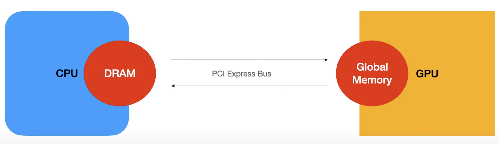

    ### Data life cycle between CPU - GPU
    

  </Tabs.Tab>
  <Tabs.Tab>
    ## Memory RAM

    
    Processors need to be able to access data and instructions very quickly, so they can keep software zipping along. They also need to do this in a way that if it's randomly or unexpectedly requested, the performance isn't affected too much. This is why RAM – short for random-access memory – is really important in a computer.

    There are two main types of RAM: static and dynamic, or SRAM and DRAM for short.

    We'll be focusing on DRAM, as SRAM is only used inside processors, like a CPU or GPU. So where can we find DRAM in our PCs, and how does it work?

    Most people know of RAM because there is a big pile of it right next to the CPU. This group of DRAM often goes by the name of system memory, but a better name would be CPU memory, as it's the main storage for working data and instructions for the processor.

    | DRAM type |	Typical chip clock |	I/O clock |	Data transfer rate
    |---------|----------|--------|--------|
    | SDR |	100 MHz |	100 MHz	100 MT/s
    | DDR |	100 MHz |	100 MHz	200 MT/s
    | DDR2 |	200 MHz |	400 MHz	800 MT/s
    | DDR3 |	200 MHz |	800 MHz	1600 MT/s
    | DDR4 |	400 MHz |	1600 MHz	3200 MT/s

    | DRAM type | 	Typical chip clock | 	I/O clock | 	Data transfer rate
    |---------|----------|--------|--------|
    | GDDR | 	250 MHz | 	250 MHz | 	500 MT/s
    | GDDR2 | 	500 MHz | 	500 MHz | 	1000 MT/s
    | GDDR3 | 	800 MHz | 	1600 MHz | 	3200 MT/s
    | GDDR4 | 	1000 MHz | 	2000 MHz | 	4000 MT/s
    | GDDR5 | 	1500 MHz | 	3000 MHz | 	6000 MT/s
    | GDDR5X | 	1250 MHz | 	2500 MHz | 	10000 MT/s
    | GDDR6 | 	1750 MHz | 	3500 MHz | 	14000 MT/s

    Not all ranks are 64 bits in size, either – DIMMs used in servers and workstations are often 72 bits, which means they have an extra DRAM module on them. The extra chip doesn't give more storage or performance; instead, it's used for error checking and correcting (ECC).
  </Tabs.Tab>
  <Tabs.Tab>
    # HDD - Hard Disk Drive
    Let's start our look into the guts of storage drives with ones that use magnetism to store digital data. The mechanical hard disk drive (HDD) has been the standard storage system for PCs across the world for over 30 years, but the technology behind it all is much older than that.
  
    | Downside | Upside
    |--|--|
    | 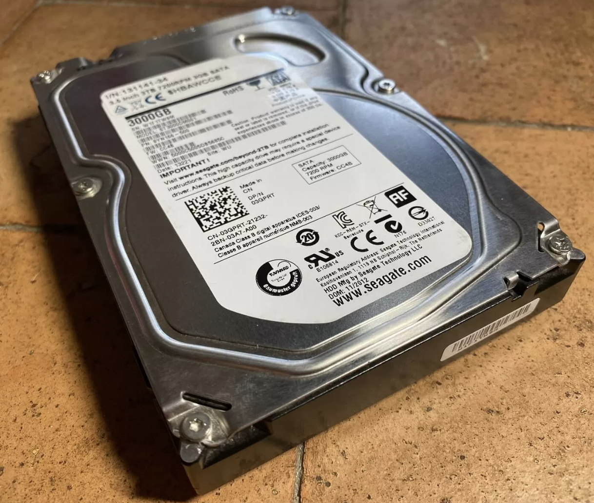 | 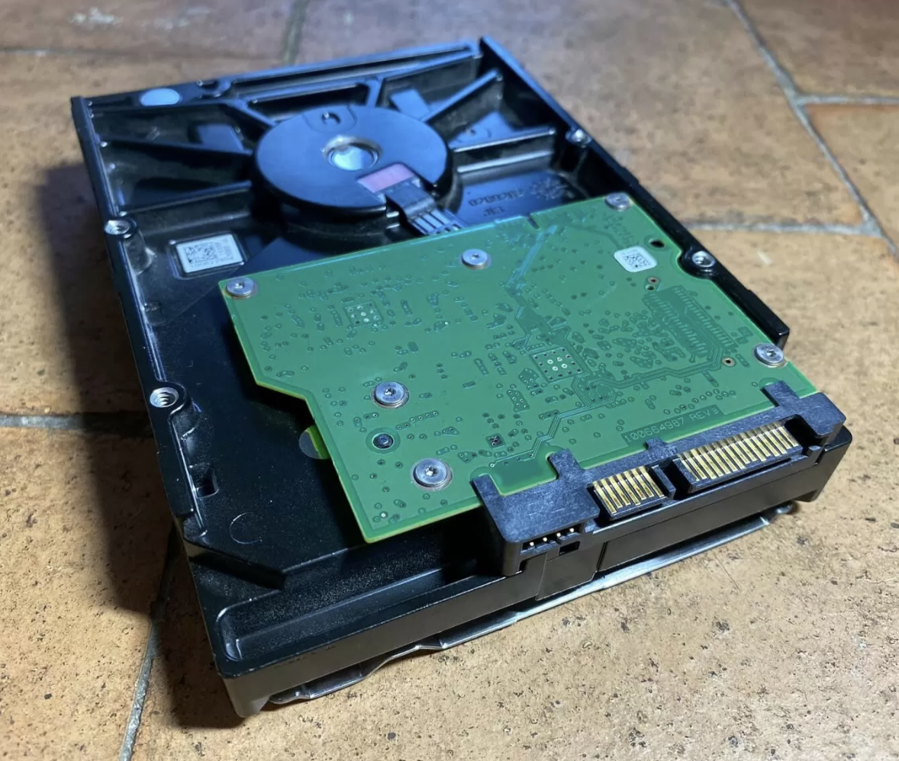 |

    ## How HDD works
    TODO: Add Youtube embed: https://www.youtube.com/watch?v=3owqvmMf6No&t=45s
  </Tabs.Tab>
  <Tabs.Tab>
    # SSD - Solid State Drive
    Disk, but way much faster and last longer
    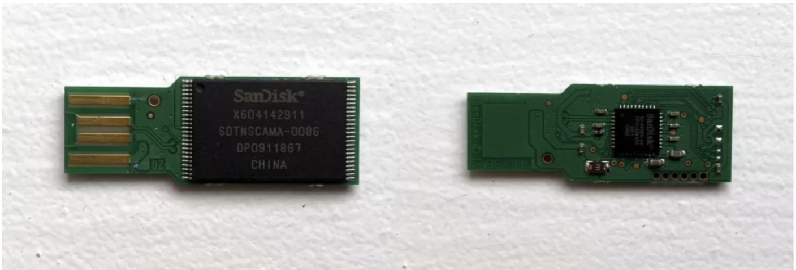
    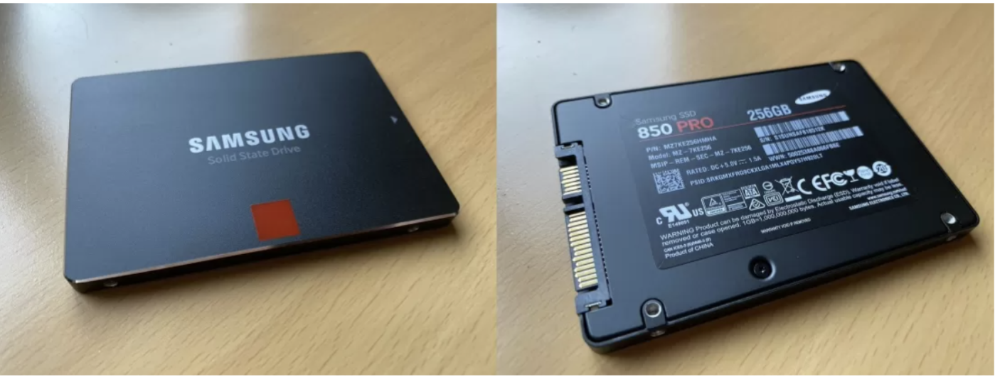

  </Tabs.Tab>
  <Tabs.Tab>
    # PSU
    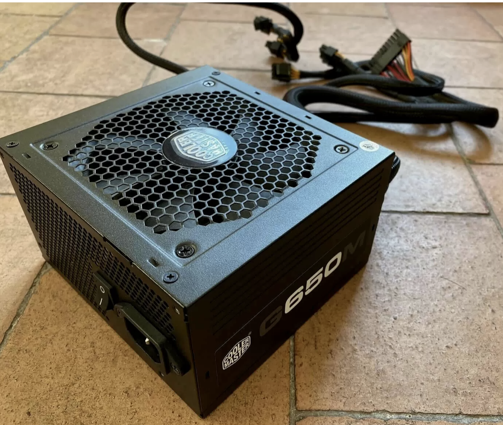
    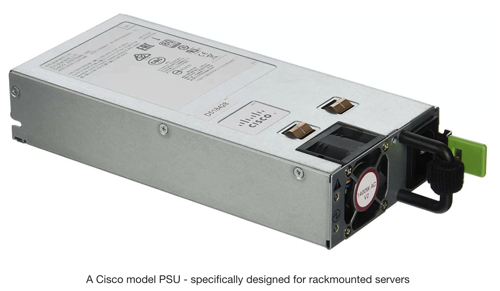
    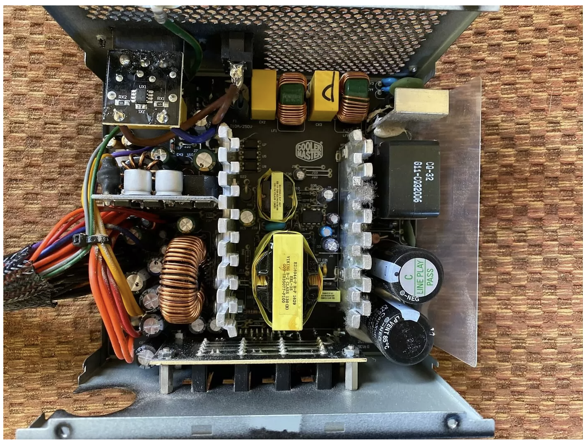
    
    
    
  </Tabs.Tab>
</Tabs>