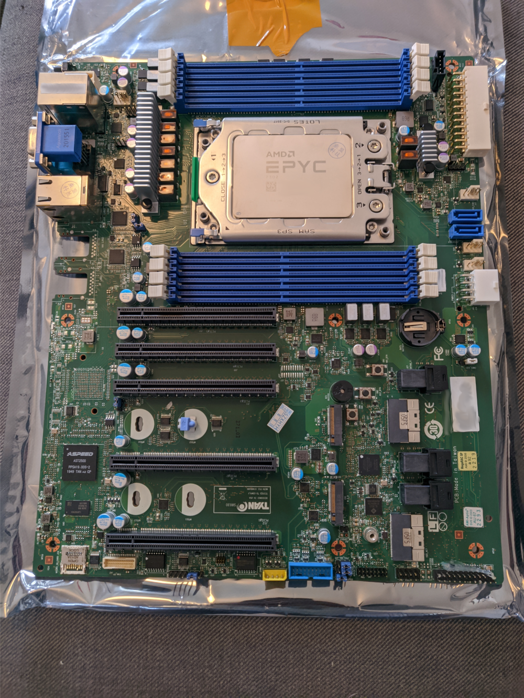
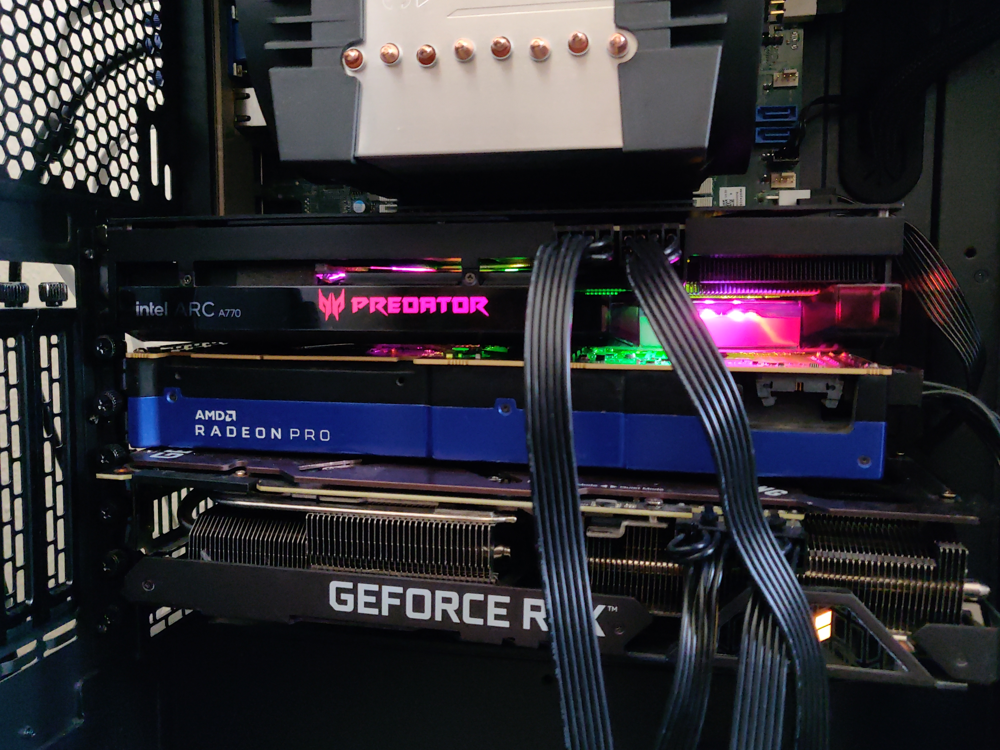

import { Callout, Steps } from 'nextra/components'
import { Cards, Card } from 'nextra/components'

<Callout type="info">
This page is still under construction.
</Callout>

<Cards>
  <Card title="Occam full server" href="/hardware/ecosystem" />
</Cards>

#### Occam full server
- An EPYC 7302 on a Tyan S8030GM2NE motherboard, chosen for its number of PCIe lanes. It provides 5 full 16x PCIe 4.0 slots in an ATX formfactor.
- The CPU has 16 cores at 3.3GHz and 8 memory channels, which I filled with 128GB of DDR-3200.
- I put in an Nvidia RTX 3090, an AMD Radeon Pro VII and an Intel ARC A770, so I can test Vulkan on all hardware configurations without having to switch systems. Since I'm using Linux, I don't get driver conflicts. AMD and Intel work with the Open Source Mesa drivers and Nvidia with their own proprietary one. I can use CUDA, ROCm and OneAPI as well.
- The goal is developing the llama.cpp Vulkan backend to the point where I can use these three GPUs together on the same model.

