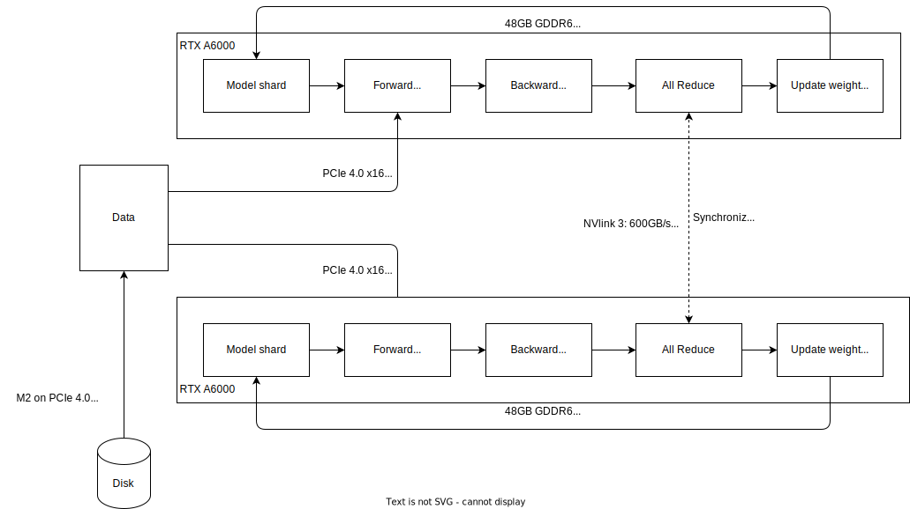

## What is LLM fine tuning

## LLM Training/ Fine tuning in single GPU
### Logical

### Physical

## LLM Training/ Fine tuning in multi external GPU in single machine
### DDP
#### Logical

#### Physical (NVIDIA)

## LLM Training/ Fine tuning in multi external GPU in multiple machines
### FSDP
#### Logical

#### Physical (NVIDIA)

## Hardware for LLM fine tuning varies
- [HF - Methods/ Tools for efficient training on single GPU](https://huggingface.co/docs/transformers/perf_train_gpu_one)
- [HF - Methods/ Tools for efficient training on multiple GPUs](https://huggingface.co/docs/transformers/perf_train_gpu_many)

## Estimating hardware for fine tuning LLM
https://medium.com/@dzmitrybahdanau/the-flops-calculus-of-language-model-training-3b19c1f025e4
https://arxiv.org/html/2404.10933v1
https://blog.scottlogic.com/2023/11/24/llm-mem.html