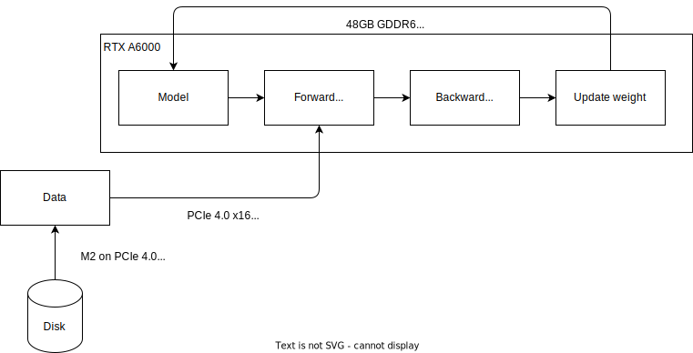
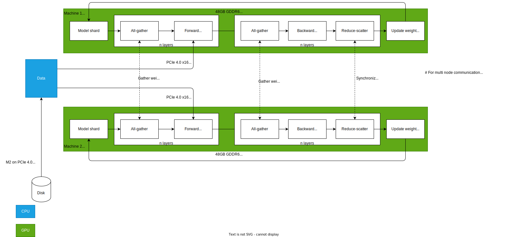

## Overview on how LLM Fine tuning work on software level

| *LLM training - software level - [Source](https://www.superannotate.com/blog/llm-fine-tuning)* | 

The above diagram shows how LLM fine tuning works in software level
 - Take a pretrained model
 - Create or get existing dataset with pre-defined format in order to start fine tuning process. Data quality matters
 - Run fine tuning process

## Overview on how LLM Training work on hardware level
### On single machine with single GPU

| *LLM training on single node single GPU - hardware level* |

The above diagram shows how LLM fine tuning/ training works in hardware layer
 - The data in disk needs to be loaded by CPU and store in computer memory via either M2 PCIe 4.0 x4 or SATA3. This can use Pytorch `DataLoader`
 - The data then will be converted to Pytorch Tensor and copy from computer memory to GPU VRAM with CPU as orchestration engine. The data travels from memory RAM (DIMM) to CPU to be converted, then via PCIe 4.0 and saved into GPU VRAM
 - The computation orchestrated by NVIDIA CUDA/ TensorCore get the data inside GPU VRAM, execute the functions to predict and backpropagate. This is so-called training epoch. The time is dependent on model size, dataset size, batch size, etc
 - After every epoch, the model weights are saved by going from GPU VRAM to CPU via PCIe 4.0 in order for user to compare the quality among many checkpoints

## On single machine with multiple NVIDIA GPUs

| *LLM training on single node multiple GPUs - hardware level* |

The above diagram shows how LLM fine tuning/ training works in hardware layer
 - The data in disk needs to be loaded by CPU and store in computer memory via either M2 PCIe 4.0 x4 or SATA3. This can use Pytorch `DistributedDataLoader`
 - The data then will be converted to Pytorch Tensor and copy from computer memory to GPU VRAM with CPU as orchestration engine. The data travels from memory RAM (DIMM) to CPU to be converted, then via PCIe 4.0 and saved into GPU VRAM
 - The computation orchestrated by NVIDIA CUDA/ TensorCore get the data inside GPU VRAM, execute the functions to predict and backpropagate. This is so-called training epoch. The time is dependent on model size, dataset size, batch size, etc. As you can see in green, in this case there are more than 1 NVIDIA GPU in place, the computation and weights on those need to synchronize either via NVLink or PCIe 4.0 in peer to peer mode.
 - After every epoch, the model weights are saved by going from GPU VRAM to CPU via PCIe 4.0 in order for user to compare the quality among many checkpoints

## On multiple machine with multiple NVIDIA GPUs

| *LLM training on multiple nodes multiple GPUs - hardware level* |

The above diagram shows how LLM fine tuning/ training works in hardware layer
 - The data in disk needs to be loaded by CPU and store in computer memory via either M2 PCIe 4.0 x4 or SATA3. This can use `FSDP` (Fully Sharded Data Parallel)
 - The data then will be converted to Pytorch Tensor and copy from computer memory to GPU VRAM with CPU as orchestration engine. The data travels from memory RAM (DIMM) to CPU to be converted, then via PCIe 4.0 and saved into GPU VRAM
 - The computation orchestrated by NVIDIA CUDA/ TensorCore get the data inside GPU VRAM, execute the functions to predict and backpropagate. This is so-called training epoch. The time is dependent on model size, dataset size, batch size, etc. As you can see in green, in this case there are more than 1 NVIDIA GPU in place, the computation and weights on those need to synchronize either via NVLink or PCIe 4.0 in peer to peer mode. In this case, as the GPUs are located on different machines, the data needs to go via either InfiniBand on PCIe or Ethernet (The Ethernet case might require CPU involvement as GPU does not connect directly to Ethernet)
 - After every epoch, the model weights are saved by going from GPU VRAM to CPU via PCIe 4.0 in order for user to compare the quality among many checkpoints

## Hardware for LLM fine tuning varies
- [HF - Methods/ Tools for efficient training on single GPU](https://huggingface.co/docs/transformers/perf_train_gpu_one)
- [HF - Methods/ Tools for efficient training on multiple GPUs](https://huggingface.co/docs/transformers/perf_train_gpu_many)

## Estimating hardware for fine tuning LLM
https://medium.com/@dzmitrybahdanau/the-flops-calculus-of-language-model-training-3b19c1f025e4
https://arxiv.org/html/2404.10933v1
https://blog.scottlogic.com/2023/11/24/llm-mem.html