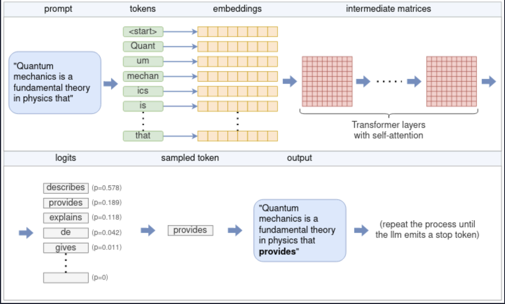
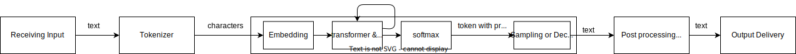
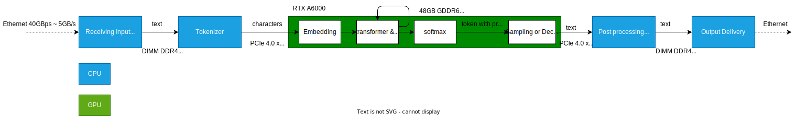
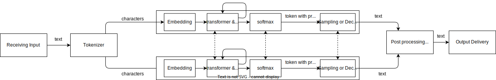
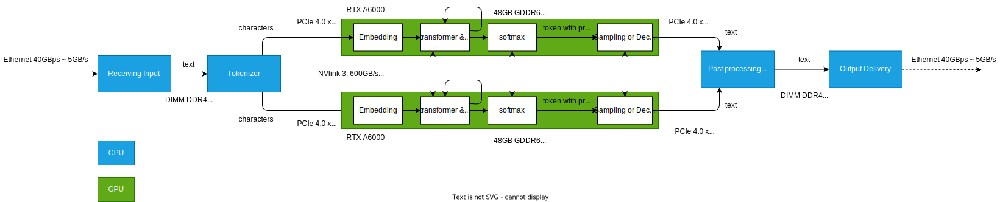

import { Tabs } from 'nextra/components'

## What is LLM Inference

## LLM Inference hardware

## LLM Inference hardware choice based on John Neumann bottleneck - [source](https://chsasank.com/llm-system-design.html)
For best AI inference oriented hardware design, you need to spend most of your money around getting the best memory out there. Compute itself is pretty cheap! People have gotten used to measuring computers by TOPS or FLOPS that they optimized heavily for it. However, if you strive to be a AI focussed hardware, you should instead measure your performance in GB/s.

## Hardware for LLM inference on Single Node
### Single GPU
#### Logical

#### Physical (NVIDIA)

### Multiple GPU with Tensor Parallel
#### Logical

#### Physical (NVIDIA)

## Hardware for LLM inference on Multi node
- [OpenAI ChatGPT](https://chatgpt.com/?oai-dm=1) uses [Ray](https://www.ray.io/) to distribute `single node` process on multiple nodes - [Reference](https://thenewstack.io/openai-chats-about-scaling-llms-at-anyscales-ray-summit/)
- [AntGroup](https://www.antgroup.com/en) uses [Ray](https://www.ray.io/) to distribute `NVIDIA Triton Inference server` process for LLM on multiple nodes - [Reference](https://www.youtube.com/watch?v=_yu0Rtuetuc)

## How is LLM inference on different hardware
| Model | Token/s | Hardware | Cost 
|-------|---------|----------|------
| llama2 7b  | 138 t/s | [RTX 4090](https://www.hardware-corner.net/guides/computer-to-run-llama-ai-model/) | $5000 complete system
| llama2 7b | 714.33 t/s | [Nvidia A100](https://github.com/vllm-project/vllm/discussions/275) | $10,000 1U System (Estimated)
| llama2 70B | 41.2 t/s | [2 x A10G](https://octoml.ai/blog/making-the-llama-2-herd-work-for-you-on-octoai/) | $15,000 1U System (Estimated)
| llama2 70B | 13.77 | [Mac Studio 192GB](https://blog.gopenai.com/how-to-deploy-llama-2-as-api-on-mac-studio-m2-ultra-and-enable-remote-api-access-7c4e6423b2dd) | $5599

## How is LLM inference on NVIDIA Datacenter Grade GPU
<Tabs items={['1 x L4 GPU', '2 x L4 GPUs', '4 x L4 GPUs', '8 x L4 GPUs']}>
  <Tabs.Tab>
  | Model                 | Throughput (tokens per second) | Throughput (requests per second) | Average latency (seconds) | Average latency per token (seconds) | Average latency per output token (seconds) | Total time (seconds) |
  |-----------------------|--------------------------------|----------------------------------|----------------------------|--------------------------------------|--------------------------------------------|----------------------|
  | Llama2-7B             | 558.54                         | 1.17                             | 449.88                     | 1.71                                 | 10.87                                      | 897.23               |
  | Mistral-7B-instruct   | 915.48                         | 1.89                             | 277.19                     | 0.97                                 | 7.12                                       | 552.44               |
  </Tabs.Tab>
  <Tabs.Tab>
  | Model                 | Throughput (tokens per second) | Throughput (requests per second) | Average latency (seconds) | Average latency per token (seconds) | Average latency per output token (seconds) | Total time (seconds) |
  |-----------------------|--------------------------------|----------------------------------|----------------------------|--------------------------------------|--------------------------------------------|----------------------|
  | Llama2-7B             | 1265.17 |	2.65 |	179.85	| 0.63 |	3.81 |	397.65               |
  | Mistral-7B-instruct   | 1625.08	| 3.35 |	153.09 |	0.50 |	2.65 |	339.51               |
  </Tabs.Tab>
  <Tabs.Tab>
  | Model                 | Throughput (tokens per second) | Throughput (requests per second) | Average latency (seconds) | Average latency per token (seconds) | Average latency per output token (seconds) | Total time (seconds) |
  |-----------------------|--------------------------------|----------------------------------|----------------------------|--------------------------------------|--------------------------------------------|----------------------|
  | Llama2-7B             | 1489.99 |	3.12 |	147.36 |	0.48 |	2.57 |	324.71               |
  | Mistral-7B-instruct   | 1742.70 |	3.59 |	136.49 |	0.44 |	2.68 |	285.03               |
  </Tabs.Tab>
  <Tabs.Tab>
  | Model                 | Throughput (tokens per second) | Throughput (requests per second) | Average latency (seconds) | Average latency per token (seconds) | Average latency per output token (seconds) | Total time (seconds) |
  |-----------------------|--------------------------------|----------------------------------|----------------------------|--------------------------------------|--------------------------------------------|----------------------|
  | Llama2-7B             | 1401.18 |	2.93 |	153.09 |	0.50 |	2.65 |	339.51               |
  | Mistral-7B-instruct   | 1570.70 |	3.24 |	149.67 |	0.48 |	2.90 |	316.74               |
  | Llama2-70B |	– |	1.00 |	475.59 |	1.62 |	9.21 |	996.86 |
  </Tabs.Tab>
</Tabs>