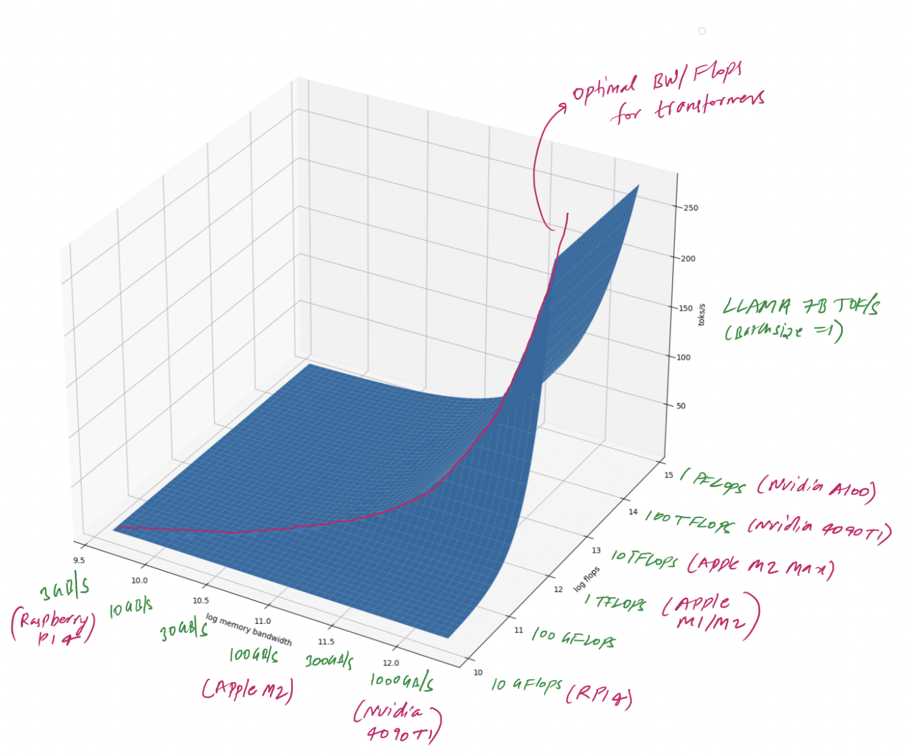

import { Tabs } from 'nextra/components'

## What is LLM Inference

## Overview on LLM Inference hardware
- Nvidia's dominance in AI isn't accidental; it arises from robust hardware and an established CUDA software toolkit. The A100 and H100 GPUs excel with potent computational power, plentiful memory, and optimizations designed for LLM workloads.
- Intel is best known for CPUs, but the chip giant is investing heavily in the AI domain.  Recent generations of CPUs offer noticeable progress in handling GenAI workloads. Enhancements like dedicated instructions, support for quantization, and libraries like BigDL-LLM give CPUs a foot in the door for LLM inference. Teams valuing existing hardware or familiar workflows may start their LLM journey with CPUs as a potential entry point.
Intel's venture into the GPU market signals ambitious aims within AI-focused computation. As their GPU options mature, so will the ability to target hardware tailored for LLM demands.  Their OneAPI software offers developers a comprehensive programming toolchain aimed at mirroring a good deal of CUDA's core functionality.
- AMD is rapidly earning credibility as a provider of formidable LLM inference solutions, prioritizing performance, availability, and a dedication to open-source tools. Its MI300/MI300A accelerators boast the computational power and memory capacity to address even the largest LLMs.
At the core of AMD's platform is the ROCm open-source software suite. There's a  strategic parallel to CUDA's core strength here, facilitating a smoother journey for developers steeped in Nvidia's environment. AMD, keenly focused on driving its LLM capabilities, actively engages with AI leaders like OpenAI to optimize software.
- Apple with their own Mac Silicon and unique design for unified memory ...
- Some hardware players have come up with specific hardware for transformer-based LLM:
  - Groq with their LPU - ...
  - NVIDIA since the new H100 has [TransformerEngine](https://blogs.nvidia.com/blog/h100-transformer-engine/) that is designed for Transformer architecture

## LLM Inference hardware choice based on John Neumann bottleneck
Computers have always been about computing things faster and faster. While this design made computers ‘automatic’, it introduced new bottlenecks to computing speed. Controller is an interpreter which fetches instructions one by one from memory and executes them on data from memory. This meant the two important components of the design (controller, memory) have to be balanced in terms of speed. Let’s understand what speed for each of these components mean:
- Controller speed aka TOPS: Number of instructions controller can run per second. Usually this is measured in operations per second. Modern computers quote their speed in TOPS - Tera operations per second or TFLOPS - Tera floating operations per second.
- Memory speed aka Bandwidth: Number of bits that can be read from memory per second. Usually this is measured in bytes per seconds. Modern computers quote their memory speeds in GB/s - Gigabytes per second.

If the controller is able to operate way more operations than the memory can cope with or vice versa, the design becomes imbalanced and a bottleneck will be created! This is termed as Von Neumann Bottleneck.

Latency per token is minimum of latency from memory and latency from controller. For latency from memory, time to transfer P weights from memory to controller has to be computed. For compute, since we’re essentially doing matrix multiplications we’ll be doing 2 * P operations (one for multiplication and one for adding). If we assume batch size of B, we’ll do 2 * P * B operations while data transfer is the same. In our formula, nbytes
 represent number of bytes per weight in our representation (for example, nbytes= 0.5 for int4). Here’s the final formula:

For optimal hardware design, we will want to chose the hardware for which compute latency and transfer `latencycompute=latencymemory` . If we use int8 representation and batch size of 1, which are very reasonable assumptions, this simplifies into nflops=nmemory bandwidth
. I plotted estimated toks/s for different memory and controller speeds and marked the optimal configuration.

For best AI inference oriented hardware design, you need to spend most of your money around getting the best memory out there. Compute itself is pretty cheap! People have gotten used to measuring computers by TOPS or FLOPS that they optimized heavily for it. However, if you strive to be a AI focussed hardware, you should instead measure your performance in GB/s.

## How is LLM inference on different hardware
| Model | Token/s | Hardware | Cost 
|-------|---------|----------|------
| llama2 7b  | 138 t/s | [RTX 4090](https://www.hardware-corner.net/guides/computer-to-run-llama-ai-model/) | $5000 complete system
| llama2 7b | 714.33 t/s | [Nvidia A100](https://github.com/vllm-project/vllm/discussions/275) | $10,000 1U System (Estimated)
| llama2 70B | 41.2 t/s | [2 x A10G](https://octoml.ai/blog/making-the-llama-2-herd-work-for-you-on-octoai/) | $15,000 1U System (Estimated)
| llama2 70B | 13.77 | [Mac Studio 192GB](https://blog.gopenai.com/how-to-deploy-llama-2-as-api-on-mac-studio-m2-ultra-and-enable-remote-api-access-7c4e6423b2dd) | $5599

## How is LLM inference on NVIDIA Datacenter Grade GPU
<Tabs items={['1 x L4 GPU', '2 x L4 GPUs', '4 x L4 GPUs', '8 x L4 GPUs']}>
  <Tabs.Tab>
  | Model                 | Throughput (tokens per second) | Throughput (requests per second) | Average latency (seconds) | Average latency per token (seconds) | Average latency per output token (seconds) | Total time (seconds) |
  |-----------------------|--------------------------------|----------------------------------|----------------------------|--------------------------------------|--------------------------------------------|----------------------|
  | Llama2-7B             | 558.54                         | 1.17                             | 449.88                     | 1.71                                 | 10.87                                      | 897.23               |
  | Mistral-7B-instruct   | 915.48                         | 1.89                             | 277.19                     | 0.97                                 | 7.12                                       | 552.44               |
  </Tabs.Tab>
  <Tabs.Tab>
  | Model                 | Throughput (tokens per second) | Throughput (requests per second) | Average latency (seconds) | Average latency per token (seconds) | Average latency per output token (seconds) | Total time (seconds) |
  |-----------------------|--------------------------------|----------------------------------|----------------------------|--------------------------------------|--------------------------------------------|----------------------|
  | Llama2-7B             | 1265.17 |	2.65 |	179.85	| 0.63 |	3.81 |	397.65               |
  | Mistral-7B-instruct   | 1625.08	| 3.35 |	153.09 |	0.50 |	2.65 |	339.51               |
  </Tabs.Tab>
  <Tabs.Tab>
  | Model                 | Throughput (tokens per second) | Throughput (requests per second) | Average latency (seconds) | Average latency per token (seconds) | Average latency per output token (seconds) | Total time (seconds) |
  |-----------------------|--------------------------------|----------------------------------|----------------------------|--------------------------------------|--------------------------------------------|----------------------|
  | Llama2-7B             | 1489.99 |	3.12 |	147.36 |	0.48 |	2.57 |	324.71               |
  | Mistral-7B-instruct   | 1742.70 |	3.59 |	136.49 |	0.44 |	2.68 |	285.03               |
  </Tabs.Tab>
  <Tabs.Tab>
  | Model                 | Throughput (tokens per second) | Throughput (requests per second) | Average latency (seconds) | Average latency per token (seconds) | Average latency per output token (seconds) | Total time (seconds) |
  |-----------------------|--------------------------------|----------------------------------|----------------------------|--------------------------------------|--------------------------------------------|----------------------|
  | Llama2-7B             | 1401.18 |	2.93 |	153.09 |	0.50 |	2.65 |	339.51               |
  | Mistral-7B-instruct   | 1570.70 |	3.24 |	149.67 |	0.48 |	2.90 |	316.74               |
  | Llama2-70B |	– |	1.00 |	475.59 |	1.62 |	9.21 |	996.86 |
  </Tabs.Tab>
</Tabs>