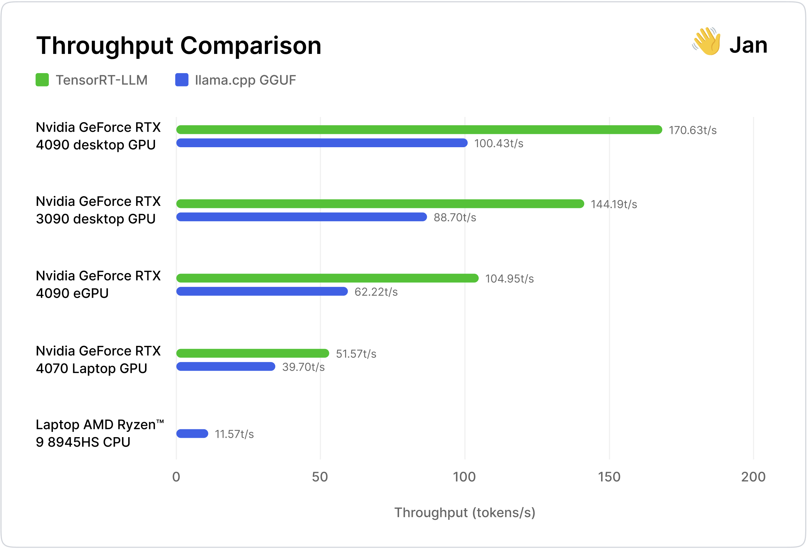

import { Callout } from 'nextra/components'

# Benchmarking with NVIDIA TensorRT-LLM and llama.cpp

Jan now supports NVIDIA TensorRT-LLM in addition to llama.cpp, making the backend multi-engine and performant across more hardware.

This post benchmarks TensorRT-LLM with llama.cpp across common consumer laptops and desktops among Jan users:
- [NVIDIA GeForce RTX 40 Series](https://www.nvidia.com/en-us/geforce/graphics-cards/40-series/) ([Ada Lovelace architecture](https://www.nvidia.com/en-us/geforce/ada-lovelace-architecture/))
- [RTX 30 Series](https://www.nvidia.com/en-us/geforce/graphics-cards/30-series/) ([Ampere architecture](https://www.nvidia.com/en-us/data-center/ampere-architecture/))
- We threw in an [NVIDIA GeForce RTX 4090 eGPU](https://www.nvidia.com/en-us/geforce/graphics-cards/40-series/rtx-4090/) for good measure

<Callout type="info" >
  **Give it a try!**
  The TensorRT-LLM extension is available in Jan v0.4.9 and up ([see more](/docs/built-in/tensorrt-llm)). We precompiled some TensorRT-LLM models for you to try: `Mistral 7b`, `TinyLlama-1.1b`, `TinyJensen-1.1b` 😂

  Bugs or feedback? Let us know on [GitHub](https://github.com/janhq/jan) or via [Discord](https://discord.com/channels/1107178041848909847/1201832734704795688).
</Callout>

## Key Findings

TensorRT-LLM was: 

- **30-70% faster** than llama.cpp on the same hardware
- **Consumes less memory on consecutive runs** and **marginally more GPU VRAM utilization** than llama.cpp
- **20%+ smaller compiled model sizes** than llama.cpp
- **Less convenient** as models have to be compiled for a specific OS and GPU architecture, vs. llama.cpp's "Compile once, run everywhere" portability
- **Less accessible** as it does not support older-generation NVIDIA GPUs

Raw stats can be found [here](https://drive.google.com/file/d/1rDwd8XD8erKt0EgIKqOBidv8LsCO6lef/view?usp=sharing).

## Why TensorRT-LLM?

TensorRT-LLM is an open-source inference library that is optimized for performance on NVIDIA GPUs. It leverages NVIDIA’s optimizations on top of its own hardware, beyond the open-source [cuBLAS](https://developer.nvidia.com/cublas) libraries that are used in llama.cpp.

TensorRT-LLM works by compiling models into a [GPU-specific execution graph](https://www.baseten.co/blog/high-performance-ml-inference-with-nvidia-tensorrt/) that optimizes for NVIDIA GPU Tensor Cores, CUDA cores and VRAM. We were familiar with TensorRT-LLM being used in datacenter-grade GPUs, where it produces a face-melting [10,000 tokens/s](https://nvidia.github.io/TensorRT-LLM/blogs/H100vsA100.html) on [NVIDIA H100 Tensor Core GPUs](https://www.nvidia.com/en-us/data-center/h100/).

We were curious as to how TensorRT-LLM performed on desktop GPUs. Desktop AI has more or less been dominated by [llama.cpp](https://github.com/ggerganov/llama.cpp), due to its cross-platform versatility and convenience of prebuilt models. 

<Callout type="info" >
  An interesting aside: Jan actually started out in June 2023 building on [NVIDIA FastTransformer](https://github.com/NVIDIA/FasterTransformer), the precursor library to TensorRT-LLM. TensorRT-LLM was released in September 2023, making it a very young library. We’re excited to see its roadmap develop!
</Callout>

## Experiment Setup

We ran the experiment using standardized inference requests in a sandboxed environment:
- We used a Mistral 7b model that was compiled and quantized for each inference engine, at an approximately comparable `int4` quantization
- Each test was run 10 times per inference engine, on a bare metal PC with no other applications.
- Each inference request was of `batch_size 1`, `input_len 2048` and `output_len 512` as a realistic test case
- Tools for measurement:
  - CPU, memory from Jan app system monitor
  - GPU VRAM metrics from `nvidia-smi` for utilization in 14 seconds
  - Throughput (token/sec) using this [Jan code](https://github.com/search?q=repo%3Ajanhq%2Fjan%20timeDiffInSeconds&type=code).
  - Note: We discovered that `nvidia-smi` on Windows yielded huge differences compared to Windows Task Manager resource monitor for NVIDIA GPUs. However, we decided to use `nvidia-smi`

### Hardware Selection
We chose the following GPUs based on our users' preferences:

| NVIDIA GPU        | VRAM (GB) | CUDA Cores | Tensor Cores | Memory Bus Width (bit) | Memory Bandwidth (GB/s) |
| ----------------- | --------- | ---------- | ------------ | ---------------------- | ----------------------- |
| GeForce RTX 4090 (Ada)    | 24        | 16,384     | 512          | 384                    | ~1000                   |
| GeForce RTX 3090 (Ampere) | 24        | 10,496     | 328          | 384                    | 935.8                   |
| GeForce RTX 4070 Laptop GPU (Ada)    | 8         | 7680       | 144          | 192                    | 272                     |

Both desktop GPUs utilize PCIe 4.0, offering substantial bandwidth at 100 Gbps, in contrast to the [NVIDIA GeForce RTX 4070 Laptop GPU’s](https://www.nvidia.com/en-us/geforce/laptops/) more limited capabilities due to power and thermal restrictions.

<Callout type="info" >
We focused on mid-to-high-end NVIDIA desktop GPUs for our tests, as TensorRT-LLM’s performance enhancements are most apparent on these devices. For users with lower-spec machines, llama.cpp remains the de-facto solution.

TensorRT-LLM provides blazing fast performance at the cost of memory usage. This means that performance improvements only show up in higher-range GPUs with larger VRAMs.
It is important to mention, though, that llama.cpp democratizes inference to those with only CPUs or lower-range GPUs.
</Callout>

### llama.cpp Setup

- llama.cpp commit [15499eb](https://github.com/ggerganov/llama.cpp/commit/15499eb94227401bdc8875da6eb85c15d37068f7)
- We used `Mistral-7b-q4_k_m` in `GGUF` with `ngl` at `100`
- Note: `ngl` is the abbreviation of `Number of GPU Layers` with the range from `0` as no GPU acceleration to `100` as full on GPU)

### TensorRT-LLM Setup

- TensorRT-LLM version [0.7.1](https://github.com/NVIDIA/TensorRT-LLM/releases/tag/v0.7.1) and build on Windows
- For TensorRT-LLM, we used `Mistral-7b-int4 AWQ`
- We ran TensorRT-LLM with `free_gpu_memory_fraction` to test it with the lowest VRAM consumption
- Note: We picked AWQ for TensorRT-LLM to be a closer comparison to GGUF's Q4.

<Callout type="info" >
  **Tip:** We found an additional **15% increase in performance** with TensorRT-LLM by:
- Enabling [XMP](https://www.intel.com/content/www/us/en/gaming/extreme-memory-profile-xmp.html)
- Overclocking RAM bus speed in BIOS from `3600` to `5600`. However, **this benchmark was not conducted with overclocking**, as it is not a default setting for most users. However, it's awesome that TensorRT-LLM can go even faster with these tweaks. 
</Callout>

## Results

### NVIDIA GeForce RTX 4090 GPU

<Callout type="info" >
  **Hardware Details**
- CPU: Intel 13th series
- GPU: NVIDIA GeForce RTX 4090 (Ada - sm 89)
- RAM: 32GB
- OS: Windows 11 Pro

**Model Details**
- llama.cpp model: Mistral 7B v0.2 GGUF Q4_K_M
- TensorRT-LLM model: Mistral 7B v0.2 AWQ, quantized for single GPU (Ada)
</Callout>

The NVIDIA GeForce RTX 4090 is the latest top-of-the-line desktop GPU, with an MSRP of $1,599, and uses the Ada architecture. It has a ~1000 gbps memory bandwidth within VRAM, and a PCIe4 lane (~125 gbps) between the GPU and the CPU.

TensorRT-LLM was almost 70% faster than llama.cpp by building the model for the GeForce RTX 4090 GPU’s Ada architecture for optimal graph execution, fully utilizing the 512 Tensor Cores, 16,384 CUDA cores, and 1,000 gbps of memory bandwidth.

The intuition for why llama.cpp is slower is because it compiles a model into a [single, generalizable CUDA “backend”](https://github.com/ggerganov/llama.cpp/blob/master/ggml-cuda.cu) that can run on many NVIDIA GPUs. Doing so requires llama.cpp to sacrifice all the optimizations that TensorRT-LLM makes with its compilation to a GPU-specific execution graph.

| Metrics              | GGUF (using CPU) | GGUF (using GPU) | TensorRT-LLM | How TensorRT-LLM Compares |
| -------------------- | ---------------- | ---------------- | ------------ | -------------------- |
| Throughput (token/s) | 14.0             | 100.43            | 170.63        | ✅ 69.89% faster|
| Max GPU Utilization (%)       | N/A                |83.50          | 88.50   | 5.99% more       |
| Max VRAM Utilization (%)       | N/A                |64 | 72.1          | 12.66% more             |
| Avg RAM Used (GB)        | 0.611            | 7.105             | 4.98         | ✅ 29.88% less   |
| Disk Size (GB)       | 4.07             | 4.06             | 3.05         | ✅ 24.88% smaller |

### NVIDIA GeForce RTX 3090 GPU

<Callout type="info" >
  **Hardware Details**
- CPU: Intel 13th series
- GPU: NVIDIA GeForce RTX 3090 (Ampere - sm 86)
- RAM: 64GB
- OS: Windows 11 Pro

**Model Details**
- llama.cpp model: Mistral 7B v0.2 GGUF Q4_K_M
- TensorRT-LLM model: Mistral 7B v0.2 AWQ, quantized for single GPU (Ampere)
</Callout>

The [NVIDIA's GeForce RTX 3090](https://www.nvidia.com/en-us/geforce/graphics-cards/30-series/rtx-3090-3090ti/) is a popular desktop GPU, and retails for approximately $1,500 (as of April 24). It uses the NVIDIA Ampere architecture. As compared to its successor GeForce RTX 4090, it has 33% fewer CUDA cores (10,496) and Tensor Cores (328) and 7% less memory bandwidth (~930gbps).

Interestingly, the GeForce RTX 3090 was only 16.6% slower compared with the GeForce RTX 4090. On TPS, TensorRT-LLM outperformed llama.cpp by 62.57%. Curiously, it also used negligible RAM for subsequent inference requests after the initial model warmup.

| Metrics              | GGUF (using CPU) | GGUF (using GPU) | TensorRT-LLM | How TensorRT-LLM Compares |
| -------------------- | ---------------- | ---------------- | ------------ | -------------------- |
| Throughput (token/s) | 11.42            | 88.70               | 144.19       | ✅ 62.57% faster        |
| Max GPU Utilization (%)       | N/A                |80.40 | 89.10          | 10.82% more        |
| Max VRAM Utilization (%)       | N/A                |66.80          | 76.20   | 14.07% more       |
| Avg RAM Used (GB)        | 0.611            | 2.60             | 0.98         | 62.41%% less        |
| Disk Size (GB)       | 4.07             | 4.06             | 3.05         | ✅ 24.88% smaller  |

### NVIDIA GeForce RTX 4070 Laptop GPU

<Callout type="info" >
  **Hardware Details**
- Laptop: Razer Blade 15 (2024)
- CPU: AMD Ryzen™ 9 8945HS, 8C/16T
- GPU: NVIDIA GeForce RTX 4070 Laptop GPU (Ada - sm 89) on PCIE 4.0 (100gbps)
- RAM: 32GB
- OS: Windows 11 Pro

**Model Details**
- llama.cpp model: Mistral 7B v0.2 GGUF `Q4_K_M`
- TensorRT-LLM model: Mistral 7B v0.2 AWQ, quantized for single GPU (Ada)
</Callout>

We also benchmarked an NVIDIA GeForce RTX 4070 Laptop GPU with 8gb of VRAM, which is a popular configuration among Jan users. Laptop GPUs are less powerful than their desktop counterparts, as they trade portability for reduced energy consumption and thermal constraints.

TensorRT-LLM was 29.9% faster in tokens per second throughput than llama.cpp.

The intuition for this is fairly simple: the GeForce RTX 4070 Laptop GPU has 53.1% fewer CUDA cores and Tensor Cores (compared to the 4090), and less VRAM (8gb vs. 24gb). This reduces the surface area for GPU-specific optimizations for TensorRT-LLM.

The GeForce RTX 4070 Laptop GPU is also ~70% slower than the GeForce RTX 4090 desktop GPU, showing the hardware effect of less electricity draw, less VRAM, and thermal constraints on inference speed.

| Metrics              | GGUF (using CPU) | GGUF (using GPU) | TensorRT-LLM | Difference on GPU |
| -------------------- | ---------------- | ---------------- | ------------ | ----------------- |
| Throughput (token/s) | 11.57            | 39.70            | 51.57        | ✅ 29.9% faster   |
| Max GPU Utilization (%)       | N/A                |80.00 | 84.67          | 5.83% more        |
| Max VRAM Utilization (%)       | N/A                |72.78          | 81.22   | 11.60% more       |
| Avg RAM Used (GB)        | 4.49            | 4.44             | 1.04         | ✅ 76.55%% less        |
| Disk Size (GB)       | 4.07             | 4.06             | 3.05         | ✅ 24.88% smaller       |

### Laptop with NVIDIA GeForce RTX 4090 eGPU

<Callout type="info" >
  **Hardware Details**
- Laptop: Razer Blade 15 (2024)
- eGPU box: AORUS RTX 4090 GAMING BOX
- CPU: AMD Ryzen™ 9 8945HS, 8C/16T
- GPU: NVIDIA GeForce RTX 4090 (Ada - sm 89) on eGPU with Thunderbolt 3 connection
- RAM: 32GB
- OS: Windows 11 Pro

**Model Details**
- llama.cpp model: Mistral 7B v0.2 GGUF `Q4_K_M`
- TensorRT-LLM model: Mistral 7B v0.2 AWQ, quantized for single GPU (Ampere)
</Callout>

Our last benchmark was to experiment with an external GeForce RTX 4090 eGPU, that was connected via a Thunderbolt 3 connection. Theoretically, the results should be fairly similar to the GeForce RTX 4090 desktop GPU as they have identical underlying hardware.
We thought this would be an interesting test of how TensorRT-LLM would react to the impact of a 68.4% reduction in communication bandwidth between the CPU and GPU:
- Thunderbolt 3 connection (40gbps)
- PCIe4.0 (126.44gbps)
The Thunderbolt 3 eGPU had a 38.5% lower tokens/s as compared to the PCIe4.0 connected GPU. But the % speedup vs. llama.cpp was similar, at around 69%.
Interestingly, the VRAM used with the eGPU was variably higher. Our hypothesis is that the slower communication bandwidth results in more VRAM being allocated, as memory is released mostly slowly as well.

| Metrics              | GGUF (using CPU) | GGUF (using GPU) | TensorRT-LLM | Difference on GPU |
| -------------------- | ---------------- | ---------------- | ------------ | ----------------- |
| Throughput (token/s) | 11.56            | 62.22            | 104.95       | ✅ 68.66% faster   |
| Max VRAM Utilization (%)       | 0                | 65              | 99        | 52.31% more    |
| RAM Used (GB)        | 0.611            | 5.38             |  4.11        | ✅ 23.61% less     |
| Disk Size (GB)       | 4.07             | 4.06             | 3.05         | ✅ 24.88% smaller  |

## Conclusion

### Token Speed

- TensorRT-LLM is up to **70% faster** than llama.cpp on desktop GPUs (e.g. 3090 GPU, 4090 GPUs) while using less RAM & CPU (but more fully utilizing VRAM)
- TensorRT-LLM is up to **30% faster** on laptop GPUs (e.g. 4070 GPUs) with smaller VRAM

| Throughput (Higher is Better)                           | TensorRT-LLM    | Llama.cpp    | % Difference    |
| -------------------------- | --------------- | ------------ | --- |
| GeForce RTX 4090 desktop GPU           | ✅ 170.63t/s     | 100.43t/s     | 69.89% faster    |
| GeForce RTX 3090 desktop GPU           | ✅ 144.19t/s    | 88.70t/s        | 62.57% faster   |
| GeForce RTX 4090 eGPU           | ✅ 104.95t/s    | 62.22t/s     | 68.66% faster   |
| GeForce RTX 4070 Laptop GPU           | ✅ 51.57t/s     | 39.70t/s     | 29.90% faster   |
| Laptop AMD Ryzen™ 9 8945HS, 8C/16T | (Not supported) | ✅ 11.57t/s |     |

### Max VRAM Utilization
- TensorRT-LLM used marginally more average VRAM utilization at peak utilization vs. llama.cpp (up to 14%). Though this could have interesting implications on consuming more electricity over time.
- Note: we used comparable (but not identical) quantizations, and TensorRT-LLM’s `AWQ INT4` is implemented differently from llama.cpp’s `q4_k_m`

|  Average VRAM utilization %                         | TensorRT-LLM    | Llama.cpp    | % Difference    |
| -------------------------- | --------------- | ------------ | --- |
| GeForce RTX 4090 desktop GPU           | 72.10      |  64.00     | 12.66% more    |
| GeForce RTX 3090 desktop GPU           | 76.20     | 66.80        | 14.07% more    |
| GeForce RTX 4070 Laptop GPU           | 81.22     | 72.78     |  11.06% more      |
| GeForce RTX 4090 eGPU           | N/A     | N/A     | N/A  |

### Max RAM Usage
TensorRT-LLM uses a lot less Max RAM vs. llama.cpp on slower connection (PCIe 3.0 or Thunderbolt 3) due to better memory management and efficient delegation to VRAM. On faster connection, it’s at least equal to llama.cpp.

|  Max RAM utilization                    | TensorRT-LLM    | Llama.cpp    | % Difference    |
| -------------------------- | --------------- | ------------ | --- |
| GeForce RTX 4090 desktop GPU           |   ✅ 4.98      |  7.11    |  ✅ 29.88% less  |
| GeForce RTX 3090 desktop GPU           |   ✅ 0.98      |  2.60    |   ✅ 62.41% less  |
| GeForce RTX 4070 Laptop GPU          |   ✅ 1.04    |  4.44    | ✅  76.55%% less     |
| GeForce RTX 4090 eGPU           | ✅ 4.11    |  5.38    | ✅ 23.61% less    |

### Compiled Model Size and Number of Files
- Contrary to popular belief, TensorRT-LLM prebuilt models turned out to not be that huge
Mistral 7b int4 was actually **25% smaller** in TensorRT-LLM, at 3.05gb vs. 4.06gb
- Note: These are approximate comparisons, as TensorRT-LLM’s `AWQ INT4` is implemented differently from llama.cpp’s `q4_k_m`
- The bigger takeaway is that the Compiled model sizes are roughly in the same ballpark, while the number of files for TensorRT-LLM is 7x the GGUF number of files.

|  Model size (Lower is better)                          | TensorRT-LLM AWQ int4   | Llama.cpp GGUF Q4   | % Difference    |
| -------------------------- | --------------- | ------------ | --- |
| Mistral 7B           | ✅ 3.05     |  4.06    | ✅ 24.88% smaller     |

|  # model files (Lower is better)                          | TensorRT-LLM AWQ int4   | Llama.cpp GGUF Q4   | % Difference    |
| -------------------------- | --------------- | ------------ | --- |
| Mistral 7B           |  8     |  ✅ 1    | 700%     |

### Convenience
- Llama.cpp still wins on cross-platform versatility and convenience of a “compile once, run everywhere” approach
- TensorRT-LLM still requires compilation to specific OS and architecture, though this could be solved with a model hub

### Accessibility
- Llama.cpp unsurprisingly beats TensorRT-LLM in terms of accessibility
- TensorRT-LLM does not support older NVIDIA GPUand won’t work well on smaller VRAM cards (e.g. 2-4gb VRAM)
- Llama.cpp provides better ROI price-wise but hits a performance asymptote, by which you’d then need to switch to TensorRT-LLM

## Final Notes

Our benchmarking is not perfect. We evaluated over a dozen tools (llmperf, psutil, gpustat, native utilities, and more) and found that everyone measured TPS, common metrics differently. We eventually settled on using our own tools in Jan, which are consistent across any inference engine. As for runtime parameters, we went with default settings, likely representing the typical user experience.

Results from the latest test run:
https://drive.google.com/file/d/1rDwd8XD8erKt0EgIKqOBidv8LsCO6lef/view?usp=sharing.